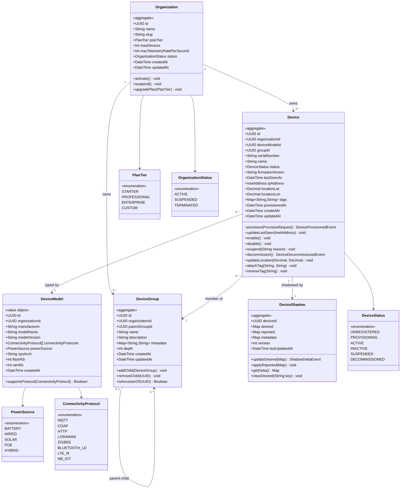
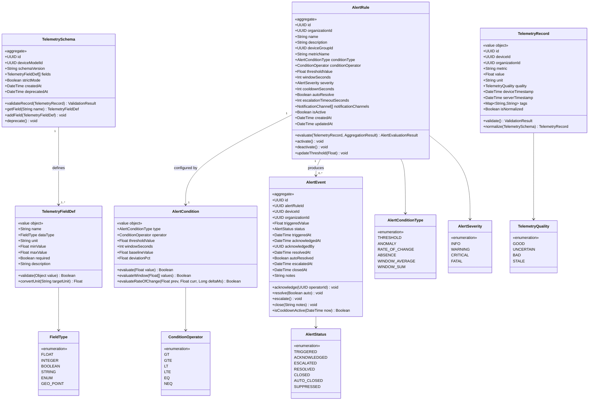
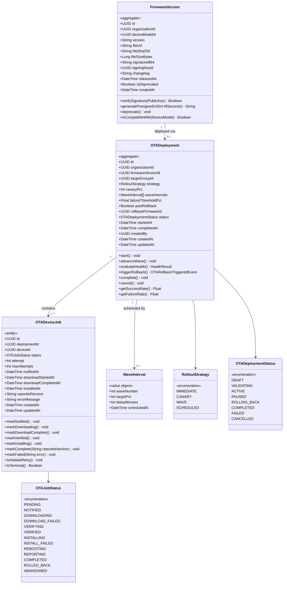
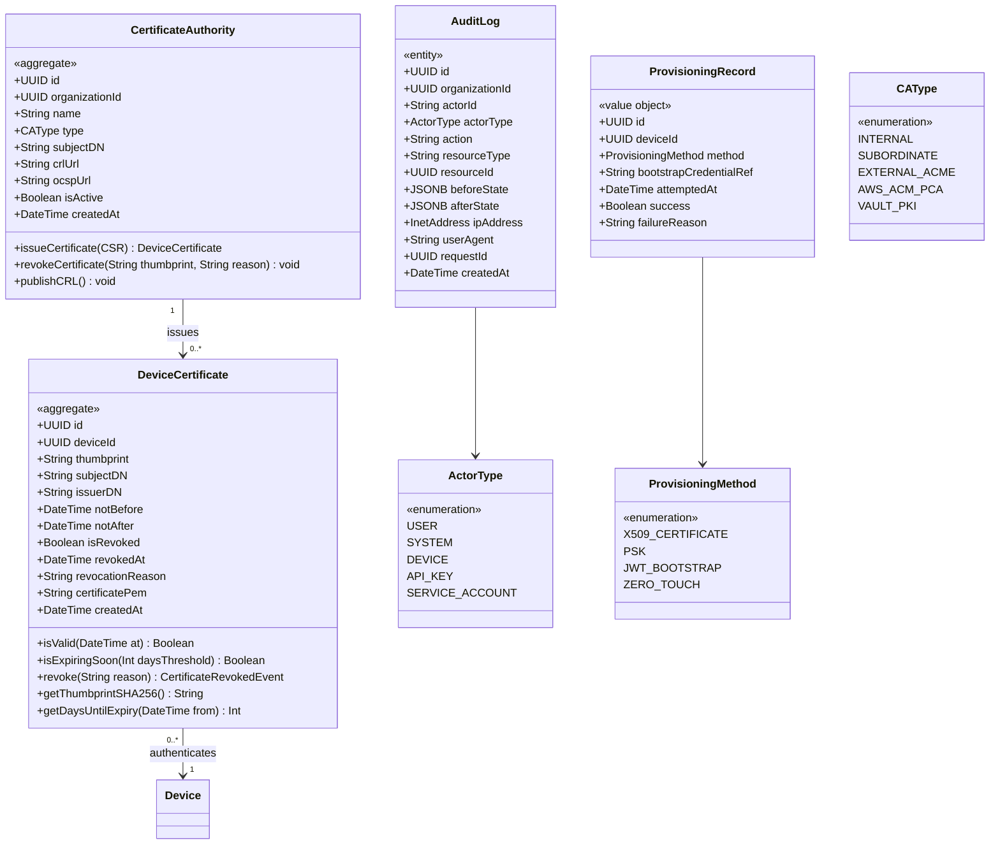
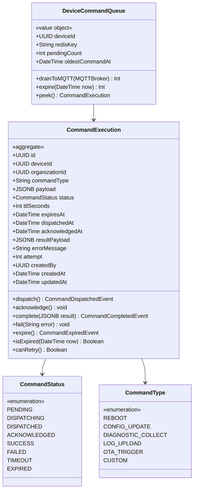

# Class Diagrams — IoT Device Management Platform

## Domain Model Organization

The domain model is organized into five bounded contexts that mirror the platform's core capabilities: **Device Registry**, **Telemetry & Alerting**, **Firmware/OTA**, **Security**, and **Command Execution**. Each context owns its aggregate roots and exposes domain events for cross-context integration. Aggregates are persisted in PostgreSQL; Redis caches frequently read projections; Kafka carries domain events between services.

The diagrams below use UML class notation rendered in Mermaid. Aggregates are marked with `«aggregate»`; value objects with `«value object»`; domain events with `«event»`. All identifiers are UUID v4 generated at the application layer, never at the database layer, to ensure portability across shards.

---

## Core Domain — Device Registry

This context owns the canonical record of every device and its configuration. `Device` is the primary aggregate root. `DeviceGroup` forms a hierarchy tree (closure table in PostgreSQL) to support logical fleet segmentation without hard depth limits. `DeviceShadow` is a 1-to-1 companion aggregate that tracks desired vs. reported state; it lives in its own table to allow separate write paths with optimistic locking.

### Design Notes — Device Registry

`Device` and `DeviceShadow` are separate aggregates despite the 1-to-1 relationship. This separation exists because shadow updates (from devices reporting state over MQTT) happen at very high frequency — potentially thousands per second — while device metadata updates are infrequent. Splitting the aggregates allows the shadow write path to use its own optimistic-lock version counter without contending with metadata updates.

`DeviceGroup` supports a self-referential parent/child hierarchy. The `depth` attribute is maintained by the service layer on every write, and a PostgreSQL recursive CTE is used for ancestry queries. The closure table pattern is maintained in a separate `device_group_ancestors` join table for O(1) ancestor lookups.

Tags on `Device` are stored as `jsonb` in PostgreSQL with a GIN index, enabling fast queries like "all devices with tag environment=production". The `Map<String,String>` type here represents that flat key-value constraint enforced at the service layer.

---

## Telemetry Domain

The Telemetry domain handles ingestion validation, schema enforcement, and the rules engine. `AlertRule` is the aggregate root for alerting configuration. `AlertEvent` is an append-only entity (never mutated in place except for acknowledgment/resolution status fields).

### Design Notes — Telemetry Domain

`TelemetryRecord` is modeled as a value object because individual records are immutable once written to InfluxDB. The `normalize()` method converts units (e.g., °F → °C, PSI → bar) based on the `TelemetrySchema` for the device model, producing a new `TelemetryRecord` without mutating the original. This enables the dual-write pattern: raw record to `telemetry-raw` Kafka topic, normalized record to `telemetry-enriched`.

`AlertCondition` encapsulates all condition variants (threshold, anomaly, rate-of-change, absence) as a single value object with a polymorphic `evaluate()` method rather than a class hierarchy. This avoids the expression problem when serializing conditions to PostgreSQL JSONB. The `windowSeconds` field drives InfluxDB Flux queries for window aggregations.

---

## Firmware / OTA Domain

The OTA domain manages the lifecycle of firmware artifacts and orchestrates multi-device rollout. `OTADeployment` is the aggregate root for a rollout campaign; it manages the set of `OTADeviceJob` entities and enforces rollout strategy invariants.

### Design Notes — Firmware / OTA Domain

`OTADeployment` enforces invariants about rollout progression: the `advanceWave()` method only succeeds when the current wave's `evaluateHealth()` returns a success rate above `(1 - failureThresholdPct)`. This check queries a materialized count from `OTADeviceJob` rows for the current wave cohort. The aggregate does not directly query InfluxDB; instead, `OTAService` provides a `HealthResult` DTO computed externally.

`OTADeviceJob.isTerminal()` returns true for `COMPLETED`, `ROLLED_BACK`, and `ABANDONED` — used by the scheduler to stop retrying. `maxAttempts` defaults to 3 and is configurable per deployment.

`FirmwareVersion.verifySignature()` validates an RSA-PSS SHA-256 signature over the file SHA-256 hash. The signing key is an asymmetric key managed in AWS KMS or HashiCorp Vault, referenced by `signingKeyId`. Verification happens at deployment creation time and again on the device side using the public key embedded in the device's trust store.

---

## Security Domain

The Security domain handles certificate lifecycle, CA management, and the immutable audit trail. `AuditLog` is append-only and partitioned by month in PostgreSQL.

### Design Notes — Security Domain

`DeviceCertificate` stores the full PEM-encoded certificate to support CRL generation and OCSP responses without requiring a separate CA API call. The `thumbprint` field is the SHA-256 fingerprint of the DER-encoded certificate, used as the lookup key in Redis for fast MQTT authentication lookups.

`AuditLog` records `beforeState` and `afterState` as JSONB diffs (RFC 7396 merge patch format) rather than full document copies to keep row size manageable. The `requestId` field links back to distributed traces in the observability stack (Jaeger/OpenTelemetry). Because `AuditLog` is append-only, no UPDATE or DELETE statements are ever issued against the table — this is enforced at the PostgreSQL level with a row-level security policy.

---

## Command Execution Domain

Remote command execution is modeled as a finite-state entity. Commands have a TTL: if the device is offline when a command is dispatched, the command is held in a Redis sorted set (keyed by `expires_at`) and delivered on reconnection, or expired automatically.

### Design Notes — Command Domain

`CommandExecution.canRetry()` returns `true` when `status` is `FAILED` and `attempt < 3` and `expiresAt > now`. The retry scheduler runs as a Quartz job every 30 seconds, querying PostgreSQL for retryable commands.

`DeviceCommandQueue` is a projection over Redis — not a PostgreSQL entity. When a device reconnects (MQTT CONNECT event received via Kafka), `CommandService` calls `DeviceCommandQueue.drainToMQTT()` which publishes all queued commands to the device's MQTT command topic in order, then removes them from the sorted set. Commands are stored in Redis as JSON blobs in a `ZSET` scored by `expires_at` (Unix epoch milliseconds), allowing efficient range queries for expiry cleanup via `ZRANGEBYSCORE`.

---

## Cross-Cutting Design Patterns

### Repository Pattern

Every aggregate has a corresponding `Repository` interface in the domain layer with implementations in the infrastructure layer. For example, `DeviceRepository` exposes `findById()`, `findByOrganizationId()`, `findBySerialNumber()`, and `save()`. Spring Data JPA provides the base implementation; custom queries use JPQL or native SQL via `@Query`.

### Value Objects

Value objects are immutable and compared by value, not identity. `TelemetryRecord`, `TelemetryFieldDef`, `AlertCondition`, `WaveInterval`, and `DeviceCommandQueue` are value objects. They are serialized to JSONB columns or embedded in their owning aggregate's table row.

### Aggregate Root and Domain Events

Each aggregate root implements `AbstractAggregateRoot<T>` (Spring Data). Domain events (`DeviceProvisionedEvent`, `ShadowDeltaEvent`, `OTARollbackTriggeredEvent`, `CertificateRevokedEvent`) are registered via `registerEvent()` and published to Kafka by the `@TransactionalEventListener` in the application layer after the transaction commits — ensuring no phantom events on rollback.

### Inheritance vs. Composition

Composition is preferred over inheritance throughout. `AlertCondition` uses an internal `type` discriminator rather than subclasses because PostgreSQL JSONB columns cannot represent polymorphic class hierarchies without custom deserializers. `CommandExecution` similarly uses a `commandType` enum to dispatch to the correct handler rather than a class hierarchy of command types — this avoids the Visitor pattern overhead and simplifies Kafka deserialization.
