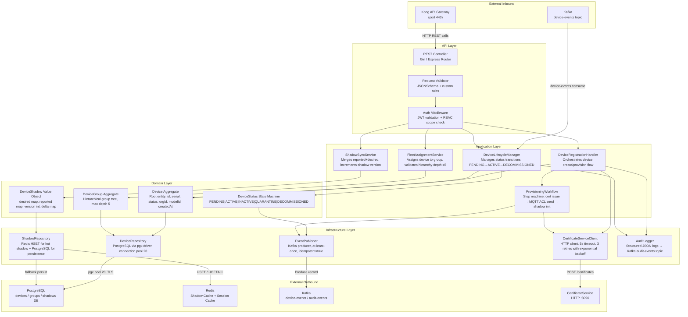
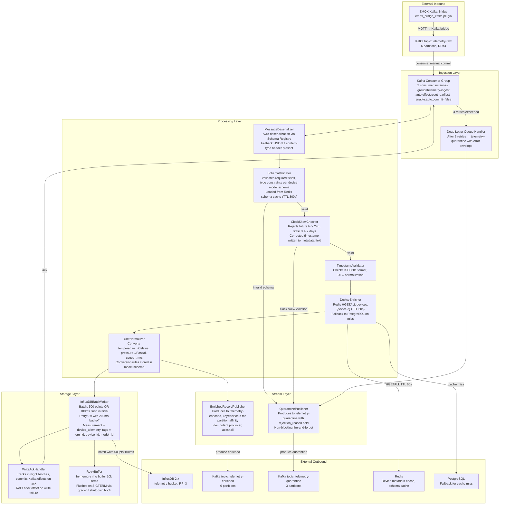
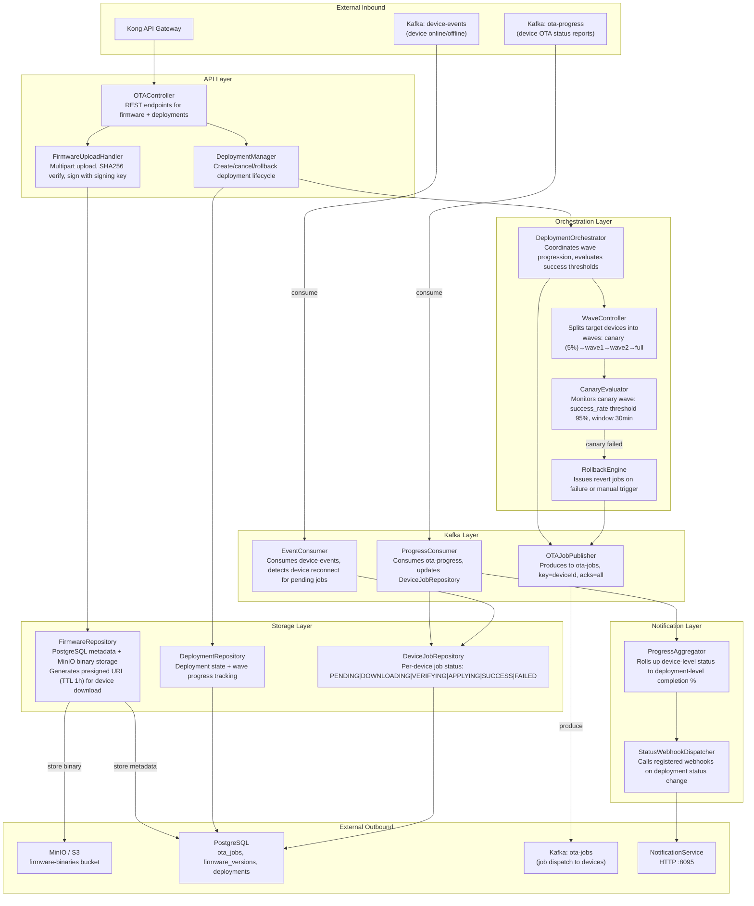
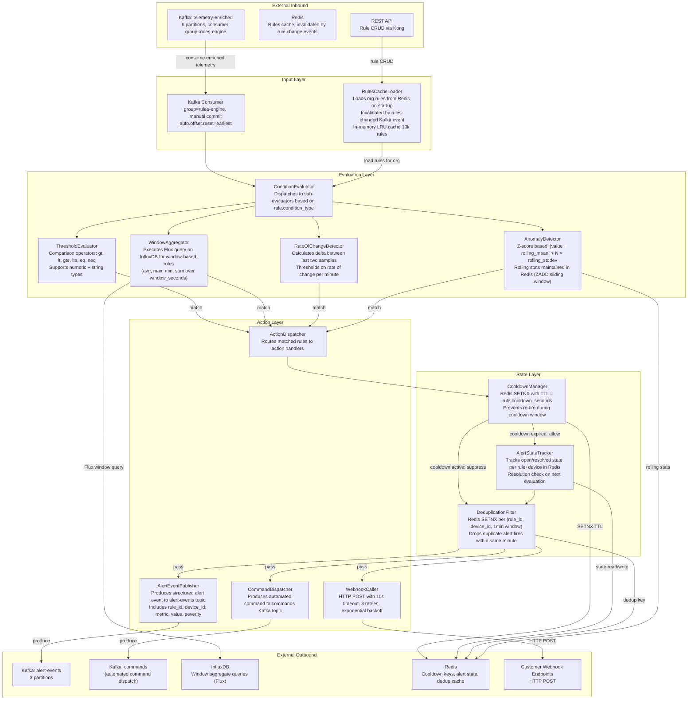

# Component Diagrams — IoT Device Management Platform

## Component Modeling Approach

All component diagrams in this document follow the **C4 Model Level 3** convention. At this level, each diagram zooms into a single container (microservice) and reveals its internal building blocks: named components, their responsibilities, the interfaces they expose, and the dependencies between them. Components map directly to deployable units of code — typically a Spring/Go package, a NestJS module, or a Python class grouping — rather than infrastructure resources or architectural patterns.

Each diagram is accompanied by:
- A **component table** listing name, responsibility, technology, and interface type (sync/async).
- **Dependency injection notes** describing how components are wired at startup.
- **Scalability notes** clarifying which components are stateless and safe to scale horizontally.
- **Testing strategy** identifying unit and integration boundaries.

Arrow labels describe the nature of the interaction (read, write, publish, consume, call, cache-read, etc.). External systems are shown as rectangles outside the service boundary.

---

## Component Diagram — DeviceRegistryService



### DeviceRegistryService Component Table

| Component | Responsibility | Technology | Interface Type |
|---|---|---|---|
| REST Controller | Route HTTP verbs to application handlers; enforce content-type | Gin (Go) / Express (Node) | Sync |
| Request Validator | JSONSchema validation, field length, enum enforcement | ajv / go-playground/validator | Sync |
| Auth Middleware | Verify RS256 JWT, extract org_id + scopes, check RBAC | jose / golang-jwt | Sync |
| DeviceRegistrationHandler | Transactional device creation + provisioning orchestration | Application service | Sync |
| DeviceLifecycleManager | Processes lifecycle events, drives state machine | Application service | Sync + Async |
| FleetAssignmentService | Validates group membership, enforces max-depth 5 hierarchy | Domain service | Sync |
| ShadowSyncService | Merges delta, increments version, publishes shadow update | Domain service | Sync |
| ProvisioningWorkflow | 4-step saga: cert → ACL → shadow init → status ACTIVE | Saga orchestrator | Async saga |
| Device Aggregate | Encapsulates device invariants, raises domain events | DDD Aggregate Root | In-process |
| DeviceGroup Aggregate | Manages group tree, validates cycles | DDD Aggregate Root | In-process |
| DeviceShadow Value Object | Immutable snapshot of desired/reported state + version | Value Object | In-process |
| DeviceStatus State Machine | Enum FSM with allowed transitions, raises StatusChanged event | State Machine | In-process |
| DeviceRepository | CRUD on devices table, optimistic locking via version column | pgx v5 + sqlc | Sync I/O |
| ShadowRepository | Hot read from Redis HASH; async-persist to PostgreSQL jsonb | Redis + pgx | Sync + async I/O |
| EventPublisher | Kafka producer, idempotent mode, 3 retries, acks=all | kafka-go / node-rdkafka | Async |
| CertificateServiceClient | HTTP client to CertService: issue, revoke, fetch | net/http / axios | Sync I/O |
| AuditLogger | Produces structured audit events to Kafka audit-events | Kafka producer | Async |

### Dependency Injection and Configuration

The service wires all components at startup via a dependency injection container (Wire for Go, tsyringe for Node):

```
DeviceRegistrationHandler
  └─ DeviceRepository          (inject PostgreSQL pool)
  └─ ShadowRepository          (inject Redis client + PostgreSQL pool)
  └─ EventPublisher            (inject Kafka producer)
  └─ CertificateServiceClient  (inject HTTP client + base URL from CERT_SERVICE_URL env)
  └─ AuditLogger               (inject Kafka producer)
```

Key environment variables: `DATABASE_URL`, `REDIS_URL`, `KAFKA_BROKERS`, `CERT_SERVICE_URL`, `JWT_PUBLIC_KEY_PEM`, `SHADOW_REDIS_TTL_SECONDS` (default 86400).

### Scalability Notes

- **Stateless components** (REST Controller, Validators, Handlers, Repositories): scale horizontally by adding pods; share no in-process state.
- **ShadowRepository**: Redis acts as the distributed cache; all instances read/write the same Redis cluster, so horizontal scaling is safe.
- **EventPublisher**: Each pod holds its own Kafka producer; idempotent producer + transactional outbox prevents duplicate events.
- **ProvisioningWorkflow**: Saga steps are persisted in a `saga_state` PostgreSQL table so a pod crash does not orphan a half-provisioned device.

### Testing Strategy

- **Unit tests**: Domain Layer (Device Aggregate, State Machine, Shadow value object) are pure in-process; no I/O mocks needed.
- **Integration tests**: Repository implementations tested against dockerized PostgreSQL 15 and Redis 7.2.
- **Contract tests**: CertificateServiceClient verified with Pact consumer-driven contract tests against CertificateService provider.
- **End-to-end**: Provisioning Workflow validated in a compose stack with real Kafka, PostgreSQL, Redis, and a stubbed CertService.

---

## Component Diagram — TelemetryIngestionService



### TelemetryIngestionService Component Table

| Component | Responsibility | Technology | Interface Type |
|---|---|---|---|
| Kafka Consumer Group | Parallel message consumption, manual offset commit | kafka-go / confluent-kafka-python | Async |
| Dead Letter Queue Handler | Wraps failed message with error metadata, routes to quarantine | Custom handler | Async |
| MessageDeserializer | Avro decode with Schema Registry, fallback JSON | Apache Avro + Schema Registry client | Sync |
| SchemaValidator | Field presence, type, range validation against model schema | Custom validator, rules from Redis | Sync |
| ClockSkewChecker | Timestamp bounds check: ±24h future, -7d past | Time comparison | Sync |
| DeviceEnricher | Attach org_id, fleet_id, model_id from cache | Redis client (go-redis / aioredis) | Sync (cached) |
| UnitNormalizer | SI unit conversion per model schema conversion table | Expression evaluator | Sync |
| TimestampValidator | ISO 8601 parse, UTC normalization | Time library | Sync |
| InfluxDBBatchWriter | Accumulate + flush to InfluxDB, 500 pts / 100ms | influxdb-client-go | Async batch |
| WriteAckHandler | Coordinate Kafka offset commit with InfluxDB write ack | Custom state tracker | Async |
| RetryBuffer | In-memory ring buffer for write retries before DLQ | Ring buffer | In-memory |
| EnrichedRecordPublisher | Publish enriched telemetry to telemetry-enriched topic | Kafka producer | Async |
| QuarantinePublisher | Publish invalid records to telemetry-quarantine | Kafka producer | Async (fire-and-forget) |
| MetricsCollector | Prometheus metrics on throughput, lag, error rates | prometheus/client_golang | Sync push |
| ConfigurationLoader | Load org-level schemas and quotas from Redis on startup | Redis client | Sync |

### Scalability Notes

- Consumer group instances scale to the number of partitions (max 6). Add consumer pods up to partition count without rebalancing overhead beyond group protocol.
- **InfluxDBBatchWriter** is stateless per-instance; each pod batches independently. Total write throughput scales linearly with pod count.
- **DeviceEnricher** relies on Redis for metadata; TTL 60 seconds means cache invalidation latency is bounded. At 100k devices/tenant, the Redis memory footprint is approximately 50 MB (avg 500B per device entry × 100k).
- **RetryBuffer** is in-process; on SIGTERM, a 10-second graceful shutdown drains the buffer or writes remaining items to the DLQ before exit.

### Testing Strategy

- **Unit tests**: SchemaValidator, ClockSkewChecker, UnitNormalizer, and TimestampValidator are pure functions with no I/O.
- **Integration tests**: DeviceEnricher tested against dockerized Redis 7.2; InfluxDBBatchWriter tested against InfluxDB 2.7 testcontainer.
- **Load tests**: k6 script publishes 50,000 MQTT messages/second via EMQX; verifies no Kafka consumer lag above 10,000 messages after steady state.

---

## Component Diagram — OTAService



### OTAService Component Table

| Component | Responsibility | Technology | Interface Type |
|---|---|---|---|
| OTAController | REST routing for firmware and deployment endpoints | Gin / Fiber | Sync |
| FirmwareUploadHandler | Multipart stream to MinIO, SHA256 checksum, store metadata | MinIO SDK + pgx | Sync I/O |
| DeploymentManager | Create/cancel/rollback deployment, validate target group | Application service | Sync |
| DeploymentOrchestrator | Wave sequencing, threshold monitoring, transition logic | Scheduler (cron 30s tick) | Async |
| WaveController | Split device list into canary + N waves (configurable wave_size) | Domain service | Sync |
| CanaryEvaluator | Check success_rate ≥ 95% after 30-min canary window | Domain service | Sync |
| RollbackEngine | Issue REVERT OTA jobs to all devices that applied the bad version | Domain service | Async |
| OTAJobPublisher | Produce job record to ota-jobs Kafka topic | kafka-go | Async |
| ProgressConsumer | Consume ota-progress events, persist device job state | Kafka consumer | Async |
| EventConsumer | Detect device reconnects; dispatch queued jobs to reconnected devices | Kafka consumer | Async |
| FirmwareRepository | Metadata CRUD + MinIO presigned URL generation | pgx + MinIO SDK | Sync I/O |
| DeploymentRepository | Deployment entity CRUD with optimistic locking | pgx | Sync I/O |
| DeviceJobRepository | Per-device job state tracking, idempotent upsert | pgx | Sync I/O |
| ProgressAggregator | Aggregate device-level completion into deployment-level % | In-process reducer | Async |
| StatusWebhookDispatcher | HTTP POST to customer webhook URLs with deployment payload | net/http (retried 3×) | Async |

### Scalability Notes

- **DeploymentOrchestrator** runs with leader election (PostgreSQL advisory lock) so only one pod drives wave progression at a time. Other pods are idle standbys.
- **ProgressConsumer** and **EventConsumer** are stateless; scale to partition count (ota-progress: 6 partitions).
- **FirmwareUploadHandler**: MinIO handles multipart uploads; the service pod is just a proxy. Memory footprint is bounded by the multipart chunk size (16 MB chunks).

### Testing Strategy

- **Unit tests**: WaveController, CanaryEvaluator, RollbackEngine — pure domain logic with mock repositories.
- **Integration tests**: FirmwareRepository against dockerized MinIO + PostgreSQL; OTAJobPublisher against Kafka testcontainer.
- **Chaos tests**: Kill pod mid-deployment to verify orchestrator leader re-election and wave resumption within 60 seconds.

---

## Component Diagram — RulesEngine



### RulesEngine Component Table

| Component | Responsibility | Technology | Interface Type |
|---|---|---|---|
| Kafka Consumer | Consume enriched telemetry, manual offset commit | kafka-go | Async |
| RulesCacheLoader | In-memory LRU rule cache, Redis-backed, invalidated on rule change | go-cache / Redis | Sync (in-memory) |
| ConditionEvaluator | Dispatch to correct evaluator based on rule condition_type | Dispatch table | Sync |
| ThresholdEvaluator | Numeric/string comparison with operators | Arithmetic | Sync |
| WindowAggregator | Flux queries against InfluxDB for time-window aggregates | InfluxDB client | Async I/O |
| RateOfChangeDetector | Delta calculation per metric across consecutive samples | Sliding buffer | Sync |
| AnomalyDetector | Z-score anomaly detection with rolling statistics in Redis | Redis ZADD + Lua | Sync I/O |
| ActionDispatcher | Route matched rule actions to action handlers | Router | Sync |
| AlertEventPublisher | Produce alert event to Kafka alert-events | Kafka producer | Async |
| CommandDispatcher | Produce automated command to Kafka commands | Kafka producer | Async |
| WebhookCaller | HTTP POST to customer webhooks with retries | net/http | Async |
| CooldownManager | Redis SETNX with TTL for per-rule cooldown window | Redis | Sync I/O |
| AlertStateTracker | Open/resolved alert state per (rule, device) pair in Redis | Redis HSET | Sync I/O |
| DeduplicationFilter | 1-minute dedup window per (rule, device) using Redis SETNX | Redis | Sync I/O |

### Scalability Notes

- **Stateless evaluators** (ThresholdEvaluator, RateOfChangeDetector, ConditionEvaluator): scale horizontally without coordination.
- **RulesCacheLoader**: Each pod maintains its own LRU cache. Cache invalidation is propagated via a Kafka `rules-changed` topic; all pods consume the same topic and evict stale entries within one Kafka poll cycle (max 500ms).
- **CooldownManager / AlertStateTracker / DeduplicationFilter**: State is centralised in Redis Cluster; all pods share the same Redis keys, ensuring exactly one alert fires per cooldown window regardless of how many pods process the same rule concurrently.
- **WindowAggregator**: Executes InfluxDB Flux queries; heavy window queries (>1h) are rate-limited per org to prevent InfluxDB saturation. At most 10 concurrent Flux queries per rules-engine pod.

### Testing Strategy

- **Unit tests**: ThresholdEvaluator, RateOfChangeDetector, ConditionEvaluator — pure functions, parameterised test tables covering all operators and edge cases.
- **Integration tests**: AnomalyDetector tested with Redis testcontainer; WindowAggregator with InfluxDB testcontainer.
- **Property-based tests**: fuzz the ConditionEvaluator with random telemetry payloads to verify no panics.
- **Alert fire tests**: End-to-end test publishes synthetic telemetry to Kafka, asserts that alert-events topic receives the expected event within 2 seconds and that a second event is suppressed for the cooldown duration.

---

## Interface Definitions

### IDeviceRepository

```go
type IDeviceRepository interface {
    Create(ctx context.Context, device *Device) error
    FindByID(ctx context.Context, orgID, deviceID string) (*Device, error)
    FindBySerial(ctx context.Context, orgID, serial string) (*Device, error)
    List(ctx context.Context, filter DeviceFilter) ([]*Device, int64, error)
    Update(ctx context.Context, device *Device) error
    Delete(ctx context.Context, orgID, deviceID string) error
}
```

### IEventPublisher

```go
type IEventPublisher interface {
    PublishDeviceEvent(ctx context.Context, event DeviceEvent) error
    PublishAuditEvent(ctx context.Context, event AuditEvent) error
}
```

### IShadowRepository

```go
type IShadowRepository interface {
    GetShadow(ctx context.Context, deviceID string) (*DeviceShadow, error)
    UpdateDesired(ctx context.Context, deviceID string, desired map[string]interface{}) (*DeviceShadow, error)
    UpdateReported(ctx context.Context, deviceID string, reported map[string]interface{}) (*DeviceShadow, error)
}
```

These interfaces are implemented by the Infrastructure Layer and injected at startup. In tests, mock implementations satisfy the same contracts, enabling full isolation of application and domain layers.
