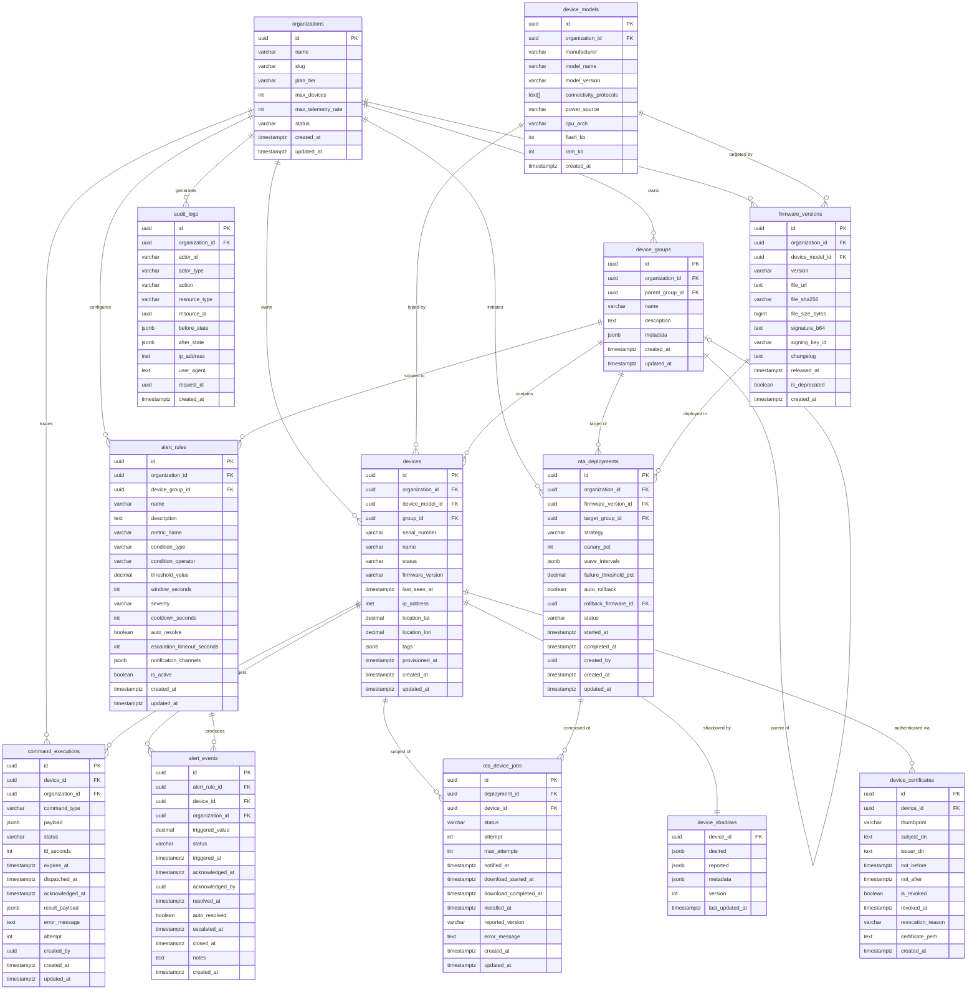

# ERD and Database Schema — IoT Device Management Platform

## Database Technology Choices

The platform uses three purpose-fit storage technologies:

- **PostgreSQL 16** (primary OLTP store): Structured relational data — device registry, OTA deployments, alert rules and events, certificates, audit logs. Row-level security (RLS) enforces multi-tenant isolation at the database layer. pg_partman manages range partitioning on large tables. Used for all writes that require ACID transactions and foreign-key referential integrity.

- **InfluxDB 2.x / TimescaleDB** (time-series store): Device telemetry measurements. InfluxDB is the primary choice for cloud deployments; TimescaleDB (PostgreSQL extension) is supported for self-hosted enterprise customers who prefer a single PostgreSQL cluster. Retention policies are defined per measurement with automatic downsampling (InfluxDB Tasks). Write throughput target: 500,000 points/second per cluster.

- **Redis 7.x** (cache and ephemeral state): Certificate authentication cache, device metadata projections, shadow read cache, rate-limiting counters, OTA command queues (sorted sets by expiry), alert cooldown gates, session tokens. Redis Cluster mode with 3 primary + 3 replica shards. Sentinel-based failover for single-region; cross-region replication via Redis Enterprise for DR.

- **MinIO / AWS S3** (object store): Firmware binary blobs. MinIO is used for on-premises deployments; S3 for cloud. Presigned URLs (TTL 3,600 seconds) are generated per firmware download request. Objects are versioned; deletion requires explicit admin action with MFA confirmation in production.

---

## Entity Relationship Diagram



---

## PostgreSQL DDL

### organizations

```sql
CREATE TABLE organizations (
    id              UUID PRIMARY KEY DEFAULT gen_random_uuid(),
    name            VARCHAR(255) NOT NULL,
    -- URL-safe slug for subdomain routing (e.g., acme-corp → acme-corp.iotplatform.io)
    slug            VARCHAR(100) NOT NULL UNIQUE,
    plan_tier       VARCHAR(50) NOT NULL DEFAULT 'STARTER'
                    CHECK (plan_tier IN ('STARTER','PROFESSIONAL','ENTERPRISE','CUSTOM')),
    -- Hard limits enforced at API layer; 0 = unlimited (ENTERPRISE/CUSTOM only)
    max_devices               INT NOT NULL DEFAULT 100,
    max_telemetry_rate        INT NOT NULL DEFAULT 1000, -- messages/second per org
    max_ota_concurrent        INT NOT NULL DEFAULT 10,   -- concurrent OTA deployments
    status          VARCHAR(30) NOT NULL DEFAULT 'ACTIVE'
                    CHECK (status IN ('ACTIVE','SUSPENDED','TERMINATED')),
    created_at      TIMESTAMPTZ NOT NULL DEFAULT NOW(),
    updated_at      TIMESTAMPTZ NOT NULL DEFAULT NOW()
);

CREATE UNIQUE INDEX idx_organizations_slug ON organizations(slug);
```

### device_models

```sql
CREATE TABLE device_models (
    id                      UUID PRIMARY KEY DEFAULT gen_random_uuid(),
    organization_id         UUID NOT NULL REFERENCES organizations(id),
    manufacturer            VARCHAR(255) NOT NULL,
    model_name              VARCHAR(255) NOT NULL,
    model_version           VARCHAR(50)  NOT NULL DEFAULT '1.0',
    -- Array of supported protocols; validated against enum in application layer
    connectivity_protocols  TEXT[] NOT NULL DEFAULT '{}',
    power_source            VARCHAR(30) NOT NULL DEFAULT 'WIRED'
                            CHECK (power_source IN ('BATTERY','WIRED','SOLAR','POE','HYBRID')),
    cpu_arch                VARCHAR(50),  -- e.g., 'ARM_CORTEX_M4', 'XTENSA_LX6'
    flash_kb                INT,
    ram_kb                  INT,
    created_at              TIMESTAMPTZ NOT NULL DEFAULT NOW(),
    UNIQUE (organization_id, manufacturer, model_name, model_version)
);

CREATE INDEX idx_device_models_org ON device_models(organization_id);
```

### device_groups

```sql
CREATE TABLE device_groups (
    id              UUID PRIMARY KEY DEFAULT gen_random_uuid(),
    organization_id UUID NOT NULL REFERENCES organizations(id) ON DELETE RESTRICT,
    -- NULL for root-level groups; self-referential FK
    parent_group_id UUID REFERENCES device_groups(id) ON DELETE RESTRICT,
    name            VARCHAR(255) NOT NULL,
    description     TEXT,
    -- Arbitrary key-value metadata (labels, environment, region, etc.)
    metadata        JSONB NOT NULL DEFAULT '{}',
    created_at      TIMESTAMPTZ NOT NULL DEFAULT NOW(),
    updated_at      TIMESTAMPTZ NOT NULL DEFAULT NOW(),
    UNIQUE (organization_id, parent_group_id, name)
);

-- Closure table for O(1) ancestor/descendant lookups without recursive CTEs on hot paths
CREATE TABLE device_group_ancestors (
    descendant_id  UUID NOT NULL REFERENCES device_groups(id) ON DELETE CASCADE,
    ancestor_id    UUID NOT NULL REFERENCES device_groups(id) ON DELETE CASCADE,
    depth          INT  NOT NULL, -- 0 = self, 1 = parent, 2 = grandparent, etc.
    PRIMARY KEY (descendant_id, ancestor_id)
);

CREATE INDEX idx_device_groups_org ON device_groups(organization_id);
CREATE INDEX idx_device_groups_parent ON device_groups(parent_group_id) WHERE parent_group_id IS NOT NULL;
CREATE INDEX idx_device_group_ancestors_ancestor ON device_group_ancestors(ancestor_id);
```

### devices

```sql
CREATE TYPE device_status_enum AS ENUM (
    'UNREGISTERED','PROVISIONING','ACTIVE','INACTIVE','SUSPENDED','DECOMMISSIONED'
);

CREATE TABLE devices (
    id              UUID PRIMARY KEY DEFAULT gen_random_uuid(),
    organization_id UUID NOT NULL REFERENCES organizations(id) ON DELETE RESTRICT,
    device_model_id UUID REFERENCES device_models(id),
    group_id        UUID REFERENCES device_groups(id),
    serial_number   VARCHAR(255) NOT NULL,
    name            VARCHAR(255) NOT NULL,
    status          device_status_enum NOT NULL DEFAULT 'UNREGISTERED',
    firmware_version VARCHAR(50),
    last_seen_at    TIMESTAMPTZ,
    ip_address      INET,
    location_lat    DECIMAL(10, 7),
    location_lon    DECIMAL(10, 7),
    -- Flat key-value tags for fleet segmentation; GIN-indexed for fast tag queries
    tags            JSONB NOT NULL DEFAULT '{}',
    provisioned_at  TIMESTAMPTZ,
    created_at      TIMESTAMPTZ NOT NULL DEFAULT NOW(),
    updated_at      TIMESTAMPTZ NOT NULL DEFAULT NOW(),
    UNIQUE (organization_id, serial_number)
);

-- Primary lookup for API: list devices by org
CREATE INDEX idx_devices_org ON devices(organization_id);
-- Filter by status for ACTIVE device counts and connectivity queries
CREATE INDEX idx_devices_org_status ON devices(organization_id, status);
-- Partial index: only ACTIVE devices need fast group lookup (INACTIVE/DECOMMISSIONED rarely queried)
CREATE INDEX idx_devices_group_active ON devices(group_id) WHERE status = 'ACTIVE';
-- GIN index enables jsonb @> operator for tag-based queries: devices WHERE tags @> '{"env":"prod"}'
CREATE INDEX idx_devices_tags_gin ON devices USING GIN(tags);
-- Stale device detection: find devices not seen in > N hours
CREATE INDEX idx_devices_last_seen ON devices(last_seen_at) WHERE status = 'ACTIVE';
```

### device_shadows

```sql
CREATE TABLE device_shadows (
    device_id       UUID PRIMARY KEY REFERENCES devices(id) ON DELETE CASCADE,
    -- Desired state set by operator/automation; sent to device as delta
    desired         JSONB NOT NULL DEFAULT '{}',
    -- Last state reported by the device itself
    reported        JSONB NOT NULL DEFAULT '{}',
    -- Per-key timestamp metadata for staleness detection: {"temperature": {"timestamp": "..."}}
    metadata        JSONB NOT NULL DEFAULT '{}',
    -- Optimistic-lock version counter; incremented on every desired or reported write
    version         INT NOT NULL DEFAULT 0,
    last_updated_at TIMESTAMPTZ NOT NULL DEFAULT NOW()
);

-- No separate index needed; primary key on device_id covers all lookups
```

### device_certificates

```sql
CREATE TABLE device_certificates (
    id                  UUID PRIMARY KEY DEFAULT gen_random_uuid(),
    device_id           UUID NOT NULL REFERENCES devices(id) ON DELETE RESTRICT,
    -- SHA-256 fingerprint of DER-encoded certificate; used as Redis cache key
    thumbprint          VARCHAR(64) NOT NULL UNIQUE,
    subject_dn          TEXT NOT NULL,
    issuer_dn           TEXT NOT NULL,
    not_before          TIMESTAMPTZ NOT NULL,
    not_after           TIMESTAMPTZ NOT NULL,
    is_revoked          BOOLEAN NOT NULL DEFAULT FALSE,
    revoked_at          TIMESTAMPTZ,
    revocation_reason   VARCHAR(100), -- e.g., 'KEY_COMPROMISE', 'SUPERSEDED', 'DECOMMISSIONED'
    -- Full PEM stored for CRL generation and OCSP response construction
    certificate_pem     TEXT NOT NULL,
    is_superseded       BOOLEAN NOT NULL DEFAULT FALSE, -- Set when replaced by renewal
    created_at          TIMESTAMPTZ NOT NULL DEFAULT NOW()
);

-- Fast authentication lookup by thumbprint (the primary MQTT auth key)
CREATE UNIQUE INDEX idx_certs_thumbprint ON device_certificates(thumbprint);
-- Find all active certs for a device (for renewal, revocation)
CREATE INDEX idx_certs_device ON device_certificates(device_id) WHERE is_revoked = FALSE;
-- Expiry monitoring: find certs expiring within N days
CREATE INDEX idx_certs_expiry ON device_certificates(not_after) WHERE is_revoked = FALSE;
```

### firmware_versions

```sql
CREATE TABLE firmware_versions (
    id              UUID PRIMARY KEY DEFAULT gen_random_uuid(),
    organization_id UUID NOT NULL REFERENCES organizations(id),
    device_model_id UUID NOT NULL REFERENCES device_models(id),
    version         VARCHAR(50) NOT NULL,
    file_url        TEXT NOT NULL,           -- MinIO/S3 object path (not the presigned URL)
    file_sha256     VARCHAR(64) NOT NULL,    -- Hex-encoded SHA-256 of the binary
    file_size_bytes BIGINT NOT NULL,
    signature_b64   TEXT NOT NULL,           -- Base64-encoded RSA-PSS signature over SHA-256
    signing_key_id  VARCHAR(255) NOT NULL,   -- Reference to key in Vault/KMS
    changelog       TEXT,
    released_at     TIMESTAMPTZ NOT NULL DEFAULT NOW(),
    is_deprecated   BOOLEAN NOT NULL DEFAULT FALSE,
    created_at      TIMESTAMPTZ NOT NULL DEFAULT NOW(),
    UNIQUE (organization_id, device_model_id, version)
);

CREATE INDEX idx_fw_org_model ON firmware_versions(organization_id, device_model_id);
CREATE INDEX idx_fw_active ON firmware_versions(organization_id) WHERE is_deprecated = FALSE;
```

### ota_deployments

```sql
CREATE TYPE ota_deployment_status AS ENUM (
    'DRAFT','VALIDATING','ACTIVE','PAUSED','ROLLING_BACK','COMPLETED','FAILED','CANCELLED'
);
CREATE TYPE rollout_strategy AS ENUM ('IMMEDIATE','CANARY','WAVE','SCHEDULED');

CREATE TABLE ota_deployments (
    id                      UUID PRIMARY KEY DEFAULT gen_random_uuid(),
    organization_id         UUID NOT NULL REFERENCES organizations(id),
    firmware_version_id     UUID NOT NULL REFERENCES firmware_versions(id),
    target_group_id         UUID NOT NULL REFERENCES device_groups(id),
    strategy                rollout_strategy NOT NULL DEFAULT 'CANARY',
    -- Percentage of devices in the canary wave (1–100); ignored for IMMEDIATE strategy
    canary_pct              INT NOT NULL DEFAULT 5 CHECK (canary_pct BETWEEN 1 AND 100),
    -- Array of {waveNumber, targetPct, delayMinutes} objects for WAVE strategy
    wave_intervals          JSONB NOT NULL DEFAULT '[]',
    failure_threshold_pct   DECIMAL(5,2) NOT NULL DEFAULT 5.0,
    auto_rollback           BOOLEAN NOT NULL DEFAULT TRUE,
    -- Firmware version to roll back to; NULL means use last stable version at deploy time
    rollback_firmware_id    UUID REFERENCES firmware_versions(id),
    status                  ota_deployment_status NOT NULL DEFAULT 'DRAFT',
    started_at              TIMESTAMPTZ,
    completed_at            TIMESTAMPTZ,
    created_by              UUID NOT NULL,
    created_at              TIMESTAMPTZ NOT NULL DEFAULT NOW(),
    updated_at              TIMESTAMPTZ NOT NULL DEFAULT NOW()
);

CREATE INDEX idx_ota_deployments_org ON ota_deployments(organization_id);
CREATE INDEX idx_ota_deployments_active ON ota_deployments(organization_id, status)
    WHERE status IN ('ACTIVE','ROLLING_BACK','PAUSED');
```

### ota_device_jobs

```sql
CREATE TYPE ota_job_status AS ENUM (
    'PENDING','NOTIFIED','DOWNLOADING','DOWNLOAD_FAILED','VERIFYING','VERIFIED',
    'INSTALLING','INSTALL_FAILED','REBOOTING','REPORTING','COMPLETED','ROLLED_BACK','ABANDONED'
);

-- Partitioned by created_at (range, monthly) to enable fast archival of completed deployments
CREATE TABLE ota_device_jobs (
    id                      UUID NOT NULL DEFAULT gen_random_uuid(),
    deployment_id           UUID NOT NULL REFERENCES ota_deployments(id),
    device_id               UUID NOT NULL REFERENCES devices(id),
    status                  ota_job_status NOT NULL DEFAULT 'PENDING',
    attempt                 INT NOT NULL DEFAULT 0,
    max_attempts            INT NOT NULL DEFAULT 3,
    notified_at             TIMESTAMPTZ,
    download_started_at     TIMESTAMPTZ,
    download_completed_at   TIMESTAMPTZ,
    installed_at            TIMESTAMPTZ,
    reported_version        VARCHAR(50),
    error_message           TEXT,
    created_at              TIMESTAMPTZ NOT NULL DEFAULT NOW(),
    updated_at              TIMESTAMPTZ NOT NULL DEFAULT NOW(),
    PRIMARY KEY (id, created_at)  -- composite PK required for declarative partitioning
) PARTITION BY RANGE (created_at);

-- Create monthly partitions; pg_partman automates future partition creation
CREATE TABLE ota_device_jobs_y2024m01 PARTITION OF ota_device_jobs
    FOR VALUES FROM ('2024-01-01') TO ('2024-02-01');
-- ... additional monthly partitions created by pg_partman

CREATE UNIQUE INDEX idx_ota_jobs_deployment_device ON ota_device_jobs(deployment_id, device_id);
-- Timeout query: find jobs stuck in NOTIFIED or DOWNLOADING
CREATE INDEX idx_ota_jobs_timeout ON ota_device_jobs(status, notified_at, download_started_at)
    WHERE status IN ('NOTIFIED','DOWNLOADING','REBOOTING');
-- Deployment health calculation: aggregate counts by deployment_id and status
CREATE INDEX idx_ota_jobs_deployment_status ON ota_device_jobs(deployment_id, status);
```

### alert_rules

```sql
CREATE TYPE alert_condition_type AS ENUM (
    'THRESHOLD','ANOMALY','RATE_OF_CHANGE','ABSENCE','WINDOW_AVERAGE','WINDOW_SUM'
);
CREATE TYPE alert_severity AS ENUM ('INFO','WARNING','CRITICAL','FATAL');

CREATE TABLE alert_rules (
    id                          UUID PRIMARY KEY DEFAULT gen_random_uuid(),
    organization_id             UUID NOT NULL REFERENCES organizations(id),
    device_group_id             UUID REFERENCES device_groups(id), -- NULL = org-wide rule
    name                        VARCHAR(255) NOT NULL,
    description                 TEXT,
    metric_name                 VARCHAR(255) NOT NULL,
    condition_type              alert_condition_type NOT NULL,
    condition_operator          VARCHAR(10) NOT NULL CHECK (condition_operator IN ('GT','GTE','LT','LTE','EQ','NEQ')),
    threshold_value             DECIMAL(20, 6),
    -- Time window in seconds for WINDOW_AVERAGE/WINDOW_SUM/ABSENCE condition types
    window_seconds              INT NOT NULL DEFAULT 300,
    severity                    alert_severity NOT NULL DEFAULT 'WARNING',
    -- Minimum seconds between two AlertEvent creations for the same (rule, device) pair
    cooldown_seconds            INT NOT NULL DEFAULT 300,
    auto_resolve                BOOLEAN NOT NULL DEFAULT TRUE,
    -- Seconds before escalating to additional notification channels
    escalation_timeout_seconds  INT NOT NULL DEFAULT 900,
    -- JSON array: [{type:"EMAIL",recipients:[...]},{type:"WEBHOOK",url:"..."},{type:"PAGERDUTY",integrationKey:"..."}]
    notification_channels       JSONB NOT NULL DEFAULT '[]',
    is_active                   BOOLEAN NOT NULL DEFAULT TRUE,
    created_at                  TIMESTAMPTZ NOT NULL DEFAULT NOW(),
    updated_at                  TIMESTAMPTZ NOT NULL DEFAULT NOW()
);

CREATE INDEX idx_alert_rules_org ON alert_rules(organization_id) WHERE is_active = TRUE;
-- RulesEngine lookup: find active rules for an org+metric combination
CREATE INDEX idx_alert_rules_org_metric ON alert_rules(organization_id, metric_name) WHERE is_active = TRUE;
CREATE INDEX idx_alert_rules_group ON alert_rules(device_group_id) WHERE is_active = TRUE AND device_group_id IS NOT NULL;
```

### alert_events

```sql
CREATE TYPE alert_status AS ENUM (
    'TRIGGERED','ACKNOWLEDGED','ESCALATED','RESOLVED','CLOSED','AUTO_CLOSED'
);

-- Partitioned by created_at (range, monthly)
CREATE TABLE alert_events (
    id              UUID NOT NULL DEFAULT gen_random_uuid(),
    alert_rule_id   UUID NOT NULL REFERENCES alert_rules(id),
    device_id       UUID NOT NULL REFERENCES devices(id),
    organization_id UUID NOT NULL REFERENCES organizations(id),
    triggered_value DECIMAL(20, 6),
    status          alert_status NOT NULL DEFAULT 'TRIGGERED',
    triggered_at    TIMESTAMPTZ NOT NULL DEFAULT NOW(),
    acknowledged_at TIMESTAMPTZ,
    acknowledged_by UUID,
    resolved_at     TIMESTAMPTZ,
    auto_resolved   BOOLEAN NOT NULL DEFAULT FALSE,
    escalated_at    TIMESTAMPTZ,
    closed_at       TIMESTAMPTZ,
    notes           TEXT,
    created_at      TIMESTAMPTZ NOT NULL DEFAULT NOW(),
    PRIMARY KEY (id, created_at)
) PARTITION BY RANGE (created_at);

-- Idempotency constraint: prevent duplicate alert events within the same minute
CREATE UNIQUE INDEX idx_alert_events_idempotency
    ON alert_events(alert_rule_id, device_id, date_trunc('minute', triggered_at));

-- Operator dashboard: list open alerts for an org
CREATE INDEX idx_alert_events_org_status ON alert_events(organization_id, status)
    WHERE status IN ('TRIGGERED','ACKNOWLEDGED','ESCALATED');
-- Alert history for a specific device
CREATE INDEX idx_alert_events_device ON alert_events(device_id, triggered_at DESC);
-- Escalation scheduler: find TRIGGERED events past escalation timeout
CREATE INDEX idx_alert_events_triggered ON alert_events(triggered_at)
    WHERE status = 'TRIGGERED';
```

### command_executions

```sql
CREATE TYPE command_status AS ENUM (
    'PENDING','DISPATCHING','DISPATCHED','ACKNOWLEDGED','SUCCESS','FAILED','TIMEOUT','EXPIRED'
);

CREATE TABLE command_executions (
    id              UUID PRIMARY KEY DEFAULT gen_random_uuid(),
    device_id       UUID NOT NULL REFERENCES devices(id),
    organization_id UUID NOT NULL REFERENCES organizations(id),
    command_type    VARCHAR(50) NOT NULL CHECK (command_type IN ('REBOOT','CONFIG_UPDATE','DIAGNOSTIC_COLLECT','LOG_UPLOAD','OTA_TRIGGER','CUSTOM')),
    payload         JSONB NOT NULL DEFAULT '{}',
    status          command_status NOT NULL DEFAULT 'PENDING',
    ttl_seconds     INT NOT NULL DEFAULT 3600,
    -- Absolute expiry timestamp; set at creation as NOW() + ttl_seconds
    expires_at      TIMESTAMPTZ NOT NULL,
    dispatched_at   TIMESTAMPTZ,
    acknowledged_at TIMESTAMPTZ,
    result_payload  JSONB,
    error_message   TEXT,
    attempt         INT NOT NULL DEFAULT 0,
    created_by      UUID NOT NULL,
    created_at      TIMESTAMPTZ NOT NULL DEFAULT NOW(),
    updated_at      TIMESTAMPTZ NOT NULL DEFAULT NOW()
);

-- Retry scheduler: find FAILED commands eligible for retry
CREATE INDEX idx_commands_retry ON command_executions(status, expires_at, attempt)
    WHERE status IN ('FAILED','PENDING') AND expires_at > NOW();
-- Device command history (audit)
CREATE INDEX idx_commands_device ON command_executions(device_id, created_at DESC);
-- Expiry cleanup: find PENDING/DISPATCHED commands past expires_at
CREATE INDEX idx_commands_expiry ON command_executions(expires_at)
    WHERE status IN ('PENDING','DISPATCHING','DISPATCHED');
```

### audit_logs

```sql
-- audit_logs is append-only; no UPDATE or DELETE is ever issued against this table.
-- RLS policy enforces this at the database level.
CREATE TABLE audit_logs (
    id              UUID NOT NULL DEFAULT gen_random_uuid(),
    organization_id UUID NOT NULL REFERENCES organizations(id),
    actor_id        VARCHAR(255) NOT NULL,  -- userId, serviceAccountId, deviceId, or 'system'
    actor_type      VARCHAR(30) NOT NULL CHECK (actor_type IN ('USER','SYSTEM','DEVICE','API_KEY','SERVICE_ACCOUNT')),
    action          VARCHAR(100) NOT NULL,  -- e.g., 'DEVICE_SUSPENDED', 'CERT_REVOKED', 'OTA_STARTED'
    resource_type   VARCHAR(50) NOT NULL,   -- e.g., 'device', 'certificate', 'ota_deployment'
    resource_id     UUID,
    -- RFC 7396 merge patch diffs; NULL for CREATE operations (no before_state)
    before_state    JSONB,
    after_state     JSONB,
    ip_address      INET,
    user_agent      TEXT,
    request_id      UUID,  -- Correlates with distributed trace (OpenTelemetry traceId)
    created_at      TIMESTAMPTZ NOT NULL DEFAULT NOW(),
    PRIMARY KEY (id, created_at)
) PARTITION BY RANGE (created_at);

-- Row-level security: no role may UPDATE or DELETE audit_logs rows
ALTER TABLE audit_logs ENABLE ROW LEVEL SECURITY;
CREATE POLICY audit_logs_insert_only ON audit_logs
    FOR ALL USING (TRUE)
    WITH CHECK (TRUE);
-- Separate policy blocks UPDATE/DELETE at DB level for any role except superuser
REVOKE UPDATE, DELETE ON audit_logs FROM PUBLIC;

-- BRIN index: extremely cheap for append-only time-ordered tables;
-- 64-page range. Effective for range scans on created_at (compliance queries).
CREATE INDEX idx_audit_logs_created_brin ON audit_logs USING BRIN(created_at) WITH (pages_per_range = 64);
-- GIN index on actor_id + action for compliance queries: "all actions by user X"
CREATE INDEX idx_audit_logs_actor ON audit_logs(organization_id, actor_id);
CREATE INDEX idx_audit_logs_resource ON audit_logs(organization_id, resource_type, resource_id);

-- Monthly partitions; 13 months retained online, older archived to S3 via pg_partman
CREATE TABLE audit_logs_y2024m01 PARTITION OF audit_logs
    FOR VALUES FROM ('2024-01-01') TO ('2024-02-01');
```

---

## InfluxDB Measurement Schema

### Measurement: `device_telemetry`

The primary measurement for all device sensor data.

| Key        | Type | Cardinality | Notes                                              |
|------------|------|-------------|----------------------------------------------------|
| `org_id`   | tag  | ~1,000      | Organization UUID; drives data isolation           |
| `device_id`| tag  | ~1M         | Device UUID; high cardinality — use with caution in GROUP BY |
| `model_id` | tag  | ~10,000     | Device model UUID; useful for fleet-level analysis |
| `group_id` | tag  | ~100,000    | Device group UUID; for aggregate fleet queries     |
| `metric`   | tag  | ~500        | Metric name (e.g., `temperature`, `battery_level`) |
| `quality`  | tag  | 3           | `GOOD`, `UNCERTAIN`, `BAD`                         |
| `value`    | field (Float) | — | Normalized numeric value (always after unit conversion) |
| `raw_value`| field (Float) | — | Original device-reported value before normalization |
| `unit`     | field (String) | — | Normalized unit (e.g., `celsius`, `bar`, `volts`) |

**Retention Policy**: `telemetry_raw` — 30 days, full precision. Downsampled via InfluxDB Task every hour to `telemetry_1h` measurement (mean, min, max, count per device+metric) with 365-day retention. `telemetry_1h` is further downsampled daily to `telemetry_1d` with indefinite retention for trend analysis.

**Write Path**: TelemetryService writes via InfluxDB line protocol over HTTP (batched: 5,000 points per batch, max 500ms flush interval). Write endpoint: `POST /api/v2/write?org={org}&bucket=telemetry&precision=ns`.

### Measurement: `ota_progress_metrics`

Aggregated OTA deployment health metrics for the `ProgressTracker` service.

| Key            | Type          | Notes                                            |
|----------------|---------------|--------------------------------------------------|
| `deployment_id`| tag           | OTA deployment UUID                              |
| `org_id`       | tag           | Organization UUID                                |
| `wave`         | tag           | Wave number (0 = canary)                         |
| `completed`    | field (Int)   | Count of COMPLETED jobs at sample time           |
| `failed`       | field (Int)   | Count of FAILED/ABANDONED jobs at sample time    |
| `downloading`  | field (Int)   | Count of DOWNLOADING jobs at sample time         |
| `success_rate` | field (Float) | Ratio: completed / (completed + failed + abandoned) |

Retention: 90 days (OTA deployments rarely span more than 30 days).

### Measurement: `alert_rule_evaluations`

Operational metrics for the RulesEngine — used for monitoring engine performance, not for alerting on device state.

| Key         | Type        | Notes                                              |
|-------------|-------------|----------------------------------------------------|
| `org_id`    | tag         | Organization UUID                                  |
| `rule_id`   | tag         | Alert rule UUID                                    |
| `result`    | tag         | `SUPPRESSED`, `TRIGGERED`, `NO_CONDITION`          |
| `count`     | field (Int) | Evaluation count in the sample window              |
| `latency_ms`| field (Float)| Rule evaluation latency in milliseconds           |

Retention: 7 days (short-lived operational metric).

---

## Redis Key Schema

All Redis keys are namespaced by type prefix to avoid collisions. TTLs are enforced at write time; no background TTL management is needed.

| Key Pattern                             | Data Structure | TTL         | Contents                                                        |
|-----------------------------------------|----------------|-------------|-----------------------------------------------------------------|
| `cert:auth:{thumbprint}`                | STRING (JSON)  | 300s        | `{deviceId, orgId, deviceStatus, certNotAfter}` — auth cache   |
| `device:meta:{deviceId}`               | HASH           | 300s        | `orgId`, `modelId`, `groupId`, `status`, `tags` (JSON)         |
| `device:shadow:{deviceId}`             | STRING (JSON)  | 60s         | Full shadow document (desired + reported + version)             |
| `device:status:{deviceId}`             | HASH           | No TTL      | `connected` (0/1), `lastSeen` (epoch ms), `maintenance` (0/1)  |
| `rules:active:{orgId}:{groupId}:{metric}`| STRING (JSON)| 60s         | JSON array of serialized AlertRule objects                      |
| `alert:cooldown:{ruleId}:{deviceId}`   | STRING         | cooldown_s  | Value `1`; SETNX gate for alert deduplication                  |
| `alert:escalation:{alertEventId}`      | STRING         | escalation_s| Value `pending`; expiry triggers escalation                    |
| `ota:queued:{deviceId}`                | ZSET           | No TTL      | Members: `{commandJson}`, Score: `expires_at` (epoch ms)       |
| `ratelimit:api:{orgId}:{endpoint}`     | STRING (counter)| 60s        | Sliding window counter for API rate limiting (INCR + EXPIRE)   |
| `session:{sessionToken}`               | HASH           | 3600s       | `userId`, `orgId`, `roles` (JSON), `issuedAt`                  |
| `cert:crl:{caId}`                      | STRING (binary)| 3600s       | DER-encoded CRL bytes cached from CA endpoint                  |
| `lock:ota-deploy:{deploymentId}`       | STRING         | 30s         | Distributed lock (SET NX EX) for OTADeployment wave advancement|
| `lock:cert-renew:{deviceId}`           | STRING         | 600s        | Distributed lock preventing concurrent renewal attempts        |

**Redis Cluster Sharding**: Keys are sharded using the `{}` hash tag feature for co-location where needed. For example, all keys related to a single device use `{deviceId}` as the hash tag: `cert:auth:{thumbprint}` does not use a tag (thumbprint is the natural shard key), but `device:meta:{deviceId}` and `device:shadow:{deviceId}` both use `{deviceId}` allowing pipelined reads from the same shard.

---

## Partitioning Strategy

### Range Partitioning — `audit_logs`

`audit_logs` grows at ~10,000 rows/second at peak load, accumulating ~864M rows/day. Monthly range partitioning via `pg_partman` allows:
- Fast `DROP TABLE` on old partitions (archiving months > 13 to S3 via `pg_dump` + S3 upload)
- Partition pruning: queries with `created_at` filters never scan irrelevant months
- Parallel vacuum across partitions

`pg_partman` creates the next month's partition automatically 7 days before month end.

### Range Partitioning — `ota_device_jobs`

OTA device jobs are bulky during active deployments and cold once complete. Monthly partitions allow archiving completed deployment data without affecting active deployment queries. The partial index `idx_ota_jobs_timeout` is created on each partition individually, keeping index size bounded.

### Range Partitioning — `alert_events`

Alert events accumulate at a rate proportional to fleet size and rule sensitivity. Monthly partitions enable:
- Compliance data retention policy (12 months online, 7 years archived)
- Efficient partition pruning for time-bounded compliance queries

### No Partitioning — `devices`, `device_certificates`, `firmware_versions`

These tables grow slowly (linear with fleet size, not with time) and do not benefit from range partitioning. `devices` is expected to reach at most ~10M rows in very large deployments — well within PostgreSQL's ability to handle with B-tree indexes alone.

---

## Migration Strategy

Database schema migrations are managed with **Flyway** (versioned migrations only; no undo scripts in production). Migration file naming: `V{timestamp}__{description}.sql` where timestamp is `YYYYMMDDHHMMSS`.

Key migration practices:
- All `ALTER TABLE ADD COLUMN` statements add columns as `NULLABLE` without defaults, to avoid full table rewrites on large tables (PostgreSQL rewrites the table for `NOT NULL` columns with defaults in versions < 11; with PostgreSQL 16, `ADD COLUMN ... DEFAULT` is instant for constant defaults but triggers rewrite for non-immutable expressions).
- Index creation uses `CREATE INDEX CONCURRENTLY` to avoid locking the table during migration — Flyway executes these in separate transactions outside the main migration transaction.
- Enum type additions (new `CREATE TYPE ... AS ENUM` values) use `ALTER TYPE ... ADD VALUE` which is transactional in PostgreSQL 12+.
- Column renames are executed in three phases across three releases: (1) add new column + dual-write, (2) backfill + switch reads, (3) drop old column — to support zero-downtime deployments.
- Foreign key constraints are added with `NOT VALID` first, then validated in a separate step (`ALTER TABLE ... VALIDATE CONSTRAINT`) to avoid row-level locking during migration on large tables.
