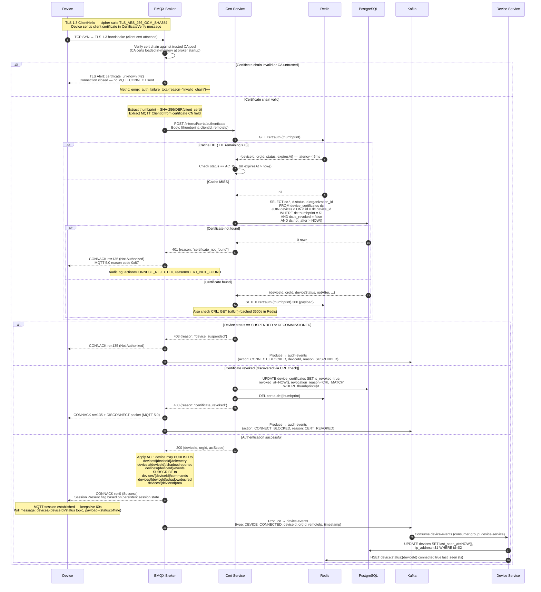
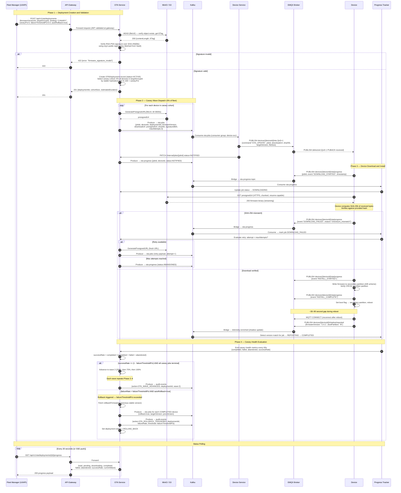
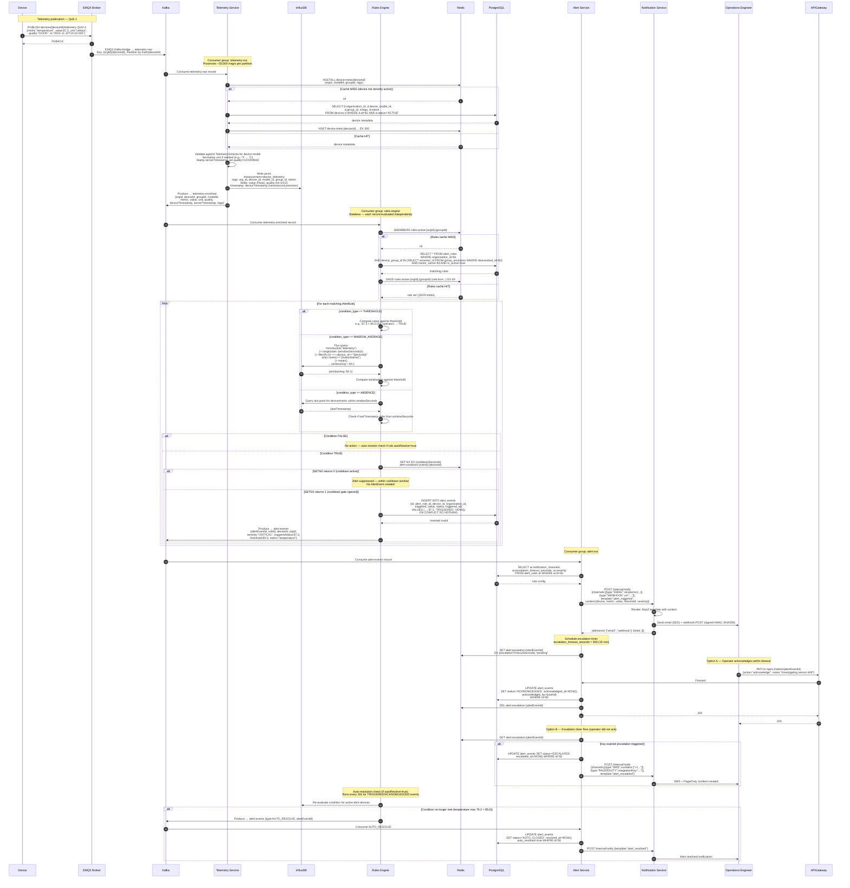

# Sequence Diagrams — IoT Device Management Platform

## Overview

This document captures the key runtime flows in the IoT Device Management Platform as UML sequence diagrams rendered in Mermaid. Each diagram covers one primary use-case path along with the most critical failure paths. Prose sections before and after each diagram explain the design rationale, failure modes, SLA targets, and operational considerations.

The platform has three primary runtime planes:

- **Device Plane**: MQTT over TLS 1.3, device → EMQX → Kafka
- **Control Plane**: REST/gRPC, operator tools → API Gateway → microservices
- **Data Plane**: Kafka consumers → InfluxDB / PostgreSQL / Redis

All inter-service calls within the cluster use mTLS (SPIFFE/SPIRE-issued SVIDs). Kafka produces and consumes use SASL/SCRAM-512 with per-topic ACLs.

---

## Device Authentication with X.509 Certificates

### Context and Design Rationale

X.509 mutual TLS is the primary authentication mechanism for production devices. Each device holds a unique client certificate issued by the platform CA (or a subordinate CA for enterprise customers with their own PKI). The thumbprint of the certificate (SHA-256 of the DER-encoded cert) is the lookup key throughout the system — it appears in Redis cache entries, PostgreSQL `device_certificates` rows, and EMQX's authentication hook call.

The authentication path is on the critical latency path for every device connection and reconnection. The target SLAs are:

- TLS handshake complete (including client cert validation): **< 200 ms** at the 99th percentile
- Certificate lookup with Redis cache hit: **< 5 ms**
- Certificate lookup with PostgreSQL (cache miss): **< 50 ms**
- Total CONNACK latency (including ACL policy load): **< 300 ms**

Redis caches authentication results with a 300-second TTL, keyed as `cert:auth:{thumbprint}`. This means a certificate revocation takes up to 300 seconds to propagate to all EMQX nodes. For immediate revocation (e.g., compromised device), a Kafka `certificate-revoked` event triggers a Redis `DEL` on the cache key across all nodes via a fan-out consumer on each EMQX node's embedded Erlang process.

### Happy Path and Failure Flows

### Post-Connection Considerations

After `CONNACK`, EMQX delivers any queued QoS 1/2 messages if the device reconnected with `cleanSession=false` (MQTT 3.1.1) or `cleanStart=false` (MQTT 5.0). Queued commands stored in Redis are drained to the device's command topic by `CommandService`, which subscribes to the `device-events` Kafka topic and reacts to `DEVICE_CONNECTED` events.

**TLS Session Resumption**: EMQX is configured with a TLS session ticket lifetime of 86,400 seconds (24 hours). Devices that reconnect within this window perform an abbreviated TLS 1.3 handshake (0-RTT or 1-RTT), reducing handshake latency from ~150 ms to ~30 ms. The full certificate authentication hook is still called on resumed sessions to enforce revocation checks.

**Cipher Suites**: Only TLS 1.3 cipher suites are accepted: `TLS_AES_256_GCM_SHA384`, `TLS_CHACHA20_POLY1305_SHA256`. TLS 1.2 is disabled at the EMQX listener level except for a legacy compatibility listener on port 8884 that supports `TLS_ECDHE_RSA_WITH_AES_256_GCM_SHA384` for constrained devices (e.g., ESP32 with mbedTLS < 3.0).

**MQTT 5.0 Enhanced Authentication**: For devices supporting MQTT 5.0, the `AUTH` packet exchange with `reason_code=0x18` (Continue Authentication) is used for challenge-response PSK flows. This is handled by a separate EMQX plugin and does not go through the `CertService` path described above.

---

## OTA Firmware Update with Canary Rollout and Auto-Rollback

### Context and Design Rationale

OTA deployments are the most operationally complex flow in the platform. The key design goals are:

1. **Integrity**: A device never installs firmware that hasn't been verified against a SHA-256 hash and RSA-PSS signature checked by the platform before the deployment is approved.
2. **Safety**: The canary strategy limits blast radius. A configurable `failureThresholdPct` (default 5%) triggers automatic rollback before the failure propagates to the full fleet.
3. **Resilience**: Devices may be offline. The OTA command is re-queued and retried up to `maxAttempts` (default 3) times with exponential backoff. After exhausting retries, the job is marked `ABANDONED` and excluded from health calculations.
4. **Auditability**: Every state transition for every device job is recorded in PostgreSQL with a timestamp, enabling post-incident analysis.

The presigned S3/MinIO URL given to the device has a TTL of 3,600 seconds. If the device has not started the download within that window (e.g., due to intermittent connectivity), `OTAService` generates a new presigned URL and re-publishes the MQTT command with the updated URL on the next retry cycle.

### Failure Modes and Mitigations

**Device offline at dispatch time**: If a device is offline when `DeviceService` attempts to publish the MQTT command, EMQX returns a no-subscriber indicator. `DeviceService` stores the OTA command in Redis as `ZSET ota:queued:{deviceId}` scored by `expires_at`. On device reconnect (detected via Kafka `DEVICE_CONNECTED` event), the command is drained from the queue and published. If the presigned URL has expired by then, `OTAService` regenerates it before re-queuing.

**Power loss mid-flash**: Devices must implement an A/B partition scheme. If the device fails to boot from the new partition (boot attempts counter > 3), the bootloader reverts to the previous partition and reconnects to MQTT. The `firmwareVersion` in the shadow `reported` state will not match the `targetVersion`, and `ProgressTracker` marks the job `INSTALL_FAILED`. The same retry logic applies.

**Kafka consumer lag**: If `ota-progress` consumer lag exceeds 10,000 messages (monitored via Prometheus `kafka_consumer_lag` metric), the `ProgressTracker` pod is scaled horizontally via HPA. All partition assignments are rebalanced with `CooperativeStickyAssignor` to minimize rebalance overhead.

---

## Alert Rule Evaluation and Notification

### Context and Design Rationale

Alert rule evaluation is a streaming computation: telemetry records flow from devices through Kafka, are enriched by `TelemetryService`, and evaluated against rules in `RulesEngine`. The key design goals are:

1. **Low latency**: Time from telemetry publication to alert notification < 5 seconds for threshold rules, < 30 seconds for window aggregation rules.
2. **Idempotency**: Duplicate Kafka messages (at-least-once delivery) must not create duplicate `AlertEvent` rows. A unique constraint on `(alert_rule_id, device_id, triggered_at::date)` combined with a Redis SETNX cooldown check prevents duplicate firing within the cooldown window.
3. **Cooldown enforcement**: Redis `SETNX alert:cooldown:{ruleId}:{deviceId}` with TTL = `cooldown_seconds` gates evaluation. A SETNX call returning 0 means the alert is suppressed without creating any database record.
4. **Escalation**: If an operator does not acknowledge an alert within `escalation_timeout_seconds`, `AlertService` escalates by publishing to additional notification channels (e.g., PagerDuty, on-call SMS).

### At-Least-Once Delivery and Idempotency

Kafka provides at-least-once delivery semantics. The `RulesEngine` may re-process the same telemetry record if a consumer crashes after writing to InfluxDB but before committing the Kafka offset. Two safeguards prevent duplicate alerts:

1. **Redis SETNX cooldown key**: The cooldown key acts as an idempotency gate. Even if the same telemetry record triggers the same rule twice within the cooldown window, the second SETNX returns 0 and no `AlertEvent` is created.

2. **PostgreSQL INSERT ON CONFLICT DO NOTHING**: The unique constraint on `alert_events(alert_rule_id, device_id, triggered_at)` (with `triggered_at` truncated to minute granularity for the index) provides a second layer of protection. The `INSERT ... ON CONFLICT DO NOTHING` ensures no duplicate row is created even if the Redis key expired between the two SETNX calls.

### Performance Considerations

- **InfluxDB window queries** are the most expensive operation in the rules evaluation path. Window queries are only executed for `WINDOW_AVERAGE` and `WINDOW_SUM` condition types (~15% of rules). The Flux query uses a `range()` predicate that is pushed down to the TSM storage engine for efficient time-range scanning. With the `device_id` and `metric` tag indexes in InfluxDB, a 5-minute window query returns in < 20 ms at the 95th percentile.
- **Rules cache TTL**: The 60-second Redis TTL on `rules:active:{orgId}:{groupId}` means rule configuration changes (e.g., threshold updates) take up to 60 seconds to propagate. A `CacheInvalidation` Kafka event published by the admin API triggers an immediate `DEL` on the affected cache keys to reduce this lag to < 1 second.
- **Consumer group scaling**: The `rules-engine` consumer group is sized at `numPartitions / 2` pods (default: 12 partitions → 6 pods). Each pod processes ~8,000 records/second. Peak load of 96,000 records/second requires 12 pods; HPA triggers scale-out at 70% CPU utilization.
