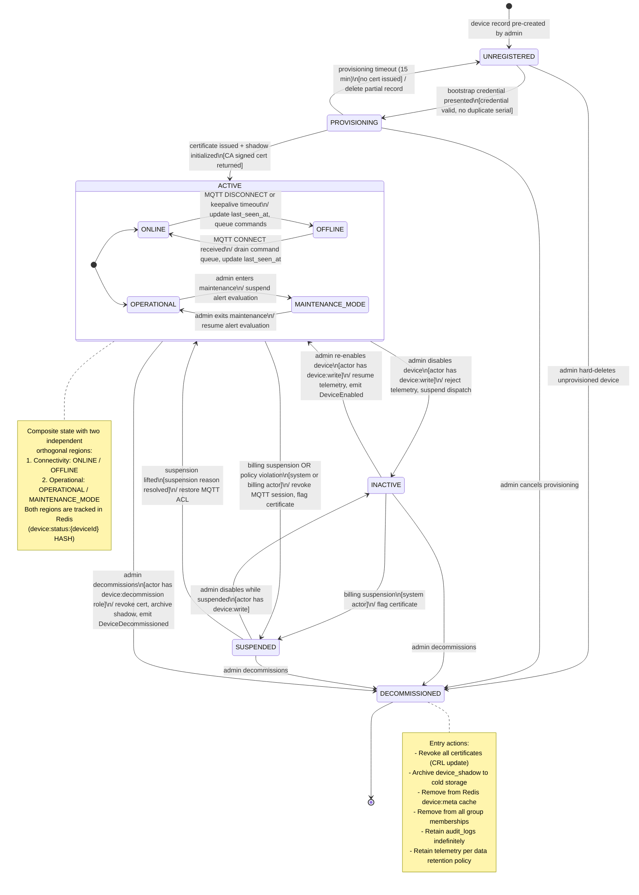
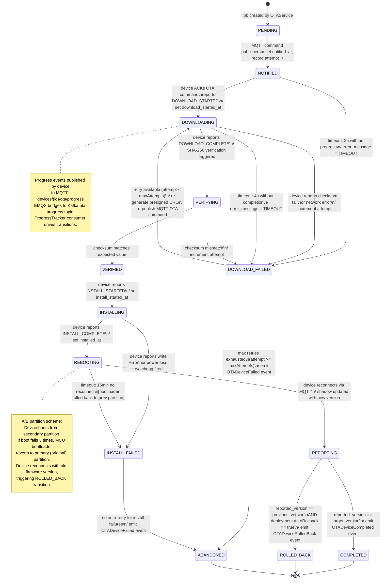
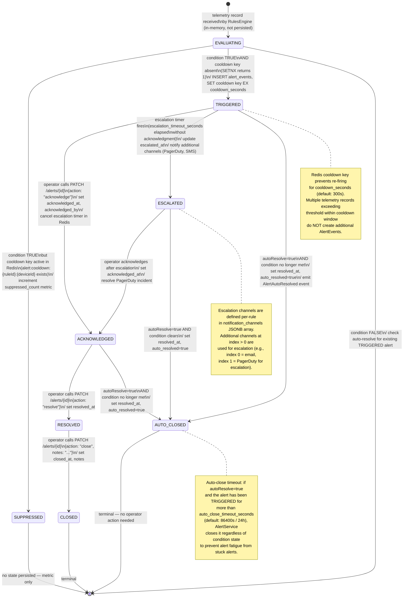

# State Machine Diagrams — IoT Device Management Platform

## Overview

This document defines the formal state machines governing the four primary lifecycle objects in the platform: devices, OTA device jobs, alert events, and device certificates. Each state machine is specified with entry/exit actions, transition guards, and integration events emitted on transitions. State machines drive persistence — every transition results in a PostgreSQL UPDATE wrapped in a database transaction, and a corresponding domain event published to the appropriate Kafka topic after commit.

All state machines are implemented as explicit state transition tables in the application layer (not as ad-hoc boolean flags). The `status` column in each table is constrained to a PostgreSQL `ENUM` type, and application-layer transition validators enforce that only legal transitions occur. Illegal transition attempts return a `409 Conflict` HTTP status with a descriptive error body.

---

## Device Lifecycle States

### Overview

A device moves through a linear provisioning flow from `UNREGISTERED` to `ACTIVE`, then can oscillate between `ACTIVE`, `INACTIVE`, and `SUSPENDED` based on administrative actions or billing events. `DECOMMISSIONED` is a terminal state with no recovery. The connectivity status overlay (`ONLINE` / `OFFLINE`) is orthogonal to the lifecycle state — an `ACTIVE` device can be either `ONLINE` or `OFFLINE` simultaneously.

`MAINTENANCE_MODE` is a composite substate of `ACTIVE`. When a device enters maintenance mode, telemetry is still accepted (for diagnostics) but alert rule evaluation is suspended for that device. This prevents maintenance activities (e.g., calibration, sensor replacement) from generating spurious alerts.

### State Transition Table

| From State     | To State        | Trigger / Event                          | Guard                                    | Actions                                                                 |
|----------------|-----------------|------------------------------------------|------------------------------------------|-------------------------------------------------------------------------|
| UNREGISTERED   | PROVISIONING    | Bootstrap credential presented           | Credential valid, device not duplicate   | Create device record, create OTA pending record, emit `DeviceCreated`   |
| PROVISIONING   | ACTIVE          | Certificate issued, shadow initialized   | CA signed cert present                   | Set `provisioned_at`, emit `DeviceProvisioned`, initialize shadow       |
| ACTIVE         | INACTIVE        | Admin disables device                    | Actor has `device:write` permission      | Reject new telemetry, suspend command dispatch, emit `DeviceDisabled`   |
| INACTIVE       | ACTIVE          | Admin re-enables device                  | Actor has `device:write` permission      | Resume telemetry acceptance, emit `DeviceEnabled`                       |
| ACTIVE         | SUSPENDED       | Billing suspension OR policy violation   | System or billing service actor          | Revoke MQTT session (`DISCONNECT`), flag cert, emit `DeviceSuspended`   |
| INACTIVE       | SUSPENDED       | Billing suspension                       | System actor                             | Emit `DeviceSuspended`, flag certificate                                |
| SUSPENDED      | ACTIVE          | Suspension lifted by admin or billing    | Suspension reason resolved               | Restore MQTT ACL, emit `DeviceUnsuspended`                              |
| SUSPENDED      | INACTIVE        | Admin disables suspended device          | Actor has `device:write` permission      | Emit `DeviceDisabled`                                                   |
| ANY            | DECOMMISSIONED  | Admin decommissions device               | Actor has `device:decommission` role     | Revoke cert, archive shadow, delete from active indexes, emit `DeviceDecommissioned` |
| ACTIVE         | MAINTENANCE     | Admin enters maintenance mode            | Actor has `device:write` permission      | Suppress alert evaluation, emit `DeviceMaintenanceStarted`              |
| MAINTENANCE    | ACTIVE          | Admin exits maintenance mode             | Actor has `device:write` permission      | Resume alert evaluation, emit `DeviceMaintenanceEnded`                  |



### State Persistence and Atomicity

All device state transitions execute within a PostgreSQL transaction:

```sql
BEGIN;
  UPDATE devices SET status = 'SUSPENDED', updated_at = NOW() WHERE id = $1 AND status IN ('ACTIVE', 'INACTIVE');
  INSERT INTO audit_logs (organization_id, actor_id, action, resource_type, resource_id, before_state, after_state, created_at)
    VALUES ($2, $3, 'DEVICE_SUSPENDED', 'device', $1, $4, $5, NOW());
COMMIT;
```

The `AND status IN (...)` guard in the `UPDATE` prevents concurrent transitions from racing. If the `UPDATE` affects 0 rows, the service layer throws `IllegalStateTransitionException` and returns `409 Conflict`. The audit log entry is written in the same transaction so there is never an audit gap.

After commit, the `@TransactionalEventListener(phase = AFTER_COMMIT)` publishes the `DeviceSuspended` domain event to Kafka topic `device-events`. The downstream consumer (`CertService`) reacts by setting a `SUSPENDED` flag on the certificate cache entry, causing EMQX to disconnect the device on the next keepalive cycle (within 60 seconds).

---

## Firmware Update Job States

### Overview

Each `OTADeviceJob` tracks a single device's progress through a firmware update deployment. The state machine is designed to be robust against device-side failures: a `DOWNLOAD_FAILED` state retries automatically up to `maxAttempts` times before giving up (`ABANDONED`). An `INSTALL_FAILED` state does not retry automatically — it requires manual intervention or a new deployment — because repeated flash attempts on a faulty device could damage the storage.

Timeout transitions are critical for correctness: without them, a job could stay in `NOTIFIED` or `DOWNLOADING` indefinitely if the device goes offline without reporting a failure. The `OTAJobTimeoutScheduler` runs every 5 minutes and queries:

```sql
SELECT id FROM ota_device_jobs
WHERE status = 'NOTIFIED' AND notified_at < NOW() - INTERVAL '2 hours'
   OR status = 'DOWNLOADING' AND download_started_at < NOW() - INTERVAL '4 hours';
```

Timed-out jobs are transitioned to `DOWNLOAD_FAILED` (with `error_message = 'TIMEOUT'`) and then retry or abandon logic applies.

### State Transition Table

| From            | To                 | Trigger                                              | Guard                         |
|-----------------|--------------------|------------------------------------------------------|-------------------------------|
| PENDING         | NOTIFIED           | MQTT command published to device                     | MQTT publish succeeded        |
| NOTIFIED        | DOWNLOADING        | Device ACKs command, publishes `DOWNLOAD_STARTED`    | —                             |
| NOTIFIED        | DOWNLOAD_FAILED    | Timeout: no progress in 2 hours                      | `notified_at < now - 2h`      |
| DOWNLOADING     | DOWNLOAD_FAILED    | Device reports checksum failure or network error     | —                             |
| DOWNLOADING     | DOWNLOAD_FAILED    | Timeout: download not completed in 4 hours           | `download_started_at < now-4h`|
| DOWNLOAD_FAILED | DOWNLOADING        | Retry: re-publish MQTT command with fresh URL        | `attempt < maxAttempts`       |
| DOWNLOAD_FAILED | ABANDONED          | Max retries exhausted                                | `attempt >= maxAttempts`      |
| DOWNLOADING     | VERIFYING          | Device reports download complete                     | —                             |
| VERIFYING       | VERIFIED           | SHA-256 checksum matches                             | Platform re-verifies hash     |
| VERIFYING       | DOWNLOAD_FAILED    | SHA-256 checksum mismatch                            | —                             |
| VERIFIED        | INSTALLING         | Device reports `INSTALL_STARTED`                     | —                             |
| INSTALLING      | INSTALL_FAILED     | Device reports write error or power-loss detected    | —                             |
| INSTALLING      | REBOOTING          | Device reports flash complete, setting boot flag     | —                             |
| REBOOTING       | REPORTING          | Device reconnects via MQTT after reboot              | Device CONNECT event received |
| REBOOTING       | INSTALL_FAILED     | Timeout: no reconnect in 15 minutes                  | `rebooting_at < now - 15min`  |
| REPORTING       | COMPLETED          | Reported firmware version matches target version     | —                             |
| REPORTING       | ROLLED_BACK        | Reported version = previous AND rollback triggered   | `autoRollback=true`           |
| INSTALL_FAILED  | ABANDONED          | No retry configured for install failures             | Terminal                      |



### Deployment-Level Aggregate State

`OTADeployment` derives its status from the aggregate of its device job states:

- **ACTIVE**: At least one job is non-terminal and failure rate < `failureThresholdPct`
- **ROLLING_BACK**: Rollback triggered; rollback jobs being dispatched
- **COMPLETED**: All jobs are in `COMPLETED` or `ABANDONED` (no `ROLLED_BACK`)
- **FAILED**: All terminal jobs are terminal and failure rate ≥ `failureThresholdPct`

The deployment status is recomputed by `OTAService` every time a `ota-progress` Kafka event updates a device job state. PostgreSQL aggregate queries over `ota_device_jobs` grouped by `deployment_id` power this calculation, with a Redis cached summary refreshed on each state change.

---

## Alert Event States

### Overview

Alert events have a lifecycle that spans detection, notification, operator acknowledgment, escalation, and resolution. The state machine is designed to ensure that every triggered alert is either acknowledged by an operator or auto-closed by the system — no alert silently disappears. The `SUPPRESSED` pseudo-state represents alerts that were evaluated and met the condition but were not persisted because the cooldown key was active in Redis. Suppressed alerts are not stored in PostgreSQL; they are counted only in metrics.

The `auto_resolve` flag on `AlertRule` enables automatic state transitions from `TRIGGERED` or `ACKNOWLEDGED` to `AUTO_CLOSED` when the triggering condition is no longer met. The auto-resolve check runs as part of the `RulesEngine`'s continuous evaluation loop, not as a separate scheduled job, ensuring timely resolution.



### Idempotency and Concurrent Evaluation

Multiple `RulesEngine` pods evaluate the same telemetry record simultaneously if Kafka delivers it to multiple partitions (which it does not — each record goes to one partition based on `hash(deviceId)`). However, if a pod crashes after `SETNX` succeeds but before `INSERT alert_events` completes, the cooldown key will be set but no `AlertEvent` row will exist. The next evaluation (after cooldown expires) will create the event correctly.

A compensating mechanism runs every 5 minutes: `AlertService` queries for cooldown keys in Redis that have no corresponding `AlertEvent` in PostgreSQL for the same `(ruleId, deviceId)` within the cooldown window. If found, it creates a synthetic `AlertEvent` with `triggered_at` estimated from the key's creation time (stored as a secondary Redis `STRING` alongside the gate key).

### State Visibility

All state transitions are visible to operators through:
- **REST API**: `GET /api/v1/alerts` with `status` filter parameter
- **WebSocket / Server-Sent Events**: `AlertService` publishes state change events to per-organization SSE streams
- **Audit Log**: Every state transition writes an `audit_logs` row with `resource_type = 'alert_event'` and `action = 'ALERT_ACKNOWLEDGED'` etc.

---

## Certificate Lifecycle States

### Overview

Device certificates are issued with a validity period of 365 days by default (configurable per CA to 90–730 days). The platform monitors certificate expiry proactively and supports automated renewal via ACME protocol for CA types `EXTERNAL_ACME` and via in-cluster PKI for `INTERNAL` CAs.

`EXPIRING_SOON` is entered when the certificate has fewer than 30 days until `not_after` (configurable). This triggers an automated renewal workflow that requests a new certificate, installs it on the device via the `CONFIG_UPDATE` command type, and transitions to `RENEWED` once the new certificate's thumbprint is registered and the old one superseded.

```mermaid
stateDiagram-v2
    direction TB

    [*] --> REQUESTED : device submits CSR via bootstrap endpoint\n(POST /provisioning/certificates)

    REQUESTED --> PENDING_ISSUANCE : CSR validated (key size ≥ 2048 bits RSA\nor 256-bit EC), forwarded to CA\n/ create device_certificates record with is_revoked=false

    PENDING_ISSUANCE --> ACTIVE : CA signs certificate\n(internal CA: sync < 500ms;\nexternal ACME: async 1–30s)\n/ store PEM, thumbprint, not_before, not_after\n/ emit CertificateIssued event

    PENDING_ISSUANCE --> FAILED : CA returns error\n(e.g., CSR policy violation, quota exceeded)\n/ emit CertificateIssuanceFailed event\n/ device remains in PROVISIONING lifecycle state

    ACTIVE --> EXPIRING_SOON : cert.not_after - now() < 30 days\n[checked daily by CertExpiryScheduler]\n/ emit CertificateExpiringSoon notification

    ACTIVE --> REVOKED : admin revokes OR\ndevice decommissioned OR\nkey compromise reported\n/ set is_revoked=true, revoked_at, revocation_reason\n/ update CRL, invalidate Redis cache\n/ emit CertificateRevoked event

    ACTIVE --> EXPIRED : cert.not_after < now()\nAND no renewal completed\n/ emit CertificateExpired event\n/ device connectivity interrupted

    EXPIRING_SOON --> RENEWAL_IN_PROGRESS : automated renewal workflow starts\n/ generate new key pair on device\n/ submit new CSR via MQTT command\n/ create new device_certificates row (PENDING_ISSUANCE)

    EXPIRING_SOON --> REVOKED : admin revokes expiring cert early

    EXPIRING_SOON --> EXPIRED : renewal not completed before not_after

    RENEWAL_IN_PROGRESS --> RENEWED : new certificate issued and ACKed by device\n/ new cert becomes ACTIVE\n/ old cert superseded (marked is_superseded=true)\n/ old cert remains ACTIVE until device confirms new cert in use

    RENEWAL_IN_PROGRESS --> EXPIRING_SOON : renewal workflow failed\n(CA unreachable, device offline)\n/ retry after 24 hours

    RENEWED --> [*] : superseded certificate record closed out\n(is_superseded flag — not deleted for audit)

    REVOKED --> [*] : terminal — certificate retained in DB for audit\n(CRL entries reference thumbprint)

    EXPIRED --> [*] : terminal — retained for audit trail

    FAILED --> [*] : terminal

    note right of EXPIRING_SOON
        Notification sent via email to org admin
        and via MQTT to device (if ONLINE) with
        instructions to initiate CSR for renewal.
        Devices supporting EST (RFC 7030) can
        auto-renew without operator intervention.
    end note

    note right of RENEWAL_IN_PROGRESS
        During renewal, BOTH old and new
        certificates are ACTIVE. The old cert
        is used until the device confirms the
        new cert is loaded (shadow update:
        {reported: {activeCertThumbprint: "..."}}).
        This prevents lockout during transition.
    end note

    note right of REVOKED
        Revocation propagates within 5 minutes:
        1. Redis DEL cert:auth:{thumbprint} (immediate)
        2. CRL republished to CDN (< 60s)
        3. OCSP stapling cache invalidated (< 5s)
        4. EMQX issues DISCONNECT to active session
    end note
```



### Certificate Expiry Monitoring

The `CertExpiryScheduler` is a Quartz-managed scheduled job that runs daily at 02:00 UTC:

```sql
SELECT d.organization_id, d.id AS device_id, dc.thumbprint, dc.not_after,
       (dc.not_after - NOW()) AS days_remaining
FROM device_certificates dc
JOIN devices d ON d.id = dc.device_id
WHERE dc.is_revoked = false
  AND dc.not_after BETWEEN NOW() AND NOW() + INTERVAL '30 days'
  AND d.status != 'DECOMMISSIONED'
ORDER BY dc.not_after ASC;
```

For each certificate in the result set, the scheduler:
1. Transitions the cert to `EXPIRING_SOON` if not already in that state
2. Sends an email notification to the org admin
3. Publishes a `CertificateExpiringSoon` event to Kafka `audit-events`
4. If the cert is within 7 days of expiry, escalates to `CRITICAL` severity alert

### Revocation Propagation

Revocation must propagate faster than the Redis TTL (300 seconds) to minimize the window during which a revoked certificate can authenticate. The propagation chain:

1. `CertService` calls `Redis.DEL cert:auth:{thumbprint}` — immediate
2. `CertService` publishes `CertificateRevoked` event to Kafka `audit-events`
3. Each EMQX node has an embedded consumer of `audit-events`. On `CertificateRevoked`, it calls `emqx_acl:kick_connection(clientId)` via the Erlang API, forcibly disconnecting the device — latency < 1 second
4. CRL is regenerated and published to the CDN-hosted CRL endpoint — latency < 60 seconds
5. OCSP stapling caches on all EMQX nodes are purged — latency < 5 seconds

This multi-layer approach ensures that a compromised device loses connectivity within 1 second of revocation, while the CRL/OCSP infrastructure catches any stale session that survived the direct kick.
