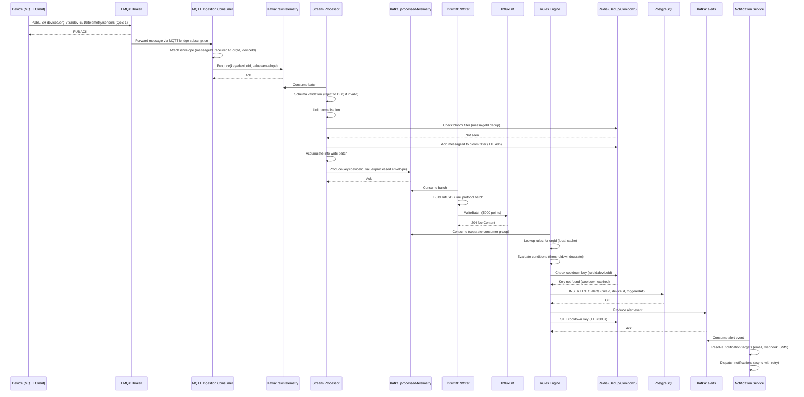

# Telemetry Pipeline and Rules Engine — Detailed Design

## 1. Overview

The telemetry pipeline is the highest-throughput data path in the IoT Device Management Platform. It accepts sensor readings and device metrics from millions of connected devices, validates and normalises the data, stores it in a time-series database, and continuously evaluates user-defined rules to detect anomalies and trigger automated responses.

The pipeline is designed around an event-driven, horizontally-scalable architecture using MQTT as the device-facing transport, Apache Kafka as the durable messaging backbone, and InfluxDB as the time-series storage layer. The rules engine runs as a stateful stream processor that consumes the processed telemetry topic, evaluates conditions against configurable windows, and dispatches actions through a dedicated action pipeline.

Key design principles:

- **At-least-once delivery** from device to storage; idempotent writes to InfluxDB prevent duplicates from causing data corruption.
- **Schema-first ingestion**: every message is validated against a registered schema before entering the processing pipeline.
- **Multi-tenant isolation**: organisation identifiers are embedded at every layer (MQTT topic, Kafka key, InfluxDB tag) to enforce data isolation and enable per-tenant quota enforcement.
- **Backpressure propagation**: if InfluxDB write throughput drops, Kafka consumer lag grows and triggers auto-scaling rather than silently dropping data.

---

## 2. MQTT Topic Structure

Devices publish telemetry to hierarchically structured MQTT topics. The topic structure carries enough routing context that the broker can apply ACL rules without inspecting the payload.

```
devices/{orgId}/{deviceId}/telemetry/{streamName}
```

| Segment | Description |
|---|---|
| `devices` | Top-level namespace for all device-originated traffic |
| `{orgId}` | UUID of the owning organisation; used for multi-tenant ACL enforcement |
| `{deviceId}` | UUID of the specific device; used for per-device rate limiting |
| `telemetry` | Segment distinguishing telemetry from other message types (commands, shadow, OTA) |
| `{streamName}` | Logical data stream name (e.g., `sensors`, `gps`, `diagnostics`, `power`) |

**Example topics:**

```
devices/org-7f3a/dev-c219/telemetry/sensors
devices/org-7f3a/dev-c219/telemetry/gps
devices/org-7f3a/dev-c219/telemetry/diagnostics
```

ACL rules in EMQX are expressed as topic patterns. A device is granted publish permission only on topics matching `devices/{its-orgId}/{its-deviceId}/telemetry/#`, enforced via the JWT claims in the device connection token.

Wildcard subscriptions for the ingestion service use `devices/+/+/telemetry/+`, allowing a single consumer to receive all telemetry across all organisations and stream types.

---

## 3. Kafka Topic Design

All inter-service communication after the MQTT broker is mediated through Kafka. Topics are named using the convention `{env}.iot.{entity}.{event}` and partitioned by `deviceId` to preserve per-device message ordering.

### 3.1 Topic Inventory

| Topic | Partitions | Retention | Purpose |
|---|---|---|---|
| `prod.iot.telemetry.raw` | 128 | 24 hours | Raw MQTT payloads, unvalidated, as received from broker |
| `prod.iot.telemetry.processed` | 128 | 7 days | Validated, normalised, deduplicated telemetry ready for storage and rules evaluation |
| `prod.iot.telemetry.dlq` | 16 | 30 days | Dead-letter queue for messages that failed validation or processing |
| `prod.iot.alerts` | 32 | 30 days | Alert events generated by the rules engine |
| `prod.iot.ota.events` | 16 | 7 days | OTA job lifecycle events (CREATED, DOWNLOADING, APPLIED, FAILED, ROLLED_BACK) |
| `prod.iot.commands` | 64 | 7 days | Commands dispatched to devices via MQTT |
| `prod.iot.device.events` | 32 | 30 days | Device lifecycle events (REGISTERED, UPDATED, DECOMMISSIONED, CONNECTED, DISCONNECTED) |

### 3.2 Partitioning Strategy

All topics are partitioned by `deviceId` (hashed). This ensures:

- Telemetry messages from a single device are processed in order by a single consumer instance.
- Rules engine state (sliding windows, counters) for a device is co-located on one partition, avoiding cross-instance coordination.
- InfluxDB write batching can accumulate points for the same device and flush atomically.

### 3.3 Message Envelope

Every Kafka message uses a common envelope schema:

```json
{
  "envelopeVersion": "2",
  "messageId": "uuid-v4",
  "orgId": "org-7f3a",
  "deviceId": "dev-c219",
  "fleetId": "fleet-alpha",
  "streamName": "sensors",
  "receivedAt": "2024-01-15T10:30:00.123Z",
  "deviceTimestamp": "2024-01-15T10:29:59.987Z",
  "payload": {}
}
```

The `messageId` is the idempotency key used to detect duplicates in downstream consumers.

---

## 4. Stream Processor Design

The stream processor is a Kafka Streams application (or equivalent in Go using Sarama) that bridges `prod.iot.telemetry.raw` and `prod.iot.telemetry.processed`. It performs four stages in a linear pipeline.

### 4.1 Schema Validation

Each incoming message is validated against the registered schema for the device's `streamName`. Schemas are stored in a Schema Registry (Confluent-compatible) and cached locally in the processor.

- If the message schema version does not exist in the registry, the message is routed to the DLQ with reason `SCHEMA_NOT_FOUND`.
- If the payload fails validation (missing required fields, wrong types, out-of-range values), the message is routed to the DLQ with reason `VALIDATION_FAILED` and a structured error report.
- Schema cache is refreshed every 60 seconds; cache invalidation is triggered by a schema-updated event on `prod.iot.schema.events`.

### 4.2 Unit Normalisation

Devices may report measurements in different units depending on firmware version or regional configuration. The normalisation stage maps all values to SI base units.

| Input Unit | Normalised Unit | Conversion |
|---|---|---|
| Fahrenheit | Celsius | `(F - 32) x 5/9` |
| PSI | Pascal | `x 6894.76` |
| mph | m/s | `x 0.44704` |
| kWh | Joule | `x 3,600,000` |
| Millivolt (mV) | Volt | `/ 1000` |

Unit mapping rules are loaded from a configuration file at startup and reloaded on SIGHUP without restarting the processor.

### 4.3 Deduplication

Duplicate messages can arrive due to MQTT QoS 1 (at-least-once) semantics or Kafka producer retries. Deduplication is performed using a bloom filter seeded with `messageId` values, with a 48-hour TTL window stored in Redis.

- If a `messageId` is already in the bloom filter, the message is dropped with a `DUPLICATE_DROPPED` counter increment.
- False-positive rate is configured at 0.01%, sufficient for the expected throughput of 100M messages/day.

### 4.4 Batching

To optimise InfluxDB write throughput, the stream processor accumulates messages into write batches:

- **Batch size**: up to 5,000 points per flush.
- **Flush interval**: maximum 500ms between flushes (to bound write latency).
- **Flush trigger**: whichever comes first — batch full or interval elapsed.
- Batches are flushed asynchronously; if the InfluxDB write fails, the batch is retried with exponential backoff up to 3 attempts before being routed to the DLQ.

---

## 5. InfluxDB Measurement Schema

Each telemetry stream maps to a dedicated InfluxDB measurement. This avoids high-cardinality measurement names while keeping queries scoped to a single stream type efficient.

### 5.1 Measurement Structure

```
measurement: {streamName}

tags (indexed, low-cardinality):
  orgId       = "org-7f3a"
  deviceId    = "dev-c219"
  fleetId     = "fleet-alpha"
  streamName  = "sensors"
  firmwareVer = "2.4.1"

fields (non-indexed, high-cardinality values):
  temperature_c  = 23.4
  humidity_pct   = 61.2
  pressure_pa    = 101325.0
  battery_v      = 3.7
  rssi_dbm       = -72

timestamp: nanosecond Unix epoch (device timestamp after clock-skew correction)
```

### 5.2 Retention Policies

| Policy Name | Duration | Replication | Default |
|---|---|---|---|
| `rp_hot` | 7 days | 2 | Yes |
| `rp_warm` | 90 days | 1 | No |
| `rp_cold` | 365 days | 1 (object storage) | No |

Continuous queries (or Flux tasks) downsample from `rp_hot` to `rp_warm` on a 1-minute aggregation interval, and from `rp_warm` to `rp_cold` on a 1-hour aggregation interval.

### 5.3 Tag Cardinality Management

High-cardinality fields such as `messageId` or raw `deviceTimestamp` are stored as fields, not tags, to prevent the InfluxDB series explosion problem. The maximum expected series count is `numDevices x numStreams x numFirmwareVersions`, kept manageable by evicting old firmware version combinations via retention policies.

---

## 6. Rules Engine Architecture

The rules engine evaluates user-defined conditions against the processed telemetry stream and dispatches actions when conditions are met.

### 6.1 Rule Data Model

```json
{
  "ruleId": "rule-temp-overheat",
  "orgId": "org-7f3a",
  "name": "Temperature Overheat Alert",
  "enabled": true,
  "streamName": "sensors",
  "fleetId": "fleet-alpha",
  "condition": {
    "type": "threshold",
    "field": "temperature_c",
    "operator": "gt",
    "value": 85.0,
    "window": { "type": "sliding", "durationSeconds": 60, "minSamples": 3 }
  },
  "actions": [
    { "type": "alert", "severity": "critical", "message": "Device overheat detected" },
    { "type": "command", "command": "reduce_sampling_rate", "params": { "interval": 60 } },
    { "type": "webhook", "url": "https://hooks.example.com/iot-alerts" }
  ],
  "cooldownSeconds": 300
}
```

### 6.2 Rule Loading Strategy

Rules are loaded from PostgreSQL at startup. To avoid rule evaluation downtime during updates:

1. **Periodic reload**: every 30 seconds, each rules engine instance queries PostgreSQL for rules modified since the last load timestamp.
2. **Cache invalidation via Kafka**: when a rule is created, updated, or deleted via the Rules API, a `prod.iot.rule.events` message is published. Rules engine instances consume this topic and invalidate their local cache immediately for the affected `orgId`.
3. **Local rule cache**: rules are stored in an in-memory map keyed by `orgId -> []Rule`. This allows O(1) lookup of applicable rules for each incoming telemetry message without database round-trips.

### 6.3 Condition Evaluation

Three condition types are supported:

**Threshold condition**: Evaluates whether a field value exceeds a static threshold.
```
temperature_c > 85.0
```
Evaluated on every message; actions fire on first breach. A cooldown period prevents repeated firing.

**Sliding window condition**: Evaluates aggregate statistics over a rolling time window.
```
avg(temperature_c, window=5min) > 80.0
avg(vibration_ms2, window=10min) > 2.5 AND count(vibration_ms2, window=10min) >= 10
```
Implemented using a per-device circular buffer in the rules engine local state (backed by RocksDB in Kafka Streams).

**Rate of change condition**: Detects rapid changes in a field value.
```
rate_of_change(pressure_pa, window=60s) > 500
```
Computed as `(latest_value - oldest_value_in_window) / window_duration_seconds`.

### 6.4 Action Dispatch Pipeline

When a rule condition is satisfied:

1. **Deduplication check**: the rules engine queries a Redis SET keyed by `{ruleId}:{deviceId}` with TTL equal to `cooldownSeconds`. If key exists, action is suppressed.
2. **Alert creation**: an alert record is written to PostgreSQL and an `alert.triggered` event is published to `prod.iot.alerts`.
3. **Command dispatch** (if action type is `command`): a command message is published to `prod.iot.commands`, which the command service picks up and forwards to the device via MQTT.
4. **Webhook dispatch** (if action type is `webhook`): dispatched asynchronously via the notification service; failures are retried with exponential backoff.
5. **Cooldown set**: Redis key is set with TTL to suppress duplicate actions.

---

## 7. Sequence Diagram: Full Telemetry Pipeline



---

## 8. Performance Considerations

### 8.1 Kafka Consumer Groups

- The stream processor uses consumer group `telemetry-processor`. Each instance owns a subset of partitions.
- The InfluxDB writer uses consumer group `influxdb-writer`, independent of the processor group, allowing independent scaling.
- The rules engine uses consumer group `rules-engine`. Because rules are partitioned by `orgId`, rules engine instances hold stable state for their assigned organisations.

### 8.2 InfluxDB Write Batching

- Each writer instance maintains a per-partition buffer. Flushing uses the InfluxDB client's batch API with HTTP/2 multiplexing.
- Target throughput per writer instance: 200,000 points/second.
- Back-off strategy on write failure: 100ms, 500ms, 2000ms; if all retries fail, points are sent to the DLQ.

### 8.3 Rules Engine Throughput

- Rule evaluation is the CPU-intensive stage. A single rules engine instance can evaluate approximately 50,000 simple threshold rules/second.
- Sliding window state is kept in RocksDB (via Kafka Streams state stores), providing O(log n) read/write per message.
- Action dispatch is decoupled from evaluation: actions are placed onto an internal queue and dispatched by a separate thread pool, preventing slow webhook calls from blocking rule evaluation.

---

## 9. Scaling Strategy

### 9.1 Horizontal Scaling of Telemetry Consumers

The stream processor and InfluxDB writer scale horizontally by adding Kafka consumer instances to their consumer groups. Maximum parallelism equals the number of Kafka partitions (128). Target: 1 consumer instance per 4 partitions at steady state, with auto-scaling triggered when consumer group lag exceeds 10,000 messages per partition.

Auto-scaling is implemented via a Kubernetes HPA backed by a custom metric exported from the Kafka consumer group lag Prometheus exporter.

### 9.2 InfluxDB Clustering

For high-throughput deployments, InfluxDB is deployed as a cluster (InfluxDB Enterprise or InfluxDB Clustered):

- Write requests are load-balanced across data nodes using consistent hashing on the series key.
- Meta nodes maintain cluster membership and schema metadata.
- Each data node is responsible for a subset of shards; shard duration is 1 day for the hot retention policy.
- Replication factor of 2 ensures no data loss on single node failure.

### 9.3 Rules Engine Partitioning by OrgId

The rules engine partitions work by `orgId`. The `prod.iot.telemetry.processed` topic uses a compound partition key of `{orgId}:{deviceId}` (hashed), ensuring all messages for an organisation are routed to a consistent subset of partitions and thus a consistent rules engine instance. This eliminates the need for distributed rule state coordination — each instance owns the complete rule set and window state for its assigned organisations.

For very large organisations exceeding single-instance throughput, a sub-partitioning strategy splits by `fleetId` within the organisation, allowing multiple instances to share load while still maintaining per-device ordering.

---

## 10. Operational Runbooks

### 10.1 Consumer Group Lag Alert Response

If `prod.iot.telemetry.raw` consumer group lag exceeds 100,000 messages:

1. Check stream processor CPU and memory utilisation in Grafana.
2. If CPU-bound: scale up consumer instances (increase `replicas` in Kubernetes deployment).
3. If I/O-bound (InfluxDB writes): check InfluxDB write latency; consider increasing batch size or write timeout.
4. If schema validation errors spiking: a new device firmware may have broken schema compatibility; investigate DLQ.

### 10.2 InfluxDB Write Error Rate Alert Response

If InfluxDB write error rate exceeds 1% of batches:

1. Check InfluxDB cluster health via `influx ping` and cluster status endpoint.
2. If disk full: trigger emergency retention policy reduction (reduce `rp_hot` from 7 days to 3 days temporarily).
3. If network partition: writer will retry from DLQ; verify DLQ consumer is running.
4. Check for cardinality explosion: run `SHOW SERIES EXACT CARDINALITY` and compare to baseline.
