# Architecture Diagram

This document describes the high-level system architecture of the IoT Device Management Platform.
The architecture follows a microservices pattern with an event-driven backbone (Apache Kafka) for
asynchronous inter-service communication and a shared API Gateway for all synchronous external
traffic.

The design goals driving this architecture are:

- **Horizontal scalability** — each service layer can be scaled independently to meet demand spikes
  in any individual subsystem (e.g., scale only the Telemetry Service during a fleet-wide firmware
  rollout storm).
- **Fault isolation** — a failure in the Rules Engine or Notification Service must not affect the
  core device connectivity and telemetry ingestion path.
- **Security in depth** — mutual TLS at the device layer, JWT at the API layer, and network
  segmentation between internal services.
- **Technology fit-for-purpose** — time-series storage for telemetry, relational storage for
  structured configuration, key-value caching for hot paths, and object storage for binary assets.

---

## Full System Architecture

```mermaid
flowchart TB
    subgraph ClientLayer["Client Layer"]
        WebDash["🌐 Web Dashboard\n(React / Next.js)"]
        MobileApp["📱 Mobile App\n(React Native)"]
        APIClients["🔗 REST API Clients\n(3rd-party integrations)"]
        IoTDevicesClient["🔌 IoT Devices\n(MQTT / HTTPS)"]
    end

    subgraph GatewayLayer["API Gateway Layer"]
        Kong["🚦 Kong / Nginx API Gateway\n• JWT authentication\n• Rate limiting (per-org quotas)\n• TLS termination\n• Request routing\n• API versioning"]
        MQTTBroker["📡 EMQX MQTT Broker\n• mTLS device auth\n• ACL enforcement\n• QoS 0/1/2 support\n• Kafka bridge plugin\n• WebSocket support"]
    end

    subgraph ServiceLayer["Service Layer (Microservices)"]
        DeviceSvc["Device Service\n• CRUD for Devices, Fleets\n• Shadow management\n• Provisioning workflow"]
        TelemetrySvc["Telemetry Service\n• Schema validation\n• Unit normalisation\n• InfluxDB writer\n• Stream management"]
        RulesEngine["Rules Engine\n• Rule evaluation\n• Condition processor\n• Alert event emitter"]
        OTASvc["OTA Service\n• Job orchestration\n• Rollout wave control\n• Progress aggregation"]
        CommandSvc["Command Service\n• Command dispatch\n• Ack tracking\n• Retry logic"]
        CertSvc["Certificate Service\n• X.509 issuance\n• CRL management\n• Revocation"]
        AuthSvc["Auth Service\n• User authentication\n• OAuth2 / OIDC\n• Token issuance & refresh"]
        NotifySvc["Notification Service\n• Template rendering\n• Email dispatch\n• SMS dispatch\n• Webhook delivery"]
    end

    subgraph MessagingLayer["Messaging Layer"]
        Kafka["Apache Kafka\n━━━━━━━━━━━━━━━━━━\nTopics:\n• telemetry-raw\n• telemetry-enriched\n• commands\n• ota-jobs\n• ota-progress\n• alert-events\n• audit-events"]
    end

    subgraph DataLayer["Data Layer"]
        Postgres["🐘 PostgreSQL\n• Device registry\n• Fleet & org data\n• Rules & conditions\n• OTA jobs & status\n• Alert records\n• Audit logs\n• Certificates"]
        InfluxDB["📈 InfluxDB / TimescaleDB\n• Telemetry time-series\n• Downsampled aggregates\n• Per-device retention policies"]
        Redis["⚡ Redis\n• Session / JWT cache\n• Device shadow cache\n• Alert deduplication keys\n• Rate limit counters\n• Distributed locks"]
        MinIO["🗄 MinIO / S3\n• Firmware binaries\n• Audit log archives\n• Certificate backups\n• Export snapshots"]
    end

    subgraph ExternalLayer["External Services"]
        ExternalCA["🏛 External PKI / CA\n(BYO certificate\nauthority for enterprise)"]
        SMTPGateway["📧 SMTP Gateway\n(Amazon SES /\nSendGrid)"]
        SMSGateway["📱 SMS Gateway\n(Twilio / SNS)"]
    end

    %% Client → Gateway
    WebDash -- "HTTPS REST / WebSocket" --> Kong
    MobileApp -- "HTTPS REST" --> Kong
    APIClients -- "HTTPS REST (API key / OAuth2)" --> Kong
    IoTDevicesClient -- "MQTT (mTLS port 8883)" --> MQTTBroker
    IoTDevicesClient -- "HTTPS (bootstrap & firmware download)" --> Kong

    %% Gateway → Services
    Kong -- "Route /api/v1/devices/**" --> DeviceSvc
    Kong -- "Route /api/v1/telemetry/**" --> TelemetrySvc
    Kong -- "Route /api/v1/rules/**" --> RulesEngine
    Kong -- "Route /api/v1/ota/**" --> OTASvc
    Kong -- "Route /api/v1/commands/**" --> CommandSvc
    Kong -- "Route /api/v1/auth/**" --> AuthSvc
    Kong -- "Validate JWT →" --> AuthSvc

    %% MQTT Broker → Kafka (bridge)
    MQTTBroker -- "telemetry publishes\n→ telemetry-raw topic" --> Kafka
    MQTTBroker -- "OTA progress\n→ ota-progress topic" --> Kafka
    MQTTBroker -- "Device connection events\n→ audit-events topic" --> Kafka

    %% Services → Kafka
    DeviceSvc -- "Produce audit-events" --> Kafka
    OTASvc -- "Produce ota-jobs topic" --> Kafka
    RulesEngine -- "Produce alert-events topic" --> Kafka
    CommandSvc -- "Produce commands topic" --> Kafka

    %% Kafka → Services (consumers)
    Kafka -- "telemetry-raw →\nconsume & validate" --> TelemetrySvc
    Kafka -- "telemetry-enriched →\nconsume & evaluate" --> RulesEngine
    Kafka -- "alert-events →\nconsume & dispatch" --> NotifySvc
    Kafka -- "ota-progress →\nconsume & aggregate" --> OTASvc
    Kafka -- "commands →\nconsume & publish" --> CommandSvc

    %% Kafka → MQTT Broker (commands fan-out)
    CommandSvc -- "MQTT publish\ndevices/{id}/commands" --> MQTTBroker

    %% Services → Data Stores
    DeviceSvc -- "Read / Write" --> Postgres
    DeviceSvc -- "Shadow cache R/W" --> Redis
    TelemetrySvc -- "Write time-series points" --> InfluxDB
    TelemetrySvc -- "Schema lookup" --> Postgres
    RulesEngine -- "Rule definitions" --> Postgres
    RulesEngine -- "Dedup keys" --> Redis
    OTASvc -- "Job & device status" --> Postgres
    OTASvc -- "Firmware upload / download URL" --> MinIO
    AuthSvc -- "User & token store" --> Postgres
    AuthSvc -- "Token cache" --> Redis
    NotifySvc -- "Alert & notification records" --> Postgres
    CertSvc -- "Certificate store" --> Postgres
    CertSvc -- "Certificate backup" --> MinIO

    %% External connections
    CertSvc -- "CSR submission" --> ExternalCA
    ExternalCA -- "Signed certificate" --> CertSvc
    NotifySvc -- "Send email" --> SMTPGateway
    NotifySvc -- "Send SMS" --> SMSGateway
```

---

## Layer Descriptions

### Client Layer
All user-facing and machine-to-machine entry points. The **Web Dashboard** provides the primary
operator UI (device maps, telemetry charts, alert inbox, OTA management). The **Mobile App**
targets field technicians who need a lightweight view during on-site visits. **REST API Clients**
cover third-party systems (SCADA, ERP) integrating via the public API. **IoT Devices** communicate
over MQTT for continuous data streams and HTTPS for one-off provisioning and firmware download.

### API Gateway Layer
A unified ingress for all synchronous traffic. **Kong** handles authentication (JWT validation
delegated to Auth Service), rate limiting (per-organisation sliding window counters stored in
Redis), TLS termination, and intelligent routing to the correct microservice. The **EMQX MQTT
Broker** sits alongside Kong to handle the persistent, stateful MQTT connections from millions of
devices; it authenticates devices via mTLS and enforces per-device ACLs before bridging published
messages into Kafka.

### Service Layer
Eight domain-focused microservices, each owning its own data and exposing a REST API internally.
Services communicate with one another asynchronously through Kafka topics, avoiding tight runtime
coupling. Synchronous inter-service calls are used only for latency-critical read paths (e.g.,
Auth Service JWT validation by Kong).

### Messaging Layer
Apache Kafka provides durable, ordered, partitioned message storage. Topics are partitioned by
`deviceId` to ensure per-device ordering. Consumer groups allow multiple services to read the same
topic independently. Retention is 7 days by default, giving services time to recover from outages
without data loss.

### Data Layer
Four specialised stores are used rather than a single database, each optimised for its workload:
**PostgreSQL** for transactional, relational data; **InfluxDB/TimescaleDB** for high-cardinality
time-series with automatic retention and downsampling; **Redis** for sub-millisecond caching and
distributed coordination; **MinIO/S3** for durable, cheap binary object storage.

### External Services
The **External CA** integration supports enterprise customers who operate their own PKI and must
issue device certificates from their own root of trust. **SMTP** and **SMS** gateways are
abstracted behind the Notification Service, allowing the underlying provider to be swapped without
any other service changes.

---

## Network Segmentation

| Zone | Components | Access Rules |
|---|---|---|
| **DMZ** | EMQX MQTT Broker, Kong API Gateway | Accessible from internet on port 443/8883 |
| **Service Zone** | All microservices | Reachable only from DMZ and other services; no direct internet access |
| **Data Zone** | PostgreSQL, InfluxDB, Redis, MinIO | Reachable only from Service Zone |
| **Management Zone** | Kafka, monitoring stack | Reachable only from Service Zone and ops tooling |

---

## Scalability Notes

- **Telemetry Service** and **Rules Engine** are the highest-throughput services and are deployed
  as Kubernetes Deployments with Horizontal Pod Autoscaler (HPA) targeting 70% CPU.
- **EMQX** is deployed as a cluster (3+ nodes) with session persistence in the cluster's Mnesia
  database to survive node failures without device reconnection storms.
- **Kafka** is deployed with a replication factor of 3 and `min.insync.replicas=2` to tolerate a
  single broker failure without data loss.
- **PostgreSQL** is deployed in primary + two read-replica topology; the Device Service read paths
  are directed to read replicas to offload the primary.
