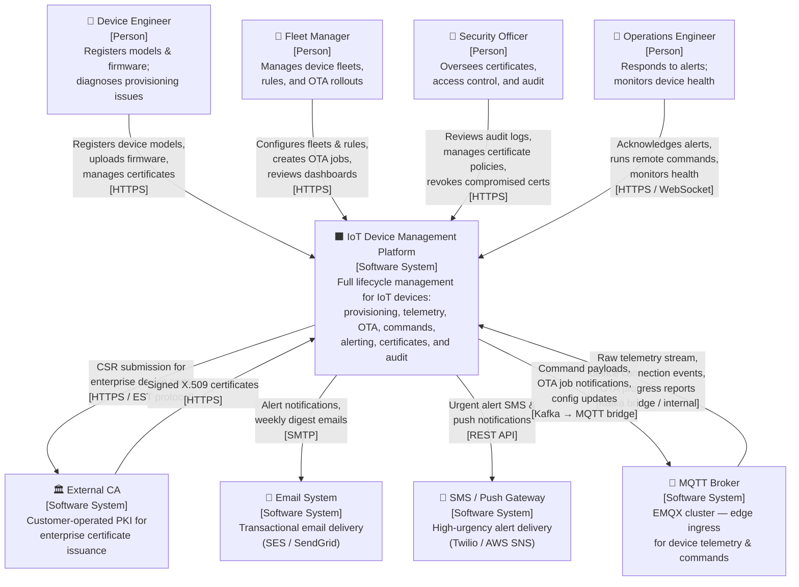

# C4 Architecture Diagrams

This document applies the **C4 Model** (Context, Containers, Components, Code) to the IoT Device
Management Platform. Two levels are presented:

- **Level 1 — System Context Diagram**: shows the platform as a single box and its relationships
  with the people and external systems that interact with it.
- **Level 2 — Container Diagram**: zooms into the platform and shows the deployable units
  (containers) that make up the system and how they communicate.

The C4 Model uses precise vocabulary: a **Person** is a human user role, a **Software System** is
any system that is relevant to the diagram (including the system being described), and a
**Container** is a separately deployable or runnable unit within a software system (not a Docker
container, though they often coincide).

---

## Level 1 — System Context Diagram

### Persons and Systems

| Name | Type | Description |
|---|---|---|
| **Device Engineer** | Person | Hardware/firmware engineer who registers new device models, uploads firmware binaries, and diagnoses connectivity or provisioning failures. |
| **Fleet Manager** | Person | Operations staff responsible for day-to-day device health, creating monitoring rules, managing OTA rollouts to fleets, and reviewing dashboards. |
| **Security Officer** | Person | Reviews certificate expiry, revocation lists, audit logs, and access control policies. Approves certificate issuance for new device models. |
| **Operations Engineer** | Person | Responds to real-time alerts, acknowledges incidents, remotely commands devices, and monitors system health metrics. |
| **IoT Device Management Platform** | Software System | The system described in this document. Manages the full lifecycle of IoT devices: provisioning, connectivity, telemetry, commands, OTA updates, alerting, and audit. |
| **External CA** | Software System | An external Certificate Authority operated by the customer or a trusted third party. Used by enterprise customers who bring their own PKI instead of using the platform's internal CA. |
| **Email System** | Software System | An SMTP relay or transactional email service (Amazon SES, SendGrid) used to deliver alert notifications, weekly digest reports, and account management emails. |
| **SMS / Push Gateway** | Software System | A messaging gateway (Twilio, AWS SNS) used to deliver high-urgency alert SMS messages and push notifications to mobile devices. |
| **MQTT Broker** | Software System | EMQX MQTT broker cluster that handles persistent TCP connections from field devices. Shown as an external system at this level because it operates at the network edge, potentially in a DMZ or co-located with devices in a factory. |

---

## Level 2 — Container Diagram

### Containers

| Name | Type | Technology | Description |
|---|---|---|---|
| **Web Application** | Container | React / Next.js | Single-page application served from a CDN. Provides the operator dashboard, fleet management UI, alert inbox, telemetry charts, and OTA management console. |
| **API Gateway** | Container | Kong / Nginx | Unified ingress for all synchronous REST traffic. Handles JWT validation (delegated to Auth Service), rate limiting, TLS termination, and route-based forwarding to internal services. |
| **Device Service** | Container | Node.js / Go | Core service managing device and fleet entities, device shadow read/write, provisioning workflows, and connection status tracking. |
| **Telemetry Service** | Container | Go | High-throughput Kafka consumer that validates, enriches, and persists telemetry data points to InfluxDB. Exposes REST endpoints for telemetry schema management and historical queries. |
| **Rules Engine** | Container | Java / Flink | Stateful stream processor that consumes enriched telemetry from Kafka, evaluates rule predicates, and emits alert events. |
| **OTA Service** | Container | Node.js | Orchestrates firmware upload, OTA job creation, rollout wave management, and progress aggregation. |
| **Command Service** | Container | Go | Manages command dispatch to devices via MQTT, tracks acknowledgement, and handles retry with exponential back-off. |
| **Certificate Service** | Container | Java | Issues, renews, and revokes X.509 certificates for devices. Operates an internal CA and can proxy to an external CA for enterprise customers. |
| **Auth Service** | Container | Node.js | Handles user authentication (email/password, SSO/OIDC), issues JWTs, and provides token introspection for Kong. |
| **Notification Service** | Container | Node.js | Renders alert and system notification templates and dispatches messages via email and SMS providers. |
| **PostgreSQL** | Container | PostgreSQL 15 | Relational database storing all structured, transactional data: devices, fleets, rules, alerts, OTA jobs, certificates, and audit logs. |
| **InfluxDB** | Container | InfluxDB 2.x | Time-series database storing all device telemetry. Data is retained at full resolution for 90 days and downsampled for 1 year. |
| **Redis** | Container | Redis 7 | In-memory cache and data structure store used for JWT caching, device shadow caching, alert deduplication keys, rate limit counters, and distributed locks. |
| **Kafka** | Container | Apache Kafka 3.x | Distributed event streaming platform. All async inter-service communication flows through Kafka topics partitioned by deviceId. |
| **MinIO / S3** | Container | MinIO | Object store for firmware binaries, audit log archives, and certificate backups. |
| **EMQX MQTT Broker** | Container | EMQX 5.x | High-performance MQTT broker. Authenticates devices via mTLS, enforces per-device ACLs, and bridges MQTT topics to Kafka. |

```mermaid
flowchart TB
    subgraph Persons["Users"]
        Engineer["👤 Device Engineer"]
        FMgr["👤 Fleet Manager"]
        SecOfficer["👤 Security Officer"]
        OpsEng["👤 Operations Engineer"]
    end

    subgraph Platform["IoT Device Management Platform"]
        subgraph Frontend["Front-End"]
            WebApp["Web Application\n[React / Next.js]"]
        end

        subgraph Ingress["Ingress"]
            APIGateway["API Gateway\n[Kong / Nginx]\nJWT auth, rate limiting,\nrouting, TLS termination"]
            EMQXBroker["EMQX MQTT Broker\n[EMQX 5.x]\nmTLS device auth, ACL,\nKafka bridge"]
        end

        subgraph Services["Microservices"]
            DeviceSvc["Device Service\n[Go]"]
            TelemetrySvc["Telemetry Service\n[Go]"]
            RulesEngine["Rules Engine\n[Java / Flink]"]
            OTASvc["OTA Service\n[Node.js]"]
            CommandSvc["Command Service\n[Go]"]
            CertSvc["Certificate Service\n[Java]"]
            AuthSvc["Auth Service\n[Node.js]"]
            NotifySvc["Notification Service\n[Node.js]"]
        end

        subgraph Messaging["Messaging"]
            KafkaBus["Apache Kafka\n[Kafka 3.x]\nTopics: telemetry-raw,\ntelemetry-enriched,\ncommands, ota-jobs,\nota-progress, alert-events"]
        end

        subgraph DataStores["Data Stores"]
            PG["PostgreSQL\n[PostgreSQL 15]\nDevices, rules, alerts,\nOTA jobs, certificates"]
            Influx["InfluxDB\n[InfluxDB 2.x]\nTelemetry time-series"]
            RedisStore["Redis\n[Redis 7]\nCache, shadow, dedup,\nrate limits"]
            ObjectStore["MinIO / S3\nFirmware binaries,\naudit archives"]
        end
    end

    subgraph External["External Systems"]
        ExtCA["🏛 External CA"]
        EmailSys["📧 Email System"]
        SMSSys["📱 SMS Gateway"]
    end

    %% User → Web App → API Gateway
    Engineer -- "HTTPS" --> WebApp
    FMgr -- "HTTPS" --> WebApp
    SecOfficer -- "HTTPS" --> WebApp
    OpsEng -- "HTTPS" --> WebApp
    WebApp -- "REST / WebSocket\nHTTPS" --> APIGateway

    %% API Gateway → Auth & Services
    APIGateway -- "JWT introspection" --> AuthSvc
    APIGateway -- "Route /devices/**" --> DeviceSvc
    APIGateway -- "Route /telemetry/**" --> TelemetrySvc
    APIGateway -- "Route /rules/**" --> RulesEngine
    APIGateway -- "Route /ota/**" --> OTASvc
    APIGateway -- "Route /commands/**" --> CommandSvc
    APIGateway -- "Route /auth/**" --> AuthSvc
    APIGateway -- "Route /certificates/**" --> CertSvc

    %% MQTT Broker ↔ Kafka
    EMQXBroker -- "Bridge: telemetry-raw\nota-progress, audit-events" --> KafkaBus
    KafkaBus -- "commands topic →\nMQTT publish" --> EMQXBroker

    %% Services → Kafka (producers)
    DeviceSvc -- "audit-events" --> KafkaBus
    OTASvc -- "ota-jobs" --> KafkaBus
    RulesEngine -- "alert-events" --> KafkaBus
    CommandSvc -- "commands" --> KafkaBus

    %% Kafka → Services (consumers)
    KafkaBus -- "telemetry-raw" --> TelemetrySvc
    KafkaBus -- "telemetry-enriched" --> RulesEngine
    KafkaBus -- "alert-events" --> NotifySvc
    KafkaBus -- "ota-progress" --> OTASvc

    %% Services → Data Stores
    DeviceSvc -- "R/W" --> PG
    DeviceSvc -- "Shadow cache" --> RedisStore
    TelemetrySvc -- "Write points" --> Influx
    TelemetrySvc -- "Schema lookup" --> PG
    RulesEngine -- "Rules lookup" --> PG
    RulesEngine -- "Dedup keys" --> RedisStore
    OTASvc -- "Job records" --> PG
    OTASvc -- "Firmware binaries" --> ObjectStore
    AuthSvc -- "User & token store" --> PG
    AuthSvc -- "Token cache" --> RedisStore
    NotifySvc -- "Alert records" --> PG
    CertSvc -- "Certificate store" --> PG
    CertSvc -- "Cert backups" --> ObjectStore

    %% External connections
    CertSvc -- "CSR / signed cert" --> ExtCA
    NotifySvc -- "SMTP" --> EmailSys
    NotifySvc -- "REST API" --> SMSSys

    %% Telemetry enriched produce (Telemetry Svc → Kafka)
    TelemetrySvc -- "telemetry-enriched" --> KafkaBus
```

---

## Key Architecture Decisions

### Why an API Gateway instead of direct service exposure?
Consolidating authentication, rate limiting, and routing at a single ingress point avoids
duplicating these cross-cutting concerns in every microservice. It also provides a stable external
API surface that can be versioned independently of internal service changes.

### Why Kafka instead of direct service-to-service calls for telemetry?
Telemetry write volume can exceed 100,000 messages per second during peak hours. Kafka's durable,
partitioned log provides back-pressure buffering so that a slow Rules Engine or a InfluxDB write
stall does not propagate upstream to the MQTT Broker and cause device disconnections.

### Why separate PostgreSQL and InfluxDB?
Telemetry data has fundamentally different access patterns from relational device metadata.
InfluxDB's columnar time-series engine compresses and queries timestamped float series orders of
magnitude faster than a row-oriented relational database, while PostgreSQL is better suited to
the complex joins and transactions needed for device/fleet/rule management.

### Why Redis for the device shadow cache?
Device shadow reads are latency-sensitive (< 20 ms) and occur on every device connection and every
command dispatch. Redis provides sub-millisecond read performance and supports atomic
compare-and-swap operations for the optimistic concurrency needed to merge shadow delta updates
safely.
