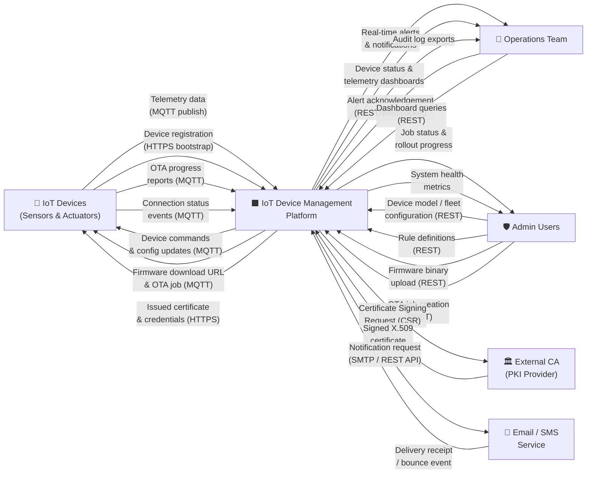
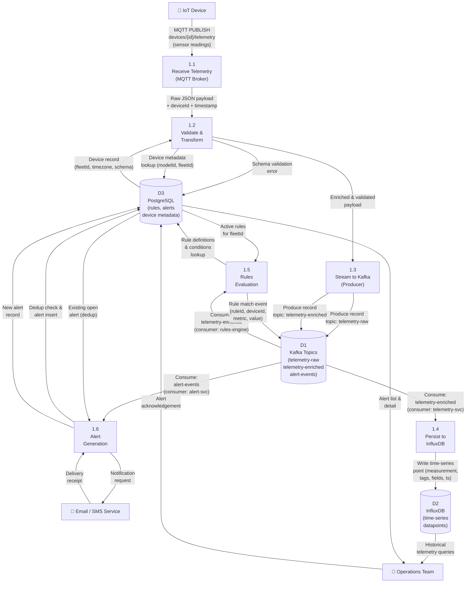

# Data Flow Diagrams

This document presents a structured view of how data moves through the IoT Device Management
Platform using Gane-Sarson Data Flow Diagram notation adapted for Mermaid flowcharts. Two levels
of decomposition are provided:

- **Level 0 (Context DFD)** — the system as a black box, showing all external entities and the
  data flows that cross the system boundary.
- **Level 1 (Telemetry Ingestion Pipeline)** — an expansion of the telemetry processing path,
  the platform's highest-throughput data flow, showing internal processes and data stores.

---

## Level 0 — System Context DFD

The Level 0 diagram treats the entire IoT Device Management Platform as a single process and
focuses exclusively on what data enters and leaves the system boundary. This is the correct
starting point for understanding the platform's external obligations: who the platform must talk
to, what it receives from them, and what it sends back.

### External Entities

| Entity | Role | Data Exchanged |
|---|---|---|
| **IoT Devices** | Physical sensors and actuators deployed in the field | Sends telemetry, status, OTA progress; receives commands, configuration, firmware notifications |
| **Operations Team** | Human operators monitoring device health and alerts | Reads alerts, dashboards, audit trails; acknowledges and resolves alerts |
| **Admin Users** | Platform administrators managing device models, fleets, rules, and firmware | Creates/updates all platform resources; triggers OTA jobs |
| **External CA** | External Certificate Authority for enterprise customers who bring their own PKI | Sends signed device certificates in response to CSRs |
| **Email / SMS Service** | Third-party messaging provider (SMTP relay or Twilio) | Receives notification requests; delivers messages to human recipients |

---

## Level 1 — Telemetry Ingestion Pipeline DFD

The telemetry ingestion pipeline is the most data-intensive path in the platform, processing
potentially millions of MQTT messages per hour from thousands of devices. This Level 1 diagram
decomposes the single "IoT Platform" process into the six discrete processing steps that make up
the telemetry pipeline, along with the three primary data stores they interact with.

### Processes

| Process | Name | Responsibility |
|---|---|---|
| **1.1** | Receive Telemetry (MQTT Broker) | Accept MQTT PUBLISH packets from authenticated devices; enforce ACL; forward raw payloads |
| **1.2** | Validate & Transform | Parse JSON, validate against device stream schema, normalise units, enrich with device metadata |
| **1.3** | Stream to Kafka | Produce validated, enriched records to the appropriate Kafka partition for fan-out consumption |
| **1.4** | Persist to InfluxDB | Consume from Kafka and write time-series data points to InfluxDB with device and fleet tags |
| **1.5** | Rules Evaluation | Consume enriched telemetry from Kafka; apply fleet-level rule predicates; forward matched events |
| **1.6** | Alert Generation | Receive rule match events; deduplicate; persist alerts; invoke notification dispatch |

### Data Stores

| Store | Technology | Data Held |
|---|---|---|
| **D1 — Kafka Topics** | Apache Kafka | `telemetry-raw`, `telemetry-enriched`, `alert-events` topics; acts as durable buffer and fan-out bus |
| **D2 — InfluxDB** | InfluxDB / TimescaleDB | Time-series measurements keyed by (deviceId, streamName, timestamp) |
| **D3 — PostgreSQL (Rules)** | PostgreSQL | Rule definitions, rule conditions, rule actions, alert records, device metadata |

---

## Data Flow Characteristics

### Throughput Targets

| Flow | Expected Volume | Max Acceptable Latency |
|---|---|---|
| MQTT Telemetry Ingestion | 100,000 msg/s (peak) | 50 ms broker → Kafka |
| Kafka → InfluxDB Write | 100,000 points/s | 200 ms |
| Rules Evaluation | 100,000 evaluations/s | 300 ms end-to-end |
| Alert Generation | 500 alerts/s (burst) | 1 s create + notify |

### Data Retention Policy

| Store | Hot Retention | Cold Retention / Archive |
|---|---|---|
| Kafka Topics | 7 days | Not applicable (source-of-truth is InfluxDB) |
| InfluxDB | 90 days (full resolution) | 1 year (downsampled 1-min averages) |
| PostgreSQL (Alerts) | Indefinite | Archived to S3 after 1 year |
| PostgreSQL (Audit Logs) | 1 year online | 7 years in cold storage (compliance) |

### Data Quality Gates

1. **Process 1.2 (Validate & Transform)** rejects payloads that fail JSON Schema validation and
   writes a `SCHEMA_VIOLATION` event to PostgreSQL, decrementing the device's data quality score.
2. Out-of-order timestamps (device clock drift > 5 minutes) are flagged but still ingested;
   InfluxDB handles late writes by timestamp.
3. Duplicate messages (same deviceId + timestamp within a 60-second dedup window) are detected
   by the Kafka consumer using Redis and dropped before InfluxDB write.
