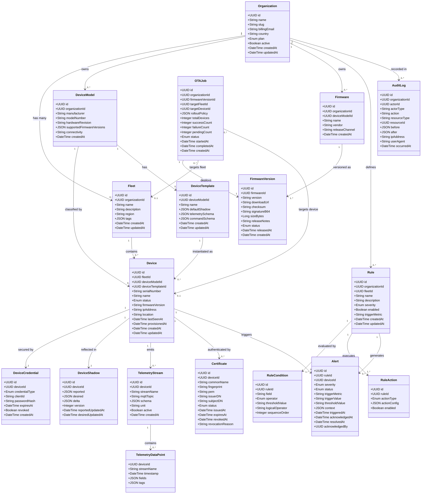

# Domain Model

This document describes the core domain entities of the IoT Device Management Platform, their
attributes, and the relationships between them. The model is intentionally technology-neutral—it
represents the business domain, not any particular database schema or ORM mapping—and serves as
the authoritative reference for all service-layer contracts and API payloads.

The model is partitioned into four bounded contexts:

| Bounded Context | Entities |
|---|---|
| **Identity & Organisation** | Organization, Fleet, DeviceModel, DeviceTemplate |
| **Device Lifecycle** | Device, DeviceCredential, DeviceShadow, Certificate |
| **Firmware & OTA** | Firmware, FirmwareVersion, OTAJob |
| **Telemetry & Alerting** | TelemetryStream, TelemetryDataPoint, Rule, RuleCondition, RuleAction, Alert |
| **Observability** | AuditLog |

---

## Class Diagram

---

## Entity Descriptions

### Organization
The top-level tenant in the multi-tenant hierarchy. Every resource belongs to exactly one
organization. The `plan` field controls feature access (FREE, STARTER, PROFESSIONAL, ENTERPRISE).

### Fleet
A logical grouping of devices within an organization, typically representing a physical site,
product line, or customer deployment. Fleets are the primary scope for rules, OTA jobs, and
dashboards.

### DeviceModel
Describes a class of hardware (manufacturer, model number, hardware revision). Models define
which firmware families are compatible and what telemetry schema devices of that model expose.

### DeviceTemplate
A reusable configuration blueprint derived from a DeviceModel. It specifies default shadow state,
expected telemetry schema, and available command schema, allowing new devices to be pre-configured
consistently at provisioning time.

### Device
The central entity—represents a single physical IoT device. Status values: `PENDING`,
`ACTIVE`, `INACTIVE`, `QUARANTINED`, `DECOMMISSIONED`.

### DeviceCredential
Stores the MQTT password hash (for username/password auth) or references the client certificate
(for mTLS auth). Credential type: `CERTIFICATE` or `PASSWORD`.

### DeviceShadow
A JSON document that holds the device's last-reported state (`reported`), the platform's desired
state (`desired`), and the computed `delta` (desired minus reported). Version is incremented on
every write and used for optimistic concurrency.

### Firmware
Represents a firmware product family for a specific DeviceModel (e.g., "Sensor Edge Firmware for
ModelX"). Acts as a container for multiple versioned releases.

### FirmwareVersion
A specific, immutable release of a Firmware. Once `status` is `RELEASED` the binary and checksum
are frozen. Status values: `DRAFT`, `RELEASED`, `DEPRECATED`.

### OTAJob
An ordered deployment of a FirmwareVersion to a Fleet or individual Device. The `rolloutPolicy`
JSON captures wave percentages, bake periods, and success thresholds. Status values: `PENDING`,
`IN_PROGRESS`, `PAUSED`, `COMPLETED`, `FAILED`.

### TelemetryStream
Defines a logical data channel from a device (e.g., "temperature", "GPS", "motor-current"). Each
stream maps to a dedicated MQTT sub-topic and has its own JSON schema for payload validation.

### TelemetryDataPoint
An individual time-series measurement. This entity is stored in InfluxDB (or TimescaleDB) rather
than PostgreSQL—it is shown here to make the logical model complete.

### Rule
A user-configured monitoring rule scoped to a Fleet. A rule has one or more conditions (forming a
logical AND/OR tree) and one or more actions to execute when the conditions are met.

### RuleCondition
A single predicate on a telemetry field. Operators: `GT`, `GTE`, `LT`, `LTE`, `EQ`, `NEQ`,
`CONTAINS`. Multiple conditions within a rule are combined using `logicalOperator` (AND or OR).

### RuleAction
The action performed when a rule fires. Types: `CREATE_ALERT`, `SEND_NOTIFICATION`,
`EXECUTE_COMMAND`, `CALL_WEBHOOK`.

### Alert
An event record created when a Rule's conditions are satisfied. Status values: `OPEN`,
`ACKNOWLEDGED`, `RESOLVED`. Alerts are deduplicated by (ruleId, deviceId) within a configurable
suppression window.

### Certificate
An X.509 certificate issued to a Device by the platform's internal CA or an external CA. Status
values: `ACTIVE`, `EXPIRED`, `REVOKED`.

### AuditLog
An immutable record of every state-changing operation performed by a human or service actor.
Captures before/after JSON diffs for compliance and forensic purposes.
