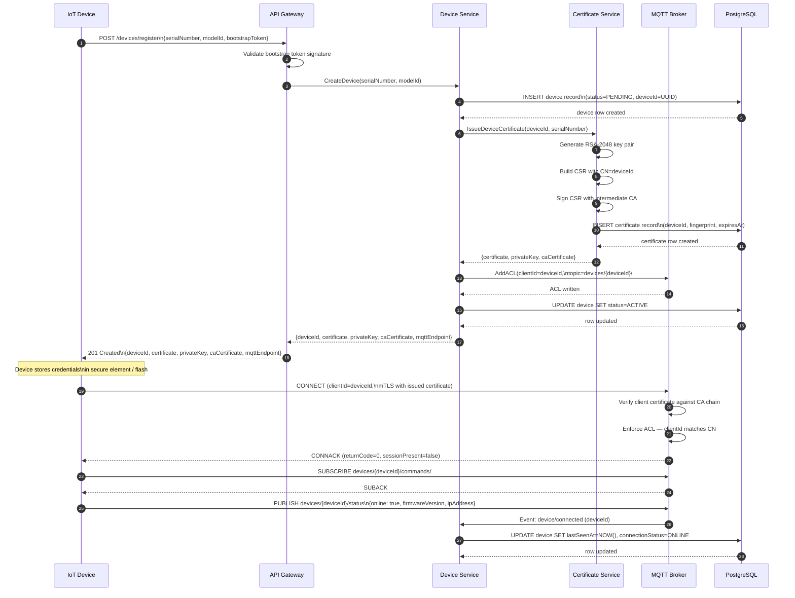
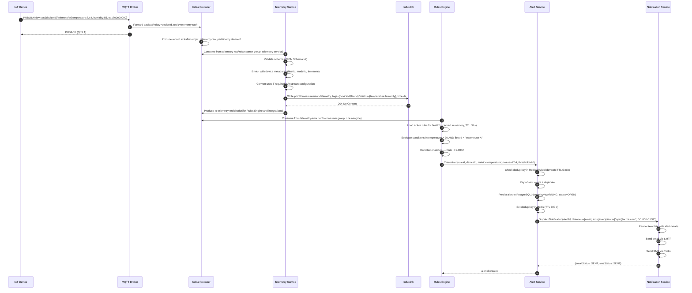
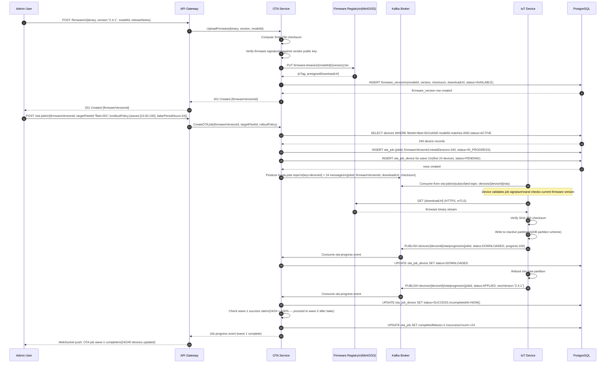

# System Sequence Diagrams

This document captures the key interaction sequences in the IoT Device Management Platform. Each
diagram traces the message flow between system participants for a critical use case, making the
runtime behaviour explicit for developers, architects, and security reviewers.

---

## 1. Device Registration and First Connection

Before an IoT device can publish telemetry or receive commands it must be registered with the
platform and provisioned with a unique X.509 certificate. This sequence covers the full lifecycle
from the initial HTTP registration request through mutual-TLS MQTT connection establishment.

The device presents its factory-burned serial number and model identifier. The API Gateway
validates the bootstrap token that ships with every device. The Device Service creates a persistent
record, then delegates certificate issuance to the Certificate Service which interfaces with the
internal CA. Once the MQTT broker ACL entry is written the device may open a persistent MQTT
session authenticated by the issued certificate. All steps are transactional: a failure at any
point rolls back already-completed sub-steps and returns an error to the device.

---

## 2. Telemetry Ingestion to Alert

This sequence covers the hot path: a device publishes a sensor reading, the platform ingests it
into the time-series store, the rules engine evaluates configured thresholds, and—if a rule fires—
an alert is created and a notification is dispatched to the on-call team.

The MQTT Broker acts as the entry point and fans the raw payload into Kafka so that multiple
downstream consumers (the Telemetry Service, the Rules Engine, and any third-party integrations)
can process the same message independently and at their own pace. The Telemetry Service normalises
the JSON payload, tags it with device metadata, and writes it to InfluxDB. The Rules Engine reads
from the same Kafka topic, applies the pre-compiled rule predicates for the device's fleet, and
calls the Alert Service if any threshold is breached. The Alert Service deduplicates in Redis
(preventing alert storms) before persisting the alert and asking the Notification Service to
dispatch an email or SMS.

---

## 3. OTA Firmware Deployment

Over-the-Air (OTA) firmware updates are the mechanism by which the platform pushes new firmware
versions to one or many devices without physical access. This sequence begins when an admin uploads
a signed firmware binary and creates an OTA Job targeting a fleet (or a specific device). The OTA
Service orchestrates a controlled rollout: it publishes a notification to affected devices via
Kafka, each device acknowledges the notification, downloads the binary from the Firmware Registry
over HTTPS, applies the update, and reports success or failure. The OTA Service tracks aggregate
progress and marks the job complete only when all targeted devices have responded.

A rollout policy (e.g., canary 10% → 50% → 100% with a 24-hour bake time between waves) is
evaluated by the OTA Service before each wave is released, guarding against fleet-wide outages
caused by a defective firmware build.

---

## Summary

| Sequence | Primary Trigger | Key Data Stores | Avg Latency Target |
|---|---|---|---|
| Device Registration & First Connection | New device boot | PostgreSQL, CA store | < 3 s end-to-end |
| Telemetry Ingestion to Alert | Sensor publish (MQTT) | Kafka, InfluxDB, PostgreSQL | < 500 ms ingest; < 2 s alert |
| OTA Firmware Deployment | Admin job creation | PostgreSQL, MinIO/S3, Kafka | Asynchronous; wave-scoped |

These three sequences collectively cover the three highest-traffic and highest-risk paths in the
platform. All other interactions (shadow reads/writes, command dispatch, audit log queries) follow
the same layered pattern of API Gateway → microservice → data store, and can be derived from the
principles illustrated here.
