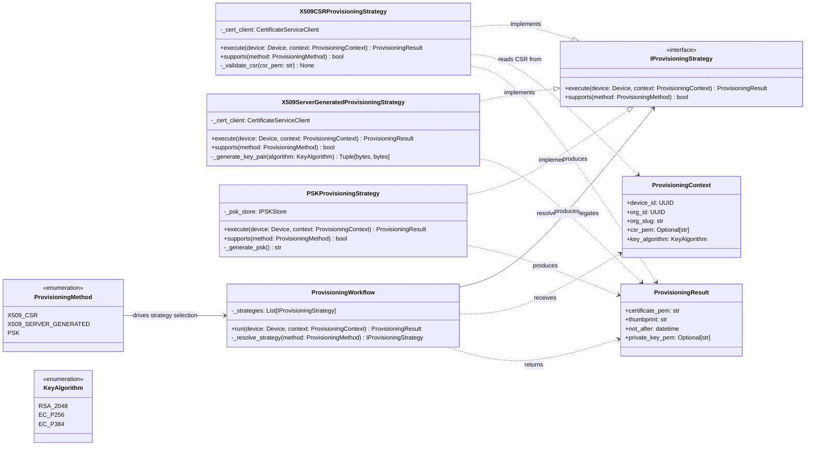
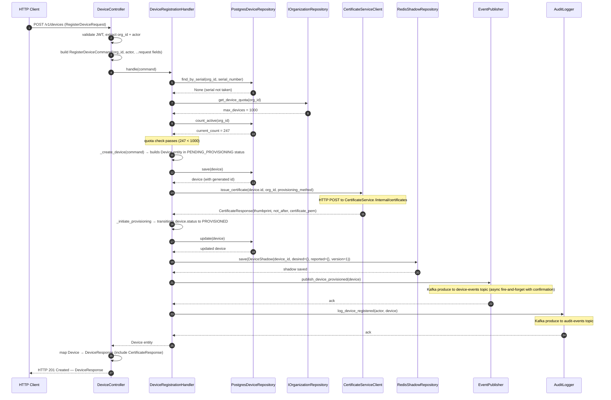

# C4 Code Diagram — IoT Device Management Platform

## About C4 Level 4 (Code) Diagrams

C4 Level 4 diagrams zoom into a single component identified at Level 3 (Component diagram) and show the internal structure of that component in terms of classes, interfaces, and their relationships. They answer the question: *"How is this component implemented?"* — mapping the code artefacts a developer will read, write, and test.

Level 4 diagrams are most valuable when:
- Onboarding engineers to a non-trivial domain component where the relationship between entities, services, and repositories is not obvious
- Performing design reviews before implementation begins, so structural issues are caught at the model level
- Documenting a component whose internal complexity warrants explicit guidance (e.g., state machines, strategy dispatch, event publishing chains)
- Generating architecture decision records (ADRs) that reference the exact class boundaries

They are intentionally **not** maintained in sync with every code change — they represent the intended design. Significant divergence between the diagram and code should trigger an ADR update.

**Scope of this document:** The `DeviceRegistryService` microservice, specifically the `DeviceRegistrationHandler` component and all classes it directly orchestrates or depends upon.

---

## Class Diagram — DeviceRegistrationHandler and Collaborators

The following diagram represents all classes involved in the device registration flow, including controllers, application services, domain entities, repositories, and external service clients.

```mermaid
classDiagram
    direction TB

    class DeviceController {
        +register_device(request: RegisterDeviceRequest) DeviceResponse
        +update_device(device_id: UUID, request: UpdateDeviceRequest) DeviceResponse
        +decommission_device(device_id: UUID) None
        -_registration_handler: DeviceRegistrationHandler
        -_lifecycle_manager: DeviceLifecycleManager
    }

    class RegisterDeviceRequest {
        +serial_number: str
        +device_model_id: UUID
        +name: str
        +group_id: Optional[UUID]
        +provisioning_method: ProvisioningMethod
        +metadata: Optional[Dict[str, Any]]
        +validate_serial_number() str
        +validate_metadata_size() Dict
    }

    class UpdateDeviceRequest {
        +name: Optional[str]
        +group_id: Optional[UUID]
        +metadata: Optional[Dict[str, Any]]
    }

    class DeviceResponse {
        +id: UUID
        +serial_number: str
        +name: str
        +status: DeviceStatus
        +provisioning_method: ProvisioningMethod
        +certificate: Optional[CertificateResponse]
        +created_at: datetime
        +model_config: ConfigDict
    }

    class CertificateResponse {
        +thumbprint: str
        +not_after: datetime
        +certificate_pem: str
    }

    class RegisterDeviceCommand {
        +org_id: UUID
        +serial_number: str
        +device_model_id: UUID
        +name: str
        +group_id: Optional[UUID]
        +provisioning_method: ProvisioningMethod
        +metadata: Dict[str, Any]
        +actor: Actor
    }

    class DeviceRegistrationHandler {
        +handle(command: RegisterDeviceCommand) Device
        -_validate_serial_uniqueness(org_id: UUID, serial: str) None
        -_check_device_quota(org_id: UUID) None
        -_create_device(command: RegisterDeviceCommand) Device
        -_initiate_provisioning(device: Device, method: ProvisioningMethod) DeviceCertificate
        -_device_repo: IDeviceRepository
        -_shadow_repo: IShadowRepository
        -_cert_client: CertificateServiceClient
        -_event_publisher: EventPublisher
        -_audit_logger: AuditLogger
        -_org_repo: IOrganizationRepository
    }

    class DeviceLifecycleManager {
        +transition_status(device: Device, target: DeviceStatus) Device
        +decommission(device: Device) None
        -_validate_transition(current: DeviceStatus, target: DeviceStatus) None
        -_device_repo: IDeviceRepository
        -_event_publisher: EventPublisher
        -_audit_logger: AuditLogger
    }

    class ShadowSyncService {
        +initialize_shadow(device_id: UUID) DeviceShadow
        +update_desired(device_id: UUID, desired: Dict) DeviceShadow
        +apply_reported(device_id: UUID, reported: Dict) DeviceShadow
        -_shadow_repo: IShadowRepository
        -_device_repo: IDeviceRepository
    }

    class Device {
        +id: UUID
        +org_id: UUID
        +serial_number: str
        +name: str
        +device_model_id: UUID
        +group_id: Optional[UUID]
        +status: DeviceStatus
        +provisioning_method: ProvisioningMethod
        +last_seen_at: Optional[datetime]
        +metadata: Dict[str, Any]
        +created_at: datetime
        +updated_at: datetime
        +transition_to(status: DeviceStatus) None
        +is_connectable() bool
        +is_decommissionable() bool
    }

    class DeviceShadow {
        +device_id: UUID
        +desired: Dict[str, Any]
        +reported: Dict[str, Any]
        +delta: Dict[str, Any]
        +version: int
        +desired_version: int
        +reported_version: int
        +last_updated_at: datetime
        +compute_delta() Dict[str, Any]
        +merge_desired(patch: Dict[str, Any]) None
        +merge_reported(patch: Dict[str, Any]) None
    }

    class DeviceCertificate {
        +id: UUID
        +device_id: UUID
        +org_id: UUID
        +thumbprint: str
        +subject_cn: str
        +not_before: datetime
        +not_after: datetime
        +status: CertificateStatus
        +is_expired() bool
        +is_revoked() bool
    }

    class IDeviceRepository {
        <<interface>>
        +save(device: Device) Device
        +find_by_id(id: UUID) Optional[Device]
        +find_by_serial(org_id: UUID, serial: str) Optional[Device]
        +count_active(org_id: UUID) int
        +update(device: Device) Device
    }

    class PostgresDeviceRepository {
        +save(device: Device) Device
        +find_by_id(id: UUID) Optional[Device]
        +find_by_serial(org_id: UUID, serial: str) Optional[Device]
        +count_active(org_id: UUID) int
        +update(device: Device) Device
        -_conn: AsyncConnection
        -_map_row_to_device(row: Record) Device
    }

    class IShadowRepository {
        <<interface>>
        +save(shadow: DeviceShadow) DeviceShadow
        +find_by_device(device_id: UUID) Optional[DeviceShadow]
        +delete(device_id: UUID) None
    }

    class RedisShadowRepository {
        +save(shadow: DeviceShadow) DeviceShadow
        +find_by_device(device_id: UUID) Optional[DeviceShadow]
        +delete(device_id: UUID) None
        -_redis: Redis
        -_cache_key(device_id: UUID) str
        -_serialize(shadow: DeviceShadow) str
        -_deserialize(raw: str) DeviceShadow
    }

    class IOrganizationRepository {
        <<interface>>
        +find_by_id(id: UUID) Optional[Organization]
        +get_device_quota(org_id: UUID) int
    }

    class CertificateServiceClient {
        +issue_certificate(device_id: UUID, org_id: UUID, provisioning_method: str) CertificateResponse
        +revoke_certificate(thumbprint: str, org_id: UUID) None
        -_base_url: str
        -_http_client: AsyncClient
        -_service_token: str
    }

    class EventPublisher {
        +publish_device_provisioned(device: Device) None
        +publish_device_status_changed(device: Device, prev_status: DeviceStatus) None
        +publish_device_decommissioned(device: Device) None
        -_producer: AIOKafkaProducer
        -_topic: str
        -_serialize_device_event(event_type: str, device: Device) bytes
    }

    class AuditLogger {
        +log_device_registered(actor: Actor, device: Device) None
        +log_status_transition(actor: Actor, device: Device, from_status: DeviceStatus, to_status: DeviceStatus) None
        +log_device_decommissioned(actor: Actor, device: Device) None
        -_producer: AIOKafkaProducer
        -_audit_topic: str
    }

    class Actor {
        +user_id: UUID
        +org_id: UUID
        +roles: List[str]
        +ip_address: str
    }

    DeviceController --> DeviceRegistrationHandler : delegates registration
    DeviceController --> DeviceLifecycleManager : delegates lifecycle transitions
    DeviceController ..> RegisterDeviceRequest : receives
    DeviceController ..> DeviceResponse : returns

    DeviceRegistrationHandler --> IDeviceRepository : persists device
    DeviceRegistrationHandler --> IShadowRepository : initializes shadow
    DeviceRegistrationHandler --> CertificateServiceClient : issues certificate
    DeviceRegistrationHandler --> EventPublisher : publishes domain events
    DeviceRegistrationHandler --> AuditLogger : records audit trail
    DeviceRegistrationHandler --> IOrganizationRepository : checks quota

    DeviceLifecycleManager --> IDeviceRepository : persists state transitions
    DeviceLifecycleManager --> EventPublisher : publishes status change events
    DeviceLifecycleManager --> AuditLogger : records audit trail

    ShadowSyncService --> IShadowRepository : reads and writes shadow
    ShadowSyncService --> IDeviceRepository : validates device exists

    PostgresDeviceRepository ..|> IDeviceRepository : implements
    RedisShadowRepository ..|> IShadowRepository : implements

    DeviceRegistrationHandler ..> RegisterDeviceCommand : receives
    DeviceRegistrationHandler ..> Device : creates and returns
    DeviceRegistrationHandler ..> DeviceCertificate : initiates provisioning

    Device "1" --> "1" DeviceShadow : has shadow
    Device "1" --> "*" DeviceCertificate : has certificates
```



---

## Class Diagram — Provisioning Workflow Module

The provisioning subsystem uses the Strategy pattern to support multiple provisioning methods (`X509_CSR`, `X509_SERVER_GENERATED`, `PSK`) without conditional branching in the handler.



---

## Sequence Diagram — Device Registration Flow

The following diagram traces the exact method call chain from the HTTP request entering the controller to the final audit log entry being written.



---

## Python Implementation

### `DeviceRegistrationHandler.handle()`

```python
from __future__ import annotations

import uuid
from dataclasses import dataclass
from typing import Optional

from app.domain.device import Device, DeviceStatus
from app.domain.exceptions import (
    DeviceAlreadyExistsError,
    DeviceQuotaExceededError,
    ProvisioningError,
)
from app.domain.shadow import DeviceShadow
from app.infrastructure.cert_client import CertificateServiceClient
from app.infrastructure.event_publisher import EventPublisher
from app.infrastructure.audit_logger import AuditLogger
from app.repositories.device import IDeviceRepository
from app.repositories.org import IOrganizationRepository
from app.repositories.shadow import IShadowRepository


@dataclass
class RegisterDeviceCommand:
    org_id: uuid.UUID
    serial_number: str
    device_model_id: uuid.UUID
    name: str
    group_id: Optional[uuid.UUID]
    provisioning_method: str
    metadata: dict
    actor: Actor


class DeviceRegistrationHandler:
    def __init__(
        self,
        device_repo: IDeviceRepository,
        org_repo: IOrganizationRepository,
        shadow_repo: IShadowRepository,
        cert_client: CertificateServiceClient,
        event_publisher: EventPublisher,
        audit_logger: AuditLogger,
    ) -> None:
        self._device_repo = device_repo
        self._org_repo = org_repo
        self._shadow_repo = shadow_repo
        self._cert_client = cert_client
        self._event_publisher = event_publisher
        self._audit_logger = audit_logger

    async def handle(self, command: RegisterDeviceCommand) -> Device:
        await self._validate_serial_uniqueness(command.org_id, command.serial_number)
        await self._check_device_quota(command.org_id)

        device = await self._create_device(command)
        device = await self._device_repo.save(device)

        try:
            cert_response = await self._cert_client.issue_certificate(
                device_id=device.id,
                org_id=command.org_id,
                provisioning_method=command.provisioning_method,
            )
        except Exception as exc:
            raise ProvisioningError(
                f"Certificate issuance failed for device {device.id}"
            ) from exc

        device.transition_to(DeviceStatus.PROVISIONED)
        device = await self._device_repo.update(device)

        shadow = DeviceShadow.initialize(device_id=device.id)
        await self._shadow_repo.save(shadow)

        await self._event_publisher.publish_device_provisioned(device)
        await self._audit_logger.log_device_registered(command.actor, device)

        device._certificate_response = cert_response
        return device

    async def _validate_serial_uniqueness(
        self, org_id: uuid.UUID, serial: str
    ) -> None:
        existing = await self._device_repo.find_by_serial(org_id, serial)
        if existing is not None:
            raise DeviceAlreadyExistsError(
                f"Device with serial '{serial}' already exists in organization {org_id}"
            )

    async def _check_device_quota(self, org_id: uuid.UUID) -> None:
        quota = await self._org_repo.get_device_quota(org_id)
        current = await self._device_repo.count_active(org_id)
        if current >= quota:
            raise DeviceQuotaExceededError(
                f"Organization {org_id} has reached its device quota of {quota}"
            )

    async def _create_device(self, command: RegisterDeviceCommand) -> Device:
        return Device(
            id=uuid.uuid4(),
            org_id=command.org_id,
            serial_number=command.serial_number,
            name=command.name,
            device_model_id=command.device_model_id,
            group_id=command.group_id,
            status=DeviceStatus.PENDING_PROVISIONING,
            provisioning_method=command.provisioning_method,
            metadata=command.metadata or {},
        )
```

---

### `Device.transition_to()` — State Machine

```python
from __future__ import annotations

from enum import Enum
from app.domain.exceptions import InvalidStatusTransitionError


class DeviceStatus(str, Enum):
    PENDING_PROVISIONING = "PENDING_PROVISIONING"
    PROVISIONED = "PROVISIONED"
    ACTIVE = "ACTIVE"
    INACTIVE = "INACTIVE"
    DECOMMISSIONED = "DECOMMISSIONED"
    SUSPENDED = "SUSPENDED"


_ALLOWED_TRANSITIONS: dict[DeviceStatus, set[DeviceStatus]] = {
    DeviceStatus.PENDING_PROVISIONING: {DeviceStatus.PROVISIONED},
    DeviceStatus.PROVISIONED: {DeviceStatus.ACTIVE, DeviceStatus.SUSPENDED},
    DeviceStatus.ACTIVE: {
        DeviceStatus.INACTIVE,
        DeviceStatus.SUSPENDED,
        DeviceStatus.DECOMMISSIONED,
    },
    DeviceStatus.INACTIVE: {
        DeviceStatus.ACTIVE,
        DeviceStatus.SUSPENDED,
        DeviceStatus.DECOMMISSIONED,
    },
    DeviceStatus.SUSPENDED: {
        DeviceStatus.ACTIVE,
        DeviceStatus.DECOMMISSIONED,
    },
    DeviceStatus.DECOMMISSIONED: set(),
}


class Device:
    # ... other fields and __init__ omitted for brevity

    def transition_to(self, target: DeviceStatus) -> None:
        allowed = _ALLOWED_TRANSITIONS.get(self.status, set())
        if target not in allowed:
            raise InvalidStatusTransitionError(
                f"Cannot transition device {self.id} from "
                f"{self.status.value} to {target.value}. "
                f"Allowed targets: {[s.value for s in allowed]}"
            )
        self.status = target

    def is_connectable(self) -> bool:
        return self.status in {DeviceStatus.ACTIVE, DeviceStatus.PROVISIONED}

    def is_decommissionable(self) -> bool:
        return self.status != DeviceStatus.DECOMMISSIONED
```

---

### `RegisterDeviceRequest` — Pydantic Model

```python
from __future__ import annotations

import re
import uuid
from typing import Any, Optional

from pydantic import BaseModel, ConfigDict, Field, field_validator, model_validator

from app.domain.device import ProvisioningMethod

_SERIAL_RE = re.compile(r"^[A-Za-z0-9\-_:]{4,64}$")
_METADATA_MAX_BYTES = 8192


class RegisterDeviceRequest(BaseModel):
    model_config = ConfigDict(strict=True, extra="forbid")

    serial_number: str = Field(..., min_length=4, max_length=64)
    device_model_id: uuid.UUID
    name: str = Field(..., min_length=1, max_length=128)
    group_id: Optional[uuid.UUID] = None
    provisioning_method: ProvisioningMethod
    csr_pem: Optional[str] = Field(
        default=None,
        description="PEM-encoded CSR required when provisioning_method=X509_CSR",
    )
    metadata: Optional[dict[str, Any]] = Field(default_factory=dict)

    @field_validator("serial_number")
    @classmethod
    def validate_serial_number(cls, v: str) -> str:
        if not _SERIAL_RE.match(v):
            raise ValueError(
                "serial_number must be 4–64 characters, alphanumeric with - _ : only"
            )
        return v.upper()

    @field_validator("metadata")
    @classmethod
    def validate_metadata_size(cls, v: dict[str, Any] | None) -> dict[str, Any]:
        if v is None:
            return {}
        import json
        size = len(json.dumps(v).encode("utf-8"))
        if size > _METADATA_MAX_BYTES:
            raise ValueError(f"metadata must not exceed {_METADATA_MAX_BYTES} bytes")
        return v

    @model_validator(mode="after")
    def validate_csr_present_for_x509_csr(self) -> RegisterDeviceRequest:
        if (
            self.provisioning_method == ProvisioningMethod.X509_CSR
            and not self.csr_pem
        ):
            raise ValueError(
                "csr_pem is required when provisioning_method is X509_CSR"
            )
        return self
```

---

### `PostgresDeviceRepository.save()` — asyncpg Implementation

```python
from __future__ import annotations

import uuid
from typing import Optional

import asyncpg

from app.domain.device import Device, DeviceStatus, ProvisioningMethod


class PostgresDeviceRepository:
    def __init__(self, conn: asyncpg.Connection) -> None:
        self._conn = conn

    async def save(self, device: Device) -> Device:
        row = await self._conn.fetchrow(
            """
            INSERT INTO devices (
                id, org_id, serial_number, name, device_model_id,
                group_id, status, provisioning_method, metadata,
                created_at, updated_at
            ) VALUES (
                $1, $2, $3, $4, $5,
                $6, $7, $8, $9::jsonb,
                NOW(), NOW()
            )
            RETURNING *
            """,
            device.id,
            device.org_id,
            device.serial_number,
            device.name,
            device.device_model_id,
            device.group_id,
            device.status.value,
            device.provisioning_method.value,
            __import__("json").dumps(device.metadata),
        )
        return self._map_row_to_device(row)

    async def find_by_serial(
        self, org_id: uuid.UUID, serial: str
    ) -> Optional[Device]:
        row = await self._conn.fetchrow(
            "SELECT * FROM devices WHERE org_id = $1 AND serial_number = $2",
            org_id,
            serial,
        )
        return self._map_row_to_device(row) if row else None

    async def count_active(self, org_id: uuid.UUID) -> int:
        result = await self._conn.fetchval(
            """
            SELECT COUNT(*) FROM devices
            WHERE org_id = $1
              AND status NOT IN ('DECOMMISSIONED', 'PENDING_PROVISIONING')
            """,
            org_id,
        )
        return int(result)

    def _map_row_to_device(self, row: asyncpg.Record) -> Device:
        return Device(
            id=row["id"],
            org_id=row["org_id"],
            serial_number=row["serial_number"],
            name=row["name"],
            device_model_id=row["device_model_id"],
            group_id=row["group_id"],
            status=DeviceStatus(row["status"]),
            provisioning_method=ProvisioningMethod(row["provisioning_method"]),
            last_seen_at=row["last_seen_at"],
            metadata=row["metadata"] or {},
            created_at=row["created_at"],
            updated_at=row["updated_at"],
        )
```

---

## Design Patterns

| Pattern | Where Applied | Rationale |
|---|---|---|
| Command | `RegisterDeviceCommand` carries all intent data; decouples controller from handler | Enables command logging, replay, and async dispatch |
| Repository | `IDeviceRepository`, `IShadowRepository` with Postgres/Redis implementations | Decouples domain logic from persistence; enables in-memory test doubles |
| Strategy | `IProvisioningStrategy` with X.509 CSR, X.509 server-generated, PSK implementations | Adds new provisioning methods without modifying the handler |
| Domain Events | `EventPublisher.publish_device_provisioned()` after registration | Downstream services (TelemetryService, CommandService) react without coupling |
| Dependency Injection | FastAPI `Depends()` provides all collaborators to controllers | Enables per-request scope, test overrides, and lifecycle management |

---

## Dependency Injection Configuration

```python
from fastapi import Depends
from app.repositories.device import PostgresDeviceRepository, IDeviceRepository
from app.repositories.shadow import RedisShadowRepository, IShadowRepository
from app.infrastructure.db import get_db_connection
from app.infrastructure.redis_client import get_redis_client
from app.infrastructure.kafka_producer import get_kafka_producer
from app.services.registration_handler import DeviceRegistrationHandler


async def get_device_repo(
    conn=Depends(get_db_connection),
) -> IDeviceRepository:
    return PostgresDeviceRepository(conn)


async def get_shadow_repo(
    redis=Depends(get_redis_client),
) -> IShadowRepository:
    return RedisShadowRepository(redis)


async def get_registration_handler(
    device_repo: IDeviceRepository = Depends(get_device_repo),
    shadow_repo: IShadowRepository = Depends(get_shadow_repo),
    cert_client: CertificateServiceClient = Depends(get_cert_client),
    event_publisher: EventPublisher = Depends(get_event_publisher),
    audit_logger: AuditLogger = Depends(get_audit_logger),
    org_repo: IOrganizationRepository = Depends(get_org_repo),
) -> DeviceRegistrationHandler:
    return DeviceRegistrationHandler(
        device_repo=device_repo,
        org_repo=org_repo,
        shadow_repo=shadow_repo,
        cert_client=cert_client,
        event_publisher=event_publisher,
        audit_logger=audit_logger,
    )
```

---

## Error Handling and HTTP Mapping

Custom exceptions are defined in `app.domain.exceptions` and mapped to HTTP responses in a global exception handler registered on the FastAPI application.

| Exception Class | HTTP Status | Error Code |
|---|---|---|
| `DeviceAlreadyExistsError` | 409 Conflict | `DEVICE_ALREADY_EXISTS` |
| `DeviceQuotaExceededError` | 422 Unprocessable Entity | `DEVICE_QUOTA_EXCEEDED` |
| `ProvisioningError` | 502 Bad Gateway | `PROVISIONING_FAILED` |
| `InvalidStatusTransitionError` | 409 Conflict | `INVALID_STATUS_TRANSITION` |
| `ResourceNotFoundError` | 404 Not Found | `RESOURCE_NOT_FOUND` |
| `AuthorizationError` | 403 Forbidden | `ACCESS_DENIED` |

All error responses follow the structure:
```json
{
  "error": {
    "code": "DEVICE_QUOTA_EXCEEDED",
    "message": "Organization abc123 has reached its device quota of 1000",
    "request_id": "req_01HX...",
    "timestamp": "2024-06-15T10:22:31Z"
  }
}
```

The global exception handler logs each error at the appropriate level (4xx → WARNING, 5xx → ERROR) with `org_id`, `request_id`, and the full exception traceback.
