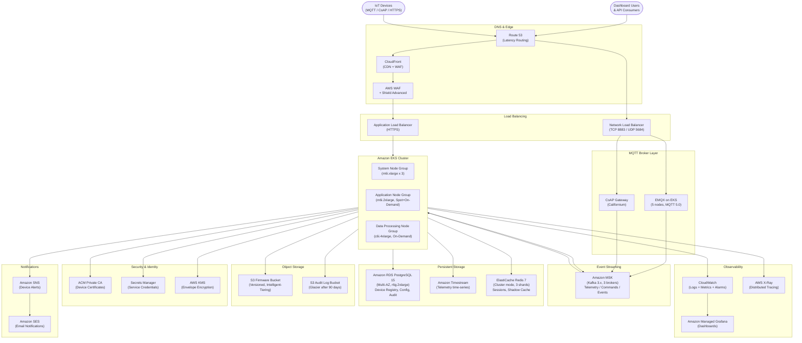

# Cloud Architecture

## Cloud Architecture Principles

The IoT Device Management Platform is built on AWS following five core architectural principles:

1. **Security First** — Every data path is encrypted in transit (TLS 1.2+) and at rest (AES-256).
   Device identity is rooted in hardware-backed certificates issued by ACM Private CA. No shared
   secrets are used across tenant boundaries.

2. **Horizontal Scalability** — All stateless components scale out rather than up. The platform
   is designed to support 10 million concurrently connected devices by adding pods and Kafka
   partitions without any architectural changes.

3. **Operational Transparency** — Every service emits structured logs, Prometheus metrics, and
   distributed traces. The CloudWatch + X-Ray combination provides a single pane of glass for
   operators without requiring a separate observability stack.

4. **Fault Isolation** — Services communicate asynchronously through Kafka wherever latency
   permits. Synchronous REST calls are wrapped with circuit breakers (Istio DestinationRule).
   A failure in the Rules Engine does not affect telemetry ingestion.

5. **Cost Proportionality** — Resources scale to zero when idle (Karpenter node provisioner).
   S3 Intelligent-Tiering manages firmware artifact storage costs automatically. Reserved
   instances cover the predictable baseline; Spot instances handle burst capacity.

---

## AWS Architecture Diagram

---

## Disaster Recovery Strategy

### RTO and RPO Targets

| Tier | RTO | RPO | Strategy |
|---|---|---|---|
| Device Connectivity (MQTT) | < 2 minutes | 0 (stateless) | Multi-AZ NLB, EMQX cluster failover |
| REST API | < 2 minutes | 0 (stateless) | Multi-AZ ALB + EKS |
| Telemetry Ingestion | < 5 minutes | < 30 seconds | Kafka replication factor 3, ACK=all |
| Device Registry (PostgreSQL) | < 4 hours (cross-region) | < 1 minute | RDS Multi-AZ + cross-region read replica |
| Time-Series Data (Timestream) | < 1 hour | < 5 minutes | Timestream replication + S3 export backup |
| OTA Firmware Artifacts | < 15 minutes | 0 | S3 cross-region replication |
| Certificate Authority | < 4 hours | 0 | ACM PCA is an AWS managed service |

### Backup Schedules

| Resource | Backup Method | Frequency | Retention |
|---|---|---|---|
| RDS PostgreSQL | Automated snapshots | Daily + continuous WAL | 35 days |
| RDS PostgreSQL | Cross-region snapshot copy | Daily | 7 days in DR region |
| Timestream | S3 export | Hourly | 90 days on S3 |
| Redis ElastiCache | AOF + RDB snapshots | Every 15 minutes | 7 days |
| Kafka MSK | MSK Replication (MirrorMaker 2) | Continuous to DR region | N/A |
| S3 Firmware Bucket | Cross-region replication | Continuous | Indefinite |
| S3 Audit Logs | Cross-region replication | Continuous | 7 years (compliance) |
| Secrets Manager | AWS-managed replication | Continuous | N/A |

### DR Activation Procedure

1. Route 53 health checks detect primary region endpoint failures and automatically shift DNS
   to the DR region (us-west-2) within 60 seconds.
2. The EKS cluster in the DR region runs in an active-standby mode with minimum replica counts
   (1 pod per deployment) to minimize cost while remaining ready.
3. Upon DR activation, a runbook script scales all deployments to production replica counts
   using `kubectl scale` and promotes the RDS cross-region read replica to primary.
4. MSK MirrorMaker 2 has already been replicating all Kafka topics to the DR MSK cluster.
   Consumers are reconfigured to point at the DR MSK endpoint via a ConfigMap update.
5. The entire activation procedure is automated via a Step Functions state machine triggered
   by a CloudWatch alarm or manual operator action.

---

## Cost Optimization Strategies

**Karpenter Node Provisioner** — Replaces the managed node group auto scaler. Karpenter
provisions exactly the right instance type (and size) for the pending pods, choosing Spot
instances whenever the workload is interruption-tolerant (Rules Engine, OTA batch workers).

**Reserved Instances** — The baseline database fleet (RDS, ElastiCache) and the system node
group run on 1-year Compute Savings Plans, saving approximately 30% over On-Demand pricing.

**S3 Intelligent-Tiering** — Firmware artifacts older than 30 days are automatically moved to
lower-cost access tiers. Cold artifacts (updated firmware versions for legacy devices) shift to
Glacier Instant Retrieval, reducing storage costs by up to 68%.

**Timestream Magnetic Store** — Telemetry data older than 7 days is automatically moved from
the memory store to the magnetic store, reducing cost per GB by roughly 90%.

**Right-Sizing** — Monthly AWS Compute Optimizer recommendations are reviewed and applied.
Over-provisioned instances are downsized; under-provisioned instances are upgraded before
they cause latency regressions.

**Data Transfer Optimization** — VPC endpoints for S3, ECR, and Secrets Manager eliminate
NAT Gateway data processing charges for these high-volume traffic patterns.

---

## Multi-Region Considerations

The platform supports an active-passive multi-region configuration (primary: us-east-1,
secondary: us-west-2) with plans for an active-active configuration in the future.

**Device Affinity** — Devices are bootstrapped with a region-specific endpoint. Route 53
latency routing directs new device registrations to the closest region. Once a device is
provisioned, it is pinned to a region to avoid split-brain shadow state scenarios.

**Global Tables (Future)** — The Device Registry PostgreSQL will migrate to Aurora Global
Database to enable active-active writes in two regions with sub-second replication lag.

**Certificate Authority** — Each region has its own ACM Private CA with certificates signed
by a common root CA. Cross-region certificate validation is supported by distributing the
root CA certificate to all EMQX clusters at startup.

**Tenant Data Residency** — Enterprise tenants with data residency requirements are assigned
to a specific region. The platform's tenant configuration schema includes a `home_region`
field that the API gateway uses to proxy requests to the correct regional endpoint.
