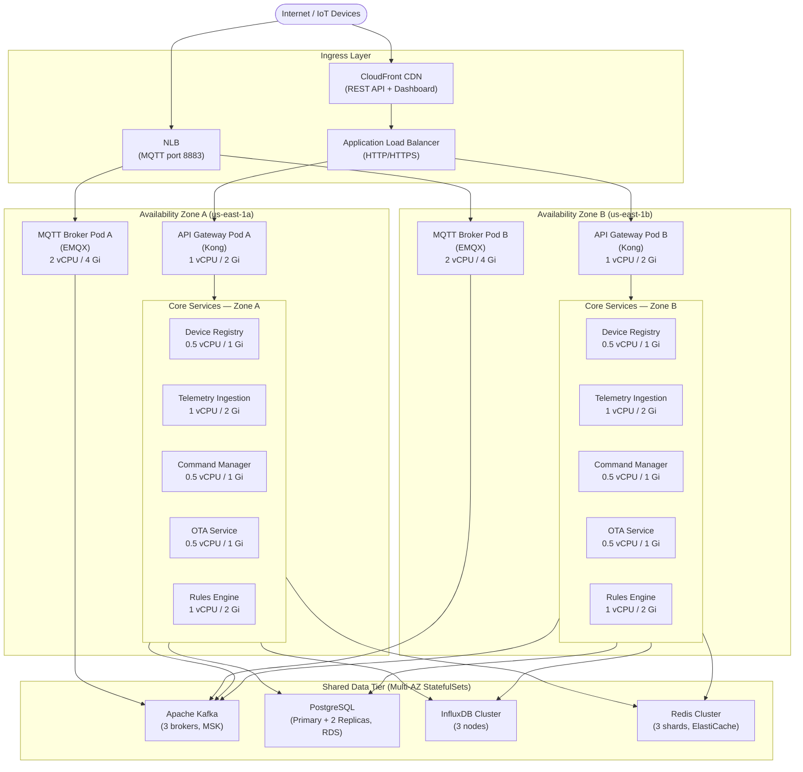

# Deployment Diagram

## Overview

The IoT Device Management Platform runs on Kubernetes (EKS) across two AWS Availability Zones
for high availability. Every stateless workload is deployed as a Kubernetes `Deployment` with
a minimum of two replicas spread across the zones using `topologySpreadConstraints`. Stateful
components — Kafka, PostgreSQL, InfluxDB, and Redis — are deployed as `StatefulSets` with
persistent volumes backed by AWS EBS `gp3` disks and cross-AZ replication enabled at the
application level.

Traffic enters the cluster via an AWS Application Load Balancer (ALB) managed by the
AWS Load Balancer Controller. A CloudFront distribution sits in front of the ALB for the
REST API and dashboard assets, providing edge caching and DDoS absorption. MQTT traffic
(port 8883 TLS) bypasses CloudFront and hits an NLB directly, since WebSocket/TCP
pass-through is required for persistent MQTT connections.

Istio service mesh handles east-west traffic encryption (mTLS), advanced traffic management
(weighted routing, circuit breakers), and distributed tracing (Zipkin-compatible spans
forwarded to AWS X-Ray).

---

## Deployment Architecture Diagram

---

## Kubernetes Resources

| Workload | Kind | Replicas (min/max) | CPU Request | CPU Limit | Memory Request | Memory Limit |
|---|---|---|---|---|---|---|
| EMQX MQTT Broker | Deployment | 2 / 6 | 2000m | 4000m | 4Gi | 8Gi |
| Kong API Gateway | Deployment | 2 / 8 | 500m | 2000m | 1Gi | 2Gi |
| Device Registry Service | Deployment | 2 / 10 | 250m | 1000m | 512Mi | 1Gi |
| Telemetry Ingestion Service | Deployment | 2 / 20 | 500m | 2000m | 1Gi | 2Gi |
| Command Manager Service | Deployment | 2 / 8 | 250m | 500m | 512Mi | 1Gi |
| OTA Update Service | Deployment | 2 / 6 | 250m | 500m | 512Mi | 1Gi |
| Rules Engine Service | Deployment | 2 / 12 | 500m | 2000m | 1Gi | 2Gi |
| Notification Service | Deployment | 2 / 6 | 250m | 500m | 256Mi | 512Mi |
| Shadow Service | Deployment | 2 / 8 | 250m | 1000m | 512Mi | 1Gi |
| Certificate Service | Deployment | 2 / 4 | 250m | 500m | 256Mi | 512Mi |
| Kafka (MSK) | StatefulSet | 3 (fixed) | 2000m | 4000m | 8Gi | 16Gi |
| PostgreSQL (RDS) | StatefulSet | 3 (fixed) | 4000m | 8000m | 16Gi | 32Gi |
| InfluxDB | StatefulSet | 3 (fixed) | 2000m | 4000m | 8Gi | 16Gi |
| Redis (ElastiCache) | StatefulSet | 3 (fixed) | 1000m | 2000m | 4Gi | 8Gi |

---

## Service Mesh Configuration — Istio

Istio 1.20 is installed in the cluster with the `IstioOperator` CRD. All application namespaces
carry the label `istio-injection: enabled`, which causes the Envoy sidecar to be injected into
every pod automatically.

**mTLS Policy** — `PeerAuthentication` is set to `STRICT` cluster-wide. Only pods with a valid
SPIFFE identity (issued by Istio's built-in CA backed by ACM PCA) are permitted to communicate.
This enforces mutual authentication between every microservice without any code changes.

**Traffic Management** — A `VirtualService` for each workload defines retry policies (3 retries
with a 500 ms base timeout) and circuit-breaker thresholds via `DestinationRule`. The MQTT broker
and API gateway have their own `Gateway` resources to accept external traffic.

**Observability** — Istio generates Prometheus metrics, Jaeger traces (sampled at 5%), and access
logs forwarded to CloudWatch Logs via the Fluent Bit DaemonSet.

**Egress Control** — A `ServiceEntry` allowlist restricts outbound traffic to known external
endpoints: Amazon S3 (firmware artifacts), ACM PCA (certificate operations), SNS/SES
(notifications), and CloudWatch APIs.

---

## Horizontal Pod Autoscaler Configuration

All Deployments are managed by HPA v2 with both CPU and custom metrics as scaling triggers.

| Workload | Scale Metric | Target | Min Pods | Max Pods | Scale-Up Stabilization | Scale-Down Stabilization |
|---|---|---|---|---|---|---|
| Telemetry Ingestion | Kafka consumer lag | < 5,000 msgs | 2 | 20 | 30 s | 300 s |
| EMQX MQTT Broker | Active MQTT connections | < 50,000 / pod | 2 | 6 | 60 s | 600 s |
| Rules Engine | CPU | < 70% | 2 | 12 | 30 s | 300 s |
| Device Registry | CPU | < 60% | 2 | 10 | 60 s | 300 s |
| API Gateway | RPS per pod | < 2,000 | 2 | 8 | 30 s | 120 s |
| OTA Update Service | Active transfers | < 500 / pod | 2 | 6 | 60 s | 600 s |
| Command Manager | Queue depth | < 1,000 msgs | 2 | 8 | 30 s | 300 s |
| Shadow Service | CPU | < 60% | 2 | 8 | 60 s | 300 s |

KEDA (Kubernetes Event-Driven Autoscaler) is used for Kafka-lag-driven scaling of the
Telemetry Ingestion and Rules Engine pods, since HPA v2 requires a custom metrics adapter
for external metrics and KEDA provides a cleaner abstraction.

All HPAs use the `behavior` block to separate scale-up and scale-down stabilization windows,
preventing thrashing during bursty IoT traffic patterns.
