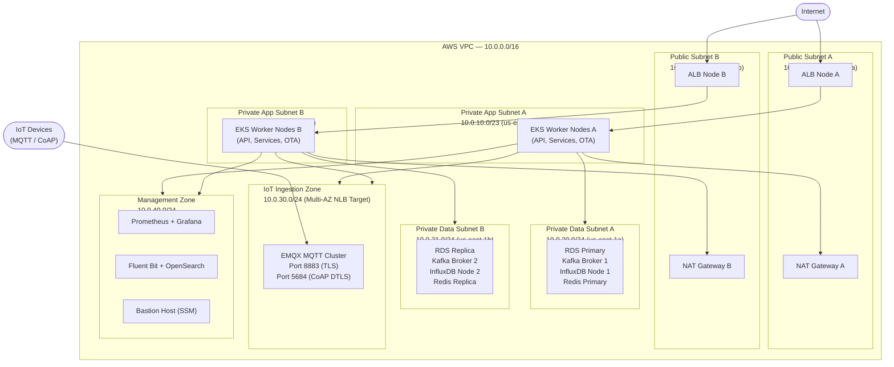

# Network Infrastructure

## Network Architecture Overview

The IoT Device Management Platform is deployed inside a dedicated AWS VPC with a CIDR block of
`10.0.0.0/16`. The VPC is divided into five network tiers that enforce the principle of least
privilege at the network layer. All inter-tier traffic is controlled by AWS Security Groups and
Kubernetes NetworkPolicy objects (enforced by the Cilium CNI plugin).

IoT devices connect exclusively through the **IoT Ingestion Zone**, which exposes only the MQTT
TLS port (8883) and the CoAP DTLS port (5684). No other inbound paths exist for device traffic.
Human operators and downstream API consumers reach the platform through the **Public Subnets**
via the ALB and NLB, both of which are protected by AWS WAF and AWS Shield Advanced.

Database traffic never leaves the **Private Data Subnets**. No direct path exists from the
Public Subnets to the Private Data Subnets without traversing the application tier.

---

## VPC Design



---

## Security Groups

### sg-alb-public — ALB (Public-Facing)

| Direction | Protocol | Port | Source / Destination | Purpose |
|---|---|---|---|---|
| Inbound | TCP | 443 | 0.0.0.0/0 | HTTPS from internet |
| Inbound | TCP | 80 | 0.0.0.0/0 | HTTP redirect to HTTPS |
| Outbound | TCP | 8080 | sg-app-nodes | Forward to Kong API Gateway |

### sg-nlb-mqtt — NLB (MQTT Ingress)

| Direction | Protocol | Port | Source / Destination | Purpose |
|---|---|---|---|---|
| Inbound | TCP | 8883 | 0.0.0.0/0 | MQTT over TLS from IoT devices |
| Inbound | UDP | 5684 | 0.0.0.0/0 | CoAP over DTLS from IoT devices |
| Outbound | TCP | 8883 | sg-mqtt-pods | Forward to EMQX pods |

### sg-app-nodes — EKS Application Worker Nodes

| Direction | Protocol | Port | Source / Destination | Purpose |
|---|---|---|---|---|
| Inbound | TCP | 8080 | sg-alb-public | API traffic from ALB |
| Inbound | TCP | 15017 | sg-app-nodes | Istio control plane (istiod) |
| Inbound | TCP | 15090 | sg-app-nodes | Envoy metrics scraping |
| Outbound | TCP | 5432 | sg-data-tier | PostgreSQL |
| Outbound | TCP | 9092 | sg-data-tier | Kafka brokers |
| Outbound | TCP | 8086 | sg-data-tier | InfluxDB |
| Outbound | TCP | 6379 | sg-data-tier | Redis |
| Outbound | TCP | 443 | 0.0.0.0/0 | AWS API calls (via NAT GW) |

### sg-data-tier — Databases & Kafka

| Direction | Protocol | Port | Source / Destination | Purpose |
|---|---|---|---|---|
| Inbound | TCP | 5432 | sg-app-nodes | PostgreSQL from services |
| Inbound | TCP | 9092 | sg-app-nodes, sg-mqtt-pods | Kafka from services & MQTT |
| Inbound | TCP | 8086 | sg-app-nodes | InfluxDB from services |
| Inbound | TCP | 6379 | sg-app-nodes | Redis from services |
| Inbound | TCP | 9092 | sg-data-tier | Kafka inter-broker replication |
| Outbound | All | All | sg-data-tier | Cluster-internal replication |

### sg-mqtt-pods — EMQX MQTT Broker Pods

| Direction | Protocol | Port | Source / Destination | Purpose |
|---|---|---|---|---|
| Inbound | TCP | 8883 | sg-nlb-mqtt | MQTT TLS from NLB |
| Inbound | UDP | 5684 | sg-nlb-mqtt | CoAP DTLS from NLB |
| Inbound | TCP | 4370 | sg-mqtt-pods | EMQX cluster Erlang distribution |
| Inbound | TCP | 5370 | sg-mqtt-pods | EMQX cluster RPC |
| Outbound | TCP | 9092 | sg-data-tier | Publish telemetry to Kafka |

### sg-management — Management Zone

| Direction | Protocol | Port | Source / Destination | Purpose |
|---|---|---|---|---|
| Inbound | TCP | 9090 | sg-app-nodes | Prometheus scrape |
| Inbound | TCP | 3000 | 10.0.40.0/24 | Grafana (internal only) |
| Inbound | TCP | 9200 | 10.0.40.0/24 | OpenSearch (internal only) |
| Outbound | TCP | 443 | 0.0.0.0/0 | Alert webhooks, PagerDuty |

---

## Network Policies (Kubernetes NetworkPolicy)

Cilium CNI enforces NetworkPolicy objects. The default posture is **deny all ingress and egress**
at the namespace level, with explicit allow rules for each service.

### Default Deny — All Namespaces

```yaml
apiVersion: networking.k8s.io/v1
kind: NetworkPolicy
metadata:
  name: default-deny-all
  namespace: iot-platform
spec:
  podSelector: {}
  policyTypes:
    - Ingress
    - Egress
```

### Telemetry Ingestion — Allow Kafka Egress

The Telemetry Ingestion pods need to write to Kafka brokers in the `kafka` namespace.

```yaml
apiVersion: networking.k8s.io/v1
kind: NetworkPolicy
metadata:
  name: allow-telemetry-to-kafka
  namespace: iot-platform
spec:
  podSelector:
    matchLabels:
      app: telemetry-ingestion
  policyTypes:
    - Egress
  egress:
    - to:
        - namespaceSelector:
            matchLabels:
              name: kafka
      ports:
        - protocol: TCP
          port: 9092
```

### MQTT Broker — Allow IoT Ingress and Kafka Egress

```yaml
apiVersion: networking.k8s.io/v1
kind: NetworkPolicy
metadata:
  name: allow-mqtt-ingress-and-kafka-egress
  namespace: iot-platform
spec:
  podSelector:
    matchLabels:
      app: emqx
  policyTypes:
    - Ingress
    - Egress
  ingress:
    - ports:
        - protocol: TCP
          port: 8883
        - protocol: UDP
          port: 5684
  egress:
    - to:
        - namespaceSelector:
            matchLabels:
              name: kafka
      ports:
        - protocol: TCP
          port: 9092
```

---

## IoT-Specific Network Considerations

### Device IP Allowlisting

For enterprise deployments where device subnets are known in advance, the NLB security group
can be restricted to specific IP CIDR ranges per customer. This is managed through a custom
operator that watches a `DeviceNetwork` CRD and updates the Security Group rules via the AWS
SDK. For consumer IoT deployments with dynamic IPs, allowlisting is impractical and mTLS
certificate-based authentication serves as the primary identity control.

### MQTT Port 8883 (TLS)

All MQTT traffic uses port 8883 with TLS 1.2 minimum (TLS 1.3 preferred). Plain-text MQTT on
port 1883 is disabled at the NLB listener level. Devices must present a valid client certificate
signed by the platform's ACM Private CA. The EMQX broker is configured with `verify = verify_peer`
and `fail_if_no_peer_cert = true`.

### CoAP Port 5684 (DTLS)

Constrained devices using the CoAP protocol connect on UDP port 5684 with DTLS 1.2. A CoAP-to-MQTT
gateway (Eclipse Californium) runs as a sidecar to the EMQX cluster, translating CoAP messages
into MQTT events. DTLS session resumption (via session tickets) reduces the handshake overhead for
devices with limited CPU.

### DNS Resolution for Devices

Devices use a hardcoded bootstrap endpoint (`iot.example.com`) that resolves to the NLB IP. A
secondary failover endpoint (`iot-backup.example.com`) is maintained in Route 53 with a failover
routing policy pointing to the secondary region NLB. Device firmware includes both endpoints and
automatically retries the backup endpoint after three consecutive connection failures.
