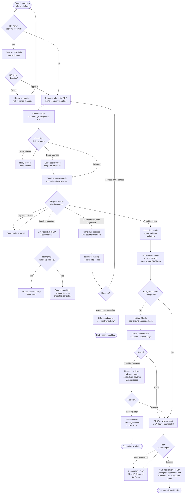

# Activity Diagrams — Job Board and Recruitment Platform

## Overview

Activity diagrams capture the dynamic behaviour of the platform's most critical workflows as sequences of actions, decisions, forks, and joins. This document models three end-to-end flows: the **Job Seeker Application Flow** (from job discovery through to offer acceptance or withdrawal), the **Recruiter Hiring Flow** (from job requisition through to offer extension and HRIS handoff), and a combined **Interview Coordination Flow** showing how the platform orchestrates scheduling across candidate availability, interviewer calendars, and video conferencing systems. Each diagram uses flowchart notation and includes all meaningful decision branches, error paths, and system-initiated actions alongside human-initiated steps.

---

## Job Seeker Application Flow

This flow represents the complete candidate journey from first landing on the job board to receiving a final outcome (hired, rejected, or withdrawn). The candidate interacts directly with the platform for most steps; the platform interacts with external systems (SendGrid, DocuSign, Zoom) on the candidate's behalf.

```mermaid
flowchart TD
    Start([Candidate visits job board]) --> BrowseSearch[Browse or search jobs]
    BrowseSearch --> FilterApply[Apply filters:\nkeyword · location · type\nsalary · experience level]
    FilterApply --> SearchResults[View search results\n ranked by relevance / date]

    SearchResults --> HasResults{Results found?}
    HasResults -->|No| BroadenSearch[Broaden search\nor save alert]
    BroadenSearch --> BrowseSearch
    HasResults -->|Yes| SelectJob[Select job and\nview full description]

    SelectJob --> EligibilityCheck{Meets basic\neligibility?}
    EligibilityCheck -->|No - clearly not eligible| SaveOrShare[Save or share job\nand return to search]
    SaveOrShare --> BrowseSearch
    EligibilityCheck -->|Yes| AlreadyApplied{Already applied\nto this job?}
    AlreadyApplied -->|Yes| ViewExistingApp[View existing\napplication status]
    ViewExistingApp --> End1([End – tracking flow])
    AlreadyApplied -->|No| LoggedIn{Logged in?}

    LoggedIn -->|No| AuthChoice{New or\nreturning?}
    AuthChoice -->|New| Register[Create candidate\naccount and profile]
    AuthChoice -->|Returning| Login[Log in\nPassword or SSO]
    Register --> ProfileComplete
    Login --> ProfileComplete{Profile\ncomplete?}

    LoggedIn -->|Yes| ProfileComplete

    ProfileComplete -->|No – resume missing| UploadResume[Upload resume\nPDF or DOCX]
    UploadResume --> ParseResume[Platform parses resume:\nskills · work history ·\neducation extracted]
    ParseResume --> ParseSuccess{Parse\nsucceeded?}
    ParseSuccess -->|No| ManualEntry[Manually enter\nprofile data]
    ManualEntry --> FillScreening
    ParseSuccess -->|Yes| FillScreening
    ProfileComplete -->|Yes| FillScreening[Complete screening\nquestions for this job]

    FillScreening --> ScreeningValid{All required\nquestions answered?}
    ScreeningValid -->|No| ShowScreeningErrors[Highlight unanswered\nrequired questions]
    ShowScreeningErrors --> FillScreening
    ScreeningValid -->|Yes| ReviewSubmit[Review application\nsummary page]

    ReviewSubmit --> Submit[Submit application]
    Submit --> DeadlineCheck{Job still\nopen / before deadline?}
    DeadlineCheck -->|No – deadline passed| NotifyDeadlinePassed[Show deadline-passed\nerror message]
    NotifyDeadlinePassed --> BrowseSearch
    DeadlineCheck -->|Yes| RecordApplication[Create application record\nstatus: SUBMITTED]

    RecordApplication --> SendConfirmation[Send confirmation email\nvia SendGrid]
    SendConfirmation --> AIScore[Platform enqueues\nAI resume scoring job]

    AIScore --> WaitForReview[Candidate waits –\nstatus: UNDER_REVIEW]

    WaitForReview --> RecruiterAction{Recruiter\ndecision}
    RecruiterAction -->|Reject at screening| RejectionEmail[Send rejection email\nwith optional feedback]
    RejectionEmail --> End2([End – rejected])

    RecruiterAction -->|Advance to phone screen| PhoneScreenInvite[Send phone screen\ninvitation email]
    PhoneScreenInvite --> CandidateResponse{Candidate\nresponds?}
    CandidateResponse -->|Declines / no response in 5 days| RecruiterNotified[Notify recruiter\nof non-response]
    RecruiterNotified --> RecruiterAction
    CandidateResponse -->|Accepts| ScheduleScreen[Candidate selects\navailability slot]
    ScheduleScreen --> ScreenComplete[Phone screen\nconducted]
    ScreenComplete --> ScreenOutcome{Screen\noutcome?}
    ScreenOutcome -->|Not a fit| RejectionEmail
    ScreenOutcome -->|Advance| InterviewStage[Move to\ninterview stage]

    InterviewStage --> InterviewInvite[Send structured\ninterview invitation\nwith Zoom link]
    InterviewInvite --> CandidateConfirms{Candidate\nconfirms?}
    CandidateConfirms -->|Reschedules| Reschedule[Candidate requests\nreschedule]
    Reschedule --> NewSlot[Offer new slot\nfrom interviewer calendar]
    NewSlot --> CandidateConfirms
    CandidateConfirms -->|Confirms| InterviewHeld[Interview conducted]

    InterviewHeld --> ScorecardFiled{Scorecard\nsubmitted?}
    ScorecardFiled -->|Pending – reminder sent| ScorecardReminder[System sends 24h\nreminder to interviewer]
    ScorecardReminder --> ScorecardFiled
    ScorecardFiled -->|Submitted| HiringDecision{Hiring team\ndecision}
    HiringDecision -->|Reject| RejectionEmail
    HiringDecision -->|Further rounds| InterviewStage
    HiringDecision -->|Extend offer| OfferSent[Offer letter sent\nvia DocuSign]

    OfferSent --> OfferDeadline[Candidate has\n5 business days\nto respond]
    OfferDeadline --> CandidateOfferResponse{Candidate\ndecision}
    CandidateOfferResponse -->|No response – deadline expired| OfferExpired[Mark offer EXPIRED\nNotify recruiter]
    OfferExpired --> End3([End – offer expired])
    CandidateOfferResponse -->|Declines| OfferDeclined[Candidate declines:\nprovide decline reason]
    OfferDeclined --> RecruiterDeclineNotify[Notify recruiter\nof decline + reason]
    RecruiterDeclineNotify --> End4([End – offer declined])
    CandidateOfferResponse -->|Accepts and signs| OfferAccepted[Offer accepted:\nDocuSign webhook received]

    OfferAccepted --> BackgroundCheck{Background check\nrequired?}
    BackgroundCheck -->|Yes| InitiateCheckr[Platform initiates\nCheckr background check]
    InitiateCheckr --> CheckrResult{Checkr\nresult}
    CheckrResult -->|Clear| HRISHandoff
    CheckrResult -->|Consider / Adverse| RecruiterReview[Recruiter reviews\nadverse result]
    RecruiterReview --> ProceedDecision{Proceed\nor withdraw?}
    ProceedDecision -->|Withdraw offer| WithdrawOffer[Withdraw offer\nwith legal notice]
    WithdrawOffer --> End5([End – offer withdrawn])
    ProceedDecision -->|Proceed| HRISHandoff
    BackgroundCheck -->|No| HRISHandoff[POST new-hire record\nto Workday / BambooHR]

    HRISHandoff --> MarkHired[Mark application HIRED\nClose job if headcount filled]
    MarkHired --> End6([End – candidate hired ✓])
```

---

## Recruiter Hiring Flow

This flow shows the recruiter's perspective across the full lifecycle of a job requisition, from initial creation through to offer extension and HRIS handoff. It includes the approval gates, syndication checks, pipeline management cycle, and the re-opening logic when a top candidate withdraws.

```mermaid
flowchart TD
    Start([Recruiter starts new requisition]) --> FillReqForm[Fill requisition form:\ntitle · dept · HM · type\nlocation · salary · description]
    FillReqForm --> AutoSave{Auto-save\nevery 30s}
    AutoSave -->|Saved| AddScreening[Configure screening\nquestions and\npipeline template]
    AddScreening --> SelectBoards[Select external job boards\nfor syndication:\nLinkedIn · Indeed · Glassdoor\nZipRecruiter]
    SelectBoards --> SubmitApproval[Submit for approval]

    SubmitApproval --> ApprovalFlow{Approval chain\nconfigured?}
    ApprovalFlow -->|Single-step| HRAdminApproval[HR Admin receives\napproval notification]
    ApprovalFlow -->|Multi-step| HMApproval[Hiring Manager\napproves first]
    HMApproval --> HMDecision{HM decision?}
    HMDecision -->|Reject with comment| RecruiterRevise[Recruiter revises\nand resubmits]
    RecruiterRevise --> SubmitApproval
    HMDecision -->|Approve| HRAdminApproval

    HRAdminApproval --> HRDecision{HR Admin\ndecision?}
    HRDecision -->|Reject – compliance issue| RecruiterRevise
    HRDecision -->|Approve| JobPublished[Job published:\nstatus ACTIVE]

    JobPublished --> SyndicationDispatch[Platform dispatches\nsyndication tasks\nto all configured boards]
    SyndicationDispatch --> SyndicationStatus{All boards\nconfirmed?}
    SyndicationStatus -->|Some boards failed| AlertRecruiter[Alert recruiter\nof failed boards]
    AlertRecruiter --> ManualRetry[Recruiter retries\nfailed syndications]
    ManualRetry --> SyndicationStatus
    SyndicationStatus -->|All live| MonitorApplications[Monitor incoming\napplications dashboard]

    MonitorApplications --> ApplicationsReady{Applications\nreceived?}
    ApplicationsReady -->|Below threshold after 7 days| BoostDecision{Boost\nor extend?}
    BoostDecision -->|Boost job on LinkedIn| PurchaseBoost[Purchase LinkedIn\nSponsored Job boost via Stripe]
    PurchaseBoost --> MonitorApplications
    BoostDecision -->|Extend deadline| ExtendDeadline[Extend application\ndeadline by 14 days]
    ExtendDeadline --> MonitorApplications
    ApplicationsReady -->|Applications received| RunAIScoring[Run AI scoring:\nranked candidate list]

    RunAIScoring --> ReviewCandidates[Review candidate\nlist with AI scores]
    ReviewCandidates --> ScreenDecision{For each\ncandidate}
    ScreenDecision -->|Reject| BulkReject[Set disposition REJECTED\nqueue rejection emails]
    ScreenDecision -->|Hold| HoldCandidate[Set disposition ON_HOLD\nfor later review]
    ScreenDecision -->|Advance| PhoneScreen[Advance to\nPhone Screen stage]

    PhoneScreen --> ScheduleCall[Send availability\nrequest to candidate]
    ScheduleCall --> CallComplete[Conduct phone screen\nUpdate scorecard]
    CallComplete --> PhoneScreenOutcome{Phone screen\noutcome?}
    PhoneScreenOutcome -->|Not a fit| BulkReject
    PhoneScreenOutcome -->|Advance| ScheduleInterview[Schedule technical /\nbehavioural interviews]

    ScheduleInterview --> CoordinateCalendars[Check interviewer\nfree/busy via Google Cal\nor Microsoft Graph]
    CoordinateCalendars --> SlotAvailable{Slot\navailable?}
    SlotAvailable -->|No slots in 10 days| EscalateToHM[Escalate to HM\nto free up time]
    EscalateToHM --> CoordinateCalendars
    SlotAvailable -->|Yes| BookMeeting[Book calendar event\nGenerate Zoom/Teams link]
    BookMeeting --> SendInterviewInvites[Send interview\ninvitations to all parties]

    SendInterviewInvites --> InterviewComplete[All interviews\nconducted]
    InterviewComplete --> ScorecardCollection{All scorecards\nsubmitted?}
    ScorecardCollection -->|Pending after 24h| SendReminders[Send interviewer\nreminder notifications]
    SendReminders --> ScorecardCollection
    ScorecardCollection -->|Complete| DebrieifDecision[Debrief / consensus\nhiring decision]

    DebrieifDecision --> HiringOutcome{Hiring\ndecision}
    HiringOutcome -->|Reject candidate| BulkReject
    HiringOutcome -->|More interviews needed| ScheduleInterview
    HiringOutcome -->|Hire| PrepareOffer[Prepare offer:\nsalary · start date ·\nequity · benefits]

    PrepareOffer --> OfferApproval{Offer requires\nHR Admin approval?}
    OfferApproval -->|Yes| SubmitOfferApproval[Submit offer\nfor HR Admin approval]
    SubmitOfferApproval --> OfferApprovalDecision{HR Admin\ndecision?}
    OfferApprovalDecision -->|Reject – out of band| ReviseOffer[Revise offer terms]
    ReviseOffer --> SubmitOfferApproval
    OfferApprovalDecision -->|Approve| SendOffer
    OfferApproval -->|No| SendOffer[Generate and send\noffer letter via DocuSign]

    SendOffer --> MonitorOfferStatus[Monitor offer status\nstatus: SENT]
    MonitorOfferStatus --> OfferOutcome{Offer\noutcome}
    OfferOutcome -->|Deadline passed – no response| ExpireOffer[Mark EXPIRED\nRestart from runner-up]
    ExpireOffer --> RunnerUp{Runner-up\ncandidate available?}
    RunnerUp -->|Yes| PrepareOffer
    RunnerUp -->|No| ReOpenPipeline[Re-open pipeline\nresume screening]
    ReOpenPipeline --> ReviewCandidates

    OfferOutcome -->|Candidate declines| DeclineHandling[Record decline reason\nnotify recruiter and HM]
    DeclineHandling --> RunnerUp

    OfferOutcome -->|Candidate accepts| InitiateBackgroundCheck[Initiate Checkr\nbackground check]
    InitiateBackgroundCheck --> CheckResult{Background\ncheck result}
    CheckResult -->|Clear| MarkHired[Mark candidate HIRED\nPOST to HRIS\nClose job if headcount met]
    CheckResult -->|Adverse| AdverseActionFlow[Follow adverse action\nlegal process\nNotify candidate]
    AdverseActionFlow --> RunnerUp
    MarkHired --> CloseRequisition{All openings\nfilled?}
    CloseRequisition -->|No – more openings| ReviewCandidates
    CloseRequisition -->|Yes| ArchiveJob[Close job posting\nall boards\nArchive requisition]
    ArchiveJob --> End([Hiring cycle complete ✓])
```

---

## Interview Coordination Flow

This diagram zooms into the interview scheduling sub-process, showing how the platform coordinates between the candidate, interviewers, calendar APIs, and the video conferencing system. This is the most technically complex sub-flow because it involves multiple external system integrations, time zone conversions, and conflict resolution.

```mermaid
flowchart TD
    Trigger([Recruiter clicks\nSchedule Interview]) --> SelectInterviewers[Select interviewers\nfrom team roster]
    SelectInterviewers --> FetchAvailability[Fetch free/busy\nfor each interviewer\nvia Google Cal / MS Graph]
    FetchAvailability --> CalAPISuccess{Calendar API\nresponse OK?}
    CalAPISuccess -->|API error / timeout| FallbackManual[Fall back:\nDisplay manual\nscheduling form]
    FallbackManual --> ManualSlotEntry[Recruiter manually\nenters proposed slots]
    ManualSlotEntry --> SendCandidateRequest

    CalAPISuccess -->|Success| ComputeSlots[Compute intersection of\nall interviewer free slots\nacross candidate's stated TZ]
    ComputeSlots --> SlotsFound{Slots\navailable?}
    SlotsFound -->|No slots in next 14 days| NotifyRecruiter[Notify recruiter:\nno common availability]
    NotifyRecruiter --> RecruiterAction{Recruiter\naction}
    RecruiterAction -->|Swap interviewer| SelectInterviewers
    RecruiterAction -->|Reduce panel size| SelectInterviewers
    RecruiterAction -->|Manual override| ManualSlotEntry

    SlotsFound -->|Yes| PresentSlots[Present up to 5 available\nslots to candidate via email]
    ManualSlotEntry --> SendCandidateRequest
    PresentSlots --> SendCandidateRequest[Send scheduling\nrequest email to candidate\nwith self-select link]

    SendCandidateRequest --> WaitResponse[Wait for candidate\nselection – up to 72h]
    WaitResponse --> ResponseTimer{Response\nreceived?}
    ResponseTimer -->|After 24h no response| Reminder1[Send first\nautomated reminder]
    Reminder1 --> ResponseTimer
    ResponseTimer -->|After 48h no response| Reminder2[Send second\nreminder via SMS\nif opted in]
    Reminder2 --> ResponseTimer
    ResponseTimer -->|After 72h no response| EscalateNoResponse[Notify recruiter:\ncandidate unresponsive]
    EscalateNoResponse --> RecruiterIntervene[Recruiter contacts\ncandidate directly]
    RecruiterIntervene --> CandidateStillEngaged{Candidate\nstill engaged?}
    CandidateStillEngaged -->|No| WithdrawCandidate[Set application\nWITHDRAWN]
    WithdrawCandidate --> End1([End – candidate withdrew])
    CandidateStillEngaged -->|Yes| PresentSlots

    ResponseTimer -->|Candidate selects slot| SlotSelected[Slot confirmed\nby candidate]
    SlotSelected --> ConflictCheck{Slot still\nfree for all\ninterviewers?}
    ConflictCheck -->|Conflict – another event booked\nsince availability was fetched| SlotConflict[Slot no longer\navailable]
    SlotConflict --> RemoveConflictedSlot[Remove conflicted slot\nfrom options]
    RemoveConflictedSlot --> SlotsRemain{Other slots\nstill valid?}
    SlotsRemain -->|No| PresentSlots
    SlotsRemain -->|Yes| PresentSlots

    ConflictCheck -->|Free| GenerateConferenceLink[Generate Zoom /\nTeams meeting link\nvia OAuth API]
    GenerateConferenceLink --> LinkSuccess{Link\ncreated?}
    LinkSuccess -->|API failure| FallbackLink[Use pre-configured\nfallback Zoom room\nor manual dial-in]
    FallbackLink --> CreateCalEvents
    LinkSuccess -->|Success| CreateCalEvents[Create calendar events\nfor all interviewers\nand candidate\nvia Calendar API]

    CreateCalEvents --> CalEventsCreated{Events\ncreated OK?}
    CalEventsCreated -->|Partial failure – some calendars| RetryCalEvents[Retry failed\ncalendar creations\nwith exponential backoff]
    RetryCalEvents --> CalEventsCreated
    CalEventsCreated -->|All created| SendConfirmations[Send confirmation emails\nto candidate and\nall interviewers\nincluding Zoom link]

    SendConfirmations --> Reminders[Schedule automated reminders:\n24h before – email all parties\n1h before – SMS to candidate\nif opted in]
    Reminders --> InterviewDay[Interview day]

    InterviewDay --> CandidateJoins{Candidate\njoins?}
    CandidateJoins -->|No-show within 15 min| NoShowAlert[Alert recruiter\nand all interviewers]
    NoShowAlert --> RecruiterDecision{Recruiter\ndecision}
    RecruiterDecision -->|Reschedule| PresentSlots
    RecruiterDecision -->|Withdraw| WithdrawCandidate

    CandidateJoins -->|Joins| InterviewConducted[Interview conducted]
    InterviewConducted --> ScorecardAssigned[Platform assigns\nscorecard to each interviewer]
    ScorecardAssigned --> ScorecardWindow[Interviewers have\n24h to submit scorecard]
    ScorecardWindow --> ScorecardSubmitted{All scorecards\nsubmitted?}
    ScorecardSubmitted -->|Pending after 24h| ScorecardNudge[Send nudge notification\nto pending interviewers]
    ScorecardNudge --> ScorecardSubmitted
    ScorecardSubmitted -->|All submitted| AggregateScores[Platform aggregates\nscores and surfaces\nsummary to recruiter]
    AggregateScores --> End2([End – interview cycle complete])
```

---

## Candidate Offer Acceptance / Decline Flow

---

*Last updated: 2025-01-01 | Owner: Platform Engineering — Workflow Design Team*
