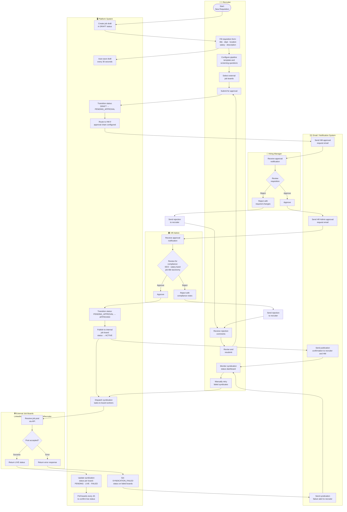
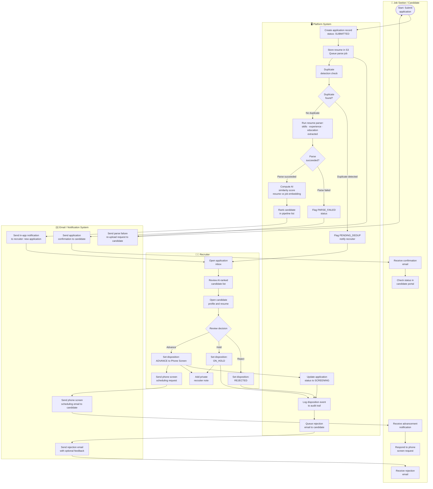
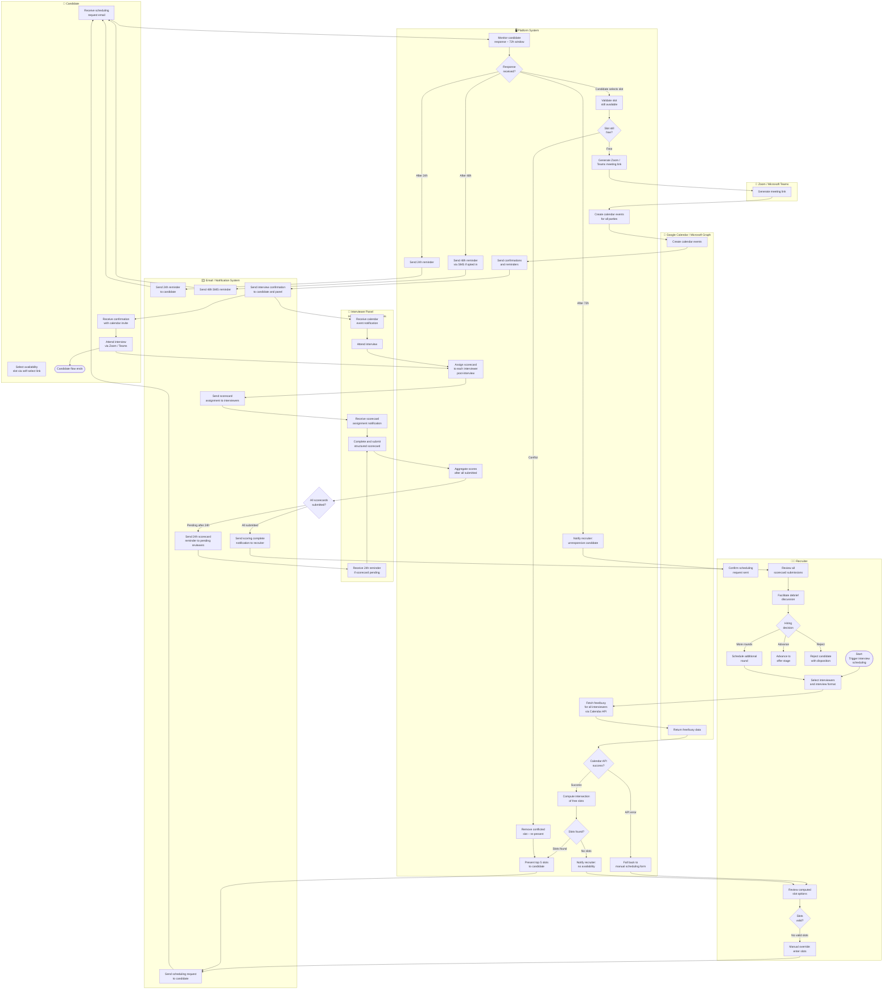
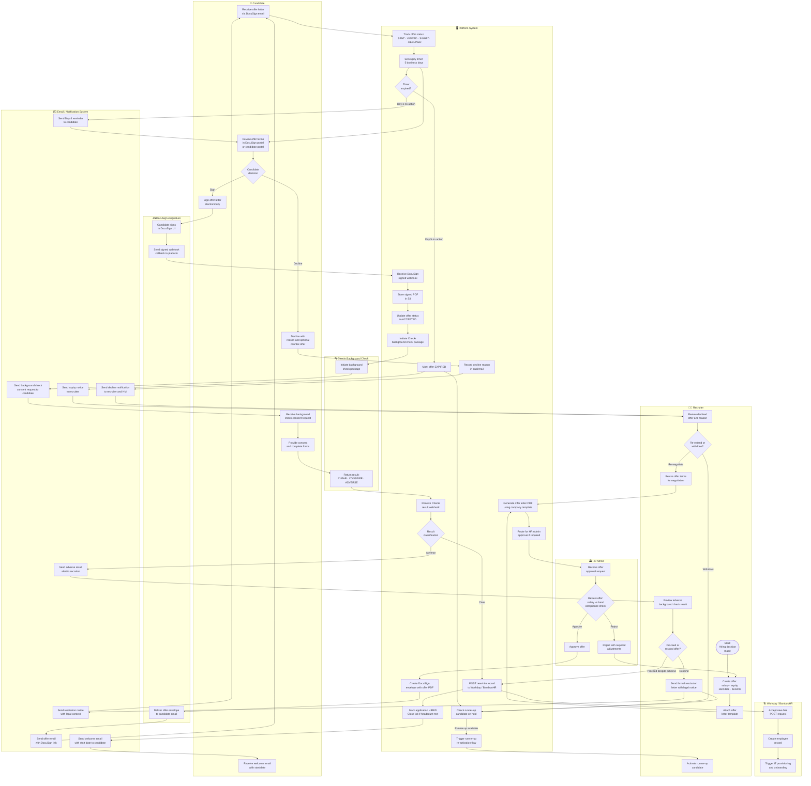

# BPMN Swimlane Diagrams — Job Board and Recruitment Platform

## Overview

Swimlane (pool-and-lane) diagrams extend activity diagrams by making the responsible party for each task explicit. Each horizontal lane represents a distinct actor or system; tasks in a lane belong exclusively to that actor. Handoffs between lanes represent process boundary crossings — precisely the points where failures, delays, and miscommunications most commonly occur in hiring workflows.

This document models four cross-functional processes using flowchart-based BPMN swimlane notation:

- **Job Posting Approval and Publication Process** — from requisition draft to live posting across job boards
- **Candidate Application Review Process** — from application receipt to pipeline advancement or rejection
- **Interview Coordination and Feedback Process** — from interview scheduling to scorecard consolidation
- **Offer Management and HRIS Handoff Process** — from offer preparation to new-hire record creation

For each process, lanes represent: **Job Seeker / Candidate**, **Recruiter**, **Hiring Manager**, **HR Admin**, **Platform (System)**, and **Email / Notification System**. External third-party systems appear as collapsed pools where relevant.

---

## Job Posting Approval and Publication Process

This process begins when a recruiter creates a new job requisition draft and ends when the posting is live on the internal job board and all external job boards. It crosses four internal actors and two external systems (job board APIs and the email provider).

---

## Candidate Application Review Process

This process begins when a new application is received and ends when the candidate is either advanced to the interview stage or formally rejected. It shows how AI scoring, recruiter review, and communication flow through the system lanes.

---

## Interview Coordination and Feedback Process

This process begins when a recruiter triggers interview scheduling and ends when all scorecards are submitted and the hiring debrief decision is recorded. It is the most multi-actor process: it involves the candidate, recruiter, hiring manager, multiple interviewers, the platform, calendar APIs, and the video conferencing system.

---

## Offer Management and HRIS Handoff Process

This process begins when the recruiter initiates offer creation after a hire decision and ends with either the candidate starting at the company (HRIS record created) or the offer being formally declined, expired, or rescinded.

---

*Last updated: 2025-01-01 | Owner: Platform Engineering — Process Architecture Team*
