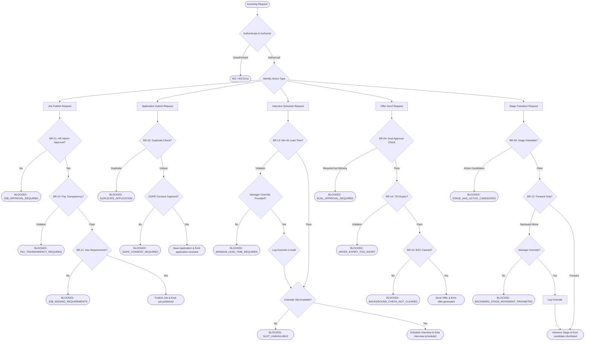

# Business Rules — Job Board and Recruitment Platform

> **Version:** 1.0.0 | **Last Updated:** 2025-01-01 | **Owner:** Product & Compliance Team  
> This document defines all enforceable business rules, the order in which they are evaluated, and the authorised override and exception-handling process for the Job Board and Recruitment Platform.

---

## Enforceable Rules

The following rules represent contractual, legal, and operational constraints that must be enforced at the application layer — not merely as UI hints. Each rule has a unique identifier, a plain-language description, the enforcement point, the entities it concerns, and the consequence of violation.

---

1. **BR-01 — Job Posting Requires HR Admin Approval Before Publishing:**  
   A Job record may not transition from `PENDING_APPROVAL` to `PUBLISHED` unless an authenticated user with the `HR_ADMIN` or `PLATFORM_ADMIN` role has explicitly approved the record by populating `approved_by` and `approved_at`. The approval action must emit a timestamped audit log entry. Automated publishing (e.g., scheduled jobs) must re-verify that the approval fields are non-NULL before the status flip is executed. If a job's content is materially edited after approval but before publishing (title, salary, description), the status is reset to `PENDING_APPROVAL` and re-approval is required.  
   *Enforcement Point:* Job Service — status transition guard, BEFORE UPDATE trigger  
   *Consequence:* Status transition blocked; error `JOB_APPROVAL_REQUIRED` returned

2. **BR-02 — Duplicate Application Prevention:**  
   A candidate may not submit more than one application to the same Job within a rolling 30-day window, even if a previous application was withdrawn or rejected. The deduplication check queries `CandidateApplication` including soft-deleted records where `created_at >= NOW() - INTERVAL '30 days'` for the same `(job_id, candidate_id)` pair. After 30 days, a new application is permitted. The error message presented to the candidate must not reveal the outcome of the prior application to comply with privacy norms.  
   *Enforcement Point:* Application Service — pre-insert guard  
   *Consequence:* Application rejected; error `DUPLICATE_APPLICATION` returned with earliest eligible re-apply date

3. **BR-03 — Interview Feedback Submission Deadline:**  
   Every interviewer assigned to an Interview must submit their `InterviewFeedback` within 48 hours of the interview's `completed_at` timestamp. The `deadline_at` field on `InterviewFeedback` is set automatically to `interview.completed_at + INTERVAL '48 hours'` and is immutable after creation. A scheduled job runs every 15 minutes and sets `is_overdue = true` on any feedback record where `submitted_at IS NULL AND deadline_at < NOW()`. Overdue feedback triggers an escalation notification to the interviewer, their manager, and the recruiting coordinator. Pipeline advancement of the candidate is blocked until all interviewers in the current round have submitted non-overdue feedback.  
   *Enforcement Point:* Feedback Service — deadline trigger; ATS Service — advancement guard  
   *Consequence:* Escalation alert; candidate advancement blocked; interviewer performance metric flagged

4. **BR-04 — Dual Approval Required for High-Value Offers:**  
   Any `OfferLetter` where `base_salary >= 150,000` in any currency (after conversion to USD equivalent using the current exchange rate at offer creation time) requires approval from both the Hiring Manager and the HR Director before the offer status can advance to `APPROVED` or `SENT`. The `requires_dual_approval` flag is set by a BEFORE INSERT/UPDATE database trigger whenever the salary threshold is met; it cannot be manually set to `false` by any application-layer call. Both `hiring_manager_approved_at` and `hr_director_approved_at` must be non-NULL for the offer to proceed. Neither approver may approve their own offer (a hiring manager approving a job they also sponsor requires a second HR Director to provide the manager approval slot).  
   *Enforcement Point:* Offer Service — approval workflow; DB trigger on salary field  
   *Consequence:* Offer status change blocked; error `DUAL_APPROVAL_REQUIRED`

5. **BR-05 — GDPR Candidate Data Erasure Within 30 Days:**  
   Upon receipt of a verified data erasure request, the platform must complete full anonymisation or deletion of all personal data for the requesting candidate within 30 calendar days. Day 0 is the timestamp of erasure request confirmation. The GDPR Service orchestrates deletion events to every dependent service. Progress is tracked in the `ErasureRequest` table. If any service has not acknowledged completion by day 28, an automatic P1 alert is raised and the DPO is notified. Failure to complete by day 30 constitutes a potential GDPR Article 17 violation and triggers an incident report.  
   *Enforcement Point:* GDPR Service — orchestration; all services — `candidate.erasure.requested` subscription  
   *Consequence:* Regulatory breach risk; DPO incident report; P1 engineering escalation

6. **BR-06 — EEO Data Collection Must Be Voluntary and Isolated:**  
   Equal Employment Opportunity (EEO) demographic data (race, gender identity, veteran status, disability status) is collected on a strictly voluntary basis during the application process. This data is stored in a separate, access-controlled `EEOResponse` table and must never be joined to or co-located with application scoring, pipeline stage, or hiring decision data in any query path. Only users with the explicit `EEO_ANALYST` role may query EEO data, and all such queries are logged. EEO fields must not appear in any API response consumed by recruiters, hiring managers, or the AI/ML screening service.  
   *Enforcement Point:* Application Service — field isolation; API gateway — response filtering; DB RLS  
   *Consequence:* Data access denied; audit log entry; potential EEOC compliance violation if breached

7. **BR-07 — Background Check Requires Written Candidate Consent:**  
   A `BackgroundCheckRequest` record may not be created, and no check may be initiated with any third-party provider, unless the candidate has provided explicit written consent. Consent is captured as a distinct electronic signature step within the offer acceptance flow. The `consent_given` flag on `BackgroundCheckRequest` must be `true` and `consent_document_url` must reference a stored, signed consent form before the Background Check service sends any request to providers such as Checkr or Sterling. Retroactive consent is not permitted.  
   *Enforcement Point:* Background Check Service — pre-initiation guard  
   *Consequence:* Check initiation blocked; error `CONSENT_REQUIRED`; potential FCRA violation if bypassed

8. **BR-08 — Job Must Be Closed Before Archiving:**  
   A Job may only transition to `ARCHIVED` status from `CLOSED` status. A job in `PUBLISHED` or `PENDING_APPROVAL` state cannot be directly archived. The archiving flow must first close the job (triggering closure notifications to candidates currently in active pipeline stages), then apply the archive transition. Archived jobs are read-only and cannot be re-published; instead, a new job posting must be created. This prevents candidates from receiving unexpected communications about archived postings.  
   *Enforcement Point:* Job Service — status transition FSM  
   *Consequence:* Status transition blocked; error `JOB_MUST_BE_CLOSED_BEFORE_ARCHIVING`

9. **BR-09 — Pipeline Stage Cannot Be Deleted With Active Candidates:**  
   A `PipelineStage` may not be deleted (hard or soft) while any `CandidateApplication` record has `current_stage_id` pointing to that stage. Before deletion, the requesting user must either move all candidate applications to a different stage or confirm closure of those applications. If the stage is part of a pipeline template shared across multiple active jobs, deletion must be blocked entirely until no job references the pipeline as active. This rule prevents data integrity failures in the application-tracking flow.  
   *Enforcement Point:* Pipeline Service — delete guard; pre-delete check query  
   *Consequence:* Delete blocked; error `STAGE_HAS_ACTIVE_CANDIDATES` with count of affected applications

10. **BR-10 — Salary Range Must Comply With Pay Transparency Laws:**  
    When a job is posted in a jurisdiction that mandates pay transparency (currently: Colorado, New York City, Washington State, California, Illinois, and Maryland in the US; all EU member states), the salary range (`salary_min` and `salary_max`) must be disclosed and `salary_disclosed` must be set to `true`. The platform maintains a `JurisdictionPayTransparencyRule` configuration table keyed by country code and US state code. The Job Service validates this rule on status transition to `PUBLISHED`. Jurisdiction is derived from `job.country` and `job.state` fields. Violations are logged and publishing is blocked.  
    *Enforcement Point:* Job Service — publish validation  
    *Consequence:* Publishing blocked; error `PAY_TRANSPARENCY_REQUIRED` with jurisdiction details

11. **BR-11 — Job Distribution to External Boards Requires At Least One Requirement:**  
    A job may not be distributed to external job boards (LinkedIn, Indeed, Glassdoor, ZipRecruiter, etc.) unless it has at least one active `JobRequirement` record linked to it. This ensures that distributed postings carry meaningful qualification criteria, reducing unqualified applications and maintaining the quality signal. The Integration Service checks this precondition before calling any external board API. Additionally, the job description must be at least 100 words and the employment type must be set.  
    *Enforcement Point:* Integration Service — pre-distribution guard  
    *Consequence:* Distribution blocked; error `JOB_MISSING_REQUIREMENTS`

12. **BR-12 — Candidate Cannot Move Backward Past a Skipped Stage:**  
    Within a hiring pipeline, candidates progress through stages in the defined `order_index` sequence. A candidate may be moved forward by skipping non-mandatory optional stages. However, once a mandatory stage has been marked complete for a candidate, they cannot be moved backward to a stage with a lower `order_index` than their current stage. Backward movement to optional stages already passed is also blocked unless a manager override is explicitly invoked and logged. This preserves the audit integrity of the hiring decision timeline.  
    *Enforcement Point:* ATS Service — stage transition guard  
    *Consequence:* Stage transition blocked; error `BACKWARD_STAGE_MOVEMENT_PROHIBITED`

13. **BR-13 — Interview Cannot Be Scheduled Within 4 Hours Without Manager Override:**  
    The minimum lead time between an Interview record's `created_at` timestamp and its `scheduled_at` timestamp is 4 hours. This ensures candidates and interviewers have adequate preparation time. Scheduling a meeting with `scheduled_at < created_at + INTERVAL '4 hours'` is rejected unless a user with the `HIRING_MANAGER` or `HR_ADMIN` role explicitly invokes the override, provides a justification reason, and their `user_id` is stored in `interview.override_by`. All overrides are logged in the audit trail.  
    *Enforcement Point:* Interview Service — schedule validation  
    *Consequence:* Scheduling blocked; error `MINIMUM_LEAD_TIME_REQUIRED`; override path provided for managers

14. **BR-14 — Offer Expiry Must Be At Least 72 Hours After Sending:**  
    When an OfferLetter transitions to `SENT` status, the `expires_at` field must be set to a timestamp at least 72 hours after `sent_at`. This gives candidates a minimum of 3 days to review the offer, consult legal or financial advisors, and respond. The constraint is enforced at both the database layer (`CHECK expires_at >= sent_at + INTERVAL '72 hours'`) and the application layer. A recruiter may set a longer expiry period (standard is 5–7 business days), but may never set a shorter one. Counteroffers (OfferNegotiation records) reset a new 72-hour window.  
    *Enforcement Point:* Offer Service — send guard; DB CHECK constraint  
    *Consequence:* Offer send blocked; error `OFFER_EXPIRY_TOO_SHORT`

15. **BR-15 — Background Check Result Must Be Reviewed Before Offer Countersigning:**  
    Before the `OfferLetter.esign_status` can be advanced to `SIGNED` (countersigned by the company), the `background_check_cleared` field on the OfferLetter must be `true`. This field is written exclusively by the Background Check Service after an authorised HR user has reviewed the completed background check report and clicked the explicit "Clear for Hire" confirmation. The platform does not automatically clear a background check regardless of outcome; human review is mandatory. This prevents accidental hire of candidates with disqualifying results.  
    *Enforcement Point:* Offer Service — countersign guard; Background Check Service — clear action  
    *Consequence:* Countersigning blocked; error `BACKGROUND_CHECK_NOT_CLEARED`

---

## Rule Evaluation Pipeline

When a state-changing action is requested — such as publishing a job, submitting an application, scheduling an interview, or sending an offer — the platform evaluates all applicable rules in a deterministic order before committing the state change. Rules are evaluated synchronously in the request path. Any rule failure short-circuits evaluation and returns the first encountered error to the caller.

### Rule Evaluation Order and Short-Circuit Logic

Rules are evaluated in the following priority tiers. A failure at any tier immediately short-circuits and prevents evaluation of lower-tier rules:

| Tier | Priority | Rule IDs | Description |
|------|----------|----------|-------------|
| 0 | Authentication | — | Identity and authorisation check before any domain rule |
| 1 | Critical Legal | BR-05, BR-06, BR-07 | GDPR and legal compliance rules; any violation stops processing |
| 2 | Data Integrity | BR-02, BR-09, BR-12 | Prevents data corruption or duplication |
| 3 | Approval Workflow | BR-01, BR-04 | Approval chain verification |
| 4 | Operational | BR-03, BR-08, BR-10, BR-11, BR-13, BR-14, BR-15 | Operational policy enforcement |
| 5 | Advisory | — | Non-blocking warnings (e.g., salary below market rate) |

Rules within the same tier are evaluated sequentially in BR number order. No rule within a tier is evaluated in parallel. Tier-5 advisory rules never block state changes; they produce warning responses alongside the success response.

---

## Exception and Override Handling

### Overview

The platform recognises that rigid rule enforcement without a safety valve creates operational bottlenecks. A controlled override mechanism allows authorised users to bypass specific rules under documented circumstances. Every override is a first-class audit event.

### Override-Eligible Rules and Authorised Roles

| Rule | Override Eligible | Minimum Role Required | Justification Required | Max Override Duration |
|------|------------------|----------------------|----------------------|----------------------|
| BR-13 (4h lead time) | Yes | HIRING_MANAGER or HR_ADMIN | Yes (free text, min 20 chars) | Per-interview, one-time |
| BR-12 (backward stage) | Yes | HR_ADMIN | Yes (free text, min 50 chars) | Per-candidate, per-stage |
| BR-03 (48h feedback deadline) | Yes | HR_DIRECTOR | Yes (reason code + free text) | Per-feedback, +24h extension only |
| BR-08 (close before archive) | No | — | — | Not overridable |
| BR-01 (approval before publish) | No | — | — | Not overridable |
| BR-04 (dual approval) | No | — | — | Not overridable |
| BR-05 (GDPR erasure) | No | — | — | Not overridable |
| BR-06 (EEO isolation) | No | — | — | Not overridable |
| BR-07 (BGC consent) | No | — | — | Not overridable |
| BR-14 (72h expiry) | No | — | — | Not overridable |
| BR-15 (BGC cleared) | No | — | — | Not overridable |

### Override Request Flow

1. **User triggers a blocked action:** The system returns a structured error with an `override_available: true` flag if the rule is override-eligible and the requesting user's role is sufficient.
2. **User submits override request:** The user provides a justification and explicitly invokes the override endpoint (`POST /overrides`), referencing the `rule_id`, `entity_id`, and justification text.
3. **Authorisation re-check:** The override endpoint independently re-validates the user's role. A second, independent authorisation check prevents role-spoofing attacks between the initial request and the override submission.
4. **Override record created:** An `RuleOverride` record is persisted with: `rule_id`, `entity_type`, `entity_id`, `overridden_by`, `justification`, `requested_at`, `approved_at`.
5. **Original action re-executed:** With the override record in place, the original action is retried. The rule evaluator checks for a valid override record before applying the rule block.
6. **Audit log enriched:** The audit log entry for the state change includes a `override_id` reference, making it clear the action occurred under an exception.

### Audit Trail Requirements for Overrides

- Every override record is append-only and cannot be modified or deleted by any application role.
- Override records are retained for 7 years regardless of the entity retention period.
- A weekly automated report is generated listing all overrides invoked in the previous 7 days, grouped by rule and requester, and delivered to the Head of Recruiting and the Chief People Officer.
- If more than 5 overrides for the same rule are invoked by the same user within a 30-day period, the system raises a compliance alert to HR Operations for review, as this may indicate systemic process avoidance.
- Override records are included in all GDPR Subject Access Request (SAR) responses if they reference the requesting data subject's records.

### Emergency Escalation Path

In the rare case where a critical operational need conflicts with a non-overridable rule (e.g., a time-sensitive offer must be processed during a system outage preventing background check clearance), the following escalation path applies:

1. Recruiting Coordinator contacts the Head of HR directly.
2. Head of HR and General Counsel provide written authorisation via email.
3. A Platform Admin user can invoke a time-limited "Emergency Bypass" via an internal admin console — this is not available to regular application users.
4. The Emergency Bypass is logged with the authorisation evidence (email thread ID) and triggers an immediate compliance review within 24 hours.
5. Emergency Bypasses are included in the quarterly compliance audit report reviewed by the Board.
