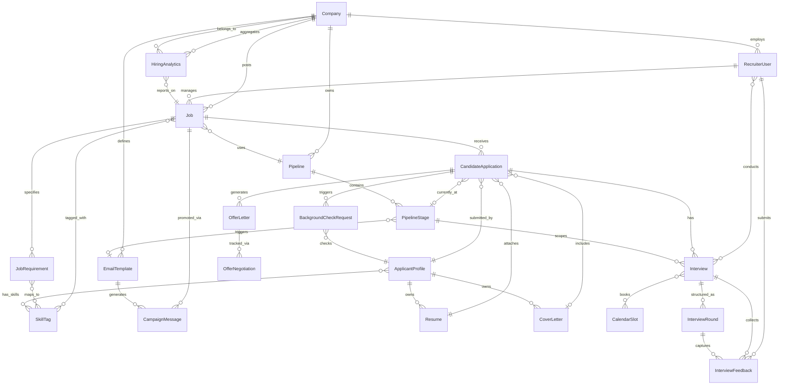

# Data Dictionary — Job Board and Recruitment Platform

> **Version:** 1.0.0 | **Last Updated:** 2025-01-01 | **Owner:** Platform Architecture Team  
> This document is the authoritative reference for all data entities, their fields, relationships, quality controls, and retention policies within the Job Board and Recruitment Platform.

---

## Core Entities

This section defines every first-class entity in the platform, the fields each entity holds, data types, constraints, and descriptions for every column.

---

### Entity: Company

| Field | Type | Nullable | Default | Constraints | Description |
|-------|------|----------|---------|-------------|-------------|
| id | UUID | No | gen_random_uuid() | PRIMARY KEY | Globally unique company identifier |
| name | VARCHAR(255) | No | — | NOT NULL, UNIQUE | Legal company name |
| slug | VARCHAR(100) | No | — | NOT NULL, UNIQUE, lowercase | URL-safe slug derived from company name |
| logo_url | TEXT | Yes | NULL | Valid URL format | CDN URL for the company logo image |
| website_url | TEXT | Yes | NULL | Valid URL format | Public-facing company website |
| industry | VARCHAR(100) | No | — | NOT NULL | Industry classification (e.g., FinTech, HealthTech) |
| company_size_range | VARCHAR(50) | No | — | NOT NULL, CHECK IN enum | Headcount band (e.g., 1–10, 11–50, 51–200, 201–500, 500+) |
| hq_country | CHAR(2) | No | — | NOT NULL, ISO 3166-1 alpha-2 | ISO country code for headquarters |
| hq_city | VARCHAR(100) | Yes | NULL | — | City of headquarters |
| description | TEXT | Yes | NULL | — | Markdown-formatted company description |
| linkedin_url | TEXT | Yes | NULL | Valid URL format | LinkedIn company page URL |
| is_verified | BOOLEAN | No | false | NOT NULL | Whether the company passed identity verification |
| verification_date | TIMESTAMPTZ | Yes | NULL | — | Timestamp when verification was completed |
| subscription_tier | VARCHAR(50) | No | 'free' | NOT NULL, CHECK IN enum | Billing tier: free, starter, professional, enterprise |
| max_active_jobs | INTEGER | No | 5 | NOT NULL, CHECK > 0 | Maximum concurrent active job postings for tier |
| created_at | TIMESTAMPTZ | No | NOW() | NOT NULL | Record creation timestamp (UTC) |
| updated_at | TIMESTAMPTZ | No | NOW() | NOT NULL | Last modification timestamp (UTC) |
| deleted_at | TIMESTAMPTZ | Yes | NULL | — | Soft-delete timestamp; NULL means active |

---

### Entity: Job

| Field | Type | Nullable | Default | Constraints | Description |
|-------|------|----------|---------|-------------|-------------|
| id | UUID | No | gen_random_uuid() | PRIMARY KEY | Globally unique job posting identifier |
| company_id | UUID | No | — | NOT NULL, FK → Company.id | Company that owns this job posting |
| recruiter_id | UUID | No | — | NOT NULL, FK → RecruiterUser.id | Recruiter responsible for managing this job |
| pipeline_id | UUID | No | — | NOT NULL, FK → Pipeline.id | Hiring pipeline assigned to this job |
| title | VARCHAR(255) | No | — | NOT NULL | Job title displayed to candidates |
| slug | VARCHAR(300) | No | — | NOT NULL, UNIQUE | URL-safe job identifier (company-slug + title-slug + short-id) |
| description | TEXT | No | — | NOT NULL, MIN 100 chars | Full job description in Markdown |
| employment_type | VARCHAR(50) | No | — | NOT NULL, CHECK IN enum | FULL_TIME, PART_TIME, CONTRACT, INTERNSHIP, FREELANCE |
| experience_level | VARCHAR(50) | No | — | NOT NULL, CHECK IN enum | ENTRY, JUNIOR, MID, SENIOR, LEAD, EXECUTIVE |
| location_type | VARCHAR(50) | No | — | NOT NULL, CHECK IN enum | ONSITE, REMOTE, HYBRID |
| country | CHAR(2) | Yes | NULL | ISO 3166-1 alpha-2 | Country of the job location |
| city | VARCHAR(100) | Yes | NULL | — | City of the job location |
| currency | CHAR(3) | No | 'USD' | NOT NULL, ISO 4217 | Three-letter ISO currency code |
| salary_min | DECIMAL(12,2) | Yes | NULL | CHECK >= 0 | Minimum annual salary; NULL means undisclosed |
| salary_max | DECIMAL(12,2) | Yes | NULL | CHECK >= salary_min | Maximum annual salary; NULL means undisclosed |
| salary_disclosed | BOOLEAN | No | true | NOT NULL | Whether salary is shown on the listing |
| equity_offered | BOOLEAN | No | false | NOT NULL | Whether equity compensation is part of the package |
| equity_details | TEXT | Yes | NULL | — | Free-text description of equity package |
| status | VARCHAR(50) | No | 'DRAFT' | NOT NULL, CHECK IN enum | DRAFT, PENDING_APPROVAL, PUBLISHED, CLOSED, ARCHIVED |
| approved_by | UUID | Yes | NULL | FK → RecruiterUser.id | HR Admin who approved the posting |
| approved_at | TIMESTAMPTZ | Yes | NULL | — | Timestamp of approval |
| published_at | TIMESTAMPTZ | Yes | NULL | — | Timestamp when job became publicly visible |
| closes_at | TIMESTAMPTZ | Yes | NULL | CHECK > published_at | Application deadline; NULL means open indefinitely |
| application_count | INTEGER | No | 0 | NOT NULL, CHECK >= 0 | Denormalized count of submitted applications |
| view_count | INTEGER | No | 0 | NOT NULL, CHECK >= 0 | Cumulative public listing views |
| eeo_statement | TEXT | Yes | NULL | — | Equal Employment Opportunity statement text |
| external_distribution | JSONB | No | '[]' | NOT NULL | Array of {board, externalId, distributedAt, status} objects |
| created_at | TIMESTAMPTZ | No | NOW() | NOT NULL | Record creation timestamp (UTC) |
| updated_at | TIMESTAMPTZ | No | NOW() | NOT NULL | Last modification timestamp (UTC) |
| deleted_at | TIMESTAMPTZ | Yes | NULL | — | Soft-delete timestamp |

---

### Entity: CandidateApplication

| Field | Type | Nullable | Default | Constraints | Description |
|-------|------|----------|---------|-------------|-------------|
| id | UUID | No | gen_random_uuid() | PRIMARY KEY | Globally unique application identifier |
| job_id | UUID | No | — | NOT NULL, FK → Job.id | Job being applied for |
| candidate_id | UUID | No | — | NOT NULL, FK → ApplicantProfile.id | Candidate who submitted the application |
| resume_id | UUID | No | — | NOT NULL, FK → Resume.id | Resume submitted with this application |
| cover_letter_id | UUID | Yes | NULL | FK → CoverLetter.id | Optional cover letter |
| current_stage_id | UUID | Yes | NULL | FK → PipelineStage.id | Current pipeline stage candidate is in |
| status | VARCHAR(50) | No | 'SUBMITTED' | NOT NULL, CHECK IN enum | SUBMITTED, SCREENING, SHORTLISTED, IN_REVIEW, INTERVIEWING, OFFER_SENT, HIRED, REJECTED, WITHDRAWN |
| ai_score | DECIMAL(5,2) | Yes | NULL | CHECK BETWEEN 0 AND 100 | AI-generated match score (0–100) |
| ai_extracted_skills | JSONB | No | '[]' | NOT NULL | Array of skill strings extracted by AI model |
| ai_match_percentage | DECIMAL(5,2) | Yes | NULL | CHECK BETWEEN 0 AND 100 | Percentage match against job requirements |
| source | VARCHAR(100) | No | 'DIRECT' | NOT NULL | Acquisition source: DIRECT, LINKEDIN, INDEED, REFERRAL, CAMPUS, etc. |
| referral_candidate_id | UUID | Yes | NULL | FK → ApplicantProfile.id | Referring candidate for internal referrals |
| rejection_reason | VARCHAR(255) | Yes | NULL | — | Standardized rejection reason code |
| rejection_note | TEXT | Yes | NULL | — | Internal note about rejection |
| withdrawn_at | TIMESTAMPTZ | Yes | NULL | — | Timestamp when candidate withdrew |
| withdrawn_reason | TEXT | Yes | NULL | — | Candidate-provided reason for withdrawal |
| hired_at | TIMESTAMPTZ | Yes | NULL | — | Timestamp when candidate was moved to HIRED |
| gdpr_consent_given | BOOLEAN | No | false | NOT NULL | Whether GDPR data processing consent was given |
| gdpr_consent_at | TIMESTAMPTZ | Yes | NULL | — | Timestamp of GDPR consent |
| created_at | TIMESTAMPTZ | No | NOW() | NOT NULL | Submission timestamp (UTC) |
| updated_at | TIMESTAMPTZ | No | NOW() | NOT NULL | Last modification timestamp (UTC) |

---

### Entity: Resume

| Field | Type | Nullable | Default | Constraints | Description |
|-------|------|----------|---------|-------------|-------------|
| id | UUID | No | gen_random_uuid() | PRIMARY KEY | Globally unique resume identifier |
| candidate_id | UUID | No | — | NOT NULL, FK → ApplicantProfile.id | Owning candidate |
| file_name | VARCHAR(255) | No | — | NOT NULL | Original uploaded file name |
| file_url | TEXT | No | — | NOT NULL | Secure CDN/S3 URL for the resume file |
| file_size_bytes | INTEGER | No | — | NOT NULL, CHECK > 0 | File size in bytes |
| mime_type | VARCHAR(100) | No | — | NOT NULL, CHECK IN enum | application/pdf, application/msword, application/vnd.openxmlformats-officedocument.wordprocessingml.document |
| parsed_text | TEXT | Yes | NULL | — | Raw extracted text from resume (for search indexing) |
| parsed_data | JSONB | Yes | NULL | — | Structured parsed data: {education[], experience[], skills[], certifications[]} |
| parsing_status | VARCHAR(50) | No | 'PENDING' | NOT NULL, CHECK IN enum | PENDING, PROCESSING, COMPLETED, FAILED |
| parsing_error | TEXT | Yes | NULL | — | Error message if parsing failed |
| version | INTEGER | No | 1 | NOT NULL, CHECK > 0 | Version number for resume revisions |
| is_primary | BOOLEAN | No | false | NOT NULL | Whether this is the candidate's primary resume |
| is_anonymised | BOOLEAN | No | false | NOT NULL | Whether PII has been stripped for blind review |
| anonymised_url | TEXT | Yes | NULL | — | CDN URL for the anonymised version |
| uploaded_at | TIMESTAMPTZ | No | NOW() | NOT NULL | Upload timestamp (UTC) |
| deleted_at | TIMESTAMPTZ | Yes | NULL | — | Soft-delete timestamp for GDPR erasure |

---

### Entity: Pipeline

| Field | Type | Nullable | Default | Constraints | Description |
|-------|------|----------|---------|-------------|-------------|
| id | UUID | No | gen_random_uuid() | PRIMARY KEY | Globally unique pipeline identifier |
| company_id | UUID | No | — | NOT NULL, FK → Company.id | Company that owns this pipeline template |
| name | VARCHAR(255) | No | — | NOT NULL | Pipeline template name (e.g., "Engineering Hire", "Sales Hire") |
| description | TEXT | Yes | NULL | — | Purpose and usage notes for the pipeline |
| is_default | BOOLEAN | No | false | NOT NULL | If true, auto-assigned to new jobs for this company |
| is_archived | BOOLEAN | No | false | NOT NULL | Soft-archive flag; archived pipelines cannot be assigned to new jobs |
| stage_count | INTEGER | No | 0 | NOT NULL, CHECK >= 0 | Denormalized count of active stages |
| created_by | UUID | No | — | NOT NULL, FK → RecruiterUser.id | User who created this pipeline |
| created_at | TIMESTAMPTZ | No | NOW() | NOT NULL | Record creation timestamp (UTC) |
| updated_at | TIMESTAMPTZ | No | NOW() | NOT NULL | Last modification timestamp (UTC) |

---

### Entity: PipelineStage

| Field | Type | Nullable | Default | Constraints | Description |
|-------|------|----------|---------|-------------|-------------|
| id | UUID | No | gen_random_uuid() | PRIMARY KEY | Globally unique stage identifier |
| pipeline_id | UUID | No | — | NOT NULL, FK → Pipeline.id | Parent pipeline |
| name | VARCHAR(100) | No | — | NOT NULL | Stage display name (e.g., "Phone Screen", "Technical Interview") |
| stage_type | VARCHAR(50) | No | — | NOT NULL, CHECK IN enum | SCREENING, ASSESSMENT, INTERVIEW, OFFER, BACKGROUND_CHECK, HIRED, REJECTED |
| order_index | INTEGER | No | — | NOT NULL, CHECK >= 0 | Zero-based ordering index within the pipeline |
| sla_hours | INTEGER | Yes | NULL | CHECK > 0 | Expected maximum hours a candidate should spend in this stage |
| is_mandatory | BOOLEAN | No | true | NOT NULL | If true, candidates cannot skip this stage |
| requires_feedback | BOOLEAN | No | false | NOT NULL | If true, feedback submission is mandatory before advancing |
| email_template_id | UUID | Yes | NULL | FK → EmailTemplate.id | Auto-send template when candidate enters this stage |
| created_at | TIMESTAMPTZ | No | NOW() | NOT NULL | Record creation timestamp (UTC) |
| updated_at | TIMESTAMPTZ | No | NOW() | NOT NULL | Last modification timestamp (UTC) |

---

### Entity: Interview

| Field | Type | Nullable | Default | Constraints | Description |
|-------|------|----------|---------|-------------|-------------|
| id | UUID | No | gen_random_uuid() | PRIMARY KEY | Globally unique interview identifier |
| application_id | UUID | No | — | NOT NULL, FK → CandidateApplication.id | Application this interview belongs to |
| pipeline_stage_id | UUID | No | — | NOT NULL, FK → PipelineStage.id | Pipeline stage this interview represents |
| round_number | INTEGER | No | 1 | NOT NULL, CHECK > 0 | Sequential interview round number |
| interview_type | VARCHAR(50) | No | — | NOT NULL, CHECK IN enum | PHONE_SCREEN, VIDEO, ONSITE, PANEL, TECHNICAL, CASE_STUDY, CULTURE_FIT |
| status | VARCHAR(50) | No | 'SCHEDULED' | NOT NULL, CHECK IN enum | SCHEDULED, CONFIRMED, IN_PROGRESS, COMPLETED, CANCELLED, NO_SHOW, RESCHEDULED |
| scheduled_at | TIMESTAMPTZ | No | — | NOT NULL | Planned start time in UTC |
| duration_minutes | INTEGER | No | 60 | NOT NULL, CHECK BETWEEN 15 AND 480 | Planned interview duration |
| location | TEXT | Yes | NULL | — | Physical address or "Video" for virtual interviews |
| video_link | TEXT | Yes | NULL | — | Video conferencing join URL |
| video_provider | VARCHAR(50) | Yes | NULL | CHECK IN enum | ZOOM, GOOGLE_MEET, TEAMS, WEBEX |
| calendar_event_id | TEXT | Yes | NULL | — | External calendar event ID for sync |
| completed_at | TIMESTAMPTZ | Yes | NULL | — | Actual end timestamp; set when status moves to COMPLETED |
| cancellation_reason | TEXT | Yes | NULL | — | Reason for cancellation or no-show |
| interviewer_ids | UUID[] | No | '{}' | NOT NULL, MIN 1 element | Array of RecruiterUser IDs who will conduct the interview |
| override_by | UUID | Yes | NULL | FK → RecruiterUser.id | Manager who overrode the 4-hour scheduling rule (BR-13) |
| created_at | TIMESTAMPTZ | No | NOW() | NOT NULL | Record creation timestamp (UTC) |
| updated_at | TIMESTAMPTZ | No | NOW() | NOT NULL | Last modification timestamp (UTC) |

---

### Entity: InterviewFeedback

| Field | Type | Nullable | Default | Constraints | Description |
|-------|------|----------|---------|-------------|-------------|
| id | UUID | No | gen_random_uuid() | PRIMARY KEY | Globally unique feedback record identifier |
| interview_id | UUID | No | — | NOT NULL, FK → Interview.id | Interview this feedback belongs to |
| interviewer_id | UUID | No | — | NOT NULL, FK → RecruiterUser.id | Interviewer who submitted this feedback |
| application_id | UUID | No | — | NOT NULL, FK → CandidateApplication.id | Application linked to this feedback (denormalized for query speed) |
| recommendation | VARCHAR(50) | No | — | NOT NULL, CHECK IN enum | STRONG_YES, YES, NEUTRAL, NO, STRONG_NO |
| overall_score | DECIMAL(3,1) | No | — | NOT NULL, CHECK BETWEEN 1.0 AND 5.0 | Aggregate score out of 5 |
| technical_score | DECIMAL(3,1) | Yes | NULL | CHECK BETWEEN 1.0 AND 5.0 | Technical competency sub-score |
| communication_score | DECIMAL(3,1) | Yes | NULL | CHECK BETWEEN 1.0 AND 5.0 | Communication skills sub-score |
| culture_fit_score | DECIMAL(3,1) | Yes | NULL | CHECK BETWEEN 1.0 AND 5.0 | Culture alignment sub-score |
| structured_responses | JSONB | No | '{}' | NOT NULL | Key–value map of scorecard question → answer |
| strengths | TEXT | Yes | NULL | — | Free-text description of candidate strengths |
| weaknesses | TEXT | Yes | NULL | — | Free-text description of candidate weaknesses |
| notes | TEXT | Yes | NULL | — | Private interview notes visible only to the hiring team |
| is_submitted | BOOLEAN | No | false | NOT NULL | False = draft, True = final and locked |
| submitted_at | TIMESTAMPTZ | Yes | NULL | — | Timestamp when feedback was finalised |
| deadline_at | TIMESTAMPTZ | No | — | NOT NULL | 48-hour deadline from interview.completed_at (enforces BR-03) |
| is_overdue | BOOLEAN | No | false | NOT NULL | Set to true by scheduler if submitted_at > deadline_at |
| created_at | TIMESTAMPTZ | No | NOW() | NOT NULL | Record creation timestamp (UTC) |
| updated_at | TIMESTAMPTZ | No | NOW() | NOT NULL | Last modification timestamp (UTC) |

---

### Entity: OfferLetter

| Field | Type | Nullable | Default | Constraints | Description |
|-------|------|----------|---------|-------------|-------------|
| id | UUID | No | gen_random_uuid() | PRIMARY KEY | Globally unique offer letter identifier |
| application_id | UUID | No | — | NOT NULL, FK → CandidateApplication.id | Application this offer is associated with |
| candidate_id | UUID | No | — | NOT NULL, FK → ApplicantProfile.id | Candidate receiving the offer (denormalized) |
| job_id | UUID | No | — | NOT NULL, FK → Job.id | Job for which the offer is being made (denormalized) |
| base_salary | DECIMAL(12,2) | No | — | NOT NULL, CHECK > 0 | Annual base salary in offer_currency |
| offer_currency | CHAR(3) | No | 'USD' | NOT NULL, ISO 4217 | Currency of salary components |
| bonus_amount | DECIMAL(12,2) | Yes | NULL | CHECK >= 0 | Signing or annual bonus amount |
| equity_units | INTEGER | Yes | NULL | CHECK >= 0 | Number of equity units (stock options/RSUs) granted |
| equity_vesting_schedule | TEXT | Yes | NULL | — | Vesting cliff and schedule description |
| start_date | DATE | No | — | NOT NULL | Proposed employment start date |
| position_title | VARCHAR(255) | No | — | NOT NULL | Job title as it will appear on contract |
| department | VARCHAR(100) | No | — | NOT NULL | Department candidate is joining |
| reporting_to | UUID | Yes | NULL | FK → RecruiterUser.id | Hiring manager the candidate will report to |
| status | VARCHAR(50) | No | 'DRAFT' | NOT NULL, CHECK IN enum | DRAFT, PENDING_APPROVAL, APPROVED, SENT, ACCEPTED, DECLINED, EXPIRED, REVOKED |
| requires_dual_approval | BOOLEAN | No | false | NOT NULL | True when base_salary >= 150000 (enforces BR-04) |
| hiring_manager_approved_by | UUID | Yes | NULL | FK → RecruiterUser.id | Hiring manager who approved (required when requires_dual_approval) |
| hiring_manager_approved_at | TIMESTAMPTZ | Yes | NULL | — | Timestamp of hiring manager approval |
| hr_director_approved_by | UUID | Yes | NULL | FK → RecruiterUser.id | HR Director who approved (required when requires_dual_approval) |
| hr_director_approved_at | TIMESTAMPTZ | Yes | NULL | — | Timestamp of HR Director approval |
| sent_at | TIMESTAMPTZ | Yes | NULL | — | Timestamp when offer was sent to candidate |
| expires_at | TIMESTAMPTZ | Yes | NULL | CHECK >= sent_at + INTERVAL '72 hours' | Offer expiry; minimum 72 hours from sent_at (enforces BR-14) |
| responded_at | TIMESTAMPTZ | Yes | NULL | — | Timestamp when candidate accepted or declined |
| esign_document_id | TEXT | Yes | NULL | — | DocuSign envelope ID for digital signature workflow |
| esign_status | VARCHAR(50) | No | 'NOT_SENT' | NOT NULL, CHECK IN enum | NOT_SENT, SENT, VIEWED, SIGNED, DECLINED, EXPIRED |
| background_check_cleared | BOOLEAN | No | false | NOT NULL | Must be true before countersigning (enforces BR-15) |
| revocation_reason | TEXT | Yes | NULL | — | Reason if offer was revoked |
| created_at | TIMESTAMPTZ | No | NOW() | NOT NULL | Record creation timestamp (UTC) |
| updated_at | TIMESTAMPTZ | No | NOW() | NOT NULL | Last modification timestamp (UTC) |

---

## Canonical Relationship Diagram

The following entity–relationship diagram captures every first-class association in the platform. Cardinalities and participation constraints are shown using crow's foot notation.



### Key Relationship Explanations

**Company → Job → CandidateApplication (core hiring funnel):** A Company posts one or more Jobs. Each Job receives zero or more CandidateApplications. This three-entity chain is the primary data flow through the platform.

**Job → Pipeline → PipelineStage:** Each Job is assigned exactly one Pipeline at creation time. That Pipeline contains an ordered sequence of PipelineStages. Each stage has a type, SLA, and optional email automation. Stages are reusable across jobs that share the same pipeline template.

**CandidateApplication → Interview → InterviewFeedback:** An application generates one or more Interview records (one per round). Each Interview collects one InterviewFeedback record per interviewer. Feedback submissions are subject to the 48-hour BR-03 deadline.

**CandidateApplication → OfferLetter → OfferNegotiation:** When an application reaches the offer stage, an OfferLetter is generated. If the candidate counters, an OfferNegotiation record tracks each revision round until acceptance or decline.

**ApplicantProfile → Resume (versioned):** An ApplicantProfile may hold multiple Resume versions. Each CandidateApplication pins a specific Resume version at submission time, ensuring historical integrity even if the candidate later uploads a new version.

**BackgroundCheckRequest → ApplicantProfile:** Background checks are initiated only after offer acceptance and require written candidate consent (BR-07). The result must be reviewed before the offer can be countersigned (BR-15).

**SkillTag (many-to-many junction):** SkillTags are normalised taxonomy items shared between Job requirements, JobRequirement mappings, and ApplicantProfile skill declarations. This enables accurate AI-powered skill gap analysis.

---

## Data Quality Controls

### Validation Rules Per Entity

**Company**
- `name` must not contain purely numeric strings; must include at least one alphabetic character.
- `slug` is auto-generated from `name` using kebab-case lowercasing; manual overrides must pass the `^[a-z0-9-]{3,100}$` regex.
- `subscription_tier` constrains `max_active_jobs`: free ≤ 5, starter ≤ 25, professional ≤ 100, enterprise = unlimited (NULL).
- `is_verified` can only be set to `true` by the internal Identity Verification service, never by the application layer directly.

**Job**
- `salary_max` must be ≥ `salary_min` when both are non-NULL; enforced at database constraint and application layer.
- `closes_at` must be at minimum 24 hours in the future at time of publication.
- Status transitions are enforced via a finite-state machine: DRAFT → PENDING_APPROVAL → PUBLISHED → CLOSED → ARCHIVED. Any other transition raises a `InvalidStatusTransitionError`.
- `title` must be between 5 and 200 characters; sanitised to strip HTML tags on ingest.
- `description` must pass a minimum word count check of 50 words before status can move from DRAFT.
- `external_distribution` is validated as a JSON schema array where each element contains required fields: `board` (string), `externalId` (string), `distributedAt` (ISO 8601), `status` (QUEUED | ACTIVE | FAILED | REMOVED).

**CandidateApplication**
- Unique constraint on `(job_id, candidate_id)` enforces deduplication within a job. The 30-day re-application window (BR-02) is enforced at the application layer using the soft-deleted record's `created_at`.
- `ai_score`, `ai_match_percentage` must be NULL until the AI/ML service emits `application.screened`; they are write-once after that.
- `gdpr_consent_given` must be `true` before any personal data processing downstream is permitted.

**Resume**
- File size must not exceed 10 MB (10,485,760 bytes).
- `mime_type` is validated server-side from the file magic bytes, not solely from the client-supplied Content-Type header.
- `parsed_data` is validated against a JSON schema before storage; malformed parses are stored as NULL with `parsing_status = 'FAILED'`.

**OfferLetter**
- `expires_at` is enforced with a CHECK constraint: `expires_at >= sent_at + INTERVAL '72 hours'` (BR-14).
- `requires_dual_approval` is auto-set to `true` by a BEFORE INSERT/UPDATE trigger when `base_salary >= 150000` (BR-04).
- `background_check_cleared` is set only by the Background Check service; direct writes are rejected by row-level security.

**InterviewFeedback**
- `deadline_at` is set automatically to `interview.completed_at + INTERVAL '48 hours'` by a BEFORE INSERT trigger.
- `is_submitted` transitions from `false` to `true` are irreversible; attempts to update a submitted feedback record raise a `FeedbackAlreadySubmittedError`.
- Partial feedback (missing `recommendation` or `overall_score`) cannot be submitted; draft saves are permitted.

---

### GDPR Data Retention Rules

| Data Category | Retention Period | Trigger | Action on Expiry |
|---------------|-----------------|---------|-----------------|
| Application data (rejected candidates) | 2 years from rejection date | `status = 'REJECTED'` + `rejected_at` | Full anonymisation: name, email, phone, address replaced with `[REDACTED]`; resume file deleted from storage |
| Application data (withdrawn candidates) | 1 year from withdrawal date | `withdrawn_at` | Same anonymisation as rejected |
| Application data (hired candidates) | 7 years from hire date | `hired_at` | Retained in full for legal and payroll compliance; access restricted to HR and Legal roles only |
| Resume files | Co-terminus with application retention | N/A | S3 object deleted; `file_url` set to NULL; `parsed_text` and `parsed_data` nullified |
| Cover letters | Co-terminus with application retention | N/A | Database record anonymised; file deleted from storage |
| Interview recordings (if applicable) | 90 days from interview date | `completed_at` | Automatic deletion by storage lifecycle policy |
| Interview feedback notes (hired) | 7 years from hire date | `hired_at` | Retained; access restricted |
| Interview feedback notes (rejected) | 2 years from rejection | `rejected_at` | `notes`, `strengths`, `weaknesses` set to NULL |
| Background check results | 7 years (legal obligation) | `check_completed_at` | Archived to cold storage; not accessible via application API |
| Candidate erasure requests | Processed within 30 days | `erasure_request_at` | GDPR Service orchestrates deletion across all services; emits `candidate.data.deleted` event (BR-05) |
| Analytics aggregates (anonymised) | Indefinite | N/A | No deletion; contains no PII |

**Erasure Request Flow:**
1. Candidate submits erasure request via account settings or email to DPO.
2. GDPR Service creates an `ErasureRequest` record and sets the 30-day deadline.
3. GDPR Service emits a `candidate.erasure.requested` event to all downstream services.
4. Each service acknowledges and initiates local deletion/anonymisation.
5. GDPR Service aggregates confirmations; upon all acknowledgements, emits `candidate.data.deleted`.
6. Failure to complete within 30 days triggers a P1 incident and notifies the DPO.

---

### Data Integrity Constraints

- **Referential Integrity:** All foreign keys use `ON DELETE RESTRICT` by default to prevent orphaned records. Soft deletes (via `deleted_at`) are used instead of hard deletes for entities with downstream dependencies.
- **Optimistic Locking:** `updated_at` is used as an optimistic concurrency token for all entities exposed via the API. Concurrent writes with stale `updated_at` values return HTTP 409 Conflict.
- **Immutable Fields:** `id`, `created_at`, `company_id` (on Job), `candidate_id` (on CandidateApplication), and `application_id` (on OfferLetter) are write-once and enforced by database-level `GENERATED` columns or BEFORE UPDATE triggers.
- **Cascaded Soft Deletes:** Deleting a Job (soft-delete) propagates `deleted_at = NOW()` to all linked `CandidateApplication` records via an application-layer cascade.
- **Enum Integrity:** All `status` and type columns are backed by PostgreSQL `CHECK` constraints matching the allowed enum values; this prevents silent corruption from application-layer bugs.
- **Non-negative Counters:** Denormalized count columns (`application_count`, `view_count`) are updated via database triggers and are enforced to never go below 0 using `CHECK >= 0`.

---

### Audit Logging Requirements

All write operations (INSERT, UPDATE, DELETE) on the following entities are captured in a centralised `audit_log` table:

| Entity | Events Logged | Retention |
|--------|--------------|-----------|
| Company | CREATE, UPDATE (all fields), soft-delete | 7 years |
| Job | CREATE, status transitions, UPDATE (salary, title), soft-delete | 7 years |
| CandidateApplication | CREATE, status transitions, ai_score writes | 7 years (hired) / 2 years (rejected) |
| OfferLetter | CREATE, approval events, status transitions, revocations | 7 years |
| InterviewFeedback | CREATE, submit event, overdue flag set | 7 years (hired) / 2 years (rejected) |
| BackgroundCheckRequest | CREATE, consent captured, result received, reviewer action | 7 years |
| Pipeline / PipelineStage | CREATE, UPDATE, DELETE attempts with reason | 5 years |
| ErasureRequest | All state changes, service acknowledgements | 10 years (regulatory) |

**Audit Log Schema:**
```
audit_log(
  id          UUID PRIMARY KEY,
  entity_type VARCHAR(100) NOT NULL,
  entity_id   UUID NOT NULL,
  action      VARCHAR(50) NOT NULL,  -- CREATE | UPDATE | DELETE | STATUS_CHANGE
  actor_id    UUID,                  -- NULL for system/service actions
  actor_type  VARCHAR(50),           -- USER | SERVICE | SCHEDULER | GDPR_AGENT
  old_value   JSONB,
  new_value   JSONB,
  ip_address  INET,
  user_agent  TEXT,
  occurred_at TIMESTAMPTZ NOT NULL DEFAULT NOW()
)
```

Audit log records are append-only; no UPDATE or DELETE operations are permitted on `audit_log` by any application role. The only permitted operation by the data retention service is archival to cold storage after the applicable retention period.
