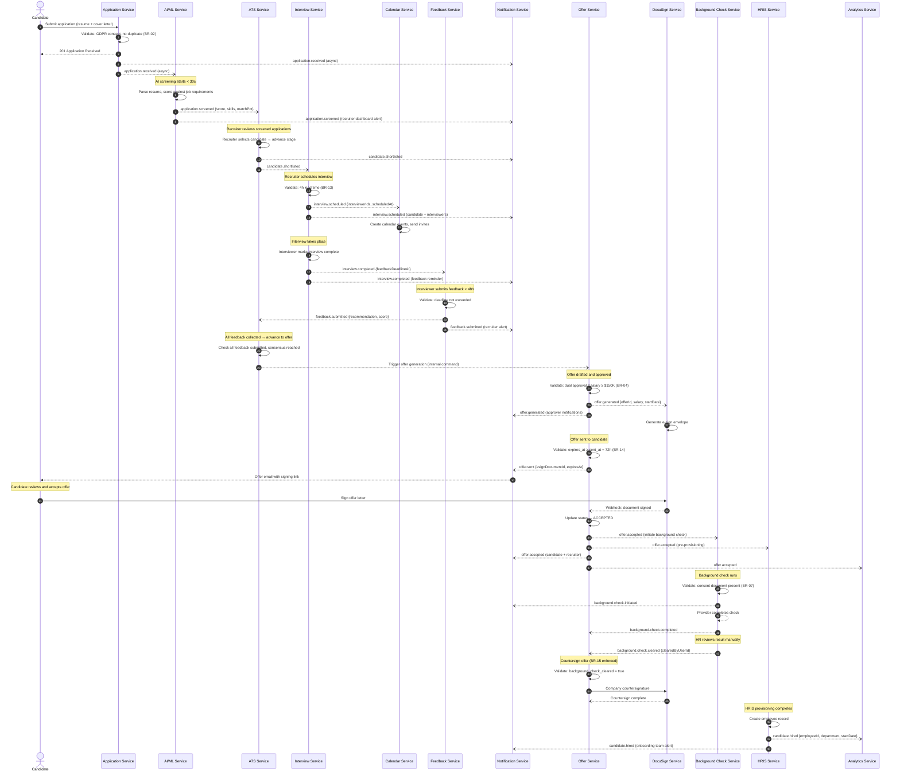

# Event Catalog — Job Board and Recruitment Platform

> **Version:** 1.0.0 | **Last Updated:** 2025-01-01 | **Owner:** Platform Engineering / Event Architecture Team  
> This document is the authoritative catalog of all domain events produced and consumed within the Job Board and Recruitment Platform. It defines event contracts, versioning strategy, publish/consumption sequences, and operational SLOs. All services must comply with the contracts defined here before deploying to production.

---

## Contract Conventions

### Event Envelope — CloudEvents Specification

All events on this platform conform to the [CloudEvents v1.0 specification](https://cloudevents.io/). Every message published to the event bus carries the following mandatory envelope fields before the domain-specific `data` payload:

| Attribute | Type | Required | Description |
|-----------|------|----------|-------------|
| `specversion` | String | Yes | Always `"1.0"` |
| `id` | String (UUID) | Yes | Globally unique event ID; used for idempotency and deduplication |
| `source` | URI | Yes | Originating service URI, e.g., `https://job-service.recruitment.internal/jobs` |
| `type` | String | Yes | Reverse-DNS event type, e.g., `io.recruitplatform.job.published` |
| `datacontenttype` | String | Yes | Always `"application/json"` |
| `dataschema` | URI | Yes | Schema Registry URL for the event payload version, e.g., `https://schema-registry.recruitment.internal/schemas/job.published/v1` |
| `time` | Timestamp (RFC3339) | Yes | ISO 8601 timestamp of when the event was emitted in UTC |
| `subject` | String | Yes | Primary resource identifier, e.g., the `jobId` or `applicationId` |
| `correlationid` | String (UUID) | No | Carries the originating HTTP request trace ID for distributed tracing |
| `causationid` | String (UUID) | No | ID of the event that caused this event (for event chains) |
| `partitionkey` | String | No | Used by the broker for topic partitioning; typically the `companyId` or `jobId` |

**Example Envelope:**
```json
{
  "specversion": "1.0",
  "id": "550e8400-e29b-41d4-a716-446655440000",
  "source": "https://job-service.recruitment.internal/jobs",
  "type": "io.recruitplatform.job.published",
  "datacontenttype": "application/json",
  "dataschema": "https://schema-registry.recruitment.internal/schemas/job.published/v1",
  "time": "2025-01-15T09:30:00Z",
  "subject": "job_7f3a9b2c-1d4e-4f5a-8b6c-9d0e1f2a3b4c",
  "correlationid": "req_1a2b3c4d-5e6f-7a8b-9c0d-1e2f3a4b5c6d",
  "data": { ... }
}
```

---

### Versioning Strategy

Events are versioned independently of the services that produce them. The versioning scheme follows **semantic versioning (MAJOR.MINOR)** applied at the schema level:

- **MAJOR version increment:** Breaking change — removing a field, changing a field's type, changing the event type string, altering the semantic meaning of an existing field. Consumers must migrate before the old MAJOR version is retired.
- **MINOR version increment:** Backwards-compatible addition — adding a new optional field, adding new enum values to an existing field.
- **PATCH changes:** Documentation corrections only; no schema registry entry created.

The active version is encoded in the `dataschema` URI path segment (`/v1`, `/v2`). Producers must publish only the latest MAJOR version in production. During migration windows, a **dual-publish** strategy is used: the producer emits both the old and new MAJOR versions simultaneously for a maximum of 90 days. After 90 days, the old version is deprecated and consumers must have migrated.

Version lifecycle:
1. **Draft:** Schema authored in the registry; no producers or consumers yet.
2. **Active:** Schema in production use.
3. **Deprecated:** A newer MAJOR version exists; dual-publish window is running. Consumers receive weekly automated deprecation warnings.
4. **Retired:** Schema removed from registry. Any producer still publishing to a retired schema version will have its messages routed to the Dead Letter Queue.

---

### Schema Registry

All event schemas are stored in the **internal Schema Registry** hosted at `https://schema-registry.recruitment.internal`. The registry is backed by [Confluent Schema Registry](https://docs.confluent.io/platform/current/schema-registry/) using JSON Schema as the schema format.

**Governance rules:**
- Every new event type requires a Pull Request to the `event-schemas` repository. The PR must be reviewed and approved by at least one member of the Platform Architecture Team and one consumer service team before the schema is promoted to Active.
- Schema compatibility mode is set to `BACKWARD_TRANSITIVE` by default, ensuring any new schema version is backwards-compatible with all previous versions within the same MAJOR.
- Producers must register their schema at service startup and validate against it before publishing. Failure to validate results in the message being dropped and an alert fired to the producing service's on-call.
- Consumers must specify the schema version(s) they support in their service manifest (`event-consumer.yaml`) to enable automated compatibility checking in CI pipelines.

---

### Backwards Compatibility Rules

The following changes are permitted without a MAJOR version bump:
- Adding new optional fields with non-null default representations in documentation.
- Adding new values to string fields that previously had no documented enumeration.
- Adding new optional nested objects.
- Expanding the length of string fields.

The following changes **always** require a MAJOR version bump:
- Removing any existing field.
- Renaming any existing field.
- Changing the data type of any field (e.g., string → integer).
- Changing a field from optional to required.
- Changing the event `type` string.
- Altering the documented semantic meaning of a field (even if the type is unchanged).

---

### Dead Letter Queue Handling

Every event topic has an associated **Dead Letter Queue (DLQ)** at `{topic-name}.dlq`. Messages are routed to the DLQ in the following scenarios:

1. **Schema validation failure:** Message does not conform to the registered schema for the declared `dataschema` version.
2. **Retired schema version:** Producer is publishing to a schema version that has been retired.
3. **Consumer processing failure after retries:** A consumer fails to process a message after exhausting its retry policy (see Operational SLOs section).
4. **Deserialization error:** Message payload cannot be deserialised.

**DLQ message envelope** adds the following additional fields to the original CloudEvents envelope:
- `dlq.reason`: One of `SCHEMA_VALIDATION_FAILED`, `RETIRED_SCHEMA`, `MAX_RETRIES_EXCEEDED`, `DESERIALIZATION_ERROR`.
- `dlq.originalTopic`: The original topic the message was published to.
- `dlq.failedAt`: RFC3339 timestamp of the final failure.
- `dlq.retryCount`: Number of consumer retry attempts before DLQ routing.
- `dlq.errorDetail`: Human-readable error message from the last failure.

DLQ messages are retained for 7 days. A Grafana dashboard monitors DLQ depth per topic; depth > 10 triggers a PagerDuty alert to the on-call engineering team. Replay tooling (`dlq-replay-cli`) allows authorised engineers to reprocess DLQ messages after the root cause is resolved.

---

## Domain Events

The following table lists all domain events published by the platform. Consumers listed are the authoritative subscribers; other services may subscribe in read-only analytical modes but must not act on these events without being listed here.

| Event Name | Producer | Consumers | Payload Fields | SLO |
|------------|----------|-----------|----------------|-----|
| `job.published` | Job Service | Integration Service, Notification Service | `jobId`, `companyId`, `title`, `location` {city, country, locationType}, `salary` {min, max, currency, disclosed}, `employmentType`, `experienceLevel`, `closesAt`, `requirementCount` | < 5 min to external board distribution |
| `job.updated` | Job Service | Integration Service, Search Service | `jobId`, `companyId`, `changedFields[]`, `updatedAt` | < 2 min for search index refresh |
| `job.closed` | Job Service | Integration Service, Notification Service, ATS Service | `jobId`, `companyId`, `closedAt`, `closedByUserId`, `activeApplicationCount` | < 1 min |
| `job.distributed` | Integration Service | Analytics Service, Job Service | `jobId`, `boardName`, `externalId`, `status` (QUEUED\|ACTIVE\|FAILED), `distributedAt`, `boardSpecificUrl` | < 1 min after distribution |
| `application.received` | Application Service | AI/ML Service, Notification Service | `applicationId`, `jobId`, `candidateId`, `resumeId`, `coverLetterId`, `source`, `submittedAt`, `gdprConsentGiven` | < 30 s for AI screening start |
| `application.screened` | AI/ML Service | ATS Service, Notification Service | `applicationId`, `score`, `extractedSkills[]`, `matchPercentage`, `screeningModelVersion`, `screenedAt` | < 30 s after AI model execution |
| `application.withdrawn` | Application Service | ATS Service, Notification Service | `applicationId`, `jobId`, `candidateId`, `withdrawnAt`, `reason` | < 1 min |
| `application.rejected` | ATS Service | Notification Service | `applicationId`, `jobId`, `candidateId`, `rejectionReason`, `rejectedAt`, `rejectedByUserId` | < 1 min |
| `candidate.shortlisted` | ATS Service | Notification Service, Interview Service | `candidateId`, `jobId`, `applicationId`, `pipelineStageId`, `shortlistedAt`, `shortlistedByUserId` | < 1 min |
| `candidate.stage.advanced` | ATS Service | Notification Service, Interview Service | `candidateId`, `applicationId`, `fromStageId`, `toStageId`, `advancedAt`, `advancedByUserId` | < 1 min |
| `interview.scheduled` | Interview Service | Calendar Service, Notification Service | `interviewId`, `applicationId`, `candidateId`, `interviewerIds[]`, `scheduledAt`, `durationMinutes`, `interviewType`, `videoLink`, `videoProvider`, `calendarEventId` | < 2 min for calendar sync |
| `interview.rescheduled` | Interview Service | Calendar Service, Notification Service | `interviewId`, `previousScheduledAt`, `newScheduledAt`, `rescheduledByUserId`, `reason` | < 2 min for calendar update |
| `interview.cancelled` | Interview Service | Calendar Service, Notification Service | `interviewId`, `cancelledAt`, `cancelledByUserId`, `reason` | < 1 min |
| `interview.completed` | Interview Service | Feedback Service, Notification Service | `interviewId`, `applicationId`, `completedAt`, `roundNumber`, `interviewType`, `feedbackDeadlineAt` | < 5 min |
| `interview.no_show` | Interview Service | ATS Service, Notification Service | `interviewId`, `applicationId`, `candidateId`, `scheduledAt`, `reportedByUserId` | < 1 min |
| `feedback.submitted` | Feedback Service | ATS Service, Notification Service | `feedbackId`, `interviewId`, `interviewerId`, `applicationId`, `recommendation`, `overallScore`, `isOverdue`, `submittedAt` | < 1 min |
| `feedback.overdue` | Feedback Service (scheduler) | Notification Service, HR Analytics Service | `feedbackId`, `interviewId`, `interviewerId`, `interviewerManagerId`, `deadlineAt`, `hoursOverdue` | < 15 min (scheduler granularity) |
| `offer.generated` | Offer Service | Notification Service, DocuSign Service | `offerId`, `candidateId`, `jobId`, `applicationId`, `baseSalary`, `offerCurrency`, `startDate`, `expiresAt`, `requiresDualApproval`, `generatedAt` | < 2 min for e-sign link generation |
| `offer.approved` | Offer Service | Notification Service | `offerId`, `approvalType` (SINGLE\|DUAL), `approvedBy[]`, `approvedAt` | < 1 min |
| `offer.sent` | Offer Service | Notification Service, DocuSign Service | `offerId`, `candidateId`, `sentAt`, `expiresAt`, `esignDocumentId` | < 2 min for signing link delivery |
| `offer.accepted` | Offer Service | HRIS Service, Background Check Service, Notification Service, Analytics Service | `offerId`, `candidateId`, `jobId`, `applicationId`, `acceptedAt`, `startDate`, `baseSalary`, `department`, `reportingToUserId` | < 5 min for background check initiation |
| `offer.declined` | Offer Service | ATS Service, Notification Service | `offerId`, `candidateId`, `declinedAt`, `reason`, `counterOffered` | < 1 min |
| `offer.expired` | Offer Service (scheduler) | ATS Service, Notification Service | `offerId`, `candidateId`, `expiredAt` | < 15 min (scheduler granularity) |
| `offer.revoked` | Offer Service | ATS Service, Notification Service, HRIS Service | `offerId`, `candidateId`, `revokedAt`, `revokedByUserId`, `reason` | < 1 min |
| `offer.negotiation.countered` | Offer Service | Notification Service | `offerId`, `negotiationId`, `candidateId`, `counterTerms` {salary, startDate, equity}, `counteredAt` | < 1 min |
| `background.check.initiated` | Background Check Service | Notification Service | `checkId`, `candidateId`, `offerId`, `provider`, `checkType`, `consentDocumentUrl`, `initiatedAt` | < 2 min |
| `background.check.completed` | Background Check Service | Offer Service, Notification Service | `checkId`, `candidateId`, `offerId`, `status` (CLEAR\|CONSIDER\|ADVERSE), `completedAt`, `requiresReview` | < 5 min after provider webhook |
| `background.check.cleared` | Background Check Service | Offer Service | `checkId`, `candidateId`, `offerId`, `clearedByUserId`, `clearedAt` | < 1 min |
| `candidate.hired` | HRIS Service | Analytics Service, Onboarding Service, Notification Service | `candidateId`, `jobId`, `offerId`, `applicationId`, `startDate`, `department`, `positionTitle`, `employeeId`, `hiredAt` | < 10 min for onboarding provisioning |
| `candidate.data.deleted` | GDPR Service | All Services | `candidateId`, `deletionType` (ERASURE_REQUEST\|RETENTION_EXPIRED), `requestedAt`, `completedAt`, `affectedEntities[]` | < 24 h for full cascade |
| `candidate.erasure.requested` | GDPR Service | Application Service, Resume Service, Interview Service, Offer Service, Feedback Service, HRIS Service | `candidateId`, `erasureRequestId`, `requestedAt`, `deadlineAt`, `requestMethod` (PORTAL\|EMAIL\|LEGAL) | < 1 h for service notification |
| `email.campaign.sent` | Notification Service | Analytics Service | `campaignId`, `templateId`, `recipientCount`, `jobId`, `sentAt`, `deliveryProvider` | < 5 min |
| `hiring.analytics.updated` | Analytics Service | BI/Reporting Service | `companyId`, `jobId`, `metricType`, `period`, `value`, `updatedAt` | < 30 min (batch aggregation) |

---

## Publish and Consumption Sequence

The following sequence diagram illustrates the canonical hiring funnel event flow — from initial application receipt through AI screening, shortlisting, interview scheduling, offer generation, acceptance, and HRIS sync.



### Sequence Notes

- Steps 1–5 complete within the synchronous HTTP request boundary; all downstream events are asynchronous.
- The AI screening fan-out (step 5 → 6) runs independently and does not block the application acknowledgement to the candidate.
- Calendar sync (step 15) uses a dedicated calendar integration adapter that bridges Google Calendar, Microsoft 365, and Apple Calendar via per-company OAuth2 credentials.
- The offer e-sign flow (steps 24–28) is webhook-driven; DocuSign posts to the Offer Service webhook endpoint on each signature event.
- HRIS provisioning (step 37) is idempotent; if the HRIS system is temporarily unavailable, `candidate.hired` is retried with exponential backoff up to 5 times over 2 hours.

---

## Operational SLOs

### SLO Targets Per Event

| Event Name | Publish Latency SLO | End-to-End Processing SLO | Availability Target | Error Budget (monthly) |
|------------|--------------------|--------------------------|--------------------|----------------------|
| `application.received` | p99 < 500 ms | < 30 s to AI screening start | 99.9% | 43.8 min/month |
| `application.screened` | p99 < 500 ms | < 30 s from model execution | 99.9% | 43.8 min/month |
| `candidate.shortlisted` | p99 < 200 ms | < 60 s | 99.9% | 43.8 min/month |
| `interview.scheduled` | p99 < 200 ms | < 2 min for calendar sync | 99.95% | 21.9 min/month |
| `interview.completed` | p99 < 200 ms | < 5 min for feedback record creation | 99.9% | 43.8 min/month |
| `feedback.submitted` | p99 < 200 ms | < 60 s | 99.9% | 43.8 min/month |
| `offer.generated` | p99 < 500 ms | < 2 min for e-sign link | 99.95% | 21.9 min/month |
| `offer.accepted` | p99 < 200 ms | < 5 min for BGC initiation | 99.99% | 4.4 min/month |
| `offer.declined` | p99 < 200 ms | < 60 s | 99.9% | 43.8 min/month |
| `candidate.hired` | p99 < 200 ms | < 10 min for HRIS sync | 99.99% | 4.4 min/month |
| `background.check.initiated` | p99 < 500 ms | < 2 min | 99.9% | 43.8 min/month |
| `candidate.data.deleted` | p99 < 1 s | < 24 h full cascade | 99.99% | 4.4 min/month |
| `job.published` | p99 < 500 ms | < 5 min to external boards | 99.9% | 43.8 min/month |
| `job.distributed` | p99 < 200 ms | < 60 s after distribution | 99.9% | 43.8 min/month |
| `hiring.analytics.updated` | p99 < 1 s | < 30 min (batch) | 99.5% | 3.6 h/month |

### Alerting Thresholds

| Metric | Warning Threshold | Critical Threshold | Escalation |
|--------|-------------------|-------------------|------------|
| Publish latency p99 | > 1 × SLO | > 3 × SLO | On-call engineer (PagerDuty P2 → P1) |
| End-to-end processing time | > 2 × SLO | > 5 × SLO | On-call engineer + service owner |
| DLQ depth (any topic) | > 10 messages | > 50 messages | On-call engineer (P2); > 50 = P1 |
| Consumer lag (Kafka) | > 1,000 messages | > 10,000 messages | Platform team (P2 → P1) |
| Schema validation error rate | > 0.1% of messages | > 1% of messages | Schema Registry owner + producer team |
| Event loss rate | > 0% | Any confirmed loss | Immediate P0; incident declared |
| `candidate.data.deleted` SLO breach | < 24 h warning | > 28 days with incomplete deletion | DPO + Engineering VP (GDPR obligation) |

### Retry Policies Per Event

| Event / Consumer Pair | Initial Retry Delay | Backoff Strategy | Max Retries | Max Retry Window | DLQ on Exhaustion |
|-----------------------|--------------------|-----------------|-----------:|-----------------|-------------------|
| `application.received` → AI/ML Service | 1 s | Exponential × 2 | 5 | 2 min | Yes |
| `application.screened` → ATS Service | 500 ms | Exponential × 2 | 5 | 5 min | Yes |
| `interview.scheduled` → Calendar Service | 2 s | Exponential × 1.5 | 10 | 30 min | Yes |
| `offer.accepted` → HRIS Service | 5 s | Exponential × 2 | 10 | 2 h | Yes |
| `offer.accepted` → Background Check Service | 5 s | Exponential × 2 | 5 | 30 min | Yes |
| `candidate.hired` → Onboarding Service | 10 s | Exponential × 2 | 10 | 4 h | Yes |
| `candidate.erasure.requested` → all consumers | 30 s | Linear (fixed) | 20 | 72 h | Yes — monitored by GDPR Service |
| `job.published` → Integration Service | 5 s | Exponential × 2 | 5 | 10 min | Yes |
| `feedback.overdue` → Notification Service | 1 min | Linear (fixed) | 3 | 1 h | Yes |
| `background.check.completed` → Offer Service | 5 s | Exponential × 2 | 5 | 30 min | Yes |
| All events → Analytics Service | 30 s | Exponential × 2 | 10 | 6 h | Yes — non-critical, can lag |

**Notes on retry policy:**
- Retry delays are calculated from the previous attempt's failure timestamp, not the original publish time.
- Idempotency is the responsibility of the consumer. All consumers must implement idempotent message processing using the CloudEvents `id` field as the idempotency key.
- A consumer that is restarted mid-retry resumes from the last successfully committed offset; it does not restart retries from scratch.
- Jitter of ±10% is applied to all exponential backoff delays to prevent thundering-herd retry storms.
- Events involving GDPR data deletion (`candidate.erasure.requested`, `candidate.data.deleted`) use a **linear retry** policy with extended windows and are monitored with a dedicated SLO dashboard separate from normal business event dashboards.

### Observability Requirements

Each event topic must have the following observability instrumentation in place before being promoted to production:

1. **Publish metrics:** `events_published_total{type, source}`, `event_publish_latency_ms{type}` (histogram, p50/p95/p99)
2. **Consumer metrics:** `events_consumed_total{type, consumer}`, `events_processing_duration_ms{type, consumer}`, `events_failed_total{type, consumer, reason}`
3. **Consumer lag metric:** `consumer_group_lag{topic, partition, consumer_group}`
4. **DLQ metrics:** `dlq_messages_total{topic, reason}`, `dlq_depth{topic}`
5. **Schema validation metrics:** `schema_validation_errors_total{type, version, reason}`

All metrics are exposed via Prometheus endpoints and visualised in the **Event Architecture** Grafana dashboard. Runbooks for all alert rules are maintained in the internal wiki at `https://wiki.recruitment.internal/runbooks/event-architecture`.
