# System Context Diagram — Job Board and Recruitment Platform

---

## 1. System Boundary Definition

### Inside the Platform (In-Scope)

The **Job Board and Recruitment Platform** is a cloud-native SaaS application responsible for the complete hiring lifecycle. The following capabilities are owned and operated within the system boundary:

- **Job Management Service** — Authoring, approving, publishing, and closing job postings; job taxonomy management.
- **Candidate Portal** — Public-facing job board, application submission, candidate self-service status tracking.
- **ATS Pipeline Engine** — Drag-and-drop Kanban pipeline, stage configuration, bulk actions, auto-advance rule execution.
- **AI Screening Service** — Resume text extraction, OpenAI GPT-4o-powered skill parsing, job-candidate match scoring, automated tagging.
- **Interview Orchestration Service** — Slot generation, calendar availability aggregation, scheduling link generation, interview record management.
- **Scorecard Service** — Competency-based scorecard templates, submission collection, aggregate score computation, SLA enforcement.
- **Offer Management Service** — Offer letter templating, compensation validation, PDF generation, approval workflows.
- **Background Check Orchestrator** — Checkr/Sterling integration, consent tracking, result processing, adverse action workflows.
- **Campaign and Sourcing Engine** — Email campaign builder, candidate segment evaluation, send scheduling, engagement tracking.
- **Notification Hub** — Unified delivery router across email (SendGrid), SMS (Twilio), push, and in-app channels.
- **Analytics and Reporting Engine** — Real-time hiring funnel, diversity metrics, time-to-hire KPIs, custom report builder.
- **Identity and Access Control** — JWT-based auth, RBAC, OAuth integrations, multi-tenancy isolation.
- **Audit Trail Service** — Immutable event log for all user and system actions.
- **Tenant Configuration Service** — Per-tenant pipeline templates, branding, compensation bands, RBAC definitions.

### Outside the Platform (Out-of-Scope)

- External job board ranking algorithms and candidate-matching logic on LinkedIn/Indeed/Glassdoor.
- Payroll processing and employee record management (owned by Workday/BambooHR).
- IT provisioning workflows triggered post-hire (downstream from the platform).
- Background check investigation procedures (owned by Checkr/Sterling).
- Video call quality and infrastructure (owned by Zoom/Microsoft Teams).
- Document storage for completed signed offer letters post-completion (archived to HR system).

---

## 2. Internal Actors

| Actor | Role | Interaction Summary |
|---|---|---|
| **Recruiter** | Core platform power user responsible for end-to-end job pipeline management | Creates jobs, manages ATS pipeline, schedules interviews, runs sourcing campaigns, reviews AI scores, generates offers |
| **Hiring Manager** | Business stakeholder who owns the headcount need | Submits requisitions, reviews shortlisted candidates, participates in interviews, submits scorecards, approves final hire decisions |
| **Candidate** | External job seeker using the public career portal | Discovers and applies to jobs, uploads resume, self-schedules interviews, tracks application status, signs offer letters |
| **HR Admin** | Governance and compliance owner | Approves job postings and offers, configures pipeline templates and RBAC, generates compliance and diversity reports |
| **Executive / CHRO** | Strategic decision-maker | Views aggregate analytics dashboards: time-to-hire KPIs, diversity metrics, offer acceptance rates, cost-per-hire |

---

## 3. External Systems

| # | External System | Category | Direction | Data Exchanged |
|---|---|---|---|---|
| 1 | **LinkedIn Jobs API** | Job Board Syndication | Outbound | Job posting data, job closure events; Inbound: application source attribution, click metrics |
| 2 | **Indeed Publisher API** | Job Board Syndication | Outbound | Job XML feed or REST payload; Inbound: application redirect tokens, impression counts |
| 3 | **Glassdoor Jobs API** | Job Board Syndication | Outbound | Job posting metadata; Inbound: application referrals |
| 4 | **ZipRecruiter API** | Job Board Syndication | Outbound | Job posting data; Inbound: click-through events via webhook |
| 5 | **Google Calendar API** | Calendar Integration | Bidirectional | Free/busy availability queries (Outbound); Calendar event creation for interviews (Outbound); Event update/delete (Outbound) |
| 6 | **Microsoft Graph API (Outlook)** | Calendar Integration | Bidirectional | Free/busy availability queries; Calendar event creation, updates; O365 user lookup |
| 7 | **Zoom Meetings API** | Video Conferencing | Outbound | Meeting creation with password, join URL, host URL; meeting deletion on cancellation |
| 8 | **Microsoft Teams Graph API** | Video Conferencing | Outbound | Online meeting creation; Teams join link; meeting cancellation |
| 9 | **DocuSign eSignature API** | Document Signing | Bidirectional | Envelope creation with PDF attachment (Outbound); `envelope-completed` webhook (Inbound); Signed document download (Inbound) |
| 10 | **Checkr API** | Background Checks | Bidirectional | Invitation creation with candidate PII (Outbound); `report.completed` / `report.disputed` webhooks (Inbound); Report fetch (Inbound) |
| 11 | **Sterling (Background Checks)** | Background Checks | Bidirectional | Order creation API (Outbound); Status webhook (Inbound) — fallback to Checkr |
| 12 | **SendGrid API** | Email Delivery | Outbound | Transactional email (confirmations, scorecards, offers); Marketing email campaigns; Bounce/open/click events (Inbound webhook) |
| 13 | **Amazon SES** | Email Delivery | Outbound | Fallback transactional email delivery; Bounce and complaint notifications (Inbound SNS) |
| 14 | **Twilio SMS API** | SMS Notifications | Outbound | Interview reminders, offer notifications, background check status via SMS |
| 15 | **OpenAI API (GPT-4o)** | AI / NLP | Outbound | Resume text → structured JSON extraction; Job-candidate embedding similarity queries |
| 16 | **Cohere Embed API** | AI / NLP | Outbound | Semantic embedding generation for resume-to-job matching (fallback to OpenAI) |
| 17 | **Workday HCM API** | HRIS / Onboarding | Outbound | New-hire record creation (name, job title, department, manager, start date, compensation) post offer acceptance |
| 18 | **BambooHR API** | HRIS / Onboarding | Outbound | New employee profile creation; alternative to Workday for SMB customers |
| 19 | **SAP SuccessFactors API** | HRIS / Onboarding | Outbound | Onboarding module integration for enterprise customers |
| 20 | **Stripe API** | Subscription Billing | Bidirectional | Subscription plan creation (Outbound); Invoice generation; Webhook for payment success/failure (Inbound) |
| 21 | **Auth0 / AWS Cognito** | Identity Provider | Bidirectional | JWT issuance, OIDC token validation; User provisioning via SCIM; Social login (Google, LinkedIn) brokerage |
| 22 | **Google Analytics 4 / Mixpanel** | Product Analytics | Outbound | Page view events, funnel step completions, feature usage events from the candidate portal |

---

## 4. System Context Diagram

```mermaid
flowchart TB
    %% ── Style definitions ────────────────────────────────────────────────────
    classDef actor fill:#1E88E5,color:#fff,stroke:#1565C0,stroke-width:2px
    classDef mainSystem fill:#0D47A1,color:#fff,stroke:#01579B,stroke-width:3px
    classDef extSystem fill:#546E7A,color:#fff,stroke:#37474F,stroke-width:1px
    classDef jobBoard fill:#2E7D32,color:#fff,stroke:#1B5E20,stroke-width:1px
    classDef calendar fill:#6A1B9A,color:#fff,stroke:#4A148C,stroke-width:1px
    classDef ai fill:#E65100,color:#fff,stroke:#BF360C,stroke-width:1px
    classDef hris fill:#00695C,color:#fff,stroke:#004D40,stroke-width:1px

    %% ── Internal Actors ─────────────────────────────────────────────────────
    REC["👤 Recruiter"]:::actor
    HM["👤 Hiring Manager"]:::actor
    CAN["👤 Candidate"]:::actor
    HRA["👤 HR Admin"]:::actor
    EXE["👤 Executive / CHRO"]:::actor

    %% ── Core System ─────────────────────────────────────────────────────────
    CORE["🏢 Job Board &\nRecruitment Platform\n(NestJS · React · FastAPI\nAWS · Prisma · Kafka)"]:::mainSystem

    %% ── Job Boards ──────────────────────────────────────────────────────────
    LI["🔗 LinkedIn\nJobs API"]:::jobBoard
    IN["🔗 Indeed\nPublisher API"]:::jobBoard
    GD["🔗 Glassdoor\nJobs API"]:::jobBoard
    ZR["🔗 ZipRecruiter\nAPI"]:::jobBoard

    %% ── Calendar & Video ─────────────────────────────────────────────────────
    GCal["📅 Google\nCalendar API"]:::calendar
    OL["📅 Microsoft Graph\n(Outlook)"]:::calendar
    ZM["🎥 Zoom\nMeetings API"]:::calendar
    TMS["🎥 Microsoft\nTeams API"]:::calendar

    %% ── Signing & Checks ─────────────────────────────────────────────────────
    DS["✍️ DocuSign\neSignature API"]:::extSystem
    CHK["🔍 Checkr\nBackground Check"]:::extSystem
    STR["🔍 Sterling\nBackground Check"]:::extSystem

    %% ── Messaging ────────────────────────────────────────────────────────────
    SG["📧 SendGrid\nEmail API"]:::extSystem
    SES["📧 Amazon SES\n(Fallback Email)"]:::extSystem
    TWI["📱 Twilio\nSMS API"]:::extSystem

    %% ── AI / ML ──────────────────────────────────────────────────────────────
    OAI["🤖 OpenAI API\n(GPT-4o)"]:::ai
    COH["🤖 Cohere\nEmbed API"]:::ai

    %% ── HRIS ─────────────────────────────────────────────────────────────────
    WKD["🏛️ Workday\nHCM API"]:::hris
    BHR["🏛️ BambooHR\nAPI"]:::hris
    SF["🏛️ SAP\nSuccessFactors"]:::hris

    %% ── Identity & Analytics ─────────────────────────────────────────────────
    AUTH["🔑 Auth0 /\nAWS Cognito"]:::extSystem
    BIL["💳 Stripe\nBilling API"]:::extSystem
    GA["📊 Google Analytics\n/ Mixpanel"]:::extSystem

    %% ── Actor → System flows ─────────────────────────────────────────────────
    REC -->|"Manage jobs, pipeline,\noffers, campaigns"| CORE
    HM -->|"Review candidates,\nsubmit scorecards"| CORE
    CAN -->|"Apply, track status,\nschedule, sign offer"| CORE
    HRA -->|"Approve, configure,\ngenerate reports"| CORE
    EXE -->|"View analytics\ndashboards"| CORE

    %% ── System → Job Boards ──────────────────────────────────────────────────
    CORE -->|"Publish job postings\n(REST/XML)"| LI
    CORE -->|"Publish job postings"| IN
    CORE -->|"Publish job postings"| GD
    CORE -->|"Publish job postings"| ZR
    LI -->|"Application attribution\n& click webhooks"| CORE
    IN -->|"Application redirects"| CORE

    %% ── System → Calendar & Video ────────────────────────────────────────────
    CORE -->|"Free/busy queries\n& event creation"| GCal
    CORE -->|"Free/busy queries\n& event creation"| OL
    CORE -->|"Create meeting\n& get join URL"| ZM
    CORE -->|"Create online\nmeeting"| TMS

    %% ── System → Signing & Checks ────────────────────────────────────────────
    CORE -->|"Create envelope\n& send offer PDF"| DS
    DS -->|"envelope-completed\nwebhook"| CORE
    CORE -->|"Initiate background\ncheck invitation"| CHK
    CHK -->|"report.completed\nwebhook"| CORE
    CORE -->|"Fallback check order"| STR

    %% ── System → Messaging ───────────────────────────────────────────────────
    CORE -->|"Transactional &\ncampaign emails"| SG
    SG -->|"Bounce/open/click\nevents"| CORE
    CORE -->|"Fallback email\ndelivery"| SES
    CORE -->|"Interview reminders\nvia SMS"| TWI

    %% ── System → AI ──────────────────────────────────────────────────────────
    CORE -->|"Resume text for\nparsing & scoring"| OAI
    OAI -->|"Structured JSON\ncandidate profile"| CORE
    CORE -->|"Text embedding\nfor semantic search"| COH

    %% ── System → HRIS ────────────────────────────────────────────────────────
    CORE -->|"New-hire record\ncreation"| WKD
    CORE -->|"Employee profile\ncreation (SMB)"| BHR
    CORE -->|"Onboarding module\nintegration (Ent)"| SF

    %% ── System → Identity & Billing ──────────────────────────────────────────
    CORE <-->|"JWT issuance &\ntoken validation"| AUTH
    CORE <-->|"Subscription billing\n& invoicing"| BIL
    CORE -->|"Portal usage events"| GA
```

---

## 5. Data Flows Narrative

### 5.1 LinkedIn Jobs API
- **Direction:** Primarily Outbound; Inbound for attribution events.
- **Protocol:** HTTPS REST (LinkedIn Jobs Posting API v2).
- **Data Exchanged (Outbound):** Job title, description (HTML), location, employment type, salary range, application URL, job ID. **Data Exchanged (Inbound):** `applyStarted`, `applicationSubmitted` events carrying a `trackingToken`, impression counts.
- **Frequency:** On every job publish and close event; attribution webhooks are near-real-time.
- **SLA:** Platform guarantees job publication on LinkedIn within 15 minutes of approval. Attribution data has no SLA guarantee from LinkedIn.

### 5.2 Google Calendar API / Microsoft Graph API
- **Direction:** Bidirectional.
- **Protocol:** HTTPS REST with OAuth 2.0 (user-delegated tokens per interviewer).
- **Data Exchanged (Outbound):** `freeBusy` query for a list of calendar IDs over a time window; `events.insert` with attendee list, title, description, location (Zoom link), time zone. **Data Exchanged (Inbound):** Free/busy availability arrays; created event ID for reference.
- **Frequency:** Per interview scheduling action (free/busy) and once per interview creation/update/cancellation.
- **SLA:** Calendar API calls are synchronous; platform enforces a 5-second timeout. Free/busy queries for up to 10 users in a single batched API call.

### 5.3 Zoom Meetings API
- **Direction:** Outbound.
- **Protocol:** HTTPS REST (Zoom Video SDK v2, Server-to-Server OAuth app).
- **Data Exchanged:** Meeting topic, start time, duration, password, registration settings. Response: `join_url`, `start_url`, `meeting_id`.
- **Frequency:** One API call per interview creation; one DELETE call per cancellation.
- **SLA:** Zoom API calls complete within 2 seconds; failure triggers Microsoft Teams fallback.

### 5.4 DocuSign eSignature API
- **Direction:** Bidirectional.
- **Protocol:** HTTPS REST (DocuSign eSignature REST API v2.1). Webhook via HMAC-signed `connect` listener.
- **Data Exchanged (Outbound):** Envelope definition (PDF document bytes, recipient email/name, tab anchor positions). **Data Exchanged (Inbound):** `envelope-sent`, `envelope-viewed`, `envelope-completed`, `envelope-voided` events with signed document download URL.
- **Frequency:** Once per offer letter; additional calls for reminders and voids.
- **SLA:** Envelope creation < 5 seconds; signed document available via webhook within seconds of completion.

### 5.5 Checkr Background Check API
- **Direction:** Bidirectional.
- **Protocol:** HTTPS REST (Checkr API v1). Webhooks via HTTPS POST with shared secret validation.
- **Data Exchanged (Outbound):** Candidate object (name, email, DOB, SSN — transmitted but not stored locally), package ID, work location. **Data Exchanged (Inbound):** `report.completed`, `report.disputed`, `report.upgraded` events with report summary (status: CLEAR/CONSIDER, check-level results).
- **Frequency:** Initiated once per hired candidate; status webhooks received over 2–10 business days.
- **SLA:** Checkr SLA for standard checks: 3–5 business days; platform escalates after 15 business days.

### 5.6 SendGrid API
- **Direction:** Primarily Outbound; Inbound for event webhooks.
- **Protocol:** HTTPS REST (SendGrid Web API v3); Event Webhook via HTTPS POST.
- **Data Exchanged (Outbound):** Personalised transactional emails (application confirmation, interview invite, offer letter notification) using dynamic templates; bulk campaign emails for sourcing. **Data Exchanged (Inbound):** Open, click, bounce, spam-report, unsubscribe events with message ID and recipient.
- **Frequency:** Transactional: per user action (high burst during application peaks). Campaign: scheduled (up to 100,000 recipients per send).
- **SLA:** Transactional delivery within 60 seconds; bounce events propagated within 5 minutes.

### 5.7 Twilio SMS API
- **Direction:** Outbound.
- **Protocol:** HTTPS REST (Twilio Programmable Messaging API).
- **Data Exchanged:** SMS body (interview reminder with date/time and join link), from number (platform Twilio number), to number (candidate mobile).
- **Frequency:** 2 reminders per scheduled interview (24h before, 1h before); opt-in only.
- **SLA:** Twilio guarantees < 1-second API acknowledgement; delivery speed dependent on carrier.

### 5.8 OpenAI API (GPT-4o)
- **Direction:** Outbound (request/response).
- **Protocol:** HTTPS REST (OpenAI Chat Completions API).
- **Data Exchanged:** Resume plain text (sanitised to remove contact PII before sending) + structured prompt. Response: JSON object conforming to the defined schema (skills, experience entries, education entries).
- **Frequency:** Once per resume upload; once per job-candidate re-scoring trigger.
- **SLA:** Platform enforces a 30-second timeout per API call. Rate limit: 500 RPM on Tier 4 plan; exponential back-off on 429s.

### 5.9 Workday HCM API
- **Direction:** Outbound.
- **Protocol:** HTTPS REST (Workday REST API v38) or SOAP (Workday Web Services) depending on customer configuration.
- **Data Exchanged:** Worker profile: first name, last name, preferred name, email, phone, job title, department, position ID, manager worker ID, start date, compensation grade, pay rate, employment type, work location.
- **Frequency:** Once per accepted and cleared candidate (background check complete).
- **SLA:** Workday API calls complete within 10 seconds; failure triggers a retry queue (3 attempts, 1-hour intervals).

### 5.10 Auth0 / AWS Cognito
- **Direction:** Bidirectional.
- **Protocol:** OpenID Connect (OIDC) / OAuth 2.0. SCIM 2.0 for user provisioning.
- **Data Exchanged:** JWT ID tokens and access tokens (Inbound to platform); user attributes (sub, email, name, roles via custom claims). SCIM: user create/update/deactivate events.
- **Frequency:** Per login session and token refresh cycle (every 15 minutes for access tokens).
- **SLA:** Token validation is local (JWT signature verification); Auth0 availability SLA is 99.9%.

### 5.11 Stripe Billing API
- **Direction:** Bidirectional.
- **Protocol:** HTTPS REST (Stripe API v2023-10-16). Webhooks via HTTPS POST with Stripe-Signature HMAC verification.
- **Data Exchanged (Outbound):** Customer object creation, subscription creation with plan ID, invoice item creation. **Data Exchanged (Inbound):** `payment_intent.succeeded`, `invoice.payment_failed`, `customer.subscription.deleted` events.
- **Frequency:** Per subscription lifecycle event (monthly billing cycle); webhooks are near-real-time.
- **SLA:** Payment processing SLA per Stripe's terms. Platform disables job publishing if subscription lapses after a 7-day grace period.

### 5.12 Google Analytics 4 / Mixpanel
- **Direction:** Outbound.
- **Protocol:** HTTPS (GA4 Measurement Protocol; Mixpanel HTTP API).
- **Data Exchanged:** Anonymised event data from the candidate portal: `page_view`, `job_search`, `job_view`, `application_started`, `application_completed`, `funnel_drop`. No PII is transmitted; candidate ID is hashed.
- **Frequency:** Per user interaction on the candidate portal; batched and sent on page unload.
- **SLA:** Analytics are best-effort; data may have up to 24-hour processing latency in GA4.

---

## 6. Assumptions and Constraints

- **Assumption 1:** All external job board API credentials (LinkedIn, Indeed, Glassdoor, ZipRecruiter) are provisioned per tenant and stored in AWS Secrets Manager. Platform administrators are responsible for obtaining and renewing API access.
- **Assumption 2:** Google Calendar and Microsoft Outlook integrations require individual OAuth consent from each user (interviewer). The platform cannot access calendar data without explicit per-user authorisation; a user who has not connected their calendar will be flagged in the scheduling UI.
- **Assumption 3:** DocuSign accounts must be provisioned by the customer at the Enterprise plan or above to support the API access and HMAC-signed webhooks required by this integration.
- **Assumption 4:** Checkr operates as the primary background check provider; Sterling is configured only when a customer's existing contract mandates it. The platform supports one active background check provider per tenant at a time.
- **Assumption 5:** OpenAI API usage is metered and billed separately. At scale (>1,000 resumes/day), the platform switches to batch processing via the OpenAI Batch API to reduce costs by up to 50%.
- **Assumption 6:** Workday, BambooHR, and SAP SuccessFactors integrations are available only on the Enterprise subscription tier. Customers on lower tiers receive a CSV export for manual HRIS upload.
- **Assumption 7:** Twilio SMS notifications are opt-in only; candidates who do not provide a mobile number or have not consented to SMS will receive only email notifications.
- **Assumption 8:** The platform assumes internet connectivity and availability of all external APIs. Degraded-mode behaviour (e.g., manual calendar invite text, SendGrid → Amazon SES fallback) is defined for each critical path integration.
- **Assumption 9:** All webhook endpoints exposed by the platform are protected by shared-secret or HMAC signature validation (DocuSign Connect HMAC, Stripe-Signature, Checkr webhook secret) to prevent spoofed events.
- **Assumption 10:** Google Analytics and Mixpanel integrations are subject to candidate portal privacy policy and GDPR consent; analytics tracking is disabled for EU-resident candidates until explicit cookie consent is granted.
