# Use Case Diagram — Job Board and Recruitment Platform

## 1. Actors

### 1.1 Recruiter
The Recruiter is the primary power user of the platform. They own the end-to-end hiring workflow for one or more open positions. Responsibilities include authoring job descriptions, configuring screening questions, managing the ATS pipeline, reviewing AI-scored applications, scheduling interviews, coordinating with hiring managers, preparing offer letters, and running email sourcing campaigns. Recruiters hold elevated permissions within their assigned job requisitions and interact with every major subsystem of the platform.

### 1.2 Hiring Manager
The Hiring Manager is a business stakeholder who initiates the need to hire by submitting a job requisition. Once candidates reach the shortlist stage, the Hiring Manager reviews candidate profiles, participates in panel interviews, submits structured scorecards, and makes or influences the final hire/no-hire decision. They have read access to pipeline analytics for their own roles but cannot modify job postings or pipeline configuration.

### 1.3 Candidate
The Candidate is the external job seeker who interacts with the public-facing job board. They create an account (or apply as a guest), search and filter job listings, submit applications with resume uploads, answer custom screening questions, self-schedule interviews from recruiter-proposed time slots, track their application status in a candidate portal, and ultimately receive, negotiate, and digitally sign offer letters. The candidate also completes background check consent forms when prompted.

### 1.4 HR Admin
The HR Admin is the compliance and governance owner of the platform. They approve new job postings before publication, configure ATS pipeline templates and stage definitions, manage role-based access control (RBAC) for all users, approve compensation bands in offer letters, and generate compliance and diversity reports for regulatory purposes. HR Admins have platform-wide visibility across all departments and job families.

### 1.5 Executive / CHRO
The Executive or Chief Human Resources Officer consumes aggregated, read-only analytics dashboards. They monitor top-level KPIs such as time-to-hire, offer acceptance rate, diversity funnel metrics, cost-per-hire, and sourcing channel effectiveness. They do not perform operational actions but may trigger ad-hoc report exports or set high-level hiring targets that influence pipeline SLAs.

### 1.6 System (Automated)
The System actor represents all automated, non-human processes within the platform. This includes the AI resume parsing service (powered by OpenAI GPT-4o and FastAPI microservice), the job-candidate matching scorer, scheduled email campaign dispatcher, SLA deadline enforcement engine (reminds interviewers to submit scorecards), auto-advance rules that move candidates between pipeline stages based on score thresholds, and notification delivery across email, SMS, and in-app channels.

### 1.7 External Job Boards
Represents the external job distribution networks — LinkedIn, Indeed, Glassdoor, and ZipRecruiter — that receive syndicated job postings from the platform via their respective publishing APIs. These actors consume job data and return click-through and application-source attribution data.

### 1.8 Background Check Provider
Represents Checkr (primary) and Sterling (fallback) background check services. The platform sends candidate PII and check-type parameters; the provider sends email invitations to candidates, performs criminal, employment, and education verification, and returns structured results via webhook callbacks.

---

## 2. Use Case Inventory

### 2.1 Job Management

| ID     | Use Case                  | Primary Actor   | Secondary Actors           |
|--------|---------------------------|-----------------|----------------------------|
| UC-01  | Create Job Draft           | Recruiter       | Hiring Manager             |
| UC-02  | Submit Job for Approval    | Recruiter       | HR Admin                   |
| UC-03  | Approve / Reject Job       | HR Admin        | Recruiter                  |
| UC-04  | Publish Job                | System          | Recruiter, External Boards |
| UC-05  | Pause Job Posting          | Recruiter       | HR Admin                   |
| UC-06  | Close Job                  | Recruiter       | HR Admin, System           |
| UC-07  | Syndicate to Job Boards    | System          | External Job Boards        |
| UC-08  | Clone Existing Job         | Recruiter       | —                          |

### 2.2 Candidate & Application

| ID     | Use Case                        | Primary Actor | Secondary Actors   |
|--------|---------------------------------|---------------|--------------------|
| UC-09  | Apply for Job                   | Candidate     | System             |
| UC-10  | Upload Resume                   | Candidate     | System             |
| UC-11  | Answer Screening Questions      | Candidate     | —                  |
| UC-12  | Track Application Status        | Candidate     | System             |
| UC-13  | Withdraw Application            | Candidate     | System, Recruiter  |

### 2.3 ATS Pipeline

| ID     | Use Case                        | Primary Actor | Secondary Actors      |
|--------|---------------------------------|---------------|-----------------------|
| UC-14  | Configure Pipeline Stages       | HR Admin      | Recruiter             |
| UC-15  | Move Candidate Through Pipeline | Recruiter     | Hiring Manager        |
| UC-16  | Bulk Move Candidates            | Recruiter     | —                     |
| UC-17  | Add Tags to Candidate           | Recruiter     | Hiring Manager        |
| UC-18  | Set Auto-Advance Rules          | HR Admin      | Recruiter             |
| UC-19  | Archive Rejected Candidate      | System        | Recruiter             |

### 2.4 Resume & AI Screening

| ID     | Use Case                        | Primary Actor | Secondary Actors   |
|--------|---------------------------------|---------------|--------------------|
| UC-20  | Parse Resume (AI)               | System        | —                  |
| UC-21  | Score Resume Against Job        | System        | —                  |
| UC-22  | Review AI Score                 | Recruiter     | Hiring Manager     |
| UC-23  | Override AI Decision            | Recruiter     | HR Admin           |
| UC-24  | Flag Candidate for Review       | System        | Recruiter          |

### 2.5 Interview Management

| ID     | Use Case                        | Primary Actor | Secondary Actors               |
|--------|---------------------------------|---------------|--------------------------------|
| UC-25  | Schedule Interview              | Recruiter     | Candidate, System              |
| UC-26  | Send Calendar Invites           | System        | Google Calendar, Outlook       |
| UC-27  | Generate Video Conference Link  | System        | Zoom, Microsoft Teams          |
| UC-28  | Join Video Interview            | Candidate     | Interviewer                    |
| UC-29  | Submit Interview Scorecard      | Hiring Manager| Recruiter                      |
| UC-30  | Request Additional Round        | Hiring Manager| Recruiter                      |
| UC-31  | Enforce Scorecard SLA           | System        | Hiring Manager                 |

### 2.6 Offer Management

| ID     | Use Case                        | Primary Actor | Secondary Actors        |
|--------|---------------------------------|---------------|-------------------------|
| UC-32  | Generate Offer Letter           | Recruiter     | System                  |
| UC-33  | Route Offer for Approval        | Recruiter     | HR Admin, Hiring Manager|
| UC-34  | Send Offer via DocuSign         | System        | DocuSign                |
| UC-35  | Negotiate Offer Terms           | Candidate     | Recruiter               |
| UC-36  | Accept Offer                    | Candidate     | System, DocuSign        |
| UC-37  | Decline Offer                   | Candidate     | Recruiter               |

### 2.7 Background Checks

| ID     | Use Case                         | Primary Actor | Secondary Actors           |
|--------|----------------------------------|---------------|----------------------------|
| UC-38  | Initiate Background Check        | Recruiter     | Checkr, System             |
| UC-39  | Monitor Background Check Status  | Recruiter     | System                     |
| UC-40  | Receive Check Results (webhook)  | System        | Checkr                     |
| UC-41  | Review Background Check Results  | HR Admin      | Recruiter                  |
| UC-42  | Clear Candidate                  | HR Admin      | System                     |
| UC-43  | Flag Candidate (adverse action)  | HR Admin      | System, Recruiter          |

### 2.8 Sourcing & Email Campaigns

| ID     | Use Case                         | Primary Actor | Secondary Actors   |
|--------|----------------------------------|---------------|--------------------|
| UC-44  | Create Email Campaign            | Recruiter     | HR Admin           |
| UC-45  | Define Candidate Segments        | Recruiter     | System             |
| UC-46  | Send Campaign via SendGrid       | System        | SendGrid           |
| UC-47  | Track Open/Click Rates           | Recruiter     | System             |
| UC-48  | Unsubscribe / GDPR Opt-Out       | Candidate     | System             |

### 2.9 Analytics & Reporting

| ID     | Use Case                         | Primary Actor    | Secondary Actors |
|--------|----------------------------------|------------------|------------------|
| UC-49  | View Hiring Funnel Analytics     | Executive / CHRO | HR Admin         |
| UC-50  | View Diversity Metrics           | HR Admin         | Executive / CHRO |
| UC-51  | View Time-to-Hire KPIs           | Executive / CHRO | HR Admin         |
| UC-52  | Export Reports (CSV/PDF)         | HR Admin         | Executive / CHRO |
| UC-53  | View Source Effectiveness        | Recruiter        | HR Admin         |

---

## 3. Use Case Relationships

### Includes (mandatory sub-behaviour)
- UC-09 **Apply for Job** `<<includes>>` UC-10 **Upload Resume**
- UC-09 **Apply for Job** `<<includes>>` UC-11 **Answer Screening Questions**
- UC-04 **Publish Job** `<<includes>>` UC-07 **Syndicate to Job Boards**
- UC-25 **Schedule Interview** `<<includes>>` UC-26 **Send Calendar Invites**
- UC-25 **Schedule Interview** `<<includes>>` UC-27 **Generate Video Conference Link**
- UC-32 **Generate Offer Letter** `<<includes>>` UC-33 **Route Offer for Approval**
- UC-34 **Send Offer via DocuSign** `<<includes>>` UC-36 **Accept Offer** (eventual)
- UC-38 **Initiate Background Check** `<<includes>>` UC-40 **Receive Check Results**

### Extends (optional conditional behaviour)
- UC-23 **Override AI Decision** `<<extends>>` UC-22 **Review AI Score**
- UC-30 **Request Additional Round** `<<extends>>` UC-29 **Submit Interview Scorecard**
- UC-35 **Negotiate Offer Terms** `<<extends>>` UC-36 **Accept Offer**
- UC-43 **Flag Candidate (adverse action)** `<<extends>>` UC-41 **Review Background Check Results**
- UC-16 **Bulk Move Candidates** `<<extends>>` UC-15 **Move Candidate Through Pipeline**
- UC-31 **Enforce Scorecard SLA** `<<extends>>` UC-29 **Submit Interview Scorecard**

---

## 4. Use Case Diagram

```mermaid
graph TD
    %% ── Actors ──────────────────────────────────────────────────────────────
    REC(["👤 Recruiter"])
    HM(["👤 Hiring Manager"])
    CAN(["👤 Candidate"])
    HRA(["👤 HR Admin"])
    EXE(["👤 Executive / CHRO"])
    SYS(["⚙️ System"])
    EJB(["🌐 External Job Boards"])
    BGP(["🔍 Background Check Provider"])

    %% ── JOB MANAGEMENT ──────────────────────────────────────────────────────
    subgraph JM["Job Management"]
        UC01["UC-01: Create Job Draft"]
        UC02["UC-02: Submit for Approval"]
        UC03["UC-03: Approve / Reject Job"]
        UC04["UC-04: Publish Job"]
        UC05["UC-05: Pause Job"]
        UC06["UC-06: Close Job"]
        UC07["UC-07: Syndicate to Job Boards"]
        UC08["UC-08: Clone Job"]
    end

    %% ── CANDIDATE & APPLICATION ─────────────────────────────────────────────
    subgraph CA["Candidate & Application"]
        UC09["UC-09: Apply for Job"]
        UC10["UC-10: Upload Resume"]
        UC11["UC-11: Answer Screening Questions"]
        UC12["UC-12: Track Application Status"]
        UC13["UC-13: Withdraw Application"]
    end

    %% ── ATS PIPELINE ────────────────────────────────────────────────────────
    subgraph ATS["ATS Pipeline"]
        UC14["UC-14: Configure Pipeline Stages"]
        UC15["UC-15: Move Candidate"]
        UC16["UC-16: Bulk Move Candidates"]
        UC17["UC-17: Add Tags"]
        UC18["UC-18: Set Auto-Advance Rules"]
        UC19["UC-19: Archive Rejected Candidate"]
    end

    %% ── RESUME & AI SCREENING ───────────────────────────────────────────────
    subgraph RS["Resume & AI Screening"]
        UC20["UC-20: Parse Resume (AI)"]
        UC21["UC-21: Score Resume Against Job"]
        UC22["UC-22: Review AI Score"]
        UC23["UC-23: Override AI Decision"]
        UC24["UC-24: Flag for Review"]
    end

    %% ── INTERVIEW MANAGEMENT ────────────────────────────────────────────────
    subgraph IM["Interview Management"]
        UC25["UC-25: Schedule Interview"]
        UC26["UC-26: Send Calendar Invites"]
        UC27["UC-27: Generate Video Link"]
        UC28["UC-28: Join Video Interview"]
        UC29["UC-29: Submit Scorecard"]
        UC30["UC-30: Request Additional Round"]
        UC31["UC-31: Enforce Scorecard SLA"]
    end

    %% ── OFFER MANAGEMENT ────────────────────────────────────────────────────
    subgraph OM["Offer Management"]
        UC32["UC-32: Generate Offer Letter"]
        UC33["UC-33: Route for Approval"]
        UC34["UC-34: Send via DocuSign"]
        UC35["UC-35: Negotiate Terms"]
        UC36["UC-36: Accept Offer"]
        UC37["UC-37: Decline Offer"]
    end

    %% ── BACKGROUND CHECKS ───────────────────────────────────────────────────
    subgraph BC["Background Checks"]
        UC38["UC-38: Initiate Background Check"]
        UC39["UC-39: Monitor Check Status"]
        UC40["UC-40: Receive Results (webhook)"]
        UC41["UC-41: Review Results"]
        UC42["UC-42: Clear Candidate"]
        UC43["UC-43: Flag Adverse Action"]
    end

    %% ── SOURCING & CAMPAIGNS ────────────────────────────────────────────────
    subgraph SC["Sourcing & Campaigns"]
        UC44["UC-44: Create Email Campaign"]
        UC45["UC-45: Define Candidate Segments"]
        UC46["UC-46: Send Campaign"]
        UC47["UC-47: Track Open/Click Rates"]
        UC48["UC-48: GDPR Opt-Out"]
    end

    %% ── ANALYTICS & REPORTING ───────────────────────────────────────────────
    subgraph AR["Analytics & Reporting"]
        UC49["UC-49: View Hiring Funnel"]
        UC50["UC-50: View Diversity Metrics"]
        UC51["UC-51: View Time-to-Hire KPIs"]
        UC52["UC-52: Export Reports"]
        UC53["UC-53: View Source Effectiveness"]
    end

    %% ── Actor → Use Case Associations ──────────────────────────────────────
    REC --> UC01
    REC --> UC02
    REC --> UC05
    REC --> UC06
    REC --> UC08
    REC --> UC15
    REC --> UC16
    REC --> UC17
    REC --> UC22
    REC --> UC23
    REC --> UC25
    REC --> UC32
    REC --> UC33
    REC --> UC38
    REC --> UC39
    REC --> UC44
    REC --> UC45
    REC --> UC47
    REC --> UC53

    HM --> UC01
    HM --> UC15
    HM --> UC17
    HM --> UC22
    HM --> UC28
    HM --> UC29
    HM --> UC30

    CAN --> UC09
    CAN --> UC10
    CAN --> UC11
    CAN --> UC12
    CAN --> UC13
    CAN --> UC28
    CAN --> UC35
    CAN --> UC36
    CAN --> UC37
    CAN --> UC48

    HRA --> UC03
    HRA --> UC14
    HRA --> UC18
    HRA --> UC33
    HRA --> UC41
    HRA --> UC42
    HRA --> UC43
    HRA --> UC50
    HRA --> UC52

    EXE --> UC49
    EXE --> UC50
    EXE --> UC51
    EXE --> UC52

    SYS --> UC04
    SYS --> UC07
    SYS --> UC19
    SYS --> UC20
    SYS --> UC21
    SYS --> UC24
    SYS --> UC26
    SYS --> UC27
    SYS --> UC31
    SYS --> UC34
    SYS --> UC40
    SYS --> UC46

    EJB --> UC07
    BGP --> UC38
    BGP --> UC40

    %% ── <<includes>> relationships ──────────────────────────────────────────
    UC09 -. "<<includes>>" .-> UC10
    UC09 -. "<<includes>>" .-> UC11
    UC04 -. "<<includes>>" .-> UC07
    UC25 -. "<<includes>>" .-> UC26
    UC25 -. "<<includes>>" .-> UC27
    UC32 -. "<<includes>>" .-> UC33
    UC38 -. "<<includes>>" .-> UC40

    %% ── <<extends>> relationships ───────────────────────────────────────────
    UC23 -. "<<extends>>" .-> UC22
    UC30 -. "<<extends>>" .-> UC29
    UC35 -. "<<extends>>" .-> UC36
    UC43 -. "<<extends>>" .-> UC41
    UC16 -. "<<extends>>" .-> UC15
    UC31 -. "<<extends>>" .-> UC29
    UC24 -. "<<extends>>" .-> UC21
```

---

## 5. Summary Statistics

| Domain                  | Use Cases | Actors Involved                                  |
|-------------------------|-----------|--------------------------------------------------|
| Job Management          | 8         | Recruiter, HR Admin, System, External Job Boards |
| Candidate & Application | 5         | Candidate, System, Recruiter                     |
| ATS Pipeline            | 6         | Recruiter, HR Admin, Hiring Manager, System      |
| Resume & AI Screening   | 5         | System, Recruiter, Hiring Manager                |
| Interview Management    | 7         | Recruiter, Candidate, Hiring Manager, System     |
| Offer Management        | 6         | Recruiter, Candidate, HR Admin, System, DocuSign |
| Background Checks       | 6         | Recruiter, HR Admin, System, Checkr              |
| Sourcing & Campaigns    | 5         | Recruiter, HR Admin, Candidate, System           |
| Analytics & Reporting   | 5         | HR Admin, Executive/CHRO, Recruiter              |
| **Total**               | **53**    | **8 distinct actors**                            |

---

## 6. Actor Permission Matrix

| Use Case Domain         | Recruiter | Hiring Manager | Candidate | HR Admin | Executive | System |
|-------------------------|:---------:|:--------------:|:---------:|:--------:|:---------:|:------:|
| Job Management          | ✅ CRUD   | ✅ Read+Init   | ✅ Read   | ✅ Approve| ✅ Read  | ✅ Auto |
| ATS Pipeline            | ✅ Full   | ✅ View+Score  | ✅ Status | ✅ Config | ✅ Dash  | ✅ Auto |
| Resume & AI Screening   | ✅ Review | ✅ Review      | —         | ✅ Audit  | ✅ Dash  | ✅ Run  |
| Interview Management    | ✅ Schedule| ✅ Participate | ✅ Select | —         | ✅ Dash  | ✅ Auto |
| Offer Management        | ✅ Create | ✅ Approve     | ✅ Sign   | ✅ Approve| ✅ Dash  | ✅ Send |
| Background Checks       | ✅ Initiate| —             | ✅ Consent| ✅ Review | —        | ✅ Track|
| Sourcing & Campaigns    | ✅ Full   | —              | ✅ Opt-out| ✅ Approve| ✅ Dash  | ✅ Send |
| Analytics & Reporting   | ✅ Own jobs| ✅ Own roles  | —         | ✅ All    | ✅ All   | ✅ Calc |
