# C4 Component Diagram — Application Service & ATS Service

## Overview

This C4 Level 3 (Component) diagram details the internal architecture of the two most data-intensive services: the **Application Service** and the **ATS Service**. It shows each component, its responsibility, the technology it uses, and all inbound/outbound dependencies including external services and shared infrastructure.

---

## C4 Component Diagram

```mermaid
flowchart TB
    %% ─────────────────────────────────────────────
    %% Style Classes
    %% ─────────────────────────────────────────────
    classDef person fill:#08427b,stroke:#052e56,color:#ffffff,font-weight:bold
    classDef system fill:#1168bd,stroke:#0b4884,color:#ffffff
    classDef container fill:#438dd5,stroke:#2e6295,color:#ffffff
    classDef component fill:#85bbf0,stroke:#5d82a8,color:#1a1a1a
    classDef db fill:#1a5276,stroke:#117a65,color:#ffffff
    classDef external fill:#666666,stroke:#444444,color:#ffffff
    classDef infra fill:#1e7e34,stroke:#145a23,color:#ffffff
    classDef boundary stroke:#aaaaaa,stroke-dasharray:6 4,fill:none,color:#aaaaaa

    %% ─────────────────────────────────────────────
    %% External Actors & Systems
    %% ─────────────────────────────────────────────
    Candidate(["👤 Candidate\n─────────────────\nJob seeker submitting\napplication and resume"]):::person
    Recruiter(["👤 Recruiter\n─────────────────\nInternal HR staff using\nthe ATS to manage pipeline"]):::person

    subgraph ExternalSystems["External Systems & Infrastructure"]
        direction TB
        AIML["🤖 AI/ML Service\n─────────────────\nPython FastAPI\nspaCy NLP + custom model\nHosted on GPU cluster\nREST + async callback"]:::external
        S3["☁️ AWS S3\n─────────────────\nDocument Object Store\nBuckets per document type\nServer-side encryption (SSE-S3)\nVersioning enabled"]:::external
        KAFKA["📨 Apache Kafka\n─────────────────\nEvent streaming backbone\nTopics: application.received\nstage.changed, tag.applied\nbulk.action.requested"]:::infra
        SQS["📋 AWS SQS\n─────────────────\nBulk Action Queue\nDead-letter queue configured\nVisibility timeout: 300s\nMax receives: 3"]:::infra
        REDIS["⚡ Redis\n─────────────────\nIdempotency key store\nRate limit counters\nBulk job status cache\nTTL-managed entries"]:::infra
        PGSQL_APP[("🐘 PostgreSQL\n[Application DB]\n─────────────────\napplications\nresumes\ncover_letters\nai_parsing_results\nnotification_log")]:::db
        PGSQL_ATS[("🐘 PostgreSQL\n[ATS DB]\n─────────────────\npipelines\npipeline_stages\nstage_triggers\nstage_transition_log\napplication_tags")]:::db
    end

    subgraph DownstreamServices["Downstream Services"]
        direction TB
        NS["📧 Notification Service\n─────────────────\nConsumes Kafka events\nRenders email templates\nSendGrid / SES routing"]:::system
        IS["📅 Interview Service\n─────────────────\nSchedules interviews\nManages calendar events\nGenerates video links"]:::system
        CP["🌐 Candidate Portal\n─────────────────\nCandidate-facing web app\nShows application status\nReceives real-time updates"]:::system
    end

    %% ─────────────────────────────────────────────
    %% APPLICATION SERVICE — C4 Components
    %% ─────────────────────────────────────────────
    subgraph AppService["Application Service  [Spring Boot Microservice]"]
        direction TB

        subgraph AppAPI["API Layer"]
            APIC["REST API Controller\n─────────────────\n[Spring MVC Controller]\nRoutes:\nPOST /applications\nGET /applications/:id\nGET /applications?jobId&status\nPATCH /applications/:id/withdraw\nDELETE /applications/:id\nAuthentication: JWT bearer\nRate limit: 100 req/min/user"]:::component
        end

        subgraph AppCore["Core Components"]
            RUH["Resume Upload Handler\n─────────────────\n[Spring Component]\nAccepts multipart/form-data\nValidates: PDF, DOCX only\nMax 5 MB per file\nGenerates S3 key:\nresumes/{candidateId}/{uuid}.ext\nTriggers ClamAV scan via async\nOn virus detected: reject + alert"]:::component

            APO["AI Parsing Orchestrator\n─────────────────\n[Spring Component + async]\nPublishes parse job to queue\nSets parse timeout: 30 seconds\nPolls via callback webhook\nOn timeout: marks PARSE_FAILED\nStores AIParsingResult on success\nFallback: flag for manual screening"]:::component

            DDS["Duplicate Detection Service\n─────────────────\n[Spring Component]\nChecks: email + jobId composite key\nDedup window: 30 days (configurable)\nQuery: SELECT 1 FROM applications\nWHERE candidateEmail=? AND jobId=?\nAND appliedAt > NOW()-interval\nFlags as duplicate — does NOT block\nLogs duplicate reason for recruiter"]:::component

            EP["Event Publisher\n─────────────────\n[Kafka Producer]\nTopic: application.received\nPayload: {applicationId, jobId,\ncandidateId, aiScore, source}\nIdempotency key: applicationId\nRetry: 3 attempts, exp backoff\nDead letter: application.dlq"]:::component

            CPA["Candidate Portal Adapter\n─────────────────\n[REST Client — Feign]\nPATCH /portal/applications/:id\n{stageLabel, status, updatedAt}\nCircuit breaker: Resilience4j\nFallback: log sync failure\nRetry with jitter"]:::component
        end

        subgraph AppData["Data Layer"]
            APPREPO["Application Repository\n─────────────────\n[Spring Data JPA]\nCRUD for applications\nCustom queries:\n- findByJobIdAndStatus\n- countByJobId\n- existsDuplicate(email, jobId)\nTransactional boundaries\nOptimistic locking on update"]:::component

            S3CLIENT["S3 Document Store Client\n─────────────────\n[AWS SDK v2]\nputObject — server-side encrypted\ngeneratePresignedGetUrl (TTL: 15min)\ndeleteObject on application delete\nCopyObject for archive flow\nRetry: 3 attempts on 5xx"]:::component
        end
    end

    %% ─────────────────────────────────────────────
    %% ATS SERVICE — C4 Components
    %% ─────────────────────────────────────────────
    subgraph ATSService["ATS Service  [Spring Boot Microservice]"]
        direction TB

        subgraph ATSAPI["API Layer"]
            ATSC["Pipeline REST Controller\n─────────────────\n[Spring MVC Controller]\nRoutes:\nGET /pipelines\nPOST /pipelines\nPATCH /pipelines/:id/stages\nPATCH /applications/:id/stage\nPOST /applications/bulk-action\nGET /applications/by-stage/:stageId\nAuthentication: JWT bearer\nPermission: RECRUITER, HR_ADMIN"]:::component
        end

        subgraph ATSCore["Core Components"]
            STE["Stage Transition Engine\n─────────────────\n[Spring Service + @Transactional]\nValidations before transition:\n1. Target stage in same pipeline\n2. Forward move or allowed back-move\n3. Application not in terminal state\n4. Scorecard submitted (if required)\n5. Minimum time-in-stage met\nActions on transition:\n- UPDATE currentStageId, lastActivityAt\n- INSERT stage_transition_log\n- Fire StageTriggers\n- Publish stage.changed to Kafka\n- Trigger Interview scheduling\n  if stage.requiresScheduling"]:::component

            BAP["Bulk Action Processor\n─────────────────\n[SQS Consumer + async]\nSupported actions:\n- BULK_STAGE_MOVE\n- BULK_REJECT\n- BULK_TAG_APPLY\n- BULK_TAG_REMOVE\nProcessing:\n- Reads from SQS bulk-actions queue\n- Processes max 100 records per message\n- Per-record idempotency via Redis key\n- Failures: logged, not re-queued\n- Progress stored in Redis (TTL: 1h)\n- Result summary written to DB"]:::component

            CTS["Candidate Tagging Service\n─────────────────\n[Spring Service]\nOperations:\n- addTag(applicationId, tag)\n- removeTags(applicationId, tags[])\n- getApplicationsByTag(companyId, tag)\n- getMostUsedTags(companyId, limit)\nTag normalisation: lowercase, trim\nMax 20 tags per application\nTag index for fast filtering"]:::component

            NTS["Notification Trigger Service\n─────────────────\n[Spring Service]\nConsumes internal domain events\nfrom StageTransitionEngine\nMaps stage transitions to\nnotification templates\nPublishes notification.requested\nevent to Kafka\nDoes NOT send emails directly\n(delegates to Notification Service)"]:::component

            RWS["Rejection Workflow Service\n─────────────────\n[Spring Service]\nSelects rejection template by:\n- Stage at rejection\n- Company configuration\n- Rejection reason category\nEnforces reject cooldown:\n- Checks prior rejections for email\n- Default cooldown: 90 days\nLogs rejection with reason code\nPublishes rejected.application event\nSupports bulk rejection with\nsingle template + per-candidate vars"]:::component

            AEE["Analytics Event Emitter\n─────────────────\n[Kafka Producer]\nEmits events for data warehouse:\n- stage.time.tracked (time in stage)\n- funnel.conversion.tracked\n- rejection.reason.tracked\n- offer.conversion.tracked\nTopic: ats.analytics (Avro schema)\nNon-blocking: fire-and-forget\nSeparate Kafka producer instance"]:::component
        end

        subgraph ATSData["Data Layer"]
            ATSREPO["ATS Repository\n─────────────────\n[Spring Data JPA]\nEntities:\n- Pipeline, PipelineStage\n- StageTransitionLog\n- ApplicationTag\nCustom queries:\n- findApplicationsByStage\n- getTransitionHistory\n- countByStageAndDateRange\nRead replicas for reporting queries\nConnection pool: HikariCP (20 max)"]:::component
        end
    end

    %% ─────────────────────────────────────────────
    %% CANDIDATE → Application Service
    %% ─────────────────────────────────────────────
    Candidate -->|"HTTPS POST /applications\nmultipart form-data\n{resume, coverLetter, jobId}"| APIC

    %% ─────────────────────────────────────────────
    %% RECRUITER → ATS Service
    %% ─────────────────────────────────────────────
    Recruiter -->|"HTTPS PATCH /applications/:id/stage\n{targetStageId, notes}"| ATSC
    Recruiter -->|"HTTPS POST /applications/bulk-action\n{action, applicationIds[], params}"| ATSC

    %% ─────────────────────────────────────────────
    %% Application Service internal flow
    %% ─────────────────────────────────────────────
    APIC --> RUH
    APIC --> DDS
    APIC --> APO
    APIC --> APPREPO
    APIC --> EP
    APIC --> CPA
    RUH --> S3CLIENT
    APO --> APPREPO
    DDS --> APPREPO
    EP --> KAFKA
    S3CLIENT --> S3
    CPA --> CP

    %% ─────────────────────────────────────────────
    %% Application Service → AI/ML
    %% ─────────────────────────────────────────────
    APO -->|"POST /parse-resume\n{s3Key, jobId, applicationId}\ncallback: /internal/parse-callback"| AIML
    AIML -->|"POST /internal/parse-callback\n{applicationId, result, score}"| APO

    %% ─────────────────────────────────────────────
    %% Application Service → PostgreSQL
    %% ─────────────────────────────────────────────
    APPREPO -->|"JDBC / JPA"| PGSQL_APP

    %% ─────────────────────────────────────────────
    %% ATS Service internal flow
    %% ─────────────────────────────────────────────
    ATSC --> STE
    ATSC --> CTS
    ATSC --> BAP
    STE --> RWS
    STE --> NTS
    STE --> AEE
    STE --> ATSREPO
    BAP --> STE
    BAP --> REDIS
    CTS --> ATSREPO
    RWS --> ATSREPO
    NTS --> KAFKA
    AEE --> KAFKA
    ATSREPO -->|"JDBC / JPA"| PGSQL_ATS

    %% ─────────────────────────────────────────────
    %% Kafka cross-service flows
    %% ─────────────────────────────────────────────
    KAFKA -->|"application.received\nconsumed by ATS Service"| STE
    KAFKA -->|"stage.changed\nconsumed by Notification Service"| NS
    KAFKA -->|"notification.requested\nconsumed by Notification Service"| NS

    %% ─────────────────────────────────────────────
    %% ATS → SQS for bulk actions
    %% ─────────────────────────────────────────────
    ATSC -->|"SendMessage: bulk-actions queue\n{action, applicationIds[], batchSize}"| SQS
    SQS -->|"ReceiveMessage\npoll interval: 20s long-poll"| BAP

    %% ─────────────────────────────────────────────
    %% ATS → Interview Service
    %% ─────────────────────────────────────────────
    STE -->|"REST: POST /interviews\n{applicationId, stageId, interviewerIds}\ntriggered when stage.requiresScheduling"| IS

    %% ─────────────────────────────────────────────
    %% ATS → Redis
    %% ─────────────────────────────────────────────
    BAP -->|"SETEX bulk:job:{jobId} (TTL: 1h)\nGET idempotency:bulk:{recordId}"| REDIS

    %% ─────────────────────────────────────────────
    %% Notification Service → Candidate
    %% ─────────────────────────────────────────────
    NS -->|"Email: stage transition notification\nStage label, next steps, portal link"| Candidate
```

---

## Component Interaction Narrative

### Application Service: End-to-End Submit Flow

1. **REST API Controller** receives the multipart POST request, validates JWT, and enforces rate limits.
2. **Resume Upload Handler** validates file type and size, generates a deterministic S3 key, uploads via **S3 Document Store Client**, and triggers an async virus scan.
3. **Duplicate Detection Service** queries the **Application Repository** to detect re-submissions within the dedup window. A duplicate flag is set but the application is not blocked — the recruiter sees the flag in the ATS view.
4. The **Application Repository** persists the application record with `status=RECEIVED`.
5. **Event Publisher** sends an `application.received` event to Kafka with idempotency protection.
6. **AI Parsing Orchestrator** sends an async parse job to the AI/ML Service. When the callback arrives, it stores the `AIParsingResult` and updates the application's `aiScore` field. On timeout, the application is flagged for manual review.
7. **Candidate Portal Adapter** pushes the initial `RECEIVED` status to the candidate-facing portal via a circuit-breaker-protected REST call.

### ATS Service: Stage Transition Flow

1. **Pipeline REST Controller** receives the `PATCH /applications/:id/stage` request, verifies the recruiter's JWT, and delegates to the **Stage Transition Engine**.
2. **Stage Transition Engine** runs a series of validations: pipeline membership, ordering constraints, scorecard completion, and terminal-state guard. All checks happen within a single database read transaction.
3. On validation success, a write transaction updates `currentStageId` and inserts a `stage_transition_log` record atomically.
4. **Stage triggers** defined on the target stage are evaluated: if `requiresScheduling = true`, a REST call to **Interview Service** is made synchronously.
5. **Notification Trigger Service** maps the transition to a notification template key and publishes `notification.requested` to Kafka.
6. **Analytics Event Emitter** fires a `stage.time.tracked` event to the analytics topic with time-in-stage duration.
7. **ATS Repository** persists all state changes. Read-replica routing is used for `GET /applications/by-stage` queries to prevent OLAP queries from impacting write throughput.

### Bulk Action Processing

Large-scale recruiter actions (e.g., rejecting 500 applications after a sourcing campaign) are handled asynchronously. The **Pipeline REST Controller** enqueues a `bulk-actions` SQS message and returns `202 Accepted` with a job tracking ID. The **Bulk Action Processor** consumes the message, processes records in batches of 100, uses Redis idempotency keys to skip already-processed records on retry, and stores completion status in Redis for the recruiter to poll via `GET /bulk-jobs/:jobId/status`.

---

## Component Dependency Overview

### Application Service

| Component | Depends On | Communication |
|---|---|---|
| REST API Controller | All core components | In-process method calls |
| Resume Upload Handler | S3 Document Store Client | In-process |
| AI Parsing Orchestrator | AI/ML Service, Application Repository | REST (async callback) |
| Duplicate Detection Service | Application Repository | In-process |
| Event Publisher | Apache Kafka | Kafka Producer SDK |
| Candidate Portal Adapter | Candidate Portal | REST (Feign + Resilience4j) |
| Application Repository | PostgreSQL | JPA / HikariCP |
| S3 Document Store Client | AWS S3 | AWS SDK v2 |

### ATS Service

| Component | Depends On | Communication |
|---|---|---|
| Pipeline REST Controller | Stage Transition Engine, Candidate Tagging Service, SQS | In-process + SQS SDK |
| Stage Transition Engine | ATS Repository, Kafka, Notification Trigger Service, Interview Service | In-process + Kafka + REST |
| Bulk Action Processor | Stage Transition Engine, Redis, SQS | In-process + Redis + SQS |
| Candidate Tagging Service | ATS Repository | In-process |
| Notification Trigger Service | Apache Kafka | Kafka Producer SDK |
| Rejection Workflow Service | ATS Repository, Notification Trigger Service | In-process |
| Analytics Event Emitter | Apache Kafka (analytics topic) | Kafka Producer SDK |
| ATS Repository | PostgreSQL (primary + read replica) | JPA / HikariCP |
