# Class Diagram — Job Board and Recruitment Platform

## Overview

This diagram captures the full domain model for the Job Board and Recruitment Platform, covering job lifecycle management, candidate applications, multi-stage interview pipelines, offer management, and recruiter/company relationships. Each class exposes the behaviours needed to drive the platform's core workflows.

---

## Domain Class Diagram

```mermaid
classDiagram
    %% ─────────────────────────────────────────────
    %% Enumerations
    %% ─────────────────────────────────────────────
    class JobStatus {
        <<enumeration>>
        DRAFT
        PENDING_APPROVAL
        PUBLISHED
        PAUSED
        CLOSED
        ARCHIVED
    }

    class ApprovalStatus {
        <<enumeration>>
        NOT_SUBMITTED
        PENDING
        APPROVED
        REJECTED
    }

    class RemotePolicy {
        <<enumeration>>
        ONSITE
        HYBRID
        REMOTE
    }

    class ApplicationStatus {
        <<enumeration>>
        RECEIVED
        SCREENING
        SHORTLISTED
        INTERVIEW_SCHEDULED
        OFFER_PENDING
        HIRED
        REJECTED
        WITHDRAWN
    }

    class OfferStatus {
        <<enumeration>>
        DRAFT
        PENDING_APPROVAL
        APPROVED_BY_HM
        APPROVED_BY_HR_DIRECTOR
        SENT
        ACCEPTED
        DECLINED
        RESCINDED
    }

    class InterviewStatus {
        <<enumeration>>
        SCHEDULED
        CONFIRMED
        COMPLETED
        CANCELLED
        NO_SHOW
    }

    class InterviewType {
        <<enumeration>>
        PHONE_SCREEN
        TECHNICAL
        SYSTEM_DESIGN
        BEHAVIOURAL
        PANEL
        FINAL
        REFERENCE_CHECK
    }

    class FeedbackDecision {
        <<enumeration>>
        STRONG_YES
        YES
        NEUTRAL
        NO
        STRONG_NO
    }

    %% ─────────────────────────────────────────────
    %% Core Job Domain
    %% ─────────────────────────────────────────────
    class Job {
        +UUID jobId
        +UUID companyId
        +UUID pipelineId
        +String title
        +Text description
        +List~JobRequirement~ requirements
        +Decimal salaryMin
        +Decimal salaryMax
        +String currency
        +String location
        +RemotePolicy remotePolicy
        +JobStatus status
        +ApprovalStatus approvalStatus
        +String department
        +String employmentType
        +Integer headcount
        +List~String~ skillTags
        +DateTime publishedAt
        +DateTime closedAt
        +DateTime expiresAt
        +DateTime createdAt
        +DateTime updatedAt
        +publish() void
        +distribute() void
        +pause(reason: String) void
        +resume() void
        +close(reason: String) void
        +archive() void
        +submitForApproval() void
        +approve(reviewerId: UUID) void
        +reject(reviewerId: UUID, notes: String) void
        +isExpired() Boolean
        +getActiveApplicationCount() Integer
        +cloneAsNewDraft() Job
    }

    class JobRequirement {
        +UUID requirementId
        +String skill
        +String level
        +Boolean isMandatory
        +Integer yearsOfExperience
        +String category
    }

    class JobDistributionRecord {
        +UUID distributionId
        +UUID jobId
        +String boardName
        +String externalJobId
        +String boardUrl
        +String status
        +DateTime distributedAt
        +DateTime lastSyncedAt
        +Integer clickCount
        +Integer applicationCount
        +refresh() void
        +retract() void
    }

    class SalaryBand {
        +UUID bandId
        +UUID companyId
        +String title
        +String level
        +Decimal minSalary
        +Decimal maxSalary
        +String currency
        +Boolean isPublic
        +isWithinBand(amount: Decimal) Boolean
        +getMidpoint() Decimal
    }

    %% ─────────────────────────────────────────────
    %% Application Domain
    %% ─────────────────────────────────────────────
    class CandidateApplication {
        +UUID applicationId
        +UUID jobId
        +UUID candidateId
        +ApplicationStatus status
        +UUID resumeId
        +UUID coverLetterId
        +Decimal aiScore
        +List~String~ aiExtractedSkills
        +Map~String, Object~ aiExtractedEntities
        +UUID currentStageId
        +Boolean isDuplicate
        +String source
        +String utmCampaign
        +String referredBy
        +DateTime appliedAt
        +DateTime lastActivityAt
        +moveToStage(stageId: UUID) void
        +reject(reason: String, templateId: UUID) void
        +shortlist() void
        +withdraw(reason: String) void
        +markAsHired() void
        +addTag(tag: String) void
        +removeTag(tag: String) void
        +getTimeInCurrentStage() Duration
        +computeAIScore() Decimal
    }

    class Resume {
        +UUID resumeId
        +UUID candidateId
        +String fileName
        +String fileType
        +String s3Key
        +Long fileSizeBytes
        +String parsedText
        +Map~String, Object~ parsedData
        +Boolean isParsed
        +DateTime uploadedAt
        +DateTime parsedAt
        +getDownloadUrl() String
        +triggerReparse() void
    }

    class CoverLetter {
        +UUID coverLetterId
        +UUID candidateId
        +UUID jobId
        +String s3Key
        +String extractedText
        +DateTime uploadedAt
    }

    class AIParsingResult {
        +UUID resultId
        +UUID resumeId
        +UUID applicationId
        +List~String~ skills
        +List~String~ education
        +List~WorkExperience~ workExperiences
        +List~String~ certifications
        +List~String~ languages
        +Decimal matchScore
        +Map~String, Decimal~ skillMatchBreakdown
        +Integer totalYearsExperience
        +String seniorityLevel
        +DateTime parsedAt
        +String modelVersion
    }

    class WorkExperience {
        +String company
        +String title
        +String startDate
        +String endDate
        +Boolean isCurrent
        +String description
        +List~String~ skillsUsed
        +getDurationMonths() Integer
    }

    %% ─────────────────────────────────────────────
    %% Pipeline Domain
    %% ─────────────────────────────────────────────
    class Pipeline {
        +UUID pipelineId
        +UUID companyId
        +String name
        +String description
        +Boolean isDefault
        +Boolean isActive
        +List~PipelineStage~ stages
        +DateTime createdAt
        +DateTime updatedAt
        +addStage(stage: PipelineStage) void
        +removeStage(stageId: UUID) void
        +reorderStages(orderedIds: List~UUID~) void
        +getStageById(stageId: UUID) PipelineStage
        +getNextStage(currentStageId: UUID) PipelineStage
        +clone(newName: String) Pipeline
    }

    class PipelineStage {
        +UUID stageId
        +UUID pipelineId
        +String name
        +String stageType
        +Integer orderIndex
        +Boolean requiresScheduling
        +Boolean requiresScorecard
        +Boolean isFinalStage
        +Boolean sendAutoEmail
        +UUID autoEmailTemplateId
        +List~StageTrigger~ triggers
        +isFirstStage() Boolean
        +isLastStage() Boolean
        +getApplicationsInStage() List~CandidateApplication~
    }

    class StageTrigger {
        +UUID triggerId
        +String eventType
        +String actionType
        +Map~String, Object~ actionParams
        +Boolean isActive
    }

    %% ─────────────────────────────────────────────
    %% Interview Domain
    %% ─────────────────────────────────────────────
    class Interview {
        +UUID interviewId
        +UUID applicationId
        +UUID pipelineStageId
        +InterviewStatus status
        +List~InterviewRound~ rounds
        +UUID scheduledBy
        +DateTime scheduledAt
        +DateTime updatedAt
        +schedule(rounds: List~InterviewRound~) void
        +confirm() void
        +cancel(reason: String) void
        +complete() void
        +reschedule(newTime: DateTime) void
        +markNoShow() void
        +getAggregatedFeedback() AggregatedFeedback
    }

    class InterviewRound {
        +UUID roundId
        +UUID interviewId
        +InterviewType type
        +String title
        +DateTime startTime
        +DateTime endTime
        +Integer durationMinutes
        +String meetingLink
        +String meetingPlatform
        +String calendarEventId
        +List~UUID~ interviewerIds
        +String location
        +Boolean isCompleted
        +generateMeetingLink() String
        +sendCalendarInvite() void
        +updateInterviewers(ids: List~UUID~) void
    }

    class InterviewFeedback {
        +UUID feedbackId
        +UUID roundId
        +UUID interviewerId
        +UUID applicationId
        +FeedbackDecision decision
        +Decimal overallScore
        +Map~String, Decimal~ criteriaScores
        +String strengths
        +String areasOfConcern
        +String privateNotes
        +Boolean isSubmitted
        +DateTime submittedAt
        +submit() void
        +updateScore(criterion: String, score: Decimal) void
    }

    class AggregatedFeedback {
        +UUID applicationId
        +Decimal averageScore
        +FeedbackDecision aggregatedDecision
        +Integer totalInterviewers
        +Integer feedbackSubmitted
        +Map~String, Decimal~ averageCriteriaScores
        +List~InterviewFeedback~ individualFeedbacks
        +isComplete() Boolean
    }

    %% ─────────────────────────────────────────────
    %% Offer Domain
    %% ─────────────────────────────────────────────
    class OfferLetter {
        +UUID offerId
        +UUID applicationId
        +UUID jobId
        +UUID candidateId
        +UUID generatedBy
        +OfferStatus status
        +Decimal baseSalary
        +String currency
        +Decimal signingBonus
        +Decimal equityGrant
        +String equityVestingSchedule
        +String jobTitle
        +String department
        +DateTime startDate
        +String workLocation
        +String reportingManager
        +String additionalBenefits
        +String offerDocumentS3Key
        +String esignatureRequestId
        +DateTime expiresAt
        +DateTime sentAt
        +DateTime respondedAt
        +DateTime createdAt
        +submitForApproval() void
        +approveByHM(hmId: UUID) void
        +approveByHRDirector(directorId: UUID) void
        +send() void
        +rescind(reason: String) void
        +generateDocument() String
        +requestESignature() void
        +isHighSalaryOffer() Boolean
    }

    class OfferNegotiation {
        +UUID negotiationId
        +UUID offerId
        +UUID initiatedBy
        +String initiatorRole
        +Decimal requestedSalary
        +Decimal requestedSigningBonus
        +String requestedChanges
        +String counterNotes
        +String status
        +DateTime createdAt
        +DateTime resolvedAt
        +accept() void
        +counter(newOffer: OfferLetter) void
        +reject(reason: String) void
    }

    class BackgroundCheck {
        +UUID checkId
        +UUID offerId
        +UUID candidateId
        +String provider
        +String externalCheckId
        +String status
        +Boolean candidateConsented
        +DateTime consentedAt
        +DateTime initiatedAt
        +DateTime completedAt
        +String resultSummary
        +String reportS3Key
        +initiate() void
        +handleWebhookCallback(payload: Map) void
        +getReportUrl() String
    }

    %% ─────────────────────────────────────────────
    %% Company and User Domain
    %% ─────────────────────────────────────────────
    class Company {
        +UUID companyId
        +String name
        +String slug
        +String industry
        +String size
        +String logoS3Key
        +String website
        +String description
        +String hqLocation
        +Boolean isVerified
        +String subscriptionTier
        +DateTime createdAt
        +getActiveJobs() List~Job~
        +getRecruiterUsers() List~RecruiterUser~
        +getDefaultPipeline() Pipeline
        +updateBranding(logo: String, description: String) void
    }

    class RecruiterUser {
        +UUID userId
        +UUID companyId
        +String firstName
        +String lastName
        +String email
        +String role
        +List~String~ permissions
        +Boolean isActive
        +DateTime lastLoginAt
        +DateTime createdAt
        +hasPermission(permission: String) Boolean
        +assignJob(jobId: UUID) void
        +getAssignedJobs() List~Job~
        +deactivate() void
    }

    class CandidateProfile {
        +UUID candidateId
        +String firstName
        +String lastName
        +String email
        +String phone
        +String linkedInUrl
        +String githubUrl
        +String portfolioUrl
        +String currentTitle
        +String currentCompany
        +String location
        +Boolean openToRelocation
        +String preferredRemotePolicy
        +List~String~ skills
        +DateTime createdAt
        +DateTime updatedAt
        +getApplicationHistory() List~CandidateApplication~
        +getLatestResume() Resume
        +updateContactInfo(data: Map) void
        +anonymize() void
    }

    class EmailTemplate {
        +UUID templateId
        +UUID companyId
        +String name
        +String subject
        +String bodyHtml
        +String bodyText
        +List~String~ variables
        +String triggerEvent
        +Boolean isActive
        +render(variables: Map~String, String~) String
        +preview() String
    }

    class AuditLog {
        +UUID logId
        +String entityType
        +UUID entityId
        +String action
        +UUID actorId
        +String actorRole
        +Map~String, Object~ previousState
        +Map~String, Object~ newState
        +String ipAddress
        +DateTime timestamp
    }

    %% ─────────────────────────────────────────────
    %% Relationships — Composition
    %% ─────────────────────────────────────────────
    Job "1" *-- "many" JobRequirement : contains
    Job "1" *-- "many" JobDistributionRecord : distributed via
    Pipeline "1" *-- "many" PipelineStage : composed of
    PipelineStage "1" *-- "many" StageTrigger : triggers
    Interview "1" *-- "many" InterviewRound : has rounds
    InterviewRound "1" *-- "many" InterviewFeedback : feedback per interviewer
    OfferLetter "1" *-- "many" OfferNegotiation : negotiated via
    AIParsingResult "1" *-- "many" WorkExperience : parsed from
    AggregatedFeedback "1" *-- "many" InterviewFeedback : aggregates

    %% ─────────────────────────────────────────────
    %% Relationships — Association
    %% ─────────────────────────────────────────────
    Company "1" --> "many" Job : posts
    Company "1" --> "many" Pipeline : owns
    Company "1" --> "many" SalaryBand : defines
    Company "1" --> "many" RecruiterUser : employs
    Company "1" --> "many" EmailTemplate : configures
    RecruiterUser "1" --> "many" Job : manages
    Job "1" --> "many" CandidateApplication : receives
    CandidateApplication "1" --> "1" Resume : attached
    CandidateApplication "1" --> "0..1" CoverLetter : optionally attached
    CandidateApplication "1" --> "0..1" AIParsingResult : scored by
    CandidateApplication "1" --> "many" Interview : progresses through
    CandidateApplication "1" --> "0..1" OfferLetter : may receive
    OfferLetter "1" --> "0..1" BackgroundCheck : triggers
    CandidateProfile "1" --> "many" CandidateApplication : submits
    CandidateProfile "1" --> "many" Resume : uploads
    Job "1" --> "1" Pipeline : uses
    Job "1" --> "0..1" SalaryBand : validated against
    AuditLog --> Job : tracks
    AuditLog --> CandidateApplication : tracks
    AuditLog --> OfferLetter : tracks

    %% ─────────────────────────────────────────────
    %% Enum Associations
    %% ─────────────────────────────────────────────
    Job --> JobStatus
    Job --> ApprovalStatus
    Job --> RemotePolicy
    CandidateApplication --> ApplicationStatus
    OfferLetter --> OfferStatus
    Interview --> InterviewStatus
    InterviewRound --> InterviewType
    InterviewFeedback --> FeedbackDecision
```

---

## Key Design Decisions

### Separation of `Job` and `CandidateApplication`
The `Job` aggregate manages the lifecycle of a posting independently of any applications. This allows jobs to be closed, paused, or archived without destructive impact on active application records, which are governed by their own `ApplicationStatus` state machine.

### Pipeline as a Company-Owned Template
`Pipeline` and its `PipelineStage` objects are owned at the company level and reused across multiple `Job` postings. A job references a `Pipeline` by ID. This prevents stage duplication and allows recruiters to define standardised hiring funnels once and apply them across roles.

### AI Parsing as a Value Object
`AIParsingResult` is modelled as a derived, read-only value object associated with a `Resume` and a specific `CandidateApplication`. Multiple parses can be triggered (e.g. on model upgrades) and each result is stored with the model version, enabling auditability and regression testing of scoring changes.

### Dual-Approval Offer Flow
`OfferLetter` distinguishes two approval gates — Hiring Manager (`approveByHM`) and HR Director (`approveByHRDirector`). The `isHighSalaryOffer()` predicate enforces the business rule that any offer exceeding a salary threshold requires both approvals before the document can be sent, providing compensation governance for high-value hires.

### Audit Trail
`AuditLog` captures before/after state for all mutating operations on `Job`, `CandidateApplication`, and `OfferLetter`. This supports compliance reporting, GDPR right-to-access requests, and debugging of recruiter actions without polluting domain aggregates with cross-cutting audit concerns.
