# Component Diagram — Job Board and Recruitment Platform

## Overview

This diagram shows the internal component structure of the four core microservices — **Job Service**, **Application Service**, **ATS Service**, and **Interview Service** — along with their external integrations and inter-service communication paths. Components within each service are cohesive functional units that each own a clearly bounded responsibility.

---

## Full Component Architecture

```mermaid
flowchart TB
    %% ─────────────────────────────────────────────
    %% Style Definitions
    %% ─────────────────────────────────────────────
    classDef service fill:#1e3a5f,stroke:#4a90d9,color:#ffffff,font-weight:bold
    classDef component fill:#0d2137,stroke:#4a90d9,color:#cce4ff
    classDef external fill:#2d2d2d,stroke:#888888,color:#dddddd
    classDef infra fill:#1a3a1a,stroke:#4caf50,color:#ccffcc
    classDef adapter fill:#3a1a3a,stroke:#ce93d8,color:#f3e5f5

    %% ─────────────────────────────────────────────
    %% Job Service
    %% ─────────────────────────────────────────────
    subgraph JobService["🏢  Job Service"]
        direction TB
        JC["JobController\n─────────────────\nREST endpoints:\nPOST /jobs\nGET /jobs/:id\nPATCH /jobs/:id\nDELETE /jobs/:id\nPOST /jobs/:id/publish"]:::component
        JAW["JobApprovalWorkflow\n─────────────────\nOrchestrates multi-step\napproval state machine\nNotifies reviewers\nTracks approval history"]:::component
        JDO["JobDistributionOrchestrator\n─────────────────\nFans out to board adapters\nRetries on failure\nTracks distribution status\nHandles retraction"]:::component
        PTV["PayTransparencyValidator\n─────────────────\nEnforces salary disclosure\nper jurisdiction (NYC, CO, WA)\nBlocks publish if non-compliant"]:::component
        SBC["SalaryBandChecker\n─────────────────\nValidates salary range\nagainst company bands\nFlags out-of-band offers"]:::component
        JR[("JobRepository\n─────────────────\nPostgreSQL\njobs table\njob_requirements\ndistribution_records")]:::component

        subgraph BoardAdapters["Board Adapters"]
            direction LR
            LIA["LinkedInAdapter\n─────────────────\nLinkedIn Jobs API v2\nOAuth 2.0\nPosting + analytics sync"]:::adapter
            IDA["IndeedAdapter\n─────────────────\nIndeed Publisher API\nXML feed + REST\nSponsored job support"]:::adapter
            GDA["GlassdoorAdapter\n─────────────────\nGlassdoor Employer API\nJob posting + company Q&A sync"]:::adapter
        end
    end

    %% ─────────────────────────────────────────────
    %% Application Service
    %% ─────────────────────────────────────────────
    subgraph ApplicationService["📄  Application Service"]
        direction TB
        AC["ApplicationController\n─────────────────\nPOST /applications\nGET /applications/:id\nGET /applications?jobId=\nPATCH /applications/:id/withdraw"]:::component
        RUH["ResumeUploadHandler\n─────────────────\nMultipart file validation\nFile type: PDF, DOCX only\nMax size: 5 MB\nVirus scan trigger\nS3 pre-signed URL generation"]:::component
        APC["AIParsingClient\n─────────────────\nPublishes to AI parse queue\nPolls for result via callback\nHandles timeout (fallback: manual)\nStores AIParsingResult"]:::component
        DAC["DuplicateApplicationChecker\n─────────────────\nChecks by email + jobId\nConfigurable dedup window\nFlags duplicates — does not block"]:::component
        AR[("ApplicationRepository\n─────────────────\nPostgreSQL\napplications table\nresumes\ncover_letters\nai_parsing_results")]:::component
        CPA["CandidatePortalAdapter\n─────────────────\nPushes status updates to\ncandidate-facing portal\nMaintains portal state sync\nHandles portal auth tokens"]:::component
    end

    %% ─────────────────────────────────────────────
    %% ATS Service
    %% ─────────────────────────────────────────────
    subgraph ATSService["🗂️  ATS Service (Applicant Tracking)"]
        direction TB
        PC["PipelineController\n─────────────────\nGET /pipelines\nPOST /pipelines\nPATCH /applications/:id/stage\nGET /applications/by-stage"]:::component
        STE["StageTransitionEngine\n─────────────────\nValidates pipeline ordering\nEnforces scorecard prereqs\nApplies StageTriggers\nEmits stage.changed event"]:::component
        BAP["BulkActionProcessor\n─────────────────\nAsync batch stage moves\nBulk rejection with template\nBulk tagging\nQueue: SQS bulk-actions\nRate-limited to avoid DB contention"]:::component
        CTS["CandidateTaggingService\n─────────────────\nManages free-form tags per application\nTag-based filter queries\nCross-application tag analytics"]:::component
        RWS["RejectionWorkflow\n─────────────────\nSelects rejection template\nTriggers email send\nApplies rejection reason code\nEnforces reject cooldown policy"]:::component
        ATSR[("ATSRepository\n─────────────────\nPostgreSQL\npipelines\npipeline_stages\nstage_triggers\nstage_transition_log\napplication_tags")]:::component
    end

    %% ─────────────────────────────────────────────
    %% Interview Service
    %% ─────────────────────────────────────────────
    subgraph InterviewService["📅  Interview Service"]
        direction TB
        IC["InterviewController\n─────────────────\nPOST /interviews\nPATCH /interviews/:id/confirm-slot\nPATCH /interviews/:id/cancel\nGET /interviews/:id/feedback"]:::component
        AVC["AvailabilityChecker\n─────────────────\nFetches free/busy from\ncalendar providers\nNormalises to unified format\nCaches results (TTL: 5 min)"]:::component

        subgraph CalendarSync["Calendar Sync Manager"]
            direction LR
            GCA["GoogleCalendarAdapter\n─────────────────\nFree/busy API\nEvent CRUD\nCalendar.events.insert\nOAuth2 service account"]:::adapter
            OCA["OutlookCalendarAdapter\n─────────────────\nMS Graph getSchedule\nEvent CRUD\nMicrosoft identity platform\nApp-only OAuth flow"]:::adapter
        end

        subgraph VideoGen["Video Link Generator"]
            direction LR
            ZA["ZoomAdapter\n─────────────────\nZoom API: POST /meetings\nJWT or OAuth server-to-server\nMeeting link + password\nWebhook: meeting.ended"]:::adapter
            TA["TeamsAdapter\n─────────────────\nMS Graph: POST /onlineMeetings\nApp-only token\nJoin URL + conference ID"]:::adapter
        end

        CD["ConflictDetector\n─────────────────\nOverlap detection algorithm\nBuffer period enforcement\nDaily interview load cap\nReturns available + conflicted slots"]:::component
        SSC["ScorecardService\n─────────────────\nCreates scorecard per round\nManages criteria & weights\nComputes aggregate score\nEnforces completion before advance"]:::component
        FC["FeedbackCollector\n─────────────────\nCollects interviewer feedback\nSends reminder if not submitted\nAggregates decisions\nExposes to PipelineController"]:::component
        ISR[("InterviewRepository\n─────────────────\nPostgreSQL\ninterviews\ninterview_rounds\ninterview_feedback\nscorecards")]:::component
    end

    %% ─────────────────────────────────────────────
    %% Shared Infrastructure
    %% ─────────────────────────────────────────────
    subgraph SharedInfra["⚙️  Shared Infrastructure"]
        direction LR
        KAFKA["Kafka\n─────────────────\nTopics:\nstage.changed\napplication.received\noffer.sent\ninterview.scheduled"]:::infra
        S3["AWS S3\n─────────────────\nBuckets:\nresumes/\ncover-letters/\noffer-documents/\nbg-check-reports/"]:::infra
        REDIS["Redis\n─────────────────\nCalendar availability cache\nRate limit counters\nIdempotency keys\nSession tokens"]:::infra
        NS["Notification Service\n─────────────────\nConsumes Kafka events\nRenders email templates\nRoutes to SendGrid / SES\nManages opt-out preferences"]:::infra
    end

    %% ─────────────────────────────────────────────
    %% External Systems
    %% ─────────────────────────────────────────────
    subgraph ExternalSystems["🌐  External Systems"]
        direction LR
        LINKEDIN["LinkedIn Jobs API"]:::external
        INDEED["Indeed Publisher API"]:::external
        GLASSDOOR["Glassdoor Employer API"]:::external
        AIML["AI/ML Service\n(Python FastAPI)\nspaCy NLP + custom model"]:::external
        CHECKR["Checkr Background\nCheck API"]:::external
        GCAL["Google Calendar API"]:::external
        OUTLOOK["Microsoft Graph API\n(Outlook Calendar)"]:::external
        ZOOM["Zoom API"]:::external
        TEAMS["Microsoft Teams\n(Graph API)"]:::external
        DOCUSIGN["DocuSign / HelloSign\ne-Signature API"]:::external
    end

    %% ─────────────────────────────────────────────
    %% Internal Component Relationships — Job Service
    %% ─────────────────────────────────────────────
    JC --> JAW
    JC --> PTV
    JC --> SBC
    JAW --> JR
    JC --> JR
    JAW --> KAFKA
    JDO --> LIA
    JDO --> IDA
    JDO --> GDA
    JC --> JDO
    LIA --> LINKEDIN
    IDA --> INDEED
    GDA --> GLASSDOOR
    PTV --> JR
    SBC --> JR

    %% ─────────────────────────────────────────────
    %% Internal Component Relationships — Application Service
    %% ─────────────────────────────────────────────
    AC --> RUH
    AC --> DAC
    AC --> APC
    RUH --> S3
    APC --> AIML
    APC --> AR
    DAC --> AR
    AC --> AR
    AC --> KAFKA
    AC --> CPA

    %% ─────────────────────────────────────────────
    %% Internal Component Relationships — ATS Service
    %% ─────────────────────────────────────────────
    PC --> STE
    PC --> BAP
    PC --> CTS
    STE --> RWS
    STE --> ATSR
    STE --> KAFKA
    BAP --> STE
    BAP --> REDIS
    CTS --> ATSR
    RWS --> ATSR
    RWS --> NS
    PC --> ATSR

    %% ─────────────────────────────────────────────
    %% Internal Component Relationships — Interview Service
    %% ─────────────────────────────────────────────
    IC --> AVC
    IC --> CD
    IC --> SSC
    IC --> FC
    AVC --> GCA
    AVC --> OCA
    AVC --> REDIS
    GCA --> GCAL
    OCA --> OUTLOOK
    CD --> AVC
    IC --> ZA
    IC --> TA
    ZA --> ZOOM
    TA --> TEAMS
    IC --> ISR
    SSC --> ISR
    FC --> ISR
    IC --> KAFKA

    %% ─────────────────────────────────────────────
    %% Inter-Service Communication
    %% ─────────────────────────────────────────────
    KAFKA -->|"application.received\n→ ATS Service"| PC
    KAFKA -->|"stage.changed\n→ Notification Service"| NS
    KAFKA -->|"interview.scheduled\n→ Notification Service"| NS
    KAFKA -->|"offer.sent\n→ Notification Service"| NS

    %% ─────────────────────────────────────────────
    %% ATS → Interview Service cross-call
    %% ─────────────────────────────────────────────
    STE -->|"REST: POST /interviews\n(on stage requiring scheduling)"| IC

    %% ─────────────────────────────────────────────
    %% Application Service → ATS Service cross-call
    %% ─────────────────────────────────────────────
    AC -->|"REST: GET /pipelines/{pipelineId}\n(validate pipeline exists)"| PC
```

---

## Component Responsibility Matrix

### Job Service

| Component | Responsibility | Key Dependencies |
|---|---|---|
| `JobController` | HTTP request handling and routing | JobApprovalWorkflow, JobRepository |
| `JobApprovalWorkflow` | Manages multi-step approval state machine | JobRepository, Kafka |
| `JobDistributionOrchestrator` | Fans out to job board adapters, handles retries | LinkedInAdapter, IndeedAdapter, GlassdoorAdapter |
| `PayTransparencyValidator` | Enforces jurisdiction-specific salary disclosure laws | JobRepository |
| `SalaryBandChecker` | Validates salary range against company-defined bands | JobRepository |
| `LinkedInAdapter` | LinkedIn Jobs API integration | LinkedIn Jobs API v2 |
| `IndeedAdapter` | Indeed Publisher API integration | Indeed Publisher API |
| `GlassdoorAdapter` | Glassdoor Employer API integration | Glassdoor API |

### Application Service

| Component | Responsibility | Key Dependencies |
|---|---|---|
| `ApplicationController` | HTTP request handling for application submissions | ResumeUploadHandler, AIParsingClient, ApplicationRepository |
| `ResumeUploadHandler` | Validates and uploads resume files to S3, triggers virus scan | AWS S3 |
| `AIParsingClient` | Async client for the AI/ML parsing pipeline | AI/ML Service, ApplicationRepository |
| `DuplicateApplicationChecker` | Detects duplicate submissions by email + jobId | ApplicationRepository |
| `ApplicationRepository` | Persistence for applications, resumes, parsing results | PostgreSQL |
| `CandidatePortalAdapter` | Keeps candidate portal state in sync with ATS changes | Candidate Portal API |

### ATS Service

| Component | Responsibility | Key Dependencies |
|---|---|---|
| `PipelineController` | REST API for pipeline management and stage transitions | StageTransitionEngine, ATSRepository |
| `StageTransitionEngine` | Enforces business rules for valid stage moves | ATSRepository, Kafka, RejectionWorkflow |
| `BulkActionProcessor` | Processes bulk stage moves and tags asynchronously via SQS | StageTransitionEngine, Redis |
| `CandidateTaggingService` | Manages free-form application tags | ATSRepository |
| `RejectionWorkflow` | Sends rejection communications and logs rejection reasons | Notification Service, ATSRepository |

### Interview Service

| Component | Responsibility | Key Dependencies |
|---|---|---|
| `InterviewController` | HTTP interface for scheduling, confirming, and cancelling interviews | AvailabilityChecker, ConflictDetector |
| `AvailabilityChecker` | Fetches and normalises interviewer availability from calendar providers | GoogleCalendarAdapter, OutlookCalendarAdapter, Redis |
| `ConflictDetector` | Identifies time conflicts, buffer violations, and daily load limits | AvailabilityChecker |
| `GoogleCalendarAdapter` | Google Calendar free/busy and event management | Google Calendar API |
| `OutlookCalendarAdapter` | Microsoft Graph calendar free/busy and event management | Microsoft Graph API |
| `ZoomAdapter` | Creates Zoom meetings and retrieves join links | Zoom API |
| `TeamsAdapter` | Creates Teams online meetings | Microsoft Graph API |
| `ScorecardService` | Manages interview scorecards and computes aggregate scores | InterviewRepository |
| `FeedbackCollector` | Collects, reminds, and aggregates interviewer feedback | InterviewRepository |

---

## Inter-Service Communication Patterns

| Source Service | Target Service / System | Pattern | Event / Endpoint |
|---|---|---|---|
| Application Service | ATS Service | Kafka (async) | `application.received` |
| ATS Service | Interview Service | REST (sync) | `POST /interviews` |
| ATS Service | Notification Service | Kafka (async) | `stage.changed` |
| Interview Service | Notification Service | Kafka (async) | `interview.scheduled` |
| Job Service | Notification Service | Kafka (async) | `job.approved`, `job.rejected` |
| Offer Service | Notification Service | Kafka (async) | `offer.sent`, `offer.accepted` |
| Application Service | ATS Service | REST (sync) | `GET /pipelines/{id}` |
