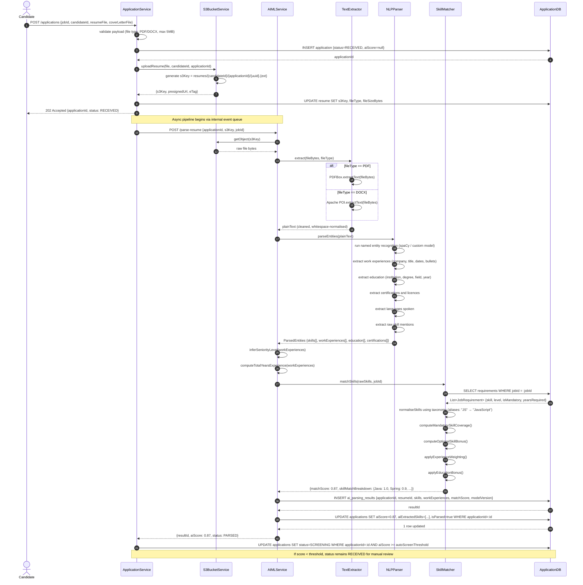
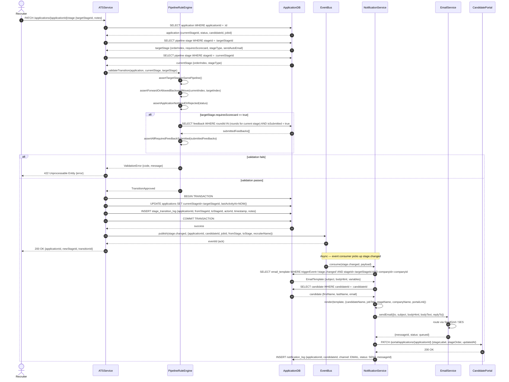
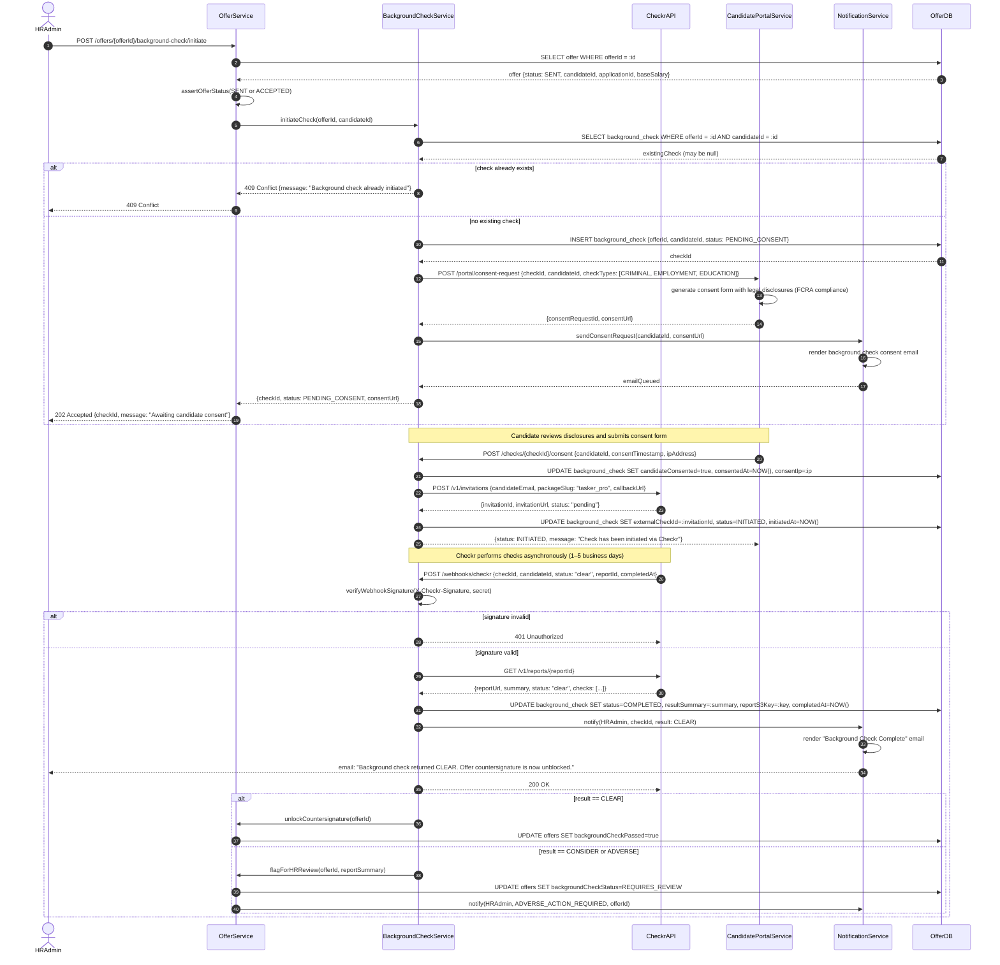
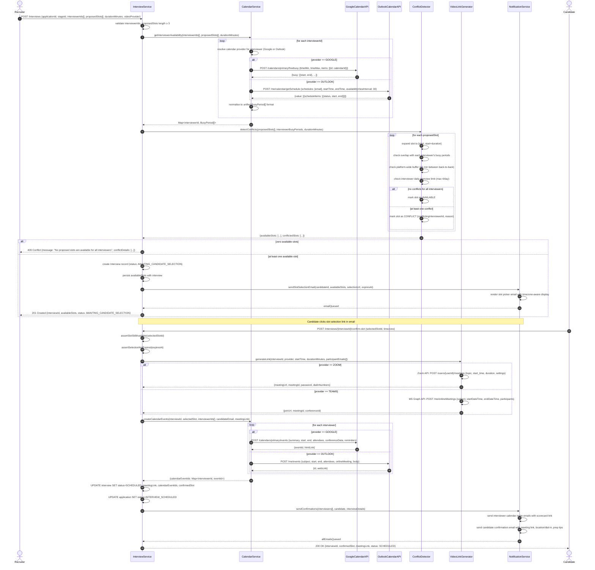

# Sequence Diagrams — Job Board and Recruitment Platform

## Overview

These four sequence diagrams cover the most technically complex workflows in the platform: AI-powered resume parsing, pipeline stage transitions with notification propagation, third-party background check integration, and calendar-aware interview slot booking with conflict detection.

---

## 1. AI Resume Parsing Flow

Triggered when a candidate submits an application. The resume file is stored durably in S3 before any parsing begins. The parsing pipeline is asynchronous — the application record is created immediately with status `RECEIVED` and enriched once the AI pipeline completes.

---

## 2. Pipeline Stage Transition with Notifications

Triggered when a recruiter moves a candidate from one pipeline stage to the next. The transition is governed by a rule engine that enforces ordering, prerequisite completion (e.g., scorecard submission), and auto-action triggers such as sending templated emails and updating the candidate-facing portal.

---

## 3. Background Check Integration Flow

Initiated by an HR Admin after an offer letter has been approved and sent. The platform integrates with the Checkr API to run criminal, employment, and education verification checks. Candidate consent is collected before any data is transmitted. Checkr delivers results via a signed webhook callback.

---

## 4. Calendar Slot Booking with Conflict Detection

Triggered when a recruiter schedules an interview and proposes time slots to a candidate. The service checks interviewer availability across both Google Calendar and Outlook Calendar, runs conflict detection, presents available slots to the candidate, and upon selection creates calendar events and generates a video conferencing link.

---

## Notes on Async Boundaries

| Flow | Sync / Async | Mechanism |
|---|---|---|
| Resume upload | Sync (upload), Async (parsing) | Internal event queue / SQS |
| Stage transition | Sync (DB write), Async (notifications) | Kafka `stage.changed` topic |
| Background check initiation | Sync | REST + DB |
| Checkr result delivery | Async (webhook) | Signed HTTPS POST from Checkr |
| Slot confirmation | Sync | REST |
| Calendar event creation | Sync (within request) | Parallel API calls |
