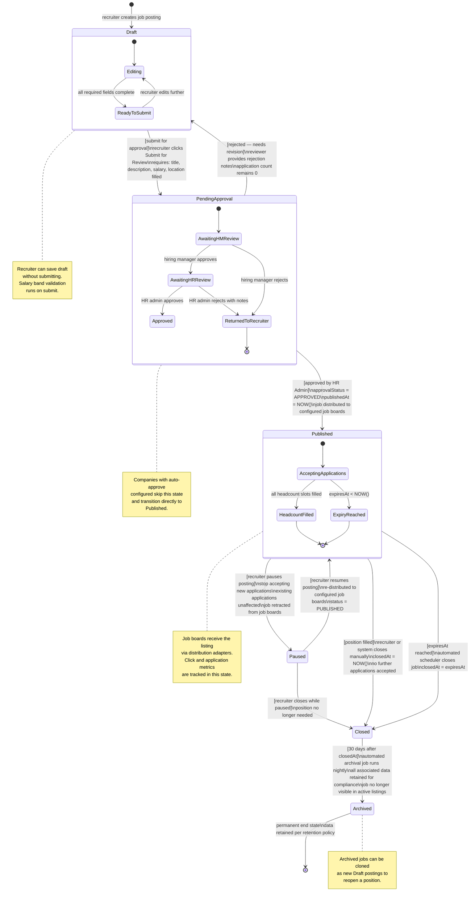

# State Machine Diagrams — Job Board and Recruitment Platform

## Overview

These three state diagrams model the complete lifecycle of the platform's three most critical entities: a **Job posting**, a **Candidate Application**, and an **Offer Letter**. Each diagram includes guard conditions, trigger events, and notes on automatic versus manual transitions.

---

## 1. Job Lifecycle

A job moves through approval, publication, and retirement stages. Most transitions are triggered by explicit recruiter or admin actions, but the `Closed → Archived` transition fires automatically after a configurable retention period (default: 30 days). A job can only receive applications when it is in the `Published` state.

---

## 2. Application Lifecycle

A candidate application progresses through screening, multiple interview stages, and a terminal state of Hired, Rejected, or Withdrawn. Rejection and withdrawal can occur from any non-terminal stage. Automatic AI screening advances high-scoring applications to `Shortlisted` while low-scoring ones remain in `Screening` for manual review.

```mermaid
stateDiagram-v2
    [*] --> Received : candidate submits application\nappliedAt = NOW()\nresume uploaded to S3

    state Received {
        [*] --> AwaitingParsing
        AwaitingParsing --> ParseComplete : AI parsing job completes
        ParseComplete --> AutoScreened : aiScore >= threshold (configurable, default 0.70)
        ParseComplete --> ManualReview : aiScore < threshold
        ManualReview --> [*]
        AutoScreened --> [*]
    }

    Received --> Screening : AI parsing complete\napplication visible in ATS recruiter view

    state Screening {
        [*] --> RecruiterReview
        RecruiterReview --> ResumeReviewed : recruiter opens application
    }

    Screening --> Shortlisted : [recruiter shortlists]\nrecruiter marks as shortlist\nor aiScore >= autoShortlistThreshold
    Screening --> Rejected : [rejected at screening stage]\nautomated rejection email sent if configured

    Shortlisted --> PhoneScreen : [phone screen scheduled]\nInterview record created with type=PHONE_SCREEN\ncandidate notified via email

    state PhoneScreen {
        [*] --> PhoneScreenScheduled
        PhoneScreenScheduled --> PhoneScreenConfirmed : candidate confirms slot
        PhoneScreenConfirmed --> PhoneScreenCompleted : interviewer marks complete
        PhoneScreenCompleted --> FeedbackPending : awaiting scorecard submission
        FeedbackPending --> FeedbackReceived : all interviewers submit feedback
        FeedbackReceived --> [*]
    }

    PhoneScreen --> TechnicalInterview : [phone screen passed]\npositive feedback decision\nrecruiter advances candidate
    PhoneScreen --> Rejected : [phone screen failed]\nnegative feedback aggregate decision

    state TechnicalInterview {
        [*] --> TechRoundScheduled
        TechRoundScheduled --> TechRoundConfirmed : candidate confirms
        TechRoundConfirmed --> TechRoundInProgress : start time reached
        TechRoundInProgress --> TechRoundCompleted : interviewer marks done
        TechRoundCompleted --> TechFeedbackPending
        TechFeedbackPending --> TechFeedbackComplete : all scorecards submitted
        TechFeedbackComplete --> [*]
    }

    TechnicalInterview --> FinalInterview : [technical round passed]\nall interviewers give YES or STRONG_YES\nrecruiter advances
    TechnicalInterview --> Rejected : [technical round failed]\nnegative aggregate feedback

    state FinalInterview {
        [*] --> FinalRoundScheduled
        FinalRoundScheduled --> FinalRoundCompleted : interview conducted
        FinalRoundCompleted --> FinalFeedbackComplete : hiring panel scorecard submitted
    }

    FinalInterview --> OfferPending : [final interview passed]\nhiring decision confirmed\nHM initiates offer creation
    FinalInterview --> Rejected : [final interview failed]\nhiring committee decision negative

    state OfferPending {
        [*] --> OfferDrafting
        OfferDrafting --> OfferApprovalInProgress : offer submitted for approval
        OfferApprovalInProgress --> OfferSent : offer approved and sent to candidate
        OfferSent --> AwaitingCandidateDecision : candidate views offer
        AwaitingCandidateDecision --> [*]
    }

    OfferPending --> Hired : [offer accepted]\ncandidate signs offer letter\nstartDate confirmed
    OfferPending --> Rejected : [offer declined]\ncandidate declines offer letter
    OfferPending --> Rejected : [offer rescinded]\nHR rescinds offer (background check failure, etc.)

    Received --> Withdrawn : [candidate withdraws]\ncandidate can withdraw at any stage before Hired
    Screening --> Withdrawn : [candidate withdraws]
    Shortlisted --> Withdrawn : [candidate withdraws]
    PhoneScreen --> Withdrawn : [candidate withdraws]
    TechnicalInterview --> Withdrawn : [candidate withdraws]
    FinalInterview --> Withdrawn : [candidate withdraws]
    OfferPending --> Withdrawn : [candidate withdraws before signing]

    Hired --> [*] : terminal — candidate onboarding begins
    Rejected --> [*] : terminal — rejection email sent\nre-apply cooldown period starts
    Withdrawn --> [*] : terminal — candidate may re-apply after cooldown

    note right of Received
        Duplicate detection runs on
        submission. If duplicate found,
        application flagged but still
        created (recruiter reviews).
    end note

    note right of Shortlisted
        Candidate portal updated
        to show "Under Consideration"
        without revealing specific stage.
    end note

    note right of OfferPending
        Offer negotiation sub-flow
        may occur here. Counter-offers
        cycle back within OfferPending
        until accepted, declined, or
        rescinded.
    end note
```

---

## 3. Offer Letter Lifecycle

The offer letter follows a dual-approval workflow for standard offers and a stricter triple-approval path for high-salary offers (configurable threshold per company). E-signature via DocuSign or HelloSign is triggered automatically once all approvals are in place.

```mermaid
stateDiagram-v2
    [*] --> Draft : HR or recruiter creates offer\nbaseSalary, startDate, jobTitle set

    state Draft {
        [*] --> FieldsIncomplete
        FieldsIncomplete --> ReadyForSubmission : all required fields populated\nsalary within approved band
        ReadyForSubmission --> DocumentGenerated : PDF document auto-generated\nusing offer letter template
        FieldsIncomplete --> SalaryBandException : salary outside approved band
        SalaryBandException --> ReadyForSubmission : exception approved by HRDirector
    }

    Draft --> PendingApproval : [submitted for approval by recruiter]\nvalidation: salary band check passed\nofferStatus = PENDING_APPROVAL

    state PendingApproval {
        [*] --> AwaitingHMApproval
        AwaitingHMApproval --> HMApprovalComplete : hiring manager approves via portal
        HMApprovalComplete --> [*]
    }

    PendingApproval --> ApprovedByHM : [hiring manager approves]\napprovalTimestamp recorded\napprovedByHMId recorded

    PendingApproval --> Draft : [hiring manager rejects]\nrejection notes provided\noffer returned for revision

    state ApprovedByHM {
        [*] --> CheckIfHighSalary
        CheckIfHighSalary --> RequiresDualApproval : baseSalary > company.highSalaryThreshold
        CheckIfHighSalary --> ReadyToSend : baseSalary <= company.highSalaryThreshold
        RequiresDualApproval --> AwaitingHRDirectorApproval
        AwaitingHRDirectorApproval --> [*]
        ReadyToSend --> [*]
    }

    ApprovedByHM --> ApprovedByHRDirector : [HR Director approves — high salary path]\nrequired when baseSalary > highSalaryThreshold\nHR Director notified by email

    ApprovedByHM --> SentForSigning : [standard salary path — auto-advance]\nno HR Director approval needed\ne-signature request triggered immediately

    ApprovedByHM --> Draft : [HR Director rejects — high salary path]\ndetailed rejection reason required\nHM notified of rejection

    ApprovedByHRDirector --> SentForSigning : [sent for e-signature]\nDocuSign/HelloSign request created\nesignatureRequestId stored\ncandidate email sent with signing link\nofferExpiresAt = NOW() + 5 business days

    state SentForSigning {
        [*] --> SigningLinkSent
        SigningLinkSent --> ReminderSent : 48 hours without action
        ReminderSent --> FinalReminderSent : 24 hours from expiry
        FinalReminderSent --> Expired : expiresAt reached without response
        SigningLinkSent --> CandidateSigning
        ReminderSent --> CandidateSigning
        FinalReminderSent --> CandidateSigning
        CandidateSigning --> CompanyCountersigning : candidate e-signs
        CompanyCountersigning --> [*]
    }

    SentForSigning --> Accepted : [candidate accepts and signs]\ne-signature webhook received\nboth parties' signatures complete\nrespondedAt = NOW()\napplication status → HIRED

    SentForSigning --> Declined : [candidate declines offer]\ncandidate clicks Decline in portal\nor notifies recruiter directly\nrespondedAt = NOW()\napplication status → REJECTED

    SentForSigning --> Rescinded : [company rescinds offer]\nHR initiates rescission before signing\nreason required (background check, budget freeze, etc.)\nrescission email sent to candidate

    SentForSigning --> Rescinded : [offer expired]\nexpiresAt reached with no candidate response\nautomated expiry job marks as Rescinded

    Accepted --> [*] : terminal — onboarding workflow triggered\noffer document archived in S3\ncompliance record created

    Declined --> [*] : terminal — recruiter can re-initiate offer\nor close position

    Rescinded --> [*] : terminal — WARN: adverse action\ncompliance team notified if post-consent rescission\ncandidate notified via email

    note right of Draft
        Salary band validation compares
        baseSalary against the role's
        configured SalaryBand record.
        Out-of-band offers require a
        documented exception approval.
    end note

    note right of ApprovedByHM
        High salary threshold is
        configurable per company.
        Default: USD 200,000 base.
        Equity grants always require
        HR Director approval regardless
        of base salary amount.
    end note

    note right of SentForSigning
        Background check must return
        CLEAR status before
        countersignature is enabled,
        even if candidate has signed.
        This prevents binding the company
        to an offer pending a failed check.
    end note

    note right of Rescinded
        Post-acceptance rescission
        triggers a legal review workflow
        and requires VP HR sign-off
        before the rescission letter
        is sent to the candidate.
    end note
```

---

## Transition Summary Tables

### Job Status Transitions

| From State | To State | Trigger | Actor | Guard |
|---|---|---|---|---|
| Draft | PendingApproval | Submit for review | Recruiter | All required fields populated |
| PendingApproval | Published | Approve | HR Admin | ApprovalStatus == APPROVED |
| PendingApproval | Draft | Reject | HR Admin / HM | Rejection notes required |
| Published | Paused | Pause posting | Recruiter | None |
| Published | Closed | Close position | Recruiter / System | None |
| Published | Closed | Expiry reached | Scheduler | NOW() >= expiresAt |
| Paused | Published | Resume posting | Recruiter | None |
| Paused | Closed | Close while paused | Recruiter | None |
| Closed | Archived | Auto-archive | Scheduler | NOW() >= closedAt + 30 days |

### Offer Letter Approval Path

| Condition | Approvers Required | Auto-Advance After |
|---|---|---|
| Standard offer (salary ≤ threshold) | Hiring Manager only | HM approval → directly to SentForSigning |
| High salary offer (salary > threshold) | Hiring Manager + HR Director | HR Director approval → SentForSigning |
| Any offer with equity grant | Hiring Manager + HR Director | HR Director approval → SentForSigning |
| Post-acceptance rescission | VP HR sign-off required | Manual — no auto-advance |
