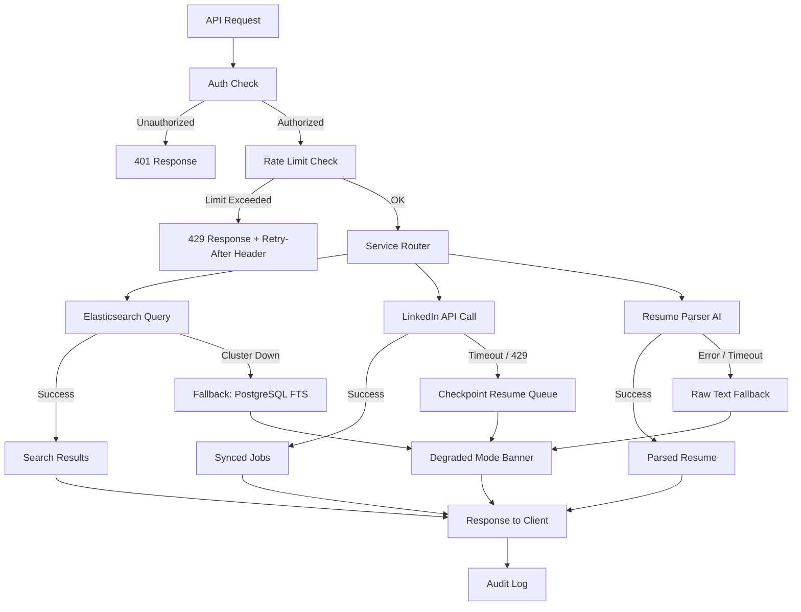

# API and UI Edge Cases

## Overview

The API and UI layer of the Job Board and Recruitment Platform mediates all interactions between candidates, employers, and third-party services such as Elasticsearch, the LinkedIn API, and the AI-powered resume parser. Failures in this layer are often invisible to the user until they manifest as silent data loss, empty search results, or broken application flows. Because job seekers and employers rely on real-time responsiveness — especially during high-traffic windows like Monday mornings or major job-fair announcements — degraded modes must activate automatically, and partial failures must never silently discard candidate data. This document catalogues the most impactful edge cases across job search, integrations, file handling, and bulk operations, together with concrete mitigation and recovery procedures.

---

### EC-01: Job Search Returns Empty Results Due to Elasticsearch Cluster Failure

**Failure Mode**
The Elasticsearch/OpenSearch cluster becomes unresponsive or returns a 503 during a job search query. All searches return zero results even though thousands of active jobs exist in PostgreSQL. This can occur due to JVM heap pressure, split-brain after a node restart, or an AWS availability-zone outage affecting the cluster.

**Impact**
Candidates see an empty job board and may abandon the platform or assume no jobs match their criteria. Employer job posts receive zero impressions. If the outage persists through a peak session (Monday 08:00–10:00 local time), click-through and application metrics drop measurably. SEO crawlers hitting the API during the outage may de-index job listing pages.

**Detection**
- CloudWatch alarm triggers when the `search_results_count_p50` metric falls below 1 result per query for two consecutive one-minute windows.
- Elasticsearch cluster health endpoint (`/_cluster/health`) transitions to `red`; a dedicated health-check Lambda pings it every 30 seconds and publishes to a `platform/search/health` SNS topic.
- Zero-result rate alert: if `(zero_result_queries / total_queries) > 0.40` for 3 minutes, PagerDuty alert fires to the search on-call rotation.

**Mitigation**
1. The API gateway's circuit breaker opens after three consecutive Elasticsearch timeouts within a 10-second window.
2. All search requests are rerouted to the PostgreSQL full-text search fallback (`tsvector` columns on `jobs` table, `pg_trgm` GIN index on title and description).
3. A `X-Search-Mode: degraded` response header is added; the frontend renders a non-intrusive banner: *"Job search is running in limited mode. Results may be incomplete."*
4. Autocomplete and faceted filters (location, salary, job type) are disabled in degraded mode to reduce PostgreSQL load.

**Recovery**
1. On-call engineer follows the Elasticsearch recovery runbook: check shard allocation (`/_cat/shards?v`), identify unassigned shards, trigger reroute if needed.
2. If split-brain: isolate the minority partition, force-elect the majority master, replay the write-ahead index log from Kafka (`jobs.index` topic).
3. After cluster returns to `green`, trigger a full re-index from PostgreSQL using the `scripts/reindex-jobs.ts` script with `--since=last_healthy_checkpoint` flag.
4. Validate index integrity: run `scripts/validate-search-index.ts` which compares job counts between PostgreSQL and Elasticsearch per employer and flags discrepancies.
5. Remove degraded mode banner once `search_results_count_p50 > 5` for five consecutive minutes.

**Prevention**
- Deploy Elasticsearch across three AWS availability zones with a minimum of one replica shard per index.
- Enable automated shard rebalancing and index lifecycle management (ILM) to prevent runaway index growth.
- Run chaos engineering drills quarterly: randomly terminate one Elasticsearch node and verify fallback activates within 60 seconds.
- Keep PostgreSQL FTS indexes warm with a background query every 5 minutes to avoid cold-cache latency spikes during failover.

---

### EC-02: LinkedIn Job Sync Fails Midway for an Employer with 500+ Postings

**Failure Mode**
An employer with 500+ active job postings triggers a LinkedIn sync (either scheduled or on-demand). The LinkedIn Jobs API returns a `429 Too Many Requests` or `500 Internal Server Error` partway through pagination, leaving the platform with a partially synced job catalogue. Some jobs are updated, others stale, and newly closed LinkedIn jobs are not marked inactive on the platform.

**Impact**
Candidates apply to jobs that have already been closed on LinkedIn, leading to frustration and wasted effort. Employers receive applications for roles they are no longer hiring for, polluting their ATS. The employer's job inventory on the platform diverges from their LinkedIn Company Page, eroding trust.

**Detection**
- Each sync operation is recorded in the `linkedin_sync_jobs` table with columns: `employer_id`, `cursor`, `status` (`in_progress` / `completed` / `failed`), `last_synced_page`, `error_code`.
- A Kafka consumer monitors sync completion events; if a sync remains `in_progress` for more than 15 minutes, an alert is published to `platform/integrations/linkedin-sync-stalled`.
- Employer-facing integration dashboard shows sync health with last-successful-sync timestamp and a warning badge if >30 minutes stale.

**Mitigation**
1. Sync operations use cursor-based pagination; every successfully processed page commits its cursor to the `linkedin_sync_jobs` checkpoint row before moving to the next page.
2. On transient error (5xx or 429), the sync worker implements exponential backoff (initial 5 s, max 5 min) with jitter, up to 5 retries per page.
3. LinkedIn rate-limit headers (`X-RateLimit-Remaining`, `Retry-After`) are respected; the worker pauses and resumes automatically.
4. If the sync fails permanently (all retries exhausted), the last successful checkpoint is preserved so the next scheduled sync resumes from that cursor rather than restarting from page 1.
5. The employer is notified via email and in-app notification: *"Your LinkedIn job sync encountered an issue. Jobs updated before [timestamp] are current. We will retry automatically in 1 hour."*

**Recovery**
1. On-call engineer can trigger a manual resume-from-checkpoint via the admin API: `POST /admin/integrations/linkedin/sync/{employer_id}/resume`.
2. After a successful full sync, a reconciliation pass compares job IDs in the platform against those returned in the latest LinkedIn feed; any platform jobs absent from LinkedIn are marked `CLOSED` and removed from search.
3. Candidates who applied to jobs closed during the sync gap receive a notification: *"This role has been filled or closed. Your application has been withdrawn."*

**Prevention**
- Request a dedicated LinkedIn API rate-limit tier for enterprise accounts processing >200 jobs.
- Distribute sync operations using Kafka-scheduled events with even spread across the hour rather than running all employer syncs at the top of the hour.
- Implement an idempotency key per job post (`linkedin_job_id + employer_id + sync_date`) so reprocessing a page never creates duplicate records.

---

### EC-03: Resume Parser AI Returns Error or Unusable Output

**Failure Mode**
The AI resume parsing service (called as a downstream HTTP API) returns a 500 error, times out after 30 seconds, or returns a 200 response with a structurally valid but semantically empty JSON body (no `skills`, `experience`, or `education` arrays extracted). This can occur due to an unsupported file format (e.g., password-protected PDF, scanned image without OCR layer), a model inference failure, or an overloaded parser service during application surges.

**Impact**
Candidate profiles are missing structured skills and experience data, so employer keyword searches and AI-driven job-match rankings exclude these candidates. The candidate may not realise their profile is incomplete, disadvantaging them without their knowledge.

**Detection**
- Each parse attempt is recorded in `resume_parse_attempts` with `status`, `raw_response`, and `empty_fields_bitmask`.
- An alert fires when `(empty_or_failed_parses / total_parses) > 0.10` in any 5-minute window, indicating a systemic parser issue rather than a single bad resume file.
- Structured logging tags every parse call with `parser_version`, `file_type`, `file_size_kb`, and `latency_ms`; Kibana dashboards surface error clusters by file type.

**Mitigation**
1. On timeout or 5xx: retry the parse request once after 5 seconds against a secondary parser endpoint. If the secondary also fails, mark the resume as `parse_status: pending_retry` and enqueue it in the `resume_parse_retry` Kafka topic with a 15-minute delay.
2. On empty extraction (all key fields null or empty arrays): fall back to raw-text indexing — the full resume text is stored in Elasticsearch as an unstructured `resume_text` field, enabling keyword search without structured field matching.
3. The candidate profile UI shows a soft warning: *"We had trouble reading parts of your resume. Consider adding your skills and experience manually to improve job matches."*
4. A manual reparse button is exposed on the candidate profile page, allowing the candidate to trigger a fresh parse after uploading a corrected file.

**Recovery**
1. If a systemic parser outage is detected, drain the `resume_parse_retry` queue in order of application submission date (most recent first), prioritising candidates with active applications at employers currently reviewing submissions.
2. After the parser recovers, trigger a backfill job: `scripts/backfill-resume-parse.ts --status=pending_retry --since=outage_start`.
3. Notify candidates whose applications were submitted during the outage window: *"Your resume has now been fully processed. Your job matches may have updated."*

**Prevention**
- Validate file format and size on upload (reject password-protected PDFs, files >10 MB, and non-standard encodings before calling the parser).
- Deploy the resume parser as a horizontally auto-scaling service with a minimum of 3 replicas; use an HPA targeting 60% CPU to prevent cold-start latency during surges.
- Run the parser service behind a circuit breaker (Hystrix / Resilience4j pattern): after 5 failures in 10 seconds, open the circuit and route directly to raw-text fallback without waiting for timeouts.

---

### EC-04: Job Search Autocomplete Returns Stale Suggestions After Bulk Job Expiry

**Failure Mode**
When a large batch of jobs expires at midnight (daily expiry cron), the autocomplete suggestion index in Redis is not invalidated. Candidates typing in the search bar continue to see autocomplete suggestions for job titles, companies, and skills that no longer have any active listings. Clicking a stale suggestion returns zero results, creating a frustrating dead-end experience.

**Impact**
High bounce rate on search sessions that start from a stale autocomplete suggestion. Employer brand damage if a company shows in autocomplete after all their jobs have expired. Misleading signals for analytics dashboards tracking top-searched job titles.

**Detection**
- A `suggestion_to_zero_result_rate` metric tracks how often an autocomplete suggestion results in a zero-result search. Alert fires when this rate exceeds 15% over a 10-minute window.
- After the daily expiry batch completes, a post-job check compares the Redis autocomplete keyspace against the `jobs` table and logs any terms that reference no active jobs.

**Mitigation**
1. The job expiry batch emits a `jobs.bulk_expired` Kafka event containing the list of expired job IDs.
2. A dedicated autocomplete-invalidation consumer subscribes to this event and removes or decrements suggestion scores for titles, companies, and skills associated with the expired jobs.
3. Redis autocomplete keys carry a TTL of 6 hours as a safety net; the background invalidation consumer provides immediate consistency.
4. For incremental expiry (single job closed by employer), the `UPDATE jobs SET status='CLOSED'` database trigger publishes a `job.closed` event that the same consumer handles inline.

**Recovery**
1. If stale suggestions are detected post-expiry, trigger the manual invalidation script: `scripts/refresh-autocomplete-index.ts --full` which rebuilds the Redis suggestion sorted sets from the active-jobs view in PostgreSQL.
2. This script runs in under 2 minutes for a catalogue of up to 500,000 active jobs and can be safely re-run without downtime.

**Prevention**
- Never build autocomplete suggestions from the raw job index; build from a materialised view `active_jobs_summary` that excludes `CLOSED`, `EXPIRED`, and `DRAFT` status jobs, refreshed every 15 minutes.
- Cap autocomplete TTL at 1 hour during the midnight expiry window (00:00–01:00 UTC) using a scheduled Redis config override.

---

### EC-05: Employer Bulk-Imports 1000+ Jobs via CSV and API Times Out

**Failure Mode**
An employer uploads a CSV file containing 1,200 job postings via the employer dashboard's bulk import feature. The synchronous API endpoint attempts to validate, parse, and insert all rows within a single HTTP request. The request times out after the API gateway's 30-second hard limit, leaving the import in an unknown partial state. The employer has no visibility into how many jobs were successfully imported.

**Impact**
Employer is unable to onboard their full job catalogue, requiring manual re-upload and duplicating entries for already-imported jobs. Support tickets increase. If the employer is on a pay-per-post plan, double-billing becomes a risk if they retry the upload.

**Detection**
- API gateway timeout logs record the endpoint, employer ID, and row count; a CloudWatch metric filter alerts when bulk import timeouts exceed 2 per hour.
- The import job table `bulk_import_jobs` tracks `total_rows`, `processed_rows`, `failed_rows`, and `status`; a status of `in_progress` older than 5 minutes without a heartbeat update triggers an alert.

**Mitigation**
1. The bulk import endpoint is asynchronous: the API immediately returns `202 Accepted` with an `import_job_id` after uploading the CSV to S3.
2. A Kafka event `jobs.bulk_import.requested` triggers a background worker that processes rows in batches of 50, updating `processed_rows` and committing a checkpoint after each batch.
3. Row-level validation errors (missing required fields, invalid salary format, unrecognised location) are recorded in an `import_errors` JSONB column and do not halt the overall import.
4. The employer can poll `GET /imports/{import_job_id}/status` or receive a webhook callback on completion with a summary: rows imported, rows skipped, rows failed, and a downloadable error report CSV.
5. Idempotency: each row is keyed by a hash of `(employer_id, external_job_ref, title, location)`. Re-uploading the same CSV after a partial failure upserts already-imported rows without creating duplicates.

**Recovery**
1. If a worker crashes mid-import, the Kafka consumer group rebalance picks up the uncommitted offset and reprocesses from the last checkpoint batch.
2. The employer receives an email with the error report and a "Retry Failed Rows" button that uploads only the failed-row subset to a new import job.

**Prevention**
- Enforce a per-employer daily bulk import limit of 2,000 rows with a clear error message and a request-to-increase flow for enterprise accounts.
- Pre-validate the CSV schema client-side in the browser (column names, required fields) before upload to surface format errors before any server processing.

---

### EC-06: Application Submission Fails After Resume File Upload Succeeds

**Failure Mode**
A candidate completes the job application form, uploads their resume (which is successfully stored in S3), and clicks Submit. The subsequent database write to the `applications` table fails due to a transient PostgreSQL connection error or a constraint violation (e.g., duplicate application attempt). The candidate sees an error page. Their resume is now an orphaned S3 object with no associated application record.

**Impact**
From the candidate's perspective, they have applied but will never hear back — or they re-apply, creating a duplicate application. From the employer's perspective, the candidate appears in neither the ATS nor the application dashboard. The candidate may miss the application deadline if they do not retry.

**Detection**
- A daily S3 lifecycle audit job compares objects in the `resumes/pending/` prefix against `applications` table records; objects older than 24 hours with no corresponding application row are flagged as orphaned.
- Client-side error tracking (Sentry) captures the failed submission event with the `s3_resume_key` attached, enabling support to manually recover the application.

**Mitigation**
1. The application submission is implemented as a two-phase operation: first, upload the resume and obtain the S3 key; second, write the application record including the S3 key in a single database transaction.
2. The application create endpoint is idempotent, keyed by `(candidate_id, job_id, resume_s3_key)`. If the candidate retries after a failure, the second request finds the existing pending record and confirms it rather than creating a duplicate.
3. On database write failure, the API returns a `503` with a `Retry-After: 5` header and a client-visible message: *"Your resume was saved. Please try submitting again — your file will not need to be re-uploaded."* The frontend pre-populates the form with the already-uploaded resume key.
4. The resume S3 key is stored in browser `sessionStorage` so a page refresh does not lose the upload reference.

**Recovery**
1. The orphaned-file cleanup job runs nightly; for each orphaned key, it attempts to reconstruct the application record from the S3 object metadata (`x-amz-meta-candidate-id`, `x-amz-meta-job-id` tags written at upload time) and inserts a `PENDING_REVIEW` application for manual confirmation by the support team.
2. Candidates identified via Sentry as having a failed submission are proactively emailed within 24 hours with a direct link to resubmit.

**Prevention**
- Move resume upload out of the application submission critical path: allow candidates to upload resumes to their profile in advance, making application submission a lightweight single-row database write.
- Implement a saga pattern for the two-phase operation with a compensation step (S3 object deletion) if the database write fails definitively after all retries, preventing orphan accumulation.
- Set an S3 lifecycle rule to automatically delete objects in the `resumes/pending/` prefix after 48 hours if not moved to `resumes/confirmed/`.
