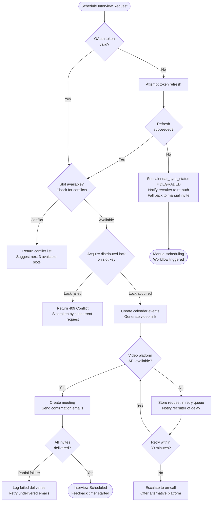

# Edge Cases — Interview Scheduling

## Overview

This document covers edge cases in the interview scheduling subsystem, including calendar integrations (Google Calendar, Outlook), video conferencing (Zoom, Microsoft Teams), timezone handling, multi-round coordination, and feedback lifecycle management. Scheduling failures are uniquely damaging because they affect both the candidate experience and the interviewer's time — two of the most sensitive dimensions of the hiring funnel.

---

## Interview Scheduling Failure Handling Flow

---

### EC-17: Google Calendar OAuth Token Expired During Interview Sync

**Failure Mode:** A recruiter authorised the platform's Google Calendar integration 90 days ago. Google's OAuth refresh token has a maximum lifetime of 90 days for OAuth apps that have not completed Google's OAuth verification process. During a batch calendar sync at 9:00 AM, the refresh token for this recruiter's calendar silently expires. The sync job fails to create calendar events for 8 scheduled interviews; no calendar invites are sent to interviewers or candidates. The interviews are scheduled in the platform's database but are invisible on everyone's calendars.

**Impact:** High. Interviews occur without any calendar reminders or joining links for participants. Interviewers may miss the interview entirely. Candidate experiences a no-show from the interviewer, severely damaging the employer brand.

**Detection:**
- Google Calendar API returns `HTTP 401 Unauthorized` with error code `invalid_grant`; the sync service publishes a `calendar.token_expired` event and marks the recruiter's integration as `DISCONNECTED`.
- A monitoring dashboard tracks the ratio of `calendar_events_created_successfully / calendar_events_attempted`; a drop below 90% triggers a P2 alert.
- All interviews created in the platform within the last 24 hours for the affected recruiter show `calendar_sync_status = FAILED`; a nightly check alerts if this count > 0.

**Mitigation:**
1. Immediately send in-app and email notifications to the affected recruiter: "Your Google Calendar integration has expired. Please re-authorise to restore calendar syncing."
2. Send manual calendar invites (ICS file via email) to all interviewers and candidates for the 8 affected interviews as a stop-gap.
3. Flag all `calendar_sync_status = FAILED` interviews for manual follow-up in the recruiter dashboard.

**Recovery:**
1. Recruiter re-authorises the Google Calendar integration via the Settings > Integrations page.
2. Trigger a retroactive sync for all `calendar_sync_status = FAILED` interviews within the last 7 days.
3. Verify sync success by checking calendar event IDs are populated in the `interviews.calendar_event_id` field.
4. Inform interviewers and candidates that calendar events have been re-sent.

**Prevention:**
- Store the token creation timestamp and proactively notify recruiters at 75 days (15 days before the 90-day expiry) to re-authorise.
- Complete Google's OAuth app verification process to obtain long-lived refresh tokens (no 90-day limit for verified apps).
- Implement a "calendar integration health check" badge in the recruiter dashboard showing green/amber/red status for each connected integration.

---

### EC-18: Interviewer Declines After Candidate Confirmation Sent

**Failure Mode:** An interview is scheduled for Tuesday at 2 PM. The candidate receives a calendar invite and a confirmation email. On Monday morning, the interviewer declines the Google Calendar event (clicks "Decline" in Gmail). The platform's calendar webhook receives the `attendee.declined` event but the webhook handler treats interviewer-declined events the same as candidate-declined events and automatically cancels the interview, sending a cancellation notice to the candidate without alerting the recruiter. The recruiter is unaware the interview was cancelled.

**Impact:** Medium. Candidate receives a confusing cancellation with no explanation. The recruiter is surprised when they check the pipeline and the interview shows `CANCELLED`. The hiring manager may hold the recruiter responsible for the mix-up.

**Detection:**
- Webhook handler distinguishes between `attendee_role = INTERVIEWER` and `attendee_role = CANDIDATE` in the decline event. Interviewer decline events generate an `interview.interviewer_declined` alert to the recruiter, not an automatic cancellation.
- Recruiter dashboard shows an "Action Required: Interviewer Declined" banner for any interview where an interviewer has declined and no replacement has been assigned.

**Mitigation:**
1. Do not auto-cancel the interview when an interviewer declines; hold it in `INTERVIEWER_DECLINED` status.
2. Notify the recruiter immediately via email and in-app notification: "Interviewer [Name] has declined the interview for [Candidate] scheduled on [Date/Time]. Please assign a replacement or reschedule."
3. Send no communication to the candidate until the recruiter takes action.

**Recovery:**
1. Recruiter assigns a replacement interviewer or reschedules with the original interviewer.
2. If the candidate was mistakenly notified of a cancellation: send a personalised apology email with the corrected interview details.
3. Audit the webhook handler code for any other event types that might incorrectly trigger automatic state changes.

**Prevention:**
- Separate the state machine for interviewer attendance changes from candidate attendance changes; they have entirely different business logic.
- Require explicit recruiter confirmation before any external-facing communication (cancellation, reschedule) is sent to a candidate due to an interviewer's calendar action.
- Add a unit test covering interviewer-decline webhook events to assert that no cancellation email is sent to the candidate.

---

### EC-19: Timezone Mismatch Causes Meeting at Wrong Time

**Failure Mode:** A recruiter in New York City (UTC-5 / EST) schedules an interview for "3:00 PM" on Thursday. The platform interprets this as `2025-03-20T15:00:00` with no timezone specified and stores it as UTC. The candidate is in London (UTC+0 / GMT). The calendar invite is sent with UTC time, which the candidate's Google Calendar correctly renders as 3:00 PM London time. The recruiter's calendar shows 3:00 PM EST. The actual meeting time is 5 hours apart. Neither party notices until both log in to the Zoom link at their respective 3:00 PM and find no one there.

**Impact:** High. Interview missed. Candidate loses confidence in the company's professionalism. Rescheduling requires additional coordination and delays the hiring process by days.

**Detection:**
- At scheduling time, the platform requires explicit timezone selection for every interview time input; there is no default "server timezone."
- On review, if the recruiter's profile timezone and candidate's profile timezone differ by more than 4 hours, a "Timezone Difference Alert" is shown: "Note: This interview is 5 hours later for [Candidate] (London, GMT)."
- Post-scheduling confirmation emails show the interview time in both the recruiter's timezone and the candidate's timezone explicitly.

**Mitigation:**
1. Contact both the candidate and interviewer immediately after the timezone discrepancy is reported.
2. Determine the intended meeting time based on the recruiter's local time (treat the recruiter's timezone as authoritative).
3. Reschedule the interview to the correct time; send updated calendar invites with timezone explicitly stated in the event title (e.g., "Technical Interview — 3:00 PM EST / 8:00 PM GMT").

**Recovery:**
1. All datetime inputs in the scheduling form must require timezone selection.
2. Store all interview times as UTC with timezone metadata; always display in the local timezone of the viewer.
3. Confirmation emails must display time in both the sender's and recipient's resolved timezone.

**Prevention:**
- Store datetime as `TIMESTAMPTZ` in PostgreSQL (not `TIMESTAMP`); always pass timezone-aware datetimes from the application layer.
- On the scheduling form, use a timezone-aware time picker that auto-detects the recruiter's browser timezone as a default but requires explicit confirmation.
- Add a prominent timezone translation widget to all scheduling confirmation screens, showing "Your time: [X] | Candidate's time: [Y]".

---

### EC-20: Zoom API Rate Limit Hit During Bulk Interview Creation

**Failure Mode:** A large enterprise customer runs an assessment day with 80 candidates scheduled for back-to-back video interviews. The recruiter uses "Bulk Schedule" to create all 80 Zoom meetings simultaneously. The Zoom API has a rate limit of 100 requests per second per account. The bulk creation job sends all 80 requests within 200 ms, hitting the rate limit. Zoom returns `HTTP 429` for 35 of the requests. Those 35 interviews are created in the platform without a Zoom link (`video_link = NULL`).

**Impact:** Medium. 35 candidates receive calendar invites with no video joining link. They have no way to attend their interview. Interviewers also lack the link. Mass reschedule required on the day before the assessment.

**Detection:**
- Zoom API client wraps all requests with a rate-limit-aware middleware that checks for HTTP 429; affected interviews are flagged as `VIDEO_LINK_PENDING`.
- After bulk scheduling completes, the platform verifies 100% of interviews have a non-null `video_link`; a reconciliation check runs 2 minutes post-bulk and alerts if any are still `VIDEO_LINK_PENDING`.

**Mitigation:**
1. Immediately retry Zoom link generation for all `VIDEO_LINK_PENDING` interviews using exponential backoff (2s, 4s, 8s).
2. If Zoom retry fails within 30 minutes, fall back to generating Google Meet links using the recruiter's Google Calendar OAuth.
3. Notify affected candidates and interviewers with updated calendar invites including the new video link.

**Recovery:**
1. Implement a Zoom link generation queue with a configurable rate: maximum 10 Zoom API requests per second.
2. All bulk operations must use a queued job system with rate limiting, never fire-and-forget HTTP bursts.
3. Add a post-bulk-schedule reconciliation job that verifies `video_link IS NOT NULL` for all created interviews.

**Prevention:**
- Use a token bucket rate limiter in the Zoom integration layer enforcing `max_requests_per_second = 10` regardless of bulk operation size.
- Support multi-provider video link generation (Zoom, Google Meet, Microsoft Teams) with automatic fallback.
- For bulk scheduling operations, process interviews in sequential batches of 10 with a 1-second delay between batches.

---

### EC-21: Same Calendar Slot Double-Booked by Two Concurrent Scheduling Requests

**Failure Mode:** Two recruiters from the same organisation simultaneously attempt to schedule Interviewer Alice for the same 2 PM Thursday slot. Both recruiters' scheduling requests pass the availability check at 14:02:00.100 and 14:02:00.150 respectively — 50 ms apart. Both checks read `slot_available = true` because neither write has committed yet. Both interviews are created, and Interviewer Alice receives two conflicting calendar invites for the same time slot.

**Impact:** High. Interviewer Alice must cancel one interview; one candidate receives a last-minute cancellation. Interviewer availability trust is broken. Duplicate events on Alice's calendar cause confusion.

**Detection:**
- Interviewer's calendar shows two events at the same time; Google Calendar webhook fires a `calendar.event_conflict` event.
- Availability check followed by slot booking is not atomic without a distributed lock; a post-booking conflict reconciliation job running every 15 minutes detects overlapping bookings for the same interviewer.

**Mitigation:**
1. Immediately notify both recruiters of the double-booking.
2. Determine which booking was first by comparing `created_at` timestamps; cancel the later booking.
3. Contact the candidate whose interview was cancelled and reschedule as a priority.

**Recovery:**
1. Implement a distributed lock (Redis `SET NX PX` with a 5-second TTL) on the key `slot_lock:{interviewer_id}:{date}:{time_slot}` before performing the availability check-and-book sequence.
2. The lock ensures only one scheduling request can proceed for a given interviewer slot at a time.
3. If the lock cannot be acquired within 2 seconds, return a `409 Conflict` to the second requester with a "Slot no longer available" message.

**Prevention:**
- Treat availability check and slot reservation as an atomic operation using optimistic locking with a database version field on the slot record, or distributed locking via Redis.
- Display real-time slot availability in the scheduling UI using WebSocket or Server-Sent Events so recruiters see stale slots disappear immediately.
- Add a unique constraint at the database level: `UNIQUE (interviewer_id, start_time)` on the `interview_slots` table.

---

### EC-22: Interviewer Not Available for All Rounds of a Multi-Round Interview

**Failure Mode:** A candidate is progressing through a 4-round interview process (recruiter screen → technical → system design → hiring manager). When the system attempts to schedule all 4 rounds back-to-back in a single day (as requested by the candidate), it successfully books rounds 1, 2, and 4 — but round 3 (System Design with Engineer Bob) has no available slots that day because Bob is on PTO. The scheduling workflow marks the multi-round schedule as "partially booked" but only sends calendar invites for the 3 confirmed rounds without alerting the recruiter that round 3 is missing.

**Impact:** Medium. Candidate arrives expecting 4 rounds and finds only 3 are on their calendar. The hiring decision is delayed. Bob may not realise he missed a scheduled interview.

**Detection:**
- Multi-round scheduling workflow validates that all rounds are booked before sending any invitations; a `multi_round_incomplete` status is set and alerts the recruiter before any invites go out.
- After booking, a completeness check verifies `COUNT(booked_rounds) == COUNT(required_rounds)`; failure raises an alert.

**Mitigation:**
1. Do not send any calendar invites until all rounds are successfully booked or the recruiter explicitly approves a partial schedule.
2. Present the recruiter with alternative dates for the unavailable round; offer to schedule the other rounds on a different day when all interviewers are available.

**Recovery:**
1. Notify the recruiter of the gap and provide available slots for the missing interviewer.
2. Once all rounds are booked, send a single set of calendar invites with all rounds in one notification.

**Prevention:**
- Multi-round scheduling must perform availability checks for all required interviewers before committing any bookings.
- Implement a "hold slot" mechanism: check and hold all required slots atomically before confirming any of them.
- Allow the recruiter to configure whether partial scheduling is acceptable (with candidate notification) or whether all rounds must be confirmed together.

---

### EC-23: Interview Completed but Feedback Deadline Not Triggered

**Failure Mode:** An interview is marked `COMPLETED` in the ATS at 4:15 PM on a Friday. The feedback deadline reminder job runs daily at 8:00 AM. Due to the late Friday completion, the interview falls into a dead zone: the Monday 8:00 AM job calculates the deadline as "48 business hours from completion" — but because the job runs after the weekend, it sets the deadline to Monday 8:00 AM + 48 hours = Wednesday 8:00 AM. The interviewer never received a "feedback requested" email. The recruiter noticed on Thursday that no feedback was submitted; the decision was delayed by 4 days.

**Impact:** High. Delayed feedback loops extend time-to-hire. If the candidate is in a competitive process, they may accept another offer. Hiring velocity KPIs are negatively impacted.

**Detection:**
- Event-driven feedback trigger: when `interview.status` transitions to `COMPLETED`, immediately publish an `interview.completed` event. The feedback service consumes this event and schedules a reminder for `now() + feedback_deadline_hours` regardless of the time of day.
- Monitoring: any interview in `COMPLETED` status for more than `feedback_deadline_hours + 2 hours` without a `feedback.submitted` event triggers a `feedback_overdue` alert to the recruiter.

**Mitigation:**
1. Immediately send the "Feedback Requested" email to all interviewers for overdue feedback submissions.
2. Escalate to the recruiter's manager if feedback is more than 24 hours overdue.

**Recovery:**
1. Replace the cron-based feedback trigger with an event-driven trigger on `interview.completed`.
2. Add a compensating cron that runs every 30 minutes and triggers feedback deadlines for any interviews in `COMPLETED` status without a corresponding feedback reminder sent.

**Prevention:**
- Use event-driven architecture for time-sensitive triggers (feedback deadlines, offer expiry, etc.) rather than daily batch jobs.
- Implement a dead-letter monitoring pattern: any `interview.completed` event not followed by a `feedback.reminder_sent` event within 5 minutes triggers an alert.

---

### EC-24: Video Link Generated but Interview Platform Down at Meeting Time

**Failure Mode:** A Zoom meeting link was generated 3 days before the interview. At the scheduled meeting time, Zoom is experiencing a partial service outage affecting meetings in the US-EAST region. The candidate and interviewer both try to join the meeting; Zoom returns "Unable to start or join meeting" errors. There is no fallback mechanism. The interview cannot proceed. The recruiter is not alerted automatically.

**Impact:** High. Interview cannot take place. Candidate experience is severely damaged — they prepared extensively and cannot attend. Rescheduling adds at minimum 2–3 days to the hiring process.

**Detection:**
- A pre-interview health check job runs 15 minutes before each scheduled interview: it calls the Zoom API to verify the meeting still exists and the host account is active. If the meeting is unreachable, it triggers a `video_platform_degraded` alert.
- External Zoom status page monitoring (via Statuspage.io API) is integrated into the platform's monitoring stack; a Zoom service incident automatically triggers a `zoom_outage` operational alert.

**Mitigation:**
1. The 15-minute pre-check failure triggers an automatic fallback: generate a Google Meet link using the recruiter's Google OAuth and send updated calendar invites to all participants immediately.
2. Send an SMS or in-app push notification to both interviewer and candidate with the fallback link and explanation.

**Recovery:**
1. After Zoom service recovers, update the interview record with the original or new Zoom link for future reference.
2. If the interview was missed: reschedule as an urgent priority; send an apology to the candidate with a direct scheduling link showing earliest available slots.

**Prevention:**
- Always configure a secondary video platform (Google Meet, Microsoft Teams) as a fallback for every interview.
- Implement pre-interview health checks 30 minutes and 15 minutes before each scheduled meeting.
- Store backup video links for every interview at creation time so fallback is instant, not reactive.

---

*Last updated: 2025-01-01 | Owner: Platform Engineering — Scheduling Squad*
