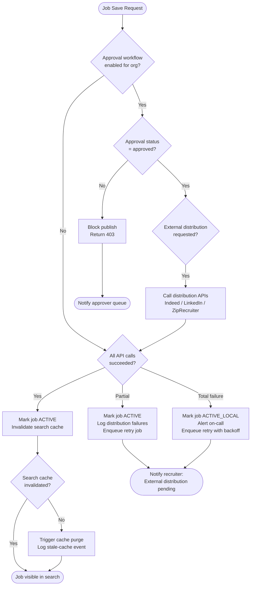

# Edge Cases — Job Posting and Matching

## Overview

This document covers edge cases in the job creation, approval, external distribution, AI-assisted resume matching, and search cache lifecycle. Failures here directly affect recruiter productivity, legal compliance, and candidate discovery. A misconfigured job post can result in regulatory fines, incorrect candidate ranking, or jobs that silently fail to reach external talent pools.

---

## Failure Detection and Recovery Flow

---

### EC-01: Job Posted Without Required Approval

**Failure Mode:** An organisation has a multi-level job approval workflow configured (e.g., hiring manager → HR business partner → department head). A recruiter uses a direct `POST /api/v1/jobs` API call with a service-account token that bypasses the approval middleware, causing the job to transition directly to `ACTIVE` status without any approver sign-off. The job may then be distributed to LinkedIn and Indeed before the organisation is aware.

**Impact:** High. Unauthorised job posts can misrepresent the organisation, create legal exposure if compensation or role description is inaccurate, and undermine internal headcount governance. In regulated industries (financial services, healthcare), this may violate internal audit controls.

**Detection:**
- Audit log event `job.published` where `approval_chain_completed = false` triggers a `WARN`-level alert in the SIEM (Splunk / Datadog).
- Nightly reconciliation job compares all `ACTIVE` jobs against `approvals` table; mismatches create a `job_approval_anomaly` metric that pages the on-call recruiter ops engineer if count > 0.
- Approval workflow service emits `approval.skipped` structured log event when `X-Service-Token` header bypasses the approval gate.

**Mitigation:**
1. Immediately set job status to `PENDING_APPROVAL` via admin console.
2. Retract job from all external boards using the distribution service's `DELETE /distributions/{jobId}` endpoint.
3. Notify the hiring manager and department head via email that the post has been recalled pending approval.
4. Rotate or scope-restrict the service-account token used to bypass the workflow.

**Recovery:**
1. Resume the approval workflow from the beginning; do not fast-track approvals to compensate for lost time.
2. Once all approvals are granted, re-publish the job; verify distribution confirmation receipts from all external boards.
3. Review audit logs for any applications received during the unapproved window; flag them for recruiter review and notify candidates if appropriate.
4. Update the API gateway policy to enforce `approval_required` check at the gateway layer for the `POST /api/v1/jobs` route regardless of token type.

**Prevention:**
- Move approval enforcement to the API gateway (Kong / AWS API Gateway policy) as a hard gate, not just middleware in the application layer — service tokens must still pass through the approval state machine.
- Implement attribute-based access control (ABAC) where `publish:job` permission requires `approval_chain_completed = true` as an assertion in the token claims.
- Add a Pact contract test that verifies the `POST /api/v1/jobs` endpoint returns `403` when `approval_chain_completed = false`.

---

### EC-02: Job Distribution to Indeed API Fails Silently

**Failure Mode:** The Indeed Employer API returns an HTTP `200 OK` response with a response body containing `{"status": "queued"}` rather than `{"status": "active"}`. The platform's distribution adapter only checks the HTTP status code and marks the distribution as successful. The job appears in the platform as "Published on Indeed" but is never actually indexed by Indeed's search engine.

**Impact:** High. Recruiter believes the job is live on Indeed; candidates who would apply via Indeed never see the posting. Time-to-fill increases silently. Recruiter trust in the platform erodes if discovered during a pipeline review.

**Detection:**
- Distribution adapter must deep-inspect the response body and map `status = queued` to a `DISTRIBUTION_PENDING` internal state, not `DISTRIBUTION_SUCCESS`.
- Polling job runs every 30 minutes querying Indeed's `GET /v2/jobs/{externalJobId}` status endpoint for all `DISTRIBUTION_PENDING` records; if not `active` within 2 hours, raises a `distribution.stale` alert.
- Datadog monitor: `distribution_success_rate` drops below 95% for any external board triggers P2 page.

**Mitigation:**
1. Query the Indeed API directly for all jobs distributed in the last 24 hours and compare `status` against platform records.
2. For any job showing `DISTRIBUTION_PENDING` beyond the 2-hour SLA, retry distribution and log the retry count.
3. Notify affected recruiters of the delay via in-app notification.

**Recovery:**
1. Re-submit affected jobs to Indeed via a backfill distribution task.
2. Audit the distribution adapter code for all external boards (LinkedIn, ZipRecruiter, Glassdoor) and add response-body validation for each.
3. Update distribution service to persist the external board's native job ID and periodically verify its status independently of the initial API response.

**Prevention:**
- Treat any `status` value other than a confirmed `active` or `live` from the external board as a non-final state requiring polling.
- Build an end-to-end distribution verification test that uses the board's public search API to confirm the job is discoverable, not just posted.
- Document the exact response schema for each external board in the integration runbook so developers don't rely on HTTP status codes alone.

---

### EC-03: AI Resume Matching Returns Incorrect Skills

**Failure Mode:** The NLP-based resume matching model (e.g., a fine-tuned BERT classifier) misclassifies a candidate's years of experience or maps an adjacent skill to an unrelated taxonomy node. For example, a candidate with "Apache Kafka" experience is tagged as having "Apache Kafka Streams" proficiency, causing them to rank highly for a role requiring real-time streaming expertise they may not possess. Alternatively, "React Native" is conflated with "React.js".

**Impact:** Critical. Poor candidate ranking directly undermines recruiter trust in AI-assisted shortlisting. In worst case, unqualified candidates advance to interview stages while qualified candidates are filtered out, resulting in wasted interviewer time and potential wrongful rejection claims.

**Detection:**
- Matching confidence score histogram monitored in ML observability (Weights & Biases / MLflow); a spike in low-confidence predictions (score < 0.60) on a particular skill cluster triggers a model drift alert.
- Recruiter feedback signals: when a recruiter manually overrides the AI ranking (moves a low-ranked candidate to interview stage), this is logged as a `ranking_override` event. A rate above 15% of AI-screened candidates in a rolling 7-day window triggers a model quality alert.
- A/B test shadow mode compares current model output against a baseline; divergence above 10% on precision@5 pages the ML engineering team.

**Mitigation:**
1. Disable AI-assisted ranking for the affected job categories and fall back to keyword-based matching until the model issue is resolved.
2. Notify recruiters currently using AI screening for affected categories that results should be manually reviewed.
3. Pull the last 500 AI ranking decisions for the affected skill cluster and queue them for human review.

**Recovery:**
1. Retrain or fine-tune the model using the corrected skill taxonomy and recruiter feedback signals.
2. Run the corrected model in shadow mode for 48 hours and validate precision@5 and recall@10 against the ground-truth labelled dataset before promoting.
3. Re-process the affected job applications with the corrected model and update candidate rankings; notify recruiters of updated shortlists.
4. Document the misclassification in the model changelog with root cause (data distribution shift, taxonomy mismatch, etc.).

**Prevention:**
- Implement a canary deployment strategy for model updates; route 5% of matching requests to new model version and compare output distributions before full rollout.
- Maintain a golden dataset of 1,000 manually labelled resume-to-job-requirement pairs; run this as a regression suite on every model update.
- Add human-in-the-loop validation for any candidate ranked in the top 10 with a confidence score below 0.75.

---

### EC-04: Duplicate Job Posting Created

**Failure Mode:** A recruiter clicks "Publish Job" twice within 500 ms due to a slow UI response. The frontend debounce is misconfigured (debounce fires but does not cancel the second HTTP request). Two identical `POST /api/v1/jobs` requests reach the API simultaneously with the same `draft_job_id`. Both succeed because the database insert does not have a unique constraint on `(org_id, draft_job_id)`, creating two `ACTIVE` job records with different `job_id` values.

**Impact:** Medium. Duplicate postings confuse candidates (they may apply to both). External boards receive duplicate distributions, wasting quota. Recruiter pipeline is split across two job IDs. Reports show inflated application counts.

**Detection:**
- Unique constraint violation monitor: alert if any job is created with the same `(org_id, title, department, created_by, created_at_truncated_to_minute)` tuple within a 60-second window.
- Audit event `job.created` with the same `draft_job_id` appearing more than once generates a `duplicate_job_creation` warning log.

**Mitigation:**
1. Immediately take the duplicate job offline (set status to `DRAFT`).
2. Merge any applications received on the duplicate job ID back to the original job ID.
3. Retract the duplicate from all external boards.

**Recovery:**
1. Add a unique database constraint on `(org_id, draft_job_id)` with a database migration.
2. Implement idempotency keys on the `POST /api/v1/jobs` endpoint: client generates a UUID `X-Idempotency-Key` header; server stores key in Redis with 60-second TTL and returns cached response on duplicate.
3. Fix frontend debounce to disable the publish button upon first click and re-enable only on error response.

**Prevention:**
- Idempotency key enforcement at the API layer prevents duplicate resources from being created regardless of client-side bugs.
- Add a unique partial index in PostgreSQL: `CREATE UNIQUE INDEX CONCURRENTLY jobs_draft_dedup ON jobs(org_id, draft_job_id) WHERE status != 'DELETED'`.

---

### EC-05: Job Board API Quota Exhausted

**Failure Mode:** The platform hits the LinkedIn Job Posting API monthly quota (e.g., 500 posts/month on the standard tier) during a bulk distribution campaign for a large enterprise customer. Subsequent distribution requests return `HTTP 429 Too Many Requests`. The queue continues to accumulate and retry without exponential backoff, causing a retry storm that exhausts the quota for the next billing period as well.

**Impact:** High. New job postings stop appearing on LinkedIn for the remainder of the billing period. Enterprise customers notice reduced application volume and escalate to account managers.

**Detection:**
- Distribution service tracks quota consumption per external board per org in Redis; when consumption reaches 80% of the monthly limit, a `quota_warning` alert notifies the recruiter ops team.
- HTTP 429 responses increment a `distribution_rate_limited` counter; a sudden spike triggers a P2 alert.
- LinkedIn API response headers (`X-Rate-Limit-Remaining`, `X-Rate-Limit-Reset`) are parsed and stored; near-zero remaining triggers immediate alert.

**Mitigation:**
1. Pause all queued LinkedIn distribution jobs for the affected org immediately.
2. Route pending jobs to alternative boards (Indeed, ZipRecruiter, Glassdoor) if configured.
3. Notify the account manager and customer that LinkedIn distribution is paused for the billing period.

**Recovery:**
1. At quota reset (first of the month), re-queue the backlogged distribution jobs with priority ordering (oldest first).
2. Implement per-org quota budgeting so high-volume customers are allocated a capped share of the monthly limit.
3. Negotiate a higher tier or additional quota with LinkedIn as a commercial action.

**Prevention:**
- Implement a token bucket rate limiter in the distribution service that enforces the monthly quota ceiling before sending requests.
- Add a daily quota burn-rate report alerting when projected end-of-month consumption will exceed the limit.
- Expose quota consumption to customers in the recruiter dashboard so they can self-manage distribution volume.

---

### EC-06: Job Posted with Salary Range Violating Pay Transparency Law

**Failure Mode:** A recruiter in a state with pay transparency requirements (New York, Colorado, California, Washington) publishes a job without including a salary range, or publishes a range that is either too narrow (violates spirit of the law) or absent entirely. The job is distributed to external boards before compliance validation runs.

**Impact:** High. Regulatory fines of up to $250,000 per violation in New York City; reputational damage; potential class action exposure. External boards may independently remove the posting, creating a confusing inconsistency.

**Detection:**
- Pre-publish compliance validation service checks job location (work location or remote-eligible states) against a jurisdiction rules table; missing or incomplete salary range for covered jurisdictions returns a `COMPLIANCE_BLOCK` status.
- Async post-publish audit job re-validates all active jobs against the latest jurisdiction rules table (updated quarterly) and flags violations.
- External board takedown notifications (Indeed's automated removal for non-compliant postings) are ingested as webhook events and trigger alerts.

**Mitigation:**
1. Immediately unpublish the job from all external boards.
2. Retract from jurisdiction-specific boards first (e.g., a NY-focused board).
3. Notify the recruiter and hiring manager of the compliance requirement with a direct link to the relevant jurisdiction rule.

**Recovery:**
1. Recruiter updates the salary range in the job editor; compliance validator re-runs and confirms coverage.
2. Re-publish and redistribute once compliant.
3. Log the violation event with timestamp, recruiter ID, and job ID for audit records.

**Prevention:**
- Make salary range a required field in the job form when work location or remote-eligible states include any covered jurisdiction; disable the publish button until populated.
- Maintain a versioned jurisdiction rules table (state, salary_range_required, effective_date) and run nightly audits.
- Provide inline guidance in the job editor showing which jurisdictions require salary disclosure based on selected work locations.

---

### EC-07: Job with HTML Injection in Description Reaches External Boards

**Failure Mode:** A recruiter pastes a job description copied from an external source containing raw HTML tags (`<script>`, `<iframe>`, `onclick` handlers). The platform sanitises HTML for display in its own UI but passes the raw `description` field to external board APIs (LinkedIn, Indeed) without sanitising. LinkedIn renders the HTML literally; candidates see broken markup. In a worst case, a script tag is embedded and an external board's XSS protection fails.

**Impact:** High. Broken job listings damage employer brand. If XSS is possible on an external board, it is a security incident on a third-party platform. The platform may be held responsible and have API access suspended.

**Detection:**
- Input validation middleware logs a `html_injection_detected` event when the `description` field contains detected HTML tags at save time.
- A post-distribution content scanner (running HTMLParser on the distributed payload) checks for non-whitelisted tags and raises an alert if found.

**Mitigation:**
1. Retract the affected job from all external boards immediately via the distribution service DELETE endpoint.
2. Sanitise the description field using the platform's existing DOMPurify-equivalent server-side sanitiser.
3. Re-distribute the clean version.

**Recovery:**
1. Audit the last 30 days of job distributions for HTML injection patterns using the content scanner.
2. Apply the sanitiser retrospectively to all affected records in the database.
3. Notify the external board's support team if XSS was observed on their platform.

**Prevention:**
- Apply server-side HTML sanitisation (OWASP-recommended allowlist: `
`, `<ul>`, `<li>`, `<strong>`, `<em>`, ` `) to the `description` field at write time, not just at display time.
- Add a unit test that asserts `<script>` and `<iframe>` tags are stripped from the description before the record is persisted.
- Enforce sanitisation in the distribution service as a second layer regardless of what the core service provides.

---

### EC-08: Job Expires but Still Appears Active in Search

**Failure Mode:** A job's `expires_at` timestamp passes. The background job that updates the job's status to `EXPIRED` and purges it from the Elasticsearch index runs 30 minutes late due to a scheduler overload. During that window, candidates find and attempt to apply to an expired job. The application form opens, the candidate invests time, and then receives a `410 Gone` error on submission.

**Impact:** Medium. Poor candidate experience; wasted effort. May result in negative reviews on Glassdoor mentioning expired jobs. Recruiter receives application notifications for a closed role.

**Detection:**
- Elasticsearch documents for jobs with `expires_at < now()` and `status = ACTIVE` trigger a `stale_job_in_index` metric scraped by Datadog; alert fires if any such document is older than 5 minutes past expiry.
- Application submission endpoint returns `410 Gone` for expired jobs; a spike in `410` responses triggers an alert.

**Mitigation:**
1. Manually trigger the expiry job for the overdue jobs via an admin console action.
2. Immediately run a targeted Elasticsearch delete-by-query for all `status = EXPIRED` documents.

**Recovery:**
1. Identify all candidates who received a `410` error during the stale window; send an apology email with links to similar open roles.
2. Investigate scheduler overload; scale up the job scheduler worker pool if queue depth was the cause.

**Prevention:**
- Use a dual-write invalidation strategy: when a job record is updated to `EXPIRED` in the database, immediately publish a `job.expired` event to Kafka; the Elasticsearch consumer processes this event with sub-second latency rather than relying solely on the batch scheduler.
- Add a TTL field to the Elasticsearch document (`expire_at_unix`) and implement a scroll-and-delete query that runs every 5 minutes as a safety net.

---

*Last updated: 2025-01-01 | Owner: Platform Engineering — Job Posting Squad*
