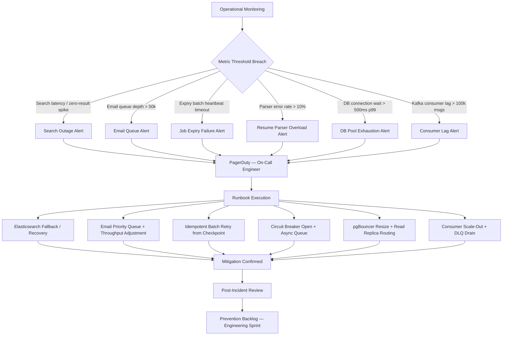

# Operations Edge Cases

## Overview

Operational reliability of the Job Board and Recruitment Platform is directly tied to candidate and employer outcomes: a search outage during a peak Monday morning session means hundreds of job seekers cannot find roles; a backed-up email queue means offer letters arrive late and candidates accept competing offers; a failed job-expiry batch means candidates waste effort applying to closed positions. The platform runs on Kubernetes on AWS with PostgreSQL (Aurora), Elasticsearch, Redis, Kafka, and multiple third-party integrations. Each layer introduces its own failure modes that must be anticipated, instrumented, and mitigated through runbooks, automated circuit breakers, and degraded-mode fallbacks. This document covers the most operationally critical failure scenarios, their detection thresholds, mitigation steps, and the post-incident review items that prevent recurrence.

---

### EC-01: Elasticsearch/OpenSearch Cluster Unavailable — Search Index Outage

**Failure Mode**
The Elasticsearch cluster transitions to `red` health status due to one of several causes: JVM heap OOM on the master node, unassigned shards following an AZ failure in `us-east-1`, an index mapping conflict after a code deployment, or a split-brain condition where two nodes simultaneously believe they are the elected master. All job search queries return 503 errors or empty result sets, and the autocomplete endpoint times out.

**Impact**
Every candidate session involving job search fails, resulting in zero new applications from search-driven traffic. The platform's primary value proposition — connecting candidates to jobs — is entirely unavailable for the duration of the outage. If the outage spans more than 20 minutes during peak hours (08:00–10:00 weekday local time in major markets), application volume for that day drops measurably. Employer contracts with SLA guarantees for job visibility may trigger penalty clauses.

**Detection**
- A synthetic canary Lambda executes a known-good search query (`q=software+engineer&location=New+York`) every 60 seconds and records `result_count` and `latency_ms` to CloudWatch. Alert: `result_count = 0` for two consecutive checks OR `latency_ms_p95 > 3000`.
- Elasticsearch cluster health check Lambda polls `/_cluster/health` every 30 seconds; status transition to `yellow` triggers a warning, `red` triggers P1 PagerDuty.
- Application-layer zero-result rate: CloudWatch metric filter on API access logs. Alarm: `(zero_result_count / total_search_count) > 0.40` for 3 minutes.

**Mitigation**
1. The API gateway's circuit breaker (configured via Resilience4j) opens after 3 consecutive Elasticsearch timeouts within 10 seconds. All subsequent search requests are routed to the PostgreSQL fallback without waiting for Elasticsearch.
2. PostgreSQL fallback uses `tsvector` full-text search with a GIN index on `(title, description, location)` in the `jobs` table. Query results are limited to 50 per page (versus 200 in Elasticsearch) to manage PostgreSQL load.
3. Faceted filters (industry, salary range, job type, posted date) are served from a Redis-cached aggregation refreshed every 5 minutes, remaining functional without Elasticsearch.
4. The frontend renders a non-intrusive banner: *"Job search is running in a limited capacity. Some filters and sorting options may be unavailable."*
5. Autocomplete suggestions are served from Redis sorted sets (pre-built from last healthy Elasticsearch snapshot) without live querying.

**Recovery**
1. On-call engineer SSHs to the Elasticsearch bastion and checks `/_cat/shards?v&h=index,shard,state,node`. For unassigned shards due to AZ failure, trigger reroute: `POST /_cluster/reroute` with `allow_primary: true` if data loss is acceptable in staging but not in production.
2. For split-brain: identify the minority partition via `/_cat/nodes?v`, isolate it, force-elect the majority master using the `cluster.initial_master_nodes` override, then re-join the minority node.
3. For JVM OOM: increase heap to 50% of node RAM (capped at 30 GB per Elasticsearch recommendation), restart the node with rolling restart to avoid full downtime.
4. After cluster returns to `green`, verify index integrity: `scripts/validate-search-index.ts --compare-postgres` checks job counts per employer between PostgreSQL and Elasticsearch.
5. Close the circuit breaker manually via admin API: `POST /admin/search/circuit-breaker/close`. Monitor for 5 minutes before removing the degraded mode banner.

**Prevention**
- Deploy cluster across 3 AZs with `minimum_master_nodes = 2` (quorum) and 1 replica shard per primary.
- Implement Index Lifecycle Management (ILM): roll over the jobs index monthly to prevent single-index bloat that slows recovery.
- Run quarterly chaos drills: terminate a random Elasticsearch data node during off-peak hours and verify the circuit breaker and fallback activate correctly within 90 seconds.
- Keep a warm PostgreSQL FTS read replica provisioned at all times, sized to handle 100% of search traffic independently.

---

### EC-02: Email Notification Queue Backs Up

**Failure Mode**
During a high-traffic event — a viral job posting, a major employer's bulk application notification, or a scheduled weekly "new jobs matching your profile" digest blast — the email notification queue depth grows from its normal ~2,000 messages to over 200,000. SendGrid's API begins throttling the platform's outbound calls (HTTP 429), or the email worker's connection pool to SendGrid becomes exhausted. Application confirmation emails, interview invites, and offer letters pile up in the Kafka `email.notifications` topic.

**Impact**
Candidates who submitted applications do not receive confirmation emails, creating anxiety and duplicate submissions. Interview invites sent by employers are delayed by hours, causing candidates to miss interviews or accept competing offers. Most critically, offer letters sent via the platform are delayed — in competitive markets, a candidate who does not receive an offer letter may accept another offer in the interim. Employer satisfaction drops and support ticket volume spikes.

**Detection**
- Kafka consumer lag monitoring via Burrow: alert when the `email-worker` consumer group on the `email.notifications` topic exceeds 50,000 unprocessed messages for more than 5 minutes.
- SendGrid API response monitoring: track HTTP 429 rate; alert when >5% of outbound API calls receive a 429 in any 1-minute window.
- Email delivery latency SLO: p95 delivery latency target is 60 seconds from event to delivery. CloudWatch alarm when p95 > 300 seconds.

**Mitigation**
1. The `email.notifications` Kafka topic is partitioned by message priority: `PRIORITY_CRITICAL` (offer letters, interview invites, account security), `PRIORITY_HIGH` (application confirmations), `PRIORITY_NORMAL` (employer notifications, system alerts), `PRIORITY_LOW` (marketing digests). The email worker processes partitions in priority order.
2. On 429 from SendGrid: implement exponential backoff (500 ms initial, 30 s max) per worker thread. Dynamically reduce throughput by 50% and redistribute worker threads from low-priority to high-priority partitions.
3. Automatically scale the email worker Kubernetes deployment from 3 to 10 replicas when consumer lag exceeds 20,000 messages (HPA based on a custom Kafka lag metric exposed via Prometheus Adapter).
4. Offer letters (PRIORITY_CRITICAL) are processed on a dedicated sub-consumer with a separate SendGrid sub-account that has its own rate limit allocation, ensuring offer delivery is never blocked by high-volume lower-priority traffic.
5. If the backlog cannot clear within 2 hours, trigger the "digest hold" circuit breaker: all PRIORITY_LOW marketing emails are paused and their Kafka offsets are held. Resources are fully reallocated to clearing PRIORITY_HIGH and PRIORITY_CRITICAL backlogs.

**Recovery**
1. Once SendGrid throttling clears (monitor via `GET /v3/stats` for current delivery rate), gradually ramp throughput back up starting with PRIORITY_CRITICAL, then PRIORITY_HIGH, then re-enable PRIORITY_NORMAL.
2. Do not retroactively resend application confirmation emails for messages delayed less than 4 hours, as sending duplicates to candidates creates confusion. For messages delayed more than 4 hours, resend with a note: *"We apologise for the delayed delivery of this message."*
3. After the incident, review digest scheduling: if a weekly digest blast triggered the backlog, shift its send time to 02:00 UTC Sunday to avoid overlap with peak application traffic.

**Prevention**
- Negotiate a dedicated SendGrid IP pool with a higher rate limit tier for transactional email (offer letters, interview invites), separate from the marketing IP pool.
- Implement a pre-send quota estimator: before scheduling a digest blast, calculate the expected volume and verify that the estimated throughput does not exceed 70% of the available rate limit window.
- Load-test the email pipeline quarterly with a synthetic 500,000-message blast in a staging environment to validate auto-scaling and priority queue behaviour.

---

### EC-03: Job Expiry Batch Processing Failure

**Failure Mode**
A daily Kubernetes CronJob runs at 00:05 UTC to find all jobs where `expires_at < NOW()` and update their `status` to `CLOSED`, remove them from the Elasticsearch index, and notify employers. The job processes jobs in batches of 500. On a night where 8,000 jobs expire simultaneously (common at the end of a monthly billing cycle), the job fails after processing 3,000 jobs due to a database deadlock with a concurrent employer-initiated job update, leaving 5,000 jobs active in the search index past their expiry date.

**Impact**
Candidates search for and apply to jobs that the employer considers closed. Employers receive applications for roles they are no longer hiring for, degrading ATS data quality. If the batch does not run for multiple nights, the search index becomes progressively more stale, increasing the expired-to-active ratio and undermining candidate trust.

**Detection**
- The CronJob writes a heartbeat row to `batch_run_log` with `job_name`, `started_at`, `last_heartbeat_at`, `batches_processed`, and `status`. An alert fires if `last_heartbeat_at` is more than 10 minutes old and `status = 'in_progress'`.
- A daily integrity check query runs at 06:00 UTC: `SELECT COUNT(*) FROM jobs WHERE expires_at < NOW() AND status = 'ACTIVE'`. Alert if count > 50.
- Post-batch Elasticsearch validation: compare the count of `status:ACTIVE` documents in Elasticsearch against the PostgreSQL `jobs` table; alert on discrepancy > 0.

**Mitigation**
1. The expiry batch is idempotent: it processes jobs using a `WHERE expires_at < NOW() AND status = 'ACTIVE'` filter, so restarting from the beginning is always safe and produces the correct outcome without double-processing.
2. Each batch of 500 jobs is processed in a database transaction with `SELECT ... FOR UPDATE SKIP LOCKED` to avoid deadlocks with concurrent employer updates. Rows locked by other sessions are skipped and re-queued for the next batch iteration.
3. Kafka events (`job.expired`) are emitted per job, ensuring Elasticsearch updates are decoupled from the database update. If the Elasticsearch consumer lags, the database is already correct; the search index catches up asynchronously.
4. A compensating run is triggered automatically at 06:00 UTC if the integrity check detects more than 50 overdue-expired active jobs: the compensating job targets only the overdue set and processes them with elevated priority.

**Recovery**
1. For candidates who submitted applications between the true expiry time and the batch correction time, generate a list via: `SELECT a.* FROM applications a JOIN jobs j ON a.job_id = j.id WHERE a.submitted_at > j.expires_at AND j.status = 'CLOSED'`.
2. Notify affected candidates: *"The job '[Title]' at [Company] closed before your application was received. Your application has been withdrawn. We're sorry for the inconvenience."*
3. Do not charge employers for applications received after their job's true expiry date (relevant for pay-per-application billing plans); issue automatic credits.

**Prevention**
- Migrate the expiry batch from a CronJob to a Kafka Streams job with micro-batch processing: stream `jobs` records with `expires_at` approaching in the next 5 minutes and process continuously rather than in a nightly bulk run. This eliminates the large-batch deadlock risk entirely.
- Add `expires_at` as a secondary filter in the candidate-facing job search query (`AND j.expires_at > NOW()`) to act as a real-time guard even if the batch has not yet run.
- Set `expires_at` with a 1-hour grace buffer beyond the employer-specified deadline, so jobs never expire before the employer-facing cutoff shown in the UI.

---

### EC-04: Resume Parsing Batch Fails During High-Volume Application Surge

**Failure Mode**
A major tech company posts a software engineering role on the platform that goes viral on LinkedIn and Reddit. Within 6 hours, 15,000 applications are submitted. The AI resume parsing service — provisioned for a sustained throughput of 500 parses per minute — becomes overloaded. Parse request latencies climb from 2 seconds to 45 seconds, and the service begins returning HTTP 503. The application submission API's synchronous dependency on the parser creates cascading timeouts, preventing candidates from completing their applications.

**Impact**
Candidates cannot submit applications during the peak traffic window, directly blocking conversion on the platform's core action. Each failed application is a permanent lost outcome — candidates move on to direct-apply flows. Employers miss high-quality candidates who gave up during the surge. Trust in platform reliability is eroded.

**Detection**
- Parser service P95 latency CloudWatch alarm: fires when `parser_request_latency_p95 > 10s` for 3 consecutive minutes.
- Circuit breaker state change event is published to `platform/parser/circuit-breaker` SNS topic; on-call is paged immediately.
- Application submission error rate alarm: fires when `(application_submission_5xx / total_submissions) > 0.05` over 5 minutes.

**Mitigation**
1. The application submission flow is restructured as two decoupled operations: (a) write the application record with `parse_status: PENDING` and store the raw resume file in S3 — this is synchronous and confirms the application; (b) enqueue the parse job to `resume.parse.requested` Kafka topic — this is asynchronous and does not block the candidate's submission response.
2. The circuit breaker on the parser service client opens when error rate exceeds 20% in a 30-second window. While open, all new applications are accepted immediately with `parse_status: PENDING_BACKOFF` and the parse is enqueued with a 15-minute delay.
3. The candidate receives a success confirmation immediately: *"Your application has been submitted. Your profile and job match score will be updated shortly as we process your resume."*
4. Employer-facing ATS view labels these candidates with a *"Profile processing"* badge until the parse completes, preventing employers from de-prioritising them due to missing skills data.
5. Kubernetes HPA for the parser deployment targets 60% CPU; during surges, it scales from 5 to 20 replicas within 90 seconds. A pre-warmed replica pool (minimum 3 standby pods) eliminates cold-start lag during rapid scaling.

**Recovery**
1. Once the parser service recovers, drain the `resume.parse.requested` topic in submission-order (oldest first), prioritising candidates whose applications are for the surge job and who have employer review activity (e.g., employer has viewed the application).
2. After all backlogged parses complete, trigger a notification to affected candidates: *"Your job matches and profile are now fully updated. Check your recommendations!"*
3. Notify the employer that full application processing is complete and match scores are now available for all applicants.

**Prevention**
- Treat resume parsing as a fully asynchronous background operation from day one of the platform architecture. Never block an application submission on a synchronous parser response.
- Implement a parse-result cache keyed by `SHA-256(resume_file_bytes)`: if the same resume file (bit-for-bit identical) is submitted multiple times (common when a candidate applies to multiple jobs), the parser is called only once and the result is reused across all applications.
- Conduct load tests simulating a 10,000-applications-per-hour surge against the parser service monthly; verify that HPA scaling completes within 90 seconds and error rate stays below 1%.

---

### EC-05: Database Connection Pool Exhausted During Peak Application Hour

**Failure Mode**
On a Monday morning between 08:30 and 09:30 UTC, a surge of concurrent candidates submitting applications, employers reviewing dashboards, and background jobs running simultaneously exhausts the pgBouncer connection pool. New database connection requests queue for longer than the configured 5-second wait timeout, causing the application API to return HTTP 503 errors for application submissions, employer login, and candidate searches routed to the primary database.

**Impact**
Application submissions fail at the moment of highest candidate intent — the top of the week when job seekers are most active. Employer logins fail, preventing hiring managers from reviewing overnight applications during their morning workflow. Read replicas are underutilised while the primary is saturated, indicating a routing misconfiguration.

**Detection**
- pgBouncer metrics exposed via `pgbouncer_exporter` to Prometheus: `pgbouncer_pools_sv_idle`, `pgbouncer_pools_cl_waiting`. Alert when `cl_waiting > 50` for 2 minutes.
- PostgreSQL `pg_stat_activity` query counts exposed to CloudWatch via a 30-second polling Lambda. Alert when `active_connections > 0.85 * max_connections`.
- Application API P99 latency alarm: fires when `api_latency_p99 > 5000ms` for 3 consecutive 1-minute windows.

**Mitigation**
1. Read traffic (job search, candidate profile reads, employer job-list fetches) is routed to the Aurora read replica cluster at the application layer via a `READ_REPLICA` data-source annotation in the TypeScript ORM configuration. This routing is enforced in code review via an ESLint rule that flags unannotated SELECT statements in non-transactional contexts.
2. pgBouncer transaction-mode pooling is configured with a pool size of 200 connections (matching Aurora's `max_connections` of 200 for the `db.r6g.2xlarge` instance class). Client-side `pool_size` in the application is set to 10 per pod × 20 pods = 200 total, which exactly saturates the pool under normal load. During the Monday surge, the pod count must scale first.
3. HPA scales the API pod count based on `requests_in_flight` (KEDA custom metric). When `requests_in_flight > 150` per pod, KEDA triggers a scale-out within 30 seconds, adding pods that each consume their share of the pgBouncer pool.
4. Write operations (application submissions) are queued via a Kafka topic `applications.write_requested` when the primary database pool is more than 80% exhausted. The queue worker drains writes at a controlled rate with backpressure, and the API returns a `202 Accepted` to the candidate with the assurance that their application is being recorded.
5. Immediate mitigation for on-call: run `scripts/rebalance-connections.sh` which increases pgBouncer `pool_size` by 20% (within Aurora's max_connections headroom) and restarts the pgBouncer pod with zero downtime via a rolling restart.

**Recovery**
1. After the peak hour subsides, reset pgBouncer pool size to baseline and drain the application write queue, verifying all `202 Accepted` applications are committed to the database.
2. Review `pg_stat_statements` for the peak period to identify any long-running or full-table-scan queries that consumed disproportionate connections. Add indexes or optimise queries identified as top contributors to connection hold time.

**Prevention**
- Upgrade Aurora instance class before the next projected peak (e.g., before a major job fair), as `max_connections` scales linearly with instance RAM.
- Implement application-level connection wait metrics: log every connection acquisition that waits more than 200 ms; use these logs to proactively rightsize the pool before exhaustion occurs.
- Introduce a `READ_COMMITTED` async write pattern for non-critical writes (e.g., `job_view_events`, `search_impression_events`) that bypass the primary database entirely and write to Kafka for eventual consistency.

---

### EC-06: Kafka Consumer Lag Grows When Processing Application Events

**Failure Mode**
A viral job posting at a major employer generates 8,000 applications in 2 hours. The `applications.events` Kafka topic receives one event per application lifecycle change (submitted, viewed by employer, shortlisted, rejected). The `application-processor` consumer group falls behind, accumulating a lag of 150,000 messages. Downstream effects include: employer dashboard showing stale application counts, candidate status emails delayed by hours, ATS sync to the employer's Greenhouse/Workday integration backlogged, and analytics pipeline metrics several hours stale.

**Impact**
Employers using the real-time dashboard to triage applications see counts that are hours out of date, undermining the platform's value proposition for active hiring. Candidates do not receive timely "we received your application" emails (see EC-02 for the email-specific case). The ATS integration falls behind, causing the employer's ATS to show a different application count from the platform dashboard, creating data reconciliation headaches.

**Detection**
- Burrow consumer lag monitoring: alert when the `application-processor` group lag on any partition exceeds 20,000 messages for 5 minutes.
- Consumer group partition assignment health: alert if any partition has zero assigned consumers (indicates a consumer crash without rebalance completion).
- End-to-end event latency SLO: the time from `application.submitted` event produced to `employer_dashboard.application_count` updated must be <30 seconds at p95. Alarm when p95 > 120 seconds.

**Mitigation**
1. The `applications.events` topic is configured with 12 partitions, allowing up to 12 concurrent consumer instances. The `application-processor` consumer group normally runs 3 replicas (1 pod per 4 partitions); KEDA triggers scale-out to 12 replicas when lag exceeds 10,000 messages, achieving 1 consumer per partition for maximum throughput.
2. The employer dashboard application count is served from a Redis counter (`employer:{id}:job:{id}:application_count`) incremented synchronously at application write time (before the Kafka event is produced), decoupled from consumer lag. This ensures the count displayed on the dashboard is always current, even during consumer lag events.
3. A poison message filter is applied in the consumer: messages that fail processing 3 times are routed to the `applications.events.dlq` (dead-letter queue) topic rather than blocking the partition. On-call engineers review the DLQ for schema errors or malformed payloads.
4. ATS sync is isolated to a separate lower-priority consumer group (`ats-sync-processor`) so lag in the main `application-processor` group does not affect it directly. However, during extreme lag, ATS sync is suspended (via a feature flag) and a batch catch-up sync is scheduled for off-peak hours.

**Recovery**
1. After scaling out consumers and clearing the backlog, check for message ordering issues: application status events that arrived out of order (e.g., a `shortlisted` event processed before the corresponding `submitted` event) must be detected and corrected using the `event_sequence_number` field on each message.
2. Replay DLQ messages after fixing the root-cause schema or logic error: `scripts/replay-dlq.ts --topic=applications.events.dlq --target=applications.events --since=backlog_start_ts`.
3. Send a delayed "application received" email to all candidates whose confirmation email was held in the backlog for more than 30 minutes, with an apology note.

**Prevention**
- Increase the `applications.events` topic partition count from 12 to 24 before projected high-traffic events (major employer launches, job fair seasons). Partition count changes require a Kafka admin operation with zero downtime but must be planned in advance.
- Set consumer `max.poll.records = 100` and `max.poll.interval.ms = 30000` to prevent the consumer from timing out on slow processing batches, which triggers unnecessary rebalances and amplifies lag during surges.
- Implement the employer dashboard counter as a write-time synchronous increment (Redis INCR) rather than a consumer-derived count, permanently decoupling dashboard freshness from consumer lag for this critical metric.
- Run monthly consumer throughput benchmarks: simulate 10,000 events/minute and verify the auto-scaler brings lag below 5,000 messages within 3 minutes.
