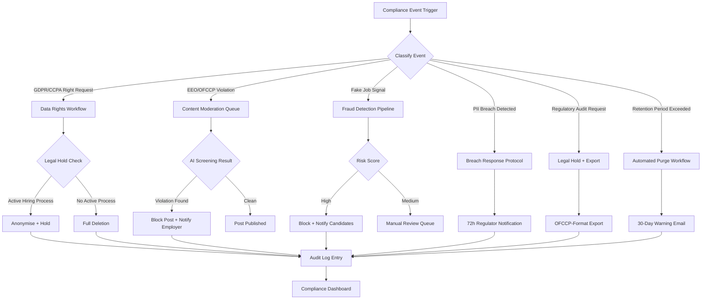

# Security and Compliance Edge Cases

## Overview

The Job Board and Recruitment Platform handles some of the most sensitive personal data in any consumer application: full legal names, contact details, employment history, salary expectations, and uploaded documents such as CVs and identification. Compliance obligations span multiple jurisdictions (GDPR in the EU, CCPA in California), federal employment law (EEO Title VII, OFCCP regulations for federal contractors), and platform-level trust concerns such as fake job detection and fraud prevention. A single compliance failure — a missed deletion request, a discriminatory job post that goes live, or a data breach — can trigger regulatory fines, class-action exposure, and irreparable reputational harm. This document catalogues the most consequential edge cases in the security and compliance domain, with concrete mitigation procedures mapped to regulatory requirements.

---

### EC-01: GDPR/CCPA Data Subject Deletion Request from a Candidate

**Failure Mode**
A candidate submits a "right to erasure" request (GDPR Article 17) or a "right to delete" request (CCPA § 1798.105). The platform must delete or anonymise all personal data relating to that candidate within 30 days. However, the candidate has active applications currently under review by employers who are federal contractors, triggering a conflicting legal obligation to retain applicant flow logs for a minimum of 2 years under OFCCP 41 CFR Part 60-1.

**Impact**
Deleting records without resolving the legal hold violates OFCCP regulations, exposing the platform to federal audit findings. Failing to act on the deletion request within 30 days violates GDPR Article 17, with fines up to €20M or 4% of global annual turnover. The conflict between these obligations must be resolved deterministically and documented.

**Detection**
- A dedicated `/privacy/data-deletion-request` API endpoint receives and records all deletion requests in `data_rights_requests` table with `request_type`, `submitted_at`, `sla_deadline` (30 calendar days from submission), and `status`.
- An automated conflict-check job runs immediately upon request creation: it queries `applications` joined against `employers` where `employer.federal_contractor = true` and `application.status NOT IN ('WITHDRAWN', 'REJECTED_FINAL')`.
- SLA countdown monitoring alerts the data-protection officer (DPO) at 7 days and 2 days before the deadline via PagerDuty.

**Mitigation**
1. **No legal hold**: If no active applications exist with federal contractor employers, proceed with full erasure within 30 days. Full erasure means: hard-delete PII columns (`first_name`, `last_name`, `email`, `phone`, `address`, `date_of_birth`), replace with a `[DELETED]` tombstone marker in audit-critical foreign-key references, delete all resume files from S3, remove profile from Elasticsearch index, unsubscribe from all email lists.
2. **Legal hold applies**: Anonymise the candidate record immediately (replace all PII with pseudonymous tokens, delete resume files, remove from search index and employer-visible dashboards). Retain the anonymised application flow record (application date, disposition, reason code) for the OFCCP retention window. Set a `legal_hold_expiry` date. Schedule full deletion on `legal_hold_expiry + 1 day`.
3. In both cases, send the candidate a confirmation email within 72 hours of receiving the request, documenting what was deleted, what is retained and why, and the retention expiry date.
4. Record a complete audit trail in the `gdpr_audit_log` table: request ID, action taken, legal basis, data categories affected, executing service account, and timestamp of each deletion step.

**Recovery**
1. If a deletion job fails partway (e.g., S3 delete times out), the job is idempotent and retries from the last uncommitted step. Each step is committed to `data_rights_requests.completed_steps` (JSONB array) before proceeding to the next.
2. If the SLA deadline is breached due to a system failure, auto-escalate to the DPO and Legal team with a full incident report and evidence of good-faith remediation attempts.

**Prevention**
- Map every table and S3 prefix containing candidate PII in a data inventory (`data_inventory.yaml` in the compliance repo). The deletion job is generated from this inventory, ensuring no new PII store is missed after a schema change.
- Run a quarterly deletion-request drill: submit a test deletion request for a synthetic candidate and verify all PII is removed within 24 hours, confirming the inventory is current.
- Integrate the legal-hold check into the employer onboarding flow: flag federal contractor status at account creation so the conflict check runs with zero latency.

---

### EC-02: EEO/OFCCP — Job Post Contains Discriminatory Language

**Failure Mode**
An employer submits a job posting containing language that violates Title VII of the Civil Rights Act, the Age Discrimination in Employment Act (ADEA), or the Americans with Disabilities Act (ADA). Examples include: age preferences ("recent graduate preferred", "must be energetic and young"), gender-coded language ("salesman", "stewardess"), disability-exclusionary requirements ("must have a valid driver's licence" for a non-driving role), or nationality/citizenship requirements that exceed legal allowances.

**Impact**
Publishing a discriminatory job post exposes the platform to EEOC enforcement action and civil liability under Title VII and ADEA. Candidates who view the post and do not apply due to the discriminatory language may have standing to file disparate-impact claims. Employer brand and platform reputation are damaged.

**Detection**
- All new and edited job post content passes through an AI content-screening service before the `status` transitions from `DRAFT` to `ACTIVE`. The screener runs three checks: (1) a fine-tuned classifier for EEO-prohibited language categories, (2) a pattern-matching ruleset for known disqualifying phrases, and (3) a legal review flag for edge cases scoring between 0.40 and 0.80 confidence.
- The screening result is stored in `job_screening_results` with `category` (e.g., `AGE_DISCRIMINATION`, `GENDER_CODED_LANGUAGE`), `confidence_score`, `matched_phrases` (JSONB), and `routing` (`auto_block` / `legal_review` / `approved`).

**Mitigation**
1. **Auto-block** (confidence ≥ 0.80): Job post is held in `PENDING_COMPLIANCE_REVIEW` status. It does not appear in search or employer dashboard as active. The employer receives an email citing the specific violation category and the offending phrase(s), with a link to EEO writing guidelines and an inline editor to correct the post.
2. **Legal review queue** (confidence 0.40–0.79): Job post is published but flagged with a `COMPLIANCE_REVIEW_PENDING` badge visible only to admins. A task is created in the compliance team's Jira queue with a 24-hour SLA. If reviewed and confirmed as violating, the post is retroactively taken down and the employer notified.
3. **Re-submission**: After the employer edits the post, the content screening runs again. Three auto-block outcomes on the same post within 30 days trigger a manual employer account review.
4. Employer notifications cite the specific legal basis (e.g., "ADEA 29 U.S.C. § 623 prohibits age preferences in job advertisements") rather than generic policy language, enabling employers to understand and remedy the issue.

**Recovery**
1. If a discriminatory post was live for any period before detection, a retroactive report is generated listing all candidates who viewed but did not apply during that window (derived from search impression logs), for potential outreach if required by legal counsel.
2. The compliance team can issue a corrected post on the employer's behalf (with employer consent) to minimise listing downtime for legitimate roles.

**Prevention**
- Provide an employer-facing "EEO language checker" tool in the job editor that gives real-time feedback as the employer types, surfacing suggestions before submission.
- Maintain the discriminatory-language classifier with monthly retraining using cases escalated through the legal review queue, capturing edge cases the initial model missed.
- Require all new employer accounts to complete a 5-minute EEO compliance acknowledgement at onboarding, which is recorded and timestamped for audit purposes.

---

### EC-03: Fake Job Posting Detected — Resume/Credential Harvesting

**Failure Mode**
A fraudulent actor creates an employer account using a disposable email domain and posts a series of highly attractive-seeming jobs (e.g., "Remote Data Entry Specialist — $80/hr, No Experience Required") designed to harvest candidate resumes, personal details, and potentially financial information (fake "equipment deposit" requests). The fake employer may impersonate a real company by copying its name and logo.

**Impact**
Candidates submit resumes containing full PII to a fraudulent party, exposing them to identity theft and financial fraud. The platform is legally and reputationally liable for facilitating the fraud. If impersonation is involved, the real company may pursue trademark infringement claims.

**Detection**
- **Velocity check**: New employer account (< 7 days old) posting more than 3 jobs per day triggers a `HIGH_VELOCITY` flag.
- **Content similarity scan**: NLP cosine-similarity check against a corpus of known scam job patterns (maintained in `scam_job_patterns` table). Similarity score > 0.75 generates a `SCAM_PATTERN_MATCH` signal.
- **Domain verification**: Employer email domain is checked against a blocklist of known disposable/throwaway domains (updated via `disposable-email-domains` open-source list). Corporate email domains are verified against DNS MX records and DKIM.
- **Impersonation check**: Employer display name is fuzzy-matched against a database of verified companies using Jaro-Winkler distance; score > 0.90 with a non-matching domain triggers an `IMPERSONATION_RISK` flag.
- **Candidate report signal**: Three or more candidate reports of the same employer within 48 hours auto-escalate to trust-and-safety review.

**Mitigation**
1. **High-risk employer account** (two or more signals active): all job posts are held in `PENDING_VERIFICATION` status — not visible to candidates. The employer receives an email requesting identity verification (government-issued ID + proof of business registration).
2. **Post-publication detection**: If fake signals are detected after a job is already live, the post is immediately set to `SUSPENDED` (removed from search index within 60 seconds via Kafka → Elasticsearch delete event). A banner is shown to any candidate who viewed the post: *"This job posting has been removed pending verification. We recommend not sharing personal information with this employer."*
3. Candidates who have already submitted applications to the suspended post receive a proactive warning email: *"We have identified a concern with a job post you applied to. Please do not respond to further requests from this employer. If you shared financial information, please contact your bank."*
4. The fraudulent employer account is suspended; all associated data is preserved for law enforcement referral.

**Recovery**
1. If a legitimate employer was incorrectly flagged (false positive): provide a fast-track manual review within 4 business hours, restore posts, and send an apology with a credit for next month's subscription.
2. File a formal incident report including the candidate list, data shared, and employer account details; share with the platform's legal team and, where required, national cybercrime reporting bodies (IC3 in the US, Action Fraud in the UK).

**Prevention**
- Require email domain verification (click-through confirmation) before any job post is published, regardless of risk signals.
- Implement progressive trust levels: new accounts can post a maximum of 2 jobs until they complete phone verification and payment method confirmation (Stripe).
- Partner with LinkedIn identity verification API to allow employers to verify their company page ownership, adding a "Verified Employer" badge that significantly increases candidate trust.

---

### EC-04: Candidate PII Data Breach

**Failure Mode**
An attacker exploits a misconfigured S3 bucket ACL or an unpatched SQL injection vulnerability to access the `candidates` table and/or the S3 resumes bucket, exfiltrating names, email addresses, phone numbers, postal addresses, employment histories, and uploaded resume files for a subset of platform users. The breach is detected via anomalous data-egress alarms.

**Impact**
Regulatory notification obligations under GDPR Article 33 (notify supervisory authority within 72 hours) and CCPA (notify California AG and affected residents without unreasonable delay) are triggered. Affected candidates face risks of identity theft, phishing, and professional harm. The platform faces fines, class-action litigation, and reputational damage.

**Detection**
- AWS GuardDuty detects anomalous S3 data-egress patterns (large volume downloads from an unexpected IP range) and triggers a P1 PagerDuty alert.
- RDS enhanced monitoring alerts on unusual `SELECT *` query volume against the `candidates` table from non-application service accounts.
- A honeypot row exists in the `candidates` table with a unique email address monitored by a canary email account; any login attempt or email receipt to the canary triggers an immediate breach alert.

**Mitigation**
1. **Immediate containment** (0–2 hours): Revoke the compromised credentials or patch the exploited endpoint. Rotate all S3 bucket access keys. Enable S3 Block Public Access on all buckets if not already set. Isolate the affected RDS instance to a restricted security group blocking all non-VPC traffic.
2. **Scope assessment** (2–24 hours): Run forensic queries to identify the exact rows and S3 objects accessed using CloudTrail and RDS audit logs. Determine the time window, data categories, and approximate number of affected individuals.
3. **Regulatory notification** (within 72 hours of confirmed breach): Notify relevant supervisory authorities (ICO for UK/EU, California AG for CCPA). Notification must include: nature of breach, data categories and approximate number of individuals, likely consequences, and measures taken to address the breach.
4. **Candidate notification**: Send individualised breach notification emails to affected candidates within the regulatory window, describing the data exposed, the risk, and recommended mitigations (password change, credit monitoring offer).
5. Offer 12 months of free credit monitoring via a third-party service to all affected candidates.

**Recovery**
1. Conduct a full security audit of all data stores, IAM roles, and API endpoints before restoring normal operations.
2. Engage a third-party forensic firm to independently validate the scope of the breach and confirm no additional exfiltration occurred.
3. Publish a transparent post-incident report on the platform's trust centre within 30 days of the breach, describing root cause, timeline, and systemic fixes implemented.

**Prevention**
- Enforce principle of least privilege: application service accounts have row-level security policies in PostgreSQL; no service account has `SELECT *` on the `candidates` table without a `WHERE candidate_id = $1` clause enforced.
- Enable S3 server-side encryption (SSE-KMS) for all resume buckets; rotate KMS keys annually.
- Run OWASP Top 10 automated scans on every PR targeting the main branch; block merge if critical findings are present.
- Conduct an annual penetration test by an external firm with findings tracked to remediation.

---

### EC-05: OFCCP Federal Contractor Audit — Government Requests Applicant Flow Log Data

**Failure Mode**
The US Department of Labor's Office of Federal Contract Compliance Programs (OFCCP) initiates a compliance audit of a federal-contractor employer using the platform. The OFCCP issues a Scheduling Letter requesting the employer's Internet Applicant data: a complete log of all individuals who expressed interest in a position, whether they were considered, and the reason for non-selection, covering a specific date range (typically 2 years).

**Impact**
Failure to produce complete, accurately formatted applicant flow log data within the 30-day response window results in enforcement proceedings, potential contract debarment for the employer, and secondary liability for the platform as the system of record. Missing disposition codes, incomplete application records, or inability to produce the data in the required format are treated as non-compliance.

**Detection**
This is a planned/foreseeable event rather than an unexpected failure. The platform proactively supports this flow via a dedicated OFCCP export feature in the employer admin console.

**Mitigation**
1. The `applications` table stores the following OFCCP-required fields for every applicant at every stage: `applied_at`, `disposition_status` (e.g., `INTERVIEWED`, `OFFER_EXTENDED`, `NOT_SELECTED`), `disposition_reason_code` (standardised OFCCP reason codes: `QUALIFICATIONS_INSUFFICIENT`, `POSITION_FILLED`, `WITHDREW`, etc.), and `selection_date`. These fields are mandatory for employers flagged as `federal_contractor = true`.
2. The employer admin console exposes `Reports → OFCCP Applicant Flow Log → Generate` with date range and position filters. The export is produced in both CSV (human-readable) and structured JSON formats within 60 seconds for date ranges up to 2 years.
3. The export includes all Internet Applicants (as defined by OFCCP: individuals who applied via the internet and met the basic qualifications), not just those who progressed in the process.
4. A data-retention lock prevents deletion of any applicant record linked to a federal-contractor employer job posting for a minimum of 2 years from the application date, regardless of any candidate data-deletion request (see EC-01 legal hold logic).

**Recovery**
1. If an employer realises disposition codes were not consistently recorded (e.g., because the feature was not enabled at account creation), a backfill workflow is available: the employer can bulk-assign disposition codes to historical applications via a CSV upload, with each change timestamped and audited.
2. The platform's compliance team provides a signed letter on letterhead confirming the data was generated from the system of record and has not been modified, which employers can include in their OFCCP response package.

**Prevention**
- During federal-contractor employer onboarding, enforce completion of a disposition-code configuration step before the first job post is published.
- Run a monthly automated check: for each federal-contractor employer, identify any applications older than 30 days with a null `disposition_reason_code` and send the employer a reminder to update records.
- Retain OFCCP audit logs (all export events, including who ran the export and at what timestamp) for 7 years.

---

### EC-06: Candidate Data Retained Beyond GDPR Retention Period for Inactive Accounts

**Failure Mode**
A candidate created an account and uploaded a resume 4 years ago but has not logged in, applied, or interacted with the platform in 3 years. Under the platform's GDPR-compliant data retention policy, personal data for inactive accounts must be deleted after 3 years of inactivity. The automated retention enforcement job fails to identify this account due to a bug in the inactivity calculation query (e.g., edge case around timezone-normalised `last_active_at` comparison), and the account — with full PII — remains in the database indefinitely.

**Impact**
Retention of data beyond its lawful purpose violates GDPR Article 5(1)(e) (storage limitation principle). If discovered during a regulatory audit, it constitutes an independent GDPR violation. Accumulating stale records also increases the blast radius of any future data breach.

**Detection**
- A monthly compliance report queries `SELECT COUNT(*) FROM candidates WHERE last_active_at < NOW() - INTERVAL '3 years' AND deletion_scheduled_at IS NULL` and alerts if the count exceeds 0.
- The retention enforcement job logs every account it evaluates and its decision, so false-negative cases (accounts that should be flagged but were not) can be detected by comparing the job's output against the compliance report query.

**Mitigation**
1. **30-day warning**: 30 days before the retention deadline, send the candidate an email: *"Your account has been inactive for 3 years. We will delete your data on [date] unless you log in or request an extension."* Include a clear opt-in to extend retention for another 3 years, and a link to download their data before deletion.
2. **Right to object**: Candidates have the right under GDPR Article 21 to object to processing; however, storage limitation is not the same as processing for a purpose — the platform must delete data when the lawful basis expires. Objections are noted but do not override the storage limitation obligation.
3. **Automated deletion**: On the scheduled deletion date, run the same erasure procedure as EC-01 (full deletion path), recording each step in `gdpr_audit_log`.
4. **Retention period clock reset**: Any meaningful user interaction (login, job search, application) resets the `last_active_at` timestamp and the retention clock.

**Recovery**
1. If the enforcement job had a bug that left overdue accounts undeleted, run a one-time remediation script against the compliance report query results. Prioritise accounts with the oldest `last_active_at` values first.
2. Document the bug, the period of non-compliance, and the remediation in the platform's GDPR Records of Processing Activities (RoPA), which may need to be disclosed to the supervisory authority if the number of affected accounts is material.

**Prevention**
- Write property-based tests for the retention calculation logic covering edge cases: leap years, DST transitions, accounts created in non-UTC timezones, accounts with null `last_active_at` (treat as account creation date).
- Separate the inactivity check query from the deletion job: run them independently and cross-check their outputs before any deletion is committed, requiring both to agree on the set of accounts to delete.
- Publish the retention policy clearly on the privacy policy page and in the candidate account settings, so candidates are not surprised by deletion notices.
