# Architecture Diagram — Job Board and Recruitment Platform

This document describes the microservices architecture of the platform, covering service responsibilities, infrastructure dependencies, communication patterns, and deployment topology. The system is designed for horizontal scalability, independent deployability of services, and resilience against partial failures.

---

## Architectural Principles

| Principle | Implementation |
|---|---|
| **Loose coupling** | Services communicate via Kafka events for async operations; REST/gRPC for sync queries |
| **Single responsibility** | Each service owns exactly one bounded context and its data store |
| **Resilience** | Circuit breakers (Resilience4j) on all sync inter-service calls; dead-letter queues for async |
| **Observability** | Distributed tracing (OpenTelemetry → Jaeger), structured JSON logs (ELK), RED metrics (Prometheus) |
| **Security** | Zero-trust networking in VPC; all inter-service traffic mTLS; secrets in AWS Secrets Manager |
| **Scalability** | Stateless services behind ALB; Kafka consumer groups scale horizontally; read replicas for heavy queries |

---

## Service Responsibilities

### API Gateway (Kong / AWS API Gateway)
Handles all inbound traffic. Responsibilities: JWT validation, RBAC enforcement, rate limiting (100 req/min per user, 10 req/min for auth endpoints), request routing to upstream microservices, request/response logging, SSL termination, and API versioning.

### Auth Service
Issues and validates JWTs. Supports password auth, OAuth 2.0 (Google, LinkedIn SSO), and MFA via TOTP. Manages RBAC roles: `RECRUITER`, `HR_ADMIN`, `HR_DIRECTOR`, `HIRING_MANAGER`, `CANDIDATE`, `SUPERADMIN`. Refresh token rotation with Redis-backed revocation list.

### Job Service
Owns the full lifecycle of a job posting: CRUD, approval workflow state machine, job board distribution triggers. Publishes `job.created`, `job.published`, `job.closed` events to Kafka. Maintains an external reference table mapping internal jobIds to LinkedIn/Indeed external IDs.

### Application Service
Ingests applications, coordinates resume upload via pre-signed S3 URLs, stores candidate answers to screening questions, and triggers the AI parsing pipeline. Publishes `application.received`, `application.screened`, `application.hired` events.

### ATS Service (Applicant Tracking)
Manages the candidate pipeline for each job. Owns pipeline configuration (stages, SLA rules, auto-advance thresholds), stage transition logic, and candidate pool management. Provides the primary data source for the recruiter ATS dashboard.

### Interview Service
Schedules interviews, manages rounds, collects feedback, and integrates with Calendar and Zoom APIs. Enforces feedback SLAs. Aggregates scores across interviewers to produce a hiring recommendation signal.

### Offer Service
Generates personalised offer letters from versioned templates, orchestrates the director-level approval workflow, dispatches DocuSign envelopes, and handles negotiation cycles. Triggers HRIS onboarding upon full execution.

### AI/ML Service
Hosts the resume parsing pipeline (PDF extraction → NLP → skill extraction → structured JSON), the job-candidate matching scoring model (OpenAI embeddings + cosine similarity), and the smart recommendation engine. Processes jobs asynchronously from a Kafka topic to avoid blocking the application ingestion path.

### Integration Service
Manages all outbound integrations with external job boards (LinkedIn, Indeed, Glassdoor, ZipRecruiter). Handles API credential rotation, board-specific schema mapping, rate limit budgets, and re-posting on failures. Consumes `job.published` events and publishes `job.distributed` confirmations.

### Analytics Service
Consumes events from all services, computes business metrics (time-to-hire, funnel conversion, source ROI), writes to the analytics PostgreSQL schema, and drives micro-batch ETL to the data warehouse. Exposes a read-only Analytics API.

### Notification Service
Consumes domain events from Kafka and dispatches multi-channel notifications: transactional email (SendGrid), SMS (Twilio), and in-app WebSocket push. Manages template rendering, delivery scheduling (e.g., delayed rejection emails), bounce handling, and unsubscribe lists.

### GDPR Service
Handles data subject requests: right-of-access exports (JSON/ZIP), erasure requests with legal hold checks, consent management, and compliance reporting. Orchestrates cross-service data deletion via a SAGA coordinator and writes to a WORM audit log.

---

## Architecture Diagram

```mermaid
flowchart TB
    subgraph Clients["Client Layer"]
        WebApp["Web Application\nReact 18 + TypeScript\nVite + TailwindCSS"]
        MobileApp["Mobile App\nReact Native\niOS + Android"]
        ExtBoards["External Job Boards\nLinkedIn / Indeed\nGlassdoor / ZipRecruiter"]
        WebhookSrc["Webhook Sources\nDocuSign / Checkr\nCalendar Push Notifications"]
    end

    subgraph Edge["Edge & Security Layer"]
        CDN["CDN\nCloudFront\nStatic assets + API cache"]
        APIGW["API Gateway\nKong / AWS API GW\n• JWT validation\n• Rate limiting\n• Routing\n• SSL termination"]
        WAF["WAF\nAWS WAF\nOWASP Top 10\nDDoS protection"]
    end

    subgraph CoreServices["Core Microservices"]
        direction TB
        AuthSvc["Auth Service\nJWT + OAuth 2.0\nMFA + RBAC\nRefresh token rotation"]
        JobSvc["Job Service\nJob CRUD\nApproval workflow\nExternal board references"]
        AppSvc["Application Service\nApplication ingestion\nResume upload coordination\nScreening question answers"]
        ATSSvc["ATS Service\nPipeline management\nStage transitions\nCandidate pool"]
        InterviewSvc["Interview Service\nScheduling\nRounds & feedback\nCalendar + Zoom sync"]
        OfferSvc["Offer Service\nOffer generation\nApproval workflow\nDocuSign orchestration"]
        AnalyticsSvc["Analytics Service\nMetrics aggregation\nFunnel reporting\nSource ROI"]
        NotifSvc["Notification Service\nEmail / SMS / In-app\nTemplate rendering\nDelivery scheduling"]
        AISvc["AI/ML Service\nResume parsing\nJob matching score\nCandidate recommendations"]
        IntegrationSvc["Integration Service\nLinkedIn API\nIndeed API\nGlassdoor API"]
        GDPRSvc["GDPR Service\nData export\nErasure requests\nConsent management"]
    end

    subgraph DataLayer["Data Layer"]
        direction LR
        PG_Auth[("PostgreSQL\nAuth DB\nusers, sessions\nroles, permissions")]
        PG_Job[("PostgreSQL\nJob DB\njobs, requirements\napproval workflows")]
        PG_App[("PostgreSQL\nApplication DB\napplications, answers\npipeline stages")]
        PG_Interview[("PostgreSQL\nInterview DB\ninterviews, rounds\nfeedback, slots")]
        PG_Offer[("PostgreSQL\nOffer DB\noffer letters\nnegotiations")]
        PG_Analytics[("PostgreSQL\nAnalytics DB\nhiring_analytics\nmetric time-series")]
        Redis[("Redis Cluster\n• Session cache\n• Rate limit counters\n• JWT revocation list\n• Hot query cache TTL=300s")]
        Kafka[("Apache Kafka\n• platform.events\n• resume.parse.requested\n• notification.dispatch\n• analytics.raw_events\n3 brokers, RF=3")]
        ES[("Elasticsearch\n• Resume full-text index\n• Job search index\n• Skill taxonomy index\n• Candidate search")]
        S3[("AWS S3\n• resumes bucket\n• offer-letters bucket\n• exports bucket\n• audit-logs bucket (WORM)")]
    end

    subgraph ExternalSystems["External Integrations"]
        LinkedIn["LinkedIn\nJob Posting API\nOAuth 2.0"]
        Indeed["Indeed\nPublisher API\nAPI Key"]
        GCal["Google Calendar API\nOAuth 2.0"]
        Outlook["Outlook Calendar API\nOAuth 2.0"]
        Zoom["Zoom API\nJWT"]
        DocuSign["DocuSign API\nOAuth 2.0\neSign"]
        Checkr["Checkr API\nBackground checks"]
        SendGrid["SendGrid\nTransactional email\nMTLS"]
        Twilio["Twilio\nSMS delivery"]
        OpenAI["OpenAI API\nEmbeddings model\ntext-embedding-3-large"]
        Workday["Workday / BambooHR\nHRIS onboarding\nREST API"]
    end

    subgraph Monitoring["Observability Stack"]
        Prometheus["Prometheus\nMetrics scraping\nRED metrics per service"]
        Grafana["Grafana\nDashboards\nAlerting"]
        Jaeger["Jaeger\nDistributed tracing\nOpenTelemetry"]
        ELK["ELK Stack\nElasticsearch\nLogstash + Kibana"]
    end

    %% Client to Edge
    WebApp -->|HTTPS| CDN
    MobileApp -->|HTTPS| APIGW
    CDN --> APIGW
    WAF --> APIGW
    ExtBoards -->|Webhook HTTPS POST| APIGW
    WebhookSrc -->|Webhook HTTPS POST| APIGW

    %% Edge to Services
    APIGW -->|REST HTTP/2| AuthSvc
    APIGW -->|REST HTTP/2| JobSvc
    APIGW -->|REST HTTP/2| AppSvc
    APIGW -->|REST HTTP/2| ATSSvc
    APIGW -->|REST HTTP/2| InterviewSvc
    APIGW -->|REST HTTP/2| OfferSvc
    APIGW -->|REST HTTP/2| AnalyticsSvc
    APIGW -->|REST HTTP/2| GDPRSvc

    %% Sync inter-service calls (gRPC)
    JobSvc -->|gRPC| AppSvc
    AppSvc -->|gRPC| ATSSvc
    OfferSvc -->|gRPC| AppSvc
    InterviewSvc -->|gRPC| ATSSvc
    GDPRSvc -->|gRPC| AppSvc
    GDPRSvc -->|gRPC| InterviewSvc
    GDPRSvc -->|gRPC| OfferSvc
    GDPRSvc -->|gRPC| NotifSvc

    %% Kafka async (AMQP-style)
    JobSvc -->|Produce AMQP| Kafka
    AppSvc -->|Produce AMQP| Kafka
    InterviewSvc -->|Produce AMQP| Kafka
    OfferSvc -->|Produce AMQP| Kafka
    Kafka -->|Consume AMQP| AISvc
    Kafka -->|Consume AMQP| NotifSvc
    Kafka -->|Consume AMQP| AnalyticsSvc
    Kafka -->|Consume AMQP| IntegrationSvc

    %% Services to Data Layer
    AuthSvc --- PG_Auth
    AuthSvc --- Redis
    JobSvc --- PG_Job
    AppSvc --- PG_App
    AppSvc --- S3
    AppSvc --- ES
    ATSSvc --- PG_App
    InterviewSvc --- PG_Interview
    OfferSvc --- PG_Offer
    OfferSvc --- S3
    AnalyticsSvc --- PG_Analytics
    AISvc --- S3
    AISvc --- ES
    GDPRSvc --- S3
    NotifSvc --- Redis
    JobSvc --- Redis

    %% External integrations
    IntegrationSvc -->|REST HTTPS| LinkedIn
    IntegrationSvc -->|REST HTTPS| Indeed
    InterviewSvc -->|REST HTTPS| GCal
    InterviewSvc -->|REST HTTPS| Outlook
    InterviewSvc -->|REST HTTPS| Zoom
    OfferSvc -->|REST HTTPS| DocuSign
    GDPRSvc -->|REST HTTPS| Checkr
    NotifSvc -->|SMTP/REST HTTPS| SendGrid
    NotifSvc -->|REST HTTPS| Twilio
    AISvc -->|REST HTTPS| OpenAI
    OfferSvc -->|REST HTTPS| Workday

    %% Observability
    CoreServices -->|Metrics scrape| Prometheus
    Prometheus --> Grafana
    CoreServices -->|Trace spans OTLP| Jaeger
    CoreServices -->|Structured logs| ELK
```

---

## Infrastructure Sizing (Production Baseline)

| Component | Spec | Notes |
|---|---|---|
| API Gateway | 2× ECS tasks, 512 MB RAM | Auto-scales to 10× under load |
| Core microservices | 2× ECS tasks per service, 1 GB RAM | P50 response < 100 ms |
| PostgreSQL | RDS Aurora PostgreSQL 15, db.r6g.large, 1 writer + 2 readers | Per-service schema isolation |
| Redis | ElastiCache Redis 7, cache.r7g.large, cluster mode enabled | 6 shards for throughput |
| Kafka | 3 MSK brokers, kafka.m5.large, RF=3, 30-day retention | 3 partitions per topic minimum |
| Elasticsearch | 3-node AWS OpenSearch, m6g.large.search | Separate index per entity type |
| S3 | Standard tier for hot data; Glacier Instant Retrieval after 90 days | Object lock on audit-logs bucket |
| AI/ML Service | 2× ECS tasks with GPU (g4dn.xlarge equivalent) | Batch inference queue drains within 10 s |

---

## Failure Mode Analysis

| Failure | Impact | Mitigation |
|---|---|---|
| Kafka broker loss | Async processing delayed | RF=3 ensures no data loss; consumer resumes from committed offset |
| AI/ML Service down | New applications cannot be scored | Applications stored successfully; parse retried when service recovers via DLQ replay |
| DocuSign API unavailable | Offer signing blocked | Offer saved in APPROVED state; retry webhook replay when service restored |
| PostgreSQL writer failure | Write operations fail | Aurora automatic failover to reader promotes in < 30 s |
| LinkedIn API rate limit | Job distribution delayed | Exponential backoff + retry queue in Integration Service; boards are independent |
| Redis cache miss | Elevated DB load | Circuit breaker limits cache-miss storm; DB connection pool prevents cascade |
