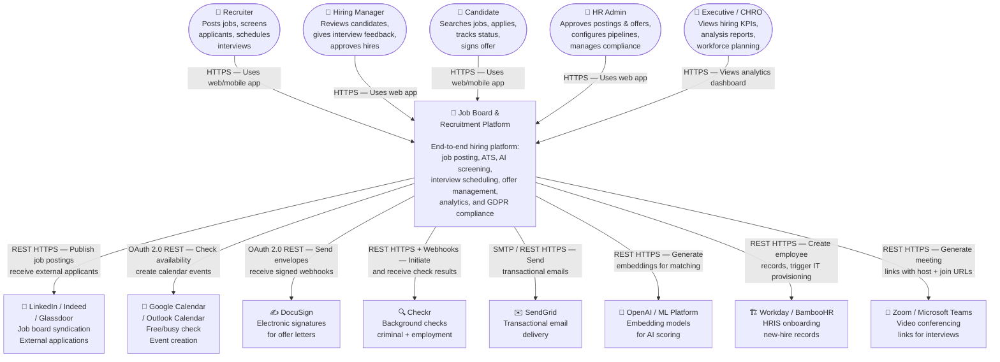

# C4 Context and Container Diagrams — Job Board and Recruitment Platform

The C4 model (Context, Container, Component, Code) provides a hierarchical set of diagrams that communicate software architecture at different levels of detail. This document covers the first two levels: the **System Context** diagram, which shows how the platform fits into the broader ecosystem of users and external systems, and the **Container** diagram, which zooms into the platform boundary to show its deployable units and how they communicate.

---

## Level 1 — System Context Diagram

The context diagram answers the question: *Who uses the system and what external systems does it depend on?* It establishes the boundary of the "Job Board and Recruitment Platform" as a single box and maps every actor and external dependency.

### Actors

| Actor | Description |
|---|---|
| **Recruiter** | Posts jobs, reviews applications, schedules interviews, extends offers |
| **Hiring Manager** | Reviews shortlisted candidates, participates in interviews, approves final decisions |
| **Candidate** | Discovers and applies for jobs, tracks application status, signs offer letters |
| **HR Admin** | Approves job postings and offers, manages pipeline configuration, runs reports |
| **Executive / CHRO** | Consumes aggregate hiring analytics, monitors KPIs across the organisation |

### External Systems

| System | Integration Purpose |
|---|---|
| **LinkedIn / Indeed / Glassdoor** | Syndicate published job postings; receive applications from board-side candidates |
| **Google Calendar / Outlook Calendar** | Check interviewer free/busy, create and update calendar events |
| **DocuSign** | Send offer letters for electronic signature; receive signed document webhooks |
| **Checkr** | Initiate and receive results of background checks for final-stage candidates |
| **SendGrid** | Deliver transactional and marketing emails (application confirmations, rejection letters, offer letters) |
| **OpenAI / ML Platform** | Provide embedding models for resume parsing and job-candidate similarity scoring |
| **Workday / BambooHR** | Receive new-hire records to initiate HRIS onboarding and IT provisioning |
| **Zoom / Microsoft Teams** | Generate video conferencing links for virtual interview sessions |

---

## Level 2 — Container Diagram

The container diagram zooms inside the platform boundary. A "container" is any separately deployable unit: a web app, an API service, a database, a message broker, or a background worker. This diagram shows how containers collaborate to deliver the system's capabilities.

### Container Inventory

| Container | Technology | Responsibility |
|---|---|---|
| Web Application | React 18, TypeScript, Vite | Recruiter, HR Admin, and Executive browser UI |
| Mobile Application | React Native | Candidate-facing mobile experience (iOS + Android) |
| API Gateway | Kong / AWS API GW | Auth, rate limiting, routing, SSL termination |
| Auth Service | Node.js, Fastify | JWT issuance, OAuth 2.0, MFA, RBAC |
| Job Service | Java, Spring Boot | Job CRUD, approval workflow, board references |
| Application Service | Python, FastAPI | Application ingestion, resume upload, screening answers |
| ATS Service | Java, Spring Boot | Pipeline management, stage transitions, candidate pools |
| Interview Service | Go, Gin | Scheduling, rounds, feedback, calendar/Zoom sync |
| Offer Service | Node.js, NestJS | Offer generation, approval, DocuSign orchestration |
| Analytics Service | Python, FastAPI | Metrics aggregation, funnel reporting, ETL |
| AI/ML Service | Python, FastAPI | Resume parsing, job matching, recommendations |
| Integration Service | Node.js, NestJS | LinkedIn/Indeed/Glassdoor API adapters |
| GDPR Service | Java, Spring Boot | Erasure requests, data export, consent |
| Notification Service | Node.js, NestJS | Email/SMS/in-app dispatch, template rendering |
| PostgreSQL (per domain) | Aurora PostgreSQL 15 | Transactional data per service |
| Redis Cluster | ElastiCache Redis 7 | Sessions, rate limits, hot cache, JWT revocation |
| Apache Kafka | Amazon MSK | Async event streaming between services |
| Elasticsearch | OpenSearch 2.x | Full-text resume/job search, skill taxonomy |
| AWS S3 | S3 Standard + Glacier | Document storage, exports, WORM audit logs |

```mermaid
flowchart TB
    subgraph Users["External Users"]
        RecruiterU(["👤 Recruiter /\nHiring Manager /\nHR Admin"])
        CandidateU(["👤 Candidate"])
        ExecU(["👤 Executive"])
    end

    subgraph ExtSystems["External Systems"]
        JobBoards["LinkedIn / Indeed\n/ Glassdoor\nREST HTTPS"]
        CalendarExt["Google Calendar\n/ Outlook\nOAuth2 REST"]
        DocuSignExt["DocuSign\nOAuth2 REST\n+ Webhooks"]
        CheckrExt["Checkr\nREST HTTPS\n+ Webhooks"]
        SendGridExt["SendGrid\nREST HTTPS"]
        OpenAIExt["OpenAI API\nREST HTTPS"]
        WorkdayExt["Workday /\nBambooHR\nREST HTTPS"]
        ZoomExt["Zoom /\nTeams\nREST HTTPS"]
    end

    subgraph Platform["Job Board & Recruitment Platform"]
        WebApp["Web Application\nReact 18 + TypeScript\nHosted on CloudFront CDN"]
        MobileApp["Mobile App\nReact Native\niOS + Android"]

        APIGW["API Gateway\nKong / AWS API GW\nJWT · Rate Limit · Routing"]

        subgraph CoreSvcs["Core Services (ECS Fargate)"]
            AuthSvc["Auth Service\nNode.js / Fastify\nJWT, OAuth2, MFA, RBAC"]
            JobSvc["Job Service\nJava / Spring Boot\nJob lifecycle & approval"]
            AppSvc["Application Service\nPython / FastAPI\nIngestion & file handling"]
            ATSSvc["ATS Service\nJava / Spring Boot\nPipeline & stages"]
            InterviewSvc["Interview Service\nGo / Gin\nScheduling & feedback"]
            OfferSvc["Offer Service\nNode.js / NestJS\nOffer & DocuSign flow"]
            AnalyticsSvc["Analytics Service\nPython / FastAPI\nMetrics & reporting"]
            AISvc["AI/ML Service\nPython / FastAPI\nGPU workers (g4dn)"]
            IntegrationSvc["Integration Service\nNode.js / NestJS\nJob board adapters"]
            GDPRSvc["GDPR Service\nJava / Spring Boot\nErasure & consent"]
            NotifSvc["Notification Service\nNode.js / NestJS\nEmail · SMS · In-app"]
        end

        subgraph DataStores["Data Stores"]
            PG_Auth[("PostgreSQL\nAuth DB")]
            PG_Job[("PostgreSQL\nJob DB")]
            PG_App[("PostgreSQL\nApplication DB")]
            PG_Interview[("PostgreSQL\nInterview DB")]
            PG_Offer[("PostgreSQL\nOffer DB")]
            PG_Analytics[("PostgreSQL\nAnalytics DB")]
            RedisCluster[("Redis Cluster\nSession · Cache\nRate Limit")]
            KafkaBroker[("Apache Kafka\n3-broker MSK\nplatform.events +\n5 other topics")]
            ESCluster[("Elasticsearch\nOpenSearch 2.x\nResume + Job index")]
            S3Buckets[("AWS S3\nresumes · offers\nexports · audit-logs")]
        end
    end

    %% User to client
    RecruiterU -->|"HTTPS"| WebApp
    CandidateU -->|"HTTPS"| WebApp
    CandidateU -->|"HTTPS"| MobileApp
    ExecU -->|"HTTPS"| WebApp

    %% Client to gateway
    WebApp -->|"HTTPS REST"| APIGW
    MobileApp -->|"HTTPS REST"| APIGW

    %% Gateway to services
    APIGW -->|"HTTP/2 REST"| AuthSvc
    APIGW -->|"HTTP/2 REST"| JobSvc
    APIGW -->|"HTTP/2 REST"| AppSvc
    APIGW -->|"HTTP/2 REST"| ATSSvc
    APIGW -->|"HTTP/2 REST"| InterviewSvc
    APIGW -->|"HTTP/2 REST"| OfferSvc
    APIGW -->|"HTTP/2 REST"| AnalyticsSvc
    APIGW -->|"HTTP/2 REST"| GDPRSvc

    %% Sync inter-service (gRPC)
    AppSvc -->|"gRPC"| ATSSvc
    AppSvc -->|"gRPC"| AISvc
    OfferSvc -->|"gRPC"| AppSvc
    InterviewSvc -->|"gRPC"| ATSSvc
    GDPRSvc -->|"gRPC"| AppSvc
    GDPRSvc -->|"gRPC"| InterviewSvc
    GDPRSvc -->|"gRPC"| NotifSvc

    %% Async via Kafka
    JobSvc -->|"Produce AMQP"| KafkaBroker
    AppSvc -->|"Produce AMQP"| KafkaBroker
    InterviewSvc -->|"Produce AMQP"| KafkaBroker
    OfferSvc -->|"Produce AMQP"| KafkaBroker
    KafkaBroker -->|"Consume AMQP"| AISvc
    KafkaBroker -->|"Consume AMQP"| NotifSvc
    KafkaBroker -->|"Consume AMQP"| AnalyticsSvc
    KafkaBroker -->|"Consume AMQP"| IntegrationSvc

    %% Services to data stores
    AuthSvc --- PG_Auth
    AuthSvc --- RedisCluster
    JobSvc --- PG_Job
    JobSvc --- RedisCluster
    AppSvc --- PG_App
    AppSvc --- S3Buckets
    AppSvc --- ESCluster
    ATSSvc --- PG_App
    InterviewSvc --- PG_Interview
    OfferSvc --- PG_Offer
    OfferSvc --- S3Buckets
    AnalyticsSvc --- PG_Analytics
    AISvc --- S3Buckets
    AISvc --- ESCluster
    GDPRSvc --- S3Buckets
    NotifSvc --- RedisCluster

    %% External integrations
    IntegrationSvc -->|"REST HTTPS"| JobBoards
    InterviewSvc -->|"OAuth2 REST"| CalendarExt
    InterviewSvc -->|"REST HTTPS"| ZoomExt
    OfferSvc -->|"OAuth2 REST + Webhooks"| DocuSignExt
    GDPRSvc -->|"REST HTTPS + Webhooks"| CheckrExt
    NotifSvc -->|"REST HTTPS"| SendGridExt
    AISvc -->|"REST HTTPS"| OpenAIExt
    OfferSvc -->|"REST HTTPS"| WorkdayExt
```

---

## Communication Protocol Summary

| Link | Protocol | Auth Method | Notes |
|---|---|---|---|
| Browser / Mobile → API GW | HTTPS REST | Bearer JWT | TLS 1.3 minimum |
| API GW → Microservices | HTTP/2 REST | mTLS (internal) | Service mesh sidecar |
| Service → Service (sync) | gRPC | mTLS | Protobuf-encoded payloads |
| Service → Kafka (produce) | AMQP over TCP | SASL/SCRAM | At-least-once delivery |
| Kafka → Service (consume) | AMQP over TCP | SASL/SCRAM | Consumer group offsets |
| Service → PostgreSQL | TCP (pgwire) | IAM RDS Auth | Connection pool (HikariCP / asyncpg) |
| Service → Redis | RESP3 over TLS | AUTH token | Read replica for cache reads |
| Service → Elasticsearch | HTTPS REST | API Key | Bulk indexing for ingestion |
| Service → S3 | HTTPS REST | IAM Role (SigV4) | Pre-signed URLs for client uploads |
| Offer Service → DocuSign | HTTPS REST | OAuth 2.0 JWT Grant | Webhook HMAC-SHA256 verification |
| Integration Service → LinkedIn | HTTPS REST | OAuth 2.0 PKCE | 3-legged flow per company |
| AI/ML Service → OpenAI | HTTPS REST | API Key | Secrets Manager rotation |
| Notification Service → SendGrid | HTTPS REST | API Key | DKIM + SPF for deliverability |
