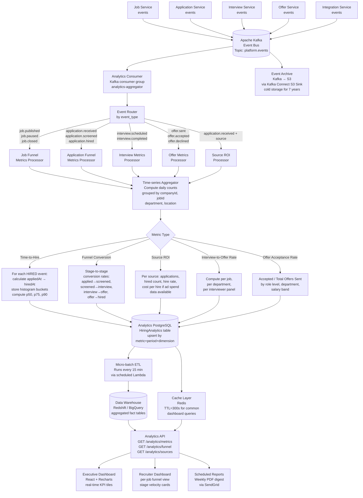

# Data Flow Diagrams — Job Board and Recruitment Platform

This document traces how data moves through the platform across four critical pipelines: AI-powered resume processing, candidate pipeline progression, analytics aggregation, and GDPR-compliant data deletion. Each diagram is accompanied by detailed notes on decision points, data transformations, and system boundaries.

---

## 1. Resume Parsing Pipeline

When a candidate uploads a resume, it enters a multi-stage enrichment pipeline. The raw file is durably stored first, then asynchronous processing extracts structured data using NLP, computes a match score against the target job, and feeds the result back into the application record. The recruiter sees enriched, structured data — never raw PDF text.

**Design decisions:**
- Storage-first guarantees the file is never lost even if downstream processing fails.
- The Lambda trigger decouples upload from processing, enabling horizontal scaling of AI workers.
- Failed parse jobs are retried up to 3 times with exponential backoff before being sent to the DLQ for manual inspection.
- The structured output schema is versioned so that model upgrades don't break existing application records.

```mermaid
flowchart TD
    A([Candidate submits\napplication form]) --> B[Application Service\nvalidates & persists\napplication record]
    B --> C[Upload resume.pdf\nto S3 via pre-signed URL]
    C --> D[(AWS S3\nresumes bucket\nAES-256 encrypted)]
    D --> E{S3 Event\nNotification\nObjectCreated}
    E --> F[AWS Lambda\nResumeParseDispatcher\ntrigger]
    F --> G[Publish parse task\nto Kafka topic\nresume.parse.requested]
    G --> H{Task Router\nselects AI worker\nbased on file type}
    H -->|PDF| I[PDF Text Extractor\npdfminer / Apache Tika]
    H -->|DOCX| J[DOCX Text Extractor\npython-docx]
    H -->|TXT| K[Plain text reader]
    I --> L[Raw text buffer]
    J --> L
    K --> L
    L --> M[Language Detection\nlangdetect library]
    M -->|Supported language| N[NLP Pre-processing\nTokenisation → POS Tagging\nNER via spaCy en_core_web_lg]
    M -->|Unsupported| N2[Flag for manual review\nstore rawText only]
    N --> O[Skill Extraction\nMatch against\nskill taxonomy v2.4\n8000+ normalised skills]
    O --> P[Experience Parser\nExtract company names\njob titles, date ranges\ncalculate tenure years]
    P --> Q[Education Parser\nDegree type, institution\nfield of study\ngraduation year]
    Q --> R[Contact & Link Parser\nEmail, phone, LinkedIn\nGitHub, portfolio URLs]
    R --> S[Structured Profile\nAssembler\nbuild ParsedResume JSON v3]
    S --> T{Schema\nValidation\npassed?}
    T -->|Fail| U[Log parse warning\nset parsingStatus=PARTIAL\nstore best-effort data]
    T -->|Pass| V[AI Scoring Engine\nOpenAI embeddings\ncosine similarity against\njob requirement vectors]
    U --> V
    V --> W[Compute Component\nScores:\n• Skill overlap score 0-40\n• Experience score 0-30\n• Education score 0-20\n• Location score 0-10]
    W --> X[Aggregate Match Score\n0–100 with\nconfidence interval]
    X --> Y[Write ParsedResume\nto PostgreSQL\nresumes table]
    Y --> Z[Update CandidateApplication\nmatchScore, parsingStatus=DONE\nparsedAt=now]
    Z --> AA[Publish event\napplication.screened to Kafka]
    AA --> AB{matchScore\nthreshold\ncheck}
    AB -->|score >= 70| AC[Auto-advance\nto SCREENING_PASSED\nstage]
    AB -->|40 <= score < 70| AD[Flag for\nRecruiter Review\nno auto-action]
    AB -->|score < 40| AE[Auto-reject\nqueue rejection\nemail delay=24h]
    AC --> AF[Update Pipeline\nStage in ATS Service]
    AD --> AF
    AE --> AF
    AF --> AG([Recruiter sees\nenriched application\nin ATS dashboard])
```



---

## 2. Pipeline Stage Progression

Every application flows through a configurable pipeline of stages. Transitions are driven by a combination of automated rules (AI scores, SLA timers) and human decisions (recruiter actions, interview feedback). This diagram captures the full decision tree from initial receipt to final disposition.

**Design decisions:**
- Stage transitions are persisted as immutable events (event sourcing), allowing full audit trails and timeline reconstruction.
- SLA violation checks run as a scheduled cron job every 15 minutes, not on every request.
- Notification triggers are decoupled via Kafka so a slow email provider cannot block a stage transition.
- Pipeline analytics are updated asynchronously after each transition event.

```mermaid
flowchart TD
    A([New Application\nReceived]) --> B[Persist application\nstatus=SUBMITTED\npipelineStage=APPLIED]
    B --> C[Publish event\napplication.received\nto Kafka]
    C --> D[Auto-Screening\nModule]
    D --> E{AI Match\nScore computed?}
    E -->|No — parse failed| F[Set status=NEEDS_MANUAL_REVIEW\nalert recruiter immediately]
    E -->|Yes| G{Score threshold\nevaluation}
    G -->|score < 40\nauto-reject enabled| H[Stage: AUTO_REJECTED\nSet rejectionReason=LOW_SCORE]
    G -->|score >= 40| I[Stage: SCREENING_PASSED\nEnter recruiter queue]
    H --> H1[Publish event\napplication.auto_rejected]
    H1 --> H2[Schedule rejection\nemail T+24h to candidate]
    I --> J{SLA Check\n24h recruiter review}
    J -->|Recruiter acts\nwithin SLA| K[Recruiter Review\nDecision Point]
    J -->|SLA breached| L[Escalation Alert\nto hiring manager]
    L --> K
    K --> M{Recruiter\nDecision}
    M -->|Reject| N[Stage: RECRUITER_REJECTED\nlog reason code]
    M -->|Advance| O{Which stage\nis next in pipeline?}
    N --> N1[Publish rejection event\nnotify candidate]
    O -->|PHONE_SCREEN| P[Stage: PHONE_SCREEN\nAssign to recruiter calendar]
    O -->|TECHNICAL| Q[Stage: TECHNICAL_ASSESSMENT\nSend coding challenge link]
    P --> R[Interview Service\ncreate interview record]
    Q --> R
    R --> S{Interview\nCompleted?}
    S -->|No-show| T[Stage: NO_SHOW\nSend reschedule offer\nmax 1 retry]
    S -->|Completed| U[Collect Interview\nFeedback from all\ninterviewers SLA=48h]
    T --> V{Candidate\nresponds to reschedule?}
    V -->|No| N
    V -->|Yes| R
    U --> W{Feedback\nAggregation}
    W -->|Any STRONG_NO| X[Stage: REJECTED_POST_INTERVIEW\nNotify candidate]
    W -->|Mixed feedback| Y[Hiring Manager\nDebrief Session]
    W -->|All STRONG_YES or YES| Z[Stage: OFFER_PENDING]
    Y --> M2{Debrief\nOutcome}
    M2 -->|Reject| X
    M2 -->|Advance| Z
    Z --> Z1[Background\nCheck Required?]
    Z1 -->|Yes| Z2[Stage: BACKGROUND_CHECK\nInitiate with Checkr]
    Z1 -->|No| AA[Offer Service\nGenerate offer letter]
    Z2 --> Z3{Check\nResult}
    Z3 -->|CLEAR| AA
    Z3 -->|CONSIDER| Z4[HR Review\nof exceptions]
    Z3 -->|FAILED| X
    Z4 --> M3{HR Decision}
    M3 -->|Proceed| AA
    M3 -->|Reject| X
    AA --> AB[Stage: OFFER_EXTENDED\nDocuSign envelope sent]
    AB --> AC{Candidate\nResponse}
    AC -->|Signed — ACCEPTED| AD[Stage: HIRED\nTrigger HRIS onboarding]
    AC -->|Declined| AE[Stage: OFFER_DECLINED\nLog reason, close application]
    AC -->|Negotiating| AF[OfferNegotiation\nrecord created]
    AF --> AA
    AD --> AG[Publish event\napplication.hired]
    AG --> AH[Update Pipeline\nAnalytics:\ntimeToHire, stageConversions]
    AH --> AI([Candidate record\nmoved to HRIS\nRecruitment closed])
```



---

## 3. Analytics Data Aggregation

The platform captures raw events from every service and aggregates them into business metrics: time-to-hire, source ROI, funnel conversion rates, and more. This pipeline uses an event-driven architecture to ensure the operational databases are never queried directly for reporting.

**Design decisions:**
- Raw events are immutable and stored indefinitely in S3 (cold tier) for compliance and re-processing.
- The analytics consumer uses idempotent writes (upsert by metricName + periodDate + dimension) to handle Kafka message redelivery safely.
- The data warehouse (Redshift/BigQuery) is refreshed via micro-batch every 15 minutes for near-real-time dashboards.
- Metrics are pre-aggregated at daily, weekly, and monthly granularities to avoid expensive full-table scans on dashboard load.



---

## 4. GDPR Data Deletion Flow

When a candidate exercises their right to erasure under GDPR Article 17, the platform must delete all personal data while respecting legal holds (e.g., active employment contracts) and preserving anonymised aggregate metrics. Every step is logged to a tamper-evident audit trail.

**Design decisions:**
- Identity verification via a signed, time-limited token prevents impersonation.
- Legal hold check queries the HRIS to determine if the person is a current or recent employee (legal obligation to retain data for 6 years in some jurisdictions).
- Cascading deletion is transactional at the service level; cross-service coordination uses a SAGA pattern with compensating actions.
- Anonymisation (not deletion) is applied to analytics records to preserve metric integrity.
- The audit log is written to an append-only store with object-lock enabled (cannot be deleted or modified).

```mermaid
flowchart TD
    A([Candidate submits\nGDPR Erasure Request\nvia account settings\nor email]) --> B[GDPR Service\nreceives request\nPOST /gdpr/erasure-requests]
    B --> C[Create erasure request record\nstatus=PENDING\nrequestId=UUID\ntimestamp=now]
    C --> D[Send verification email\nwith time-limited token\nexpiry=24h]
    D --> E{Identity\nVerified?}
    E -->|Token expired\nor mismatch| F[Mark request FAILED\nInvalid verification\nLog attempt]
    E -->|Token valid| G[Mark request IDENTITY_VERIFIED]
    G --> H[Legal Hold Check\nQuery HRIS Service:\nis person active\nor recent employee?]
    H --> I{Active\nEmployment\nContract?}
    I -->|Yes — legal hold applies| J[Suspend deletion\nof employment records\n6-year retention period\nnotify requestor of partial hold]
    I -->|No| K[Full deletion\neligible]
    J --> K2[Proceed with\nnon-employment\npersonal data only]
    K --> L[Generate Cascade\nDeletion Plan:\nlist all services holding\ncandidate personal data]
    K2 --> L
    L --> M[SAGA Coordinator\norchestrates deletion\nacross services]
    M --> N1[Application Service:\ndelete application records\nfor this candidateId]
    M --> N2[Storage Service S3:\ndelete resume.pdf and\ncoverLetter.pdf objects]
    M --> N3[Resume Service:\ndelete ParsedResume\nand raw text]
    M --> N4[Interview Service:\ndelete interview notes\nand feedback referencing candidate]
    M --> N5[Notification Service:\ndelete email history\nand preferences]
    M --> N6[Calendar Service:\ndelete calendar slot records]

    N1 & N2 & N3 & N4 & N5 & N6 --> O{All service\ndeletions\nsuccessful?}
    O -->|Any failure| P[Compensating Action:\nlog failure, retry\nmax 3 attempts with backoff]
    P --> O
    O -->|All success| Q[Analytics Anonymisation:\nreplace candidateId with\nANON-UUID in HiringAnalytics\npreserve aggregate values]
    Q --> R[Soft Delete User Account\nset email=deleted-{uuid}@anon.internal\nclearAllPII, isDeleted=true]
    R --> S[Schedule Hard Delete\napplicantProfile record\ndelay=30 days\nallows withdrawal of request]
    S --> T[Write immutable\nAudit Log Entry:\nrequestId, timestamp, deletedEntities[],\nretainedEntities[], performedBy, reason]
    T --> U[Audit Log Store\nS3 with Object Lock\nWORM — cannot modify]
    U --> V[Send Confirmation Email\nto requestor:\n"Your data has been deleted\nRef: requestId"]
    V --> W[Generate Compliance\nReport record\nfor DPO dashboard]
    W --> X([Request status=COMPLETED\nDPO notified])
```
