# Domain Model — Job Board and Recruitment Platform

This document defines the core domain model for the platform using a class diagram. Every class represents a bounded concept with clear ownership, well-defined attributes, and explicit relationships to adjacent concepts. The model is designed to be implementation-language agnostic; field types reflect logical data types rather than specific database column types.

---

## Key Enumerations

| Enum | Values |
|---|---|
| **JobStatus** | `DRAFT`, `PENDING_APPROVAL`, `PUBLISHED`, `PAUSED`, `CLOSED`, `ARCHIVED` |
| **ApplicationStatus** | `SUBMITTED`, `SCREENING`, `SHORTLISTED`, `INTERVIEW`, `OFFER_EXTENDED`, `HIRED`, `REJECTED`, `WITHDRAWN` |
| **InterviewStatus** | `SLOTS_PROPOSED`, `SCHEDULED`, `IN_PROGRESS`, `COMPLETED`, `CANCELLED`, `NO_SHOW` |
| **OfferStatus** | `DRAFT`, `PENDING_APPROVAL`, `APPROVED`, `SENT_TO_CANDIDATE`, `CANDIDATE_SIGNED`, `FULLY_EXECUTED`, `DECLINED`, `RESCINDED` |
| **CheckStatus** | `NOT_INITIATED`, `INVITED`, `IN_PROGRESS`, `CLEAR`, `CONSIDER`, `FAILED`, `CANCELLED` |
| **StageType** | `APPLIED`, `SCREENING`, `PHONE_SCREEN`, `TECHNICAL`, `ONSITE`, `REFERENCE_CHECK`, `OFFER`, `HIRED`, `REJECTED` |

---

## Class Diagram

```mermaid
classDiagram
    direction TB

    class Company {
        +UUID id
        +String name
        +String slug
        +String logoUrl
        +String websiteUrl
        +String industry
        +String size
        +String description
        +String linkedinUrl
        +Boolean isVerified
        +DateTime createdAt
        +DateTime updatedAt
    }

    class RecruiterUser {
        +UUID id
        +UUID companyId
        +String firstName
        +String lastName
        +String email
        +String phone
        +String title
        +String[] permissions
        +Boolean isActive
        +DateTime lastLoginAt
        +DateTime createdAt
    }

    class HRAdmin {
        +UUID id
        +UUID companyId
        +String firstName
        +String lastName
        +String email
        +String role
        +String approvalLevel
        +String[] managedDepartments
        +Boolean canApproveOffers
        +Boolean canApproveJobs
        +DateTime createdAt
    }

    class Job {
        +UUID id
        +UUID companyId
        +UUID postedById
        +String title
        +String slug
        +String department
        +String description
        +String responsibilities
        +String locationCity
        +String locationCountry
        +Boolean isRemote
        +String employmentType
        +Integer salaryMin
        +Integer salaryMax
        +String salaryCurrency
        +Integer experienceYearsMin
        +Integer experienceYearsMax
        +JobStatus status
        +Integer version
        +DateTime publishedAt
        +DateTime closingDate
        +DateTime createdAt
        +DateTime updatedAt
    }

    class JobRequirement {
        +UUID id
        +UUID jobId
        +String category
        +String description
        +Boolean isMandatory
        +Integer weight
        +Integer displayOrder
    }

    class JobQuestion {
        +UUID id
        +UUID jobId
        +String questionText
        +String questionType
        +String[] options
        +Boolean isRequired
        +Integer maxLengthChars
        +Integer displayOrder
    }

    class CandidateApplication {
        +UUID id
        +UUID jobId
        +UUID candidateId
        +ApplicationStatus status
        +Integer matchScore
        +String source
        +String utmCampaign
        +String coverLetterText
        +Map answersToQuestions
        +Boolean gdprConsentGiven
        +DateTime gdprConsentAt
        +DateTime appliedAt
        +DateTime lastActivityAt
        +DateTime updatedAt
    }

    class Resume {
        +UUID id
        +UUID candidateId
        +UUID applicationId
        +String s3Bucket
        +String s3Key
        +String fileName
        +String mimeType
        +Integer fileSizeBytes
        +String parsedRawText
        +String parsingStatus
        +DateTime uploadedAt
        +DateTime parsedAt
    }

    class CoverLetter {
        +UUID id
        +UUID applicationId
        +String s3Key
        +String bodyText
        +Integer wordCount
        +DateTime uploadedAt
    }

    class ApplicantProfile {
        +UUID id
        +UUID candidateId
        +String firstName
        +String lastName
        +String email
        +String phone
        +String linkedinUrl
        +String githubUrl
        +String portfolioUrl
        +String currentTitle
        +String currentCompany
        +Integer totalExperienceYears
        +String highestEducationLevel
        +String[] languagesSpoken
        +String locationCity
        +String locationCountry
        +Boolean openToRelocation
        +DateTime createdAt
        +DateTime updatedAt
    }

    class CandidatePool {
        +UUID id
        +UUID companyId
        +UUID createdById
        +String name
        +String description
        +String[] tagFilters
        +Boolean isArchived
        +DateTime createdAt
    }

    class SkillTag {
        +UUID id
        +String name
        +String normalizedName
        +String category
        +String[] aliases
        +Integer usageCount
        +Boolean isVerified
    }

    class JobMatch {
        +UUID id
        +UUID jobId
        +UUID candidateId
        +Integer overallScore
        +Integer skillScore
        +Integer experienceScore
        +Integer educationScore
        +Integer locationScore
        +String[] matchedSkills
        +String[] missingSkills
        +String aiExplanation
        +DateTime computedAt
    }

    class Pipeline {
        +UUID id
        +UUID jobId
        +String name
        +Boolean isDefault
        +Integer totalCandidates
        +DateTime createdAt
        +DateTime updatedAt
    }

    class PipelineStage {
        +UUID id
        +UUID pipelineId
        +StageType stageType
        +String displayName
        +Integer displayOrder
        +Integer slaHours
        +Boolean autoAdvanceOnScore
        +Integer autoAdvanceThreshold
        +Boolean isFinalStage
    }

    class Interview {
        +UUID id
        +UUID applicationId
        +UUID scheduledById
        +InterviewStatus status
        +String interviewType
        +DateTime scheduledStartAt
        +DateTime scheduledEndAt
        +Integer durationMinutes
        +String zoomMeetingId
        +String zoomJoinUrl
        +String googleEventId
        +String notes
        +DateTime createdAt
        +DateTime updatedAt
    }

    class InterviewRound {
        +UUID id
        +UUID interviewId
        +UUID interviewerId
        +String roundName
        +String focus
        +Integer roundOrder
        +Boolean isFeedbackSubmitted
        +DateTime feedbackDueAt
    }

    class InterviewFeedback {
        +UUID id
        +UUID interviewRoundId
        +UUID interviewerId
        +String overallRecommendation
        +Integer technicalScore
        +Integer communicationScore
        +Integer cultureFitScore
        +String strengths
        +String concerns
        +String privateNotes
        +DateTime submittedAt
    }

    class CalendarSlot {
        +UUID id
        +UUID interviewId
        +DateTime startAt
        +DateTime endAt
        +String timezone
        +Boolean isSelected
        +Boolean isExpired
    }

    class OfferLetter {
        +UUID id
        +UUID applicationId
        +UUID generatedById
        +OfferStatus status
        +String templateId
        +Integer baseSalary
        +String currency
        +String payFrequency
        +String equityGrant
        +String equityVestingSchedule
        +String[] benefits
        +DateTime startDate
        +String jobTitle
        +String department
        +String reportsTo
        +String docusignEnvelopeId
        +String signedDocumentS3Key
        +Integer version
        +DateTime sentAt
        +DateTime candidateSignedAt
        +DateTime fullyExecutedAt
        +DateTime createdAt
    }

    class OfferNegotiation {
        +UUID id
        +UUID offerId
        +UUID initiatedById
        +String counterParty
        +String fieldChanged
        +String previousValue
        +String proposedValue
        +String status
        +String resolutionNotes
        +DateTime createdAt
        +DateTime resolvedAt
    }

    class BackgroundCheckRequest {
        +UUID id
        +UUID applicationId
        +UUID requestedById
        +String provider
        +String externalCheckId
        +CheckStatus status
        +String[] checksRequested
        +String reportUrl
        +String adjudicationResult
        +DateTime initiatedAt
        +DateTime completedAt
    }

    class EmailTemplate {
        +UUID id
        +UUID companyId
        +String templateKey
        +String name
        +String subjectLine
        +String bodyHtml
        +String bodyText
        +String[] requiredVariables
        +Boolean isActive
        +DateTime createdAt
        +DateTime updatedAt
    }

    class CampaignMessage {
        +UUID id
        +UUID templateId
        +UUID candidateId
        +UUID sentById
        +String channel
        +String subject
        +String bodyRendered
        +String status
        +DateTime scheduledAt
        +DateTime sentAt
        +DateTime openedAt
        +DateTime clickedAt
    }

    class Notification {
        +UUID id
        +UUID recipientUserId
        +String eventType
        +String channel
        +String title
        +String body
        +String actionUrl
        +Boolean isRead
        +DateTime createdAt
        +DateTime readAt
    }

    class HiringAnalytics {
        +UUID id
        +UUID companyId
        +UUID jobId
        +String metricName
        +String dimension
        +Float metricValue
        +String unit
        +Date periodDate
        +String granularity
        +DateTime computedAt
    }

    %% Ownership and composition
    Company "1" --> "many" RecruiterUser : employs
    Company "1" --> "many" HRAdmin : employs
    Company "1" --> "many" Job : posts
    Company "1" --> "many" CandidatePool : owns
    Company "1" --> "many" EmailTemplate : configures
    Company "1" --> "many" HiringAnalytics : aggregates

    RecruiterUser "1" --> "many" Job : manages
    HRAdmin "1" --> "many" Job : approves

    Job "1" *-- "many" JobRequirement : defines
    Job "1" *-- "many" JobQuestion : defines
    Job "1" --> "1" Pipeline : has
    Job "1" --> "many" CandidateApplication : receives
    Job "1" --> "many" JobMatch : generates

    Pipeline "1" *-- "many" PipelineStage : consists of

    CandidateApplication "1" --> "1" ApplicantProfile : belongs to
    CandidateApplication "1" *-- "1" Resume : contains
    CandidateApplication "1" *-- "0..1" CoverLetter : may contain
    CandidateApplication "1" --> "many" Interview : scheduled for
    CandidateApplication "1" --> "0..1" OfferLetter : may receive
    CandidateApplication "1" --> "0..1" BackgroundCheckRequest : may trigger

    ApplicantProfile "many" --> "many" SkillTag : tagged with
    ApplicantProfile "many" --> "many" CandidatePool : grouped into

    JobMatch "1" --> "1" Job : scores
    JobMatch "1" --> "1" ApplicantProfile : evaluates

    Interview "1" *-- "many" InterviewRound : contains
    Interview "1" --> "many" CalendarSlot : offers
    InterviewRound "1" *-- "0..1" InterviewFeedback : produces

    OfferLetter "1" --> "many" OfferNegotiation : may have
    EmailTemplate "1" --> "many" CampaignMessage : renders into
    CampaignMessage "many" --> "1" ApplicantProfile : targets

    Job "1" --> "many" HiringAnalytics : contributes to
```

