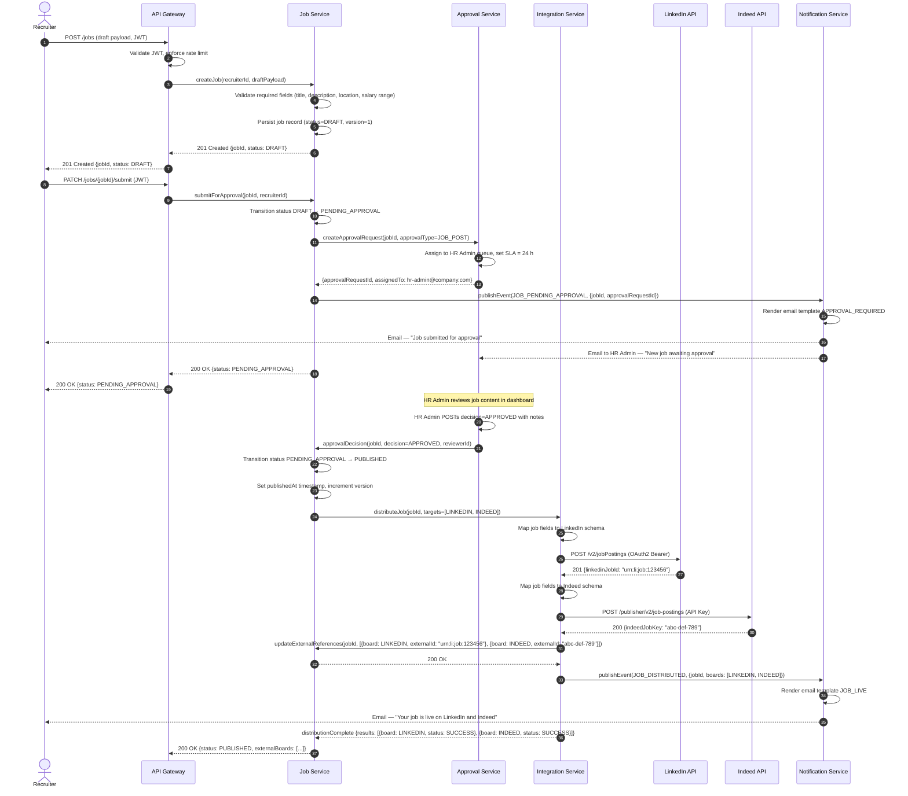
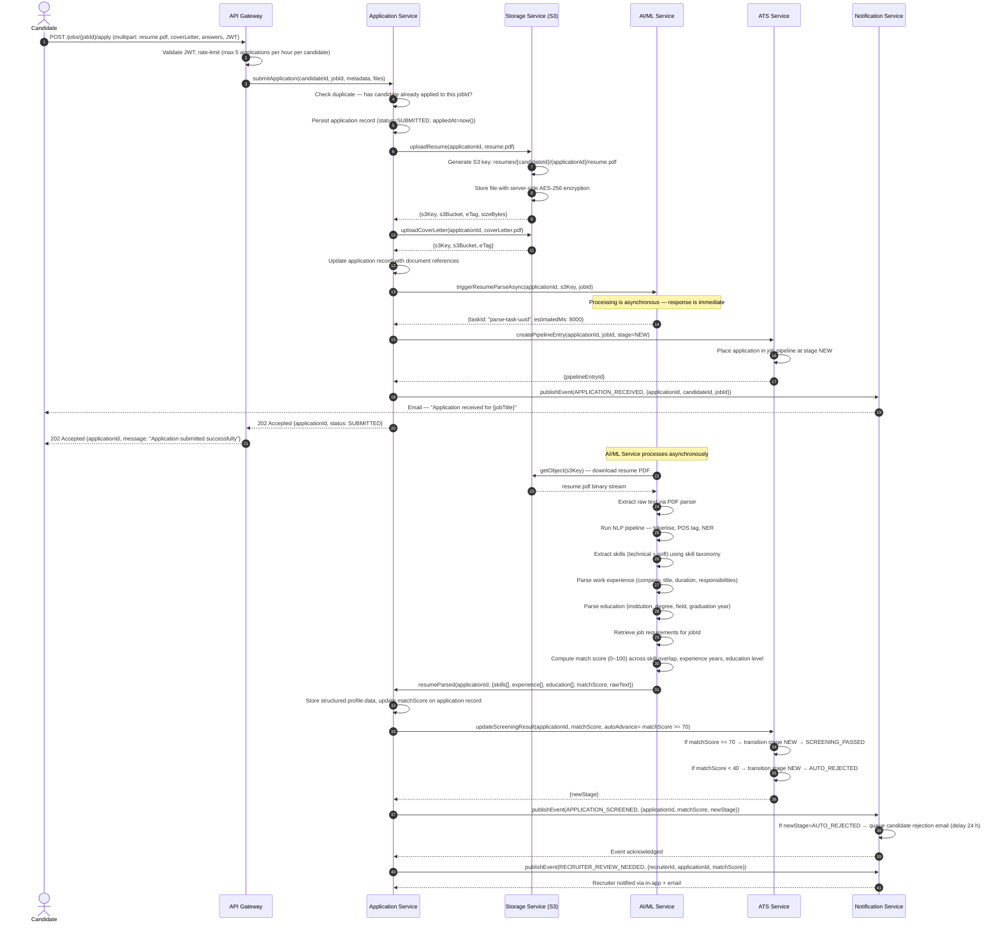
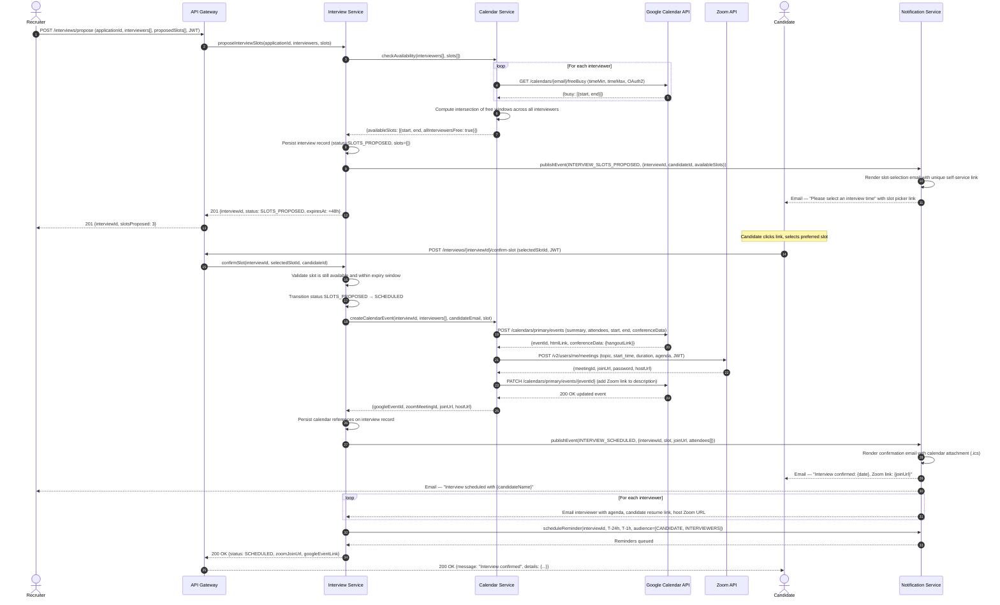
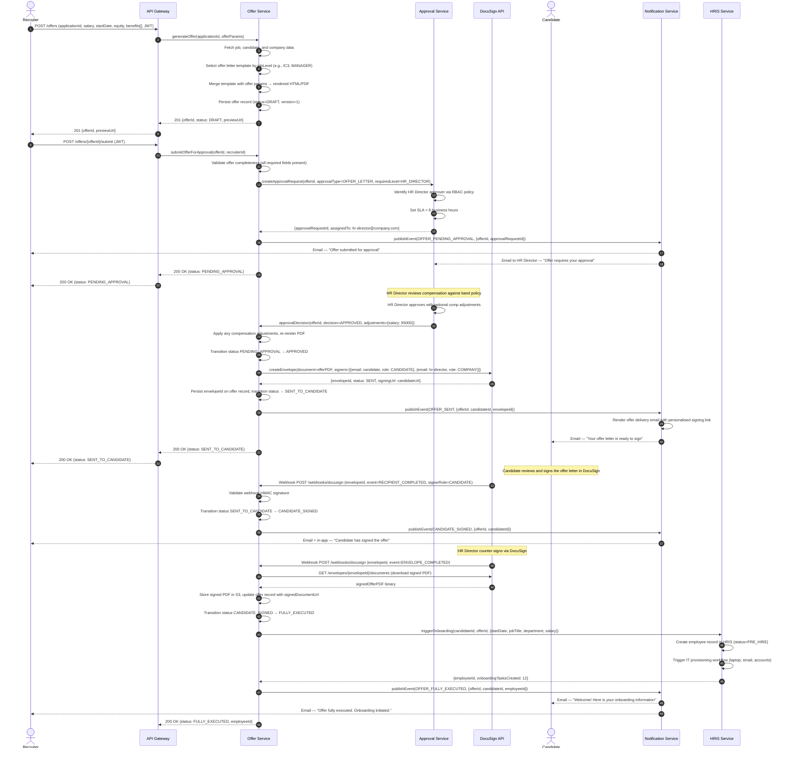

# System Sequence Diagrams — Job Board and Recruitment Platform

This document captures the four most critical end-to-end flows in the platform using UML sequence diagrams. Each diagram traces every network hop, service call, and asynchronous event so that engineers can reason about latency budgets, failure modes, and contract boundaries before writing a single line of code.

---

## 1. Job Posting and Distribution

A recruiter drafts a job, routes it through an approval workflow, and the system automatically syndicates the approved posting to external job boards. The flow enforces a two-step gate: first, an internal HR admin must approve the content; only then does the Integration Service fan out to LinkedIn, Indeed, and any other configured boards.

---

## 2. Application Submission and AI Screening

A candidate applies for a job. The platform stores the resume in S3, triggers asynchronous AI parsing, scores the parsed profile against the job requirements, and surfaces the result to the recruiter — all without the candidate waiting for the full pipeline.

---

## 3. Interview Scheduling with Calendar Sync

The recruiter proposes available time slots, the candidate chooses one, and the system automatically creates calendar events for all participants and provisions a Zoom meeting link — eliminating all manual back-and-forth.

---

## 4. Offer Letter Generation and Signing

The recruiter generates a personalised offer letter, it travels through a director-level approval workflow, and is dispatched via DocuSign for electronic signing. Upon completion, the HRIS is automatically notified to begin onboarding.

