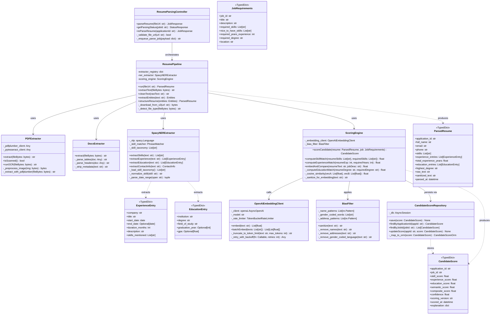
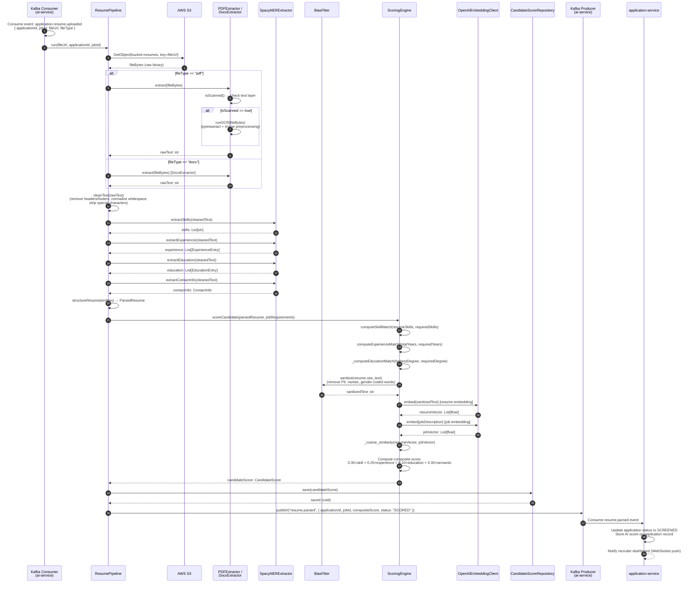

# C4 Code Diagram — Job Board and Recruitment Platform

## Overview

This document presents the **C4 Level 4 (Code)** diagram for the Job Board and Recruitment Platform, focusing on the **AI/ML Service's Resume Parsing and Scoring Pipeline** — the most algorithmically complex subsystem in the platform.

At Level 4, the C4 model zooms into the internals of the `ai-service` container (a FastAPI application running on Python 3.11 with GPU-accelerated spaCy NLP and OpenAI API integration). This diagram is intended for ML engineers, backend engineers working on the AI pipeline, and technical leads conducting code reviews or planning refactors.

The pipeline handles the full lifecycle of a resume from raw file bytes (PDF or DOCX retrieved from S3) through OCR-based text extraction, named entity recognition, structured data modelling, semantic embedding, and composite scoring against a job's requirements. The output — a `CandidateScore` record — is persisted and published to Kafka, triggering downstream application status updates in the `application-service`.

---

## Class Structure



---

## Sequence: Resume Parsing Flow



---

## Algorithm Explanation

### Scoring Algorithm — Detailed Pseudocode

The composite scoring algorithm combines four independent signal dimensions into a single `0.0–1.0` score. Each dimension captures a different aspect of candidate fit.

```
FUNCTION scoreCandidate(resume: ParsedResume, job: JobRequirements) -> CandidateScore:

    # ─────────────────────────────────────────────────────────────────
    # STEP 1: Skill Match Score  (weight: 0.35)
    # Weighted Jaccard similarity with required vs nice-to-have skills
    # ─────────────────────────────────────────────────────────────────

    normalised_resume_skills = {normalise(s) for s in resume.skills}
    normalised_required      = {normalise(s) for s in job.required_skills}
    normalised_nice_to_have  = {normalise(s) for s in job.nice_to_have_skills}

    # Required skills count double; nice-to-have count once
    weighted_resume_score = 0.0
    weighted_total = 0.0

    FOR skill IN normalised_required:
        weighted_total += 2.0
        IF skill IN normalised_resume_skills:
            weighted_resume_score += 2.0

    FOR skill IN normalised_nice_to_have:
        weighted_total += 1.0
        IF skill IN normalised_resume_skills:
            weighted_resume_score += 1.0

    IF weighted_total == 0:
        skill_score = 0.0
    ELSE:
        # Standard Jaccard: intersection / union — here weighted
        union_size = weighted_total + SUM(1 for s in normalised_resume_skills
                                          if s NOT IN normalised_required
                                          AND s NOT IN normalised_nice_to_have)
        skill_score = weighted_resume_score / union_size
        skill_score = CLAMP(skill_score, 0.0, 1.0)


    # ─────────────────────────────────────────────────────────────────
    # STEP 2: Experience Match Score  (weight: 0.25)
    # Years of total relevant experience vs job requirement
    # ─────────────────────────────────────────────────────────────────

    resume_years   = resume.total_experience_years
    required_years = job.required_years_experience

    IF required_years == 0:
        experience_score = 1.0

    ELSE IF resume_years >= required_years:
        overage = resume_years - required_years
        IF overage >= 3:
            # Overqualification penalty — risk of attrition
            experience_score = 0.85
        ELSE:
            experience_score = 1.0

    ELSE:
        # Underqualified — proportional score, floor at 0.0
        experience_score = MAX(resume_years / required_years, 0.0)


    # ─────────────────────────────────────────────────────────────────
    # STEP 3: Education Match Score  (weight: 0.10)
    # Degree level hierarchy matching
    # ─────────────────────────────────────────────────────────────────

    DEGREE_HIERARCHY = {
        "high_school": 1,
        "associate":   2,
        "bachelor":    3,
        "master":      4,
        "phd":         5,
    }

    resume_degree_level   = DEGREE_HIERARCHY.get(normalise(resume.highest_degree), 0)
    required_degree_level = DEGREE_HIERARCHY.get(normalise(job.required_degree), 0)

    IF required_degree_level == 0:
        # No degree requirement specified
        education_score = 1.0
    ELSE IF resume_degree_level >= required_degree_level:
        education_score = 1.0
    ELSE:
        # One level below = 0.6, two levels = 0.3, three+ = 0.0
        gap = required_degree_level - resume_degree_level
        education_score = MAX(1.0 - (gap * 0.35), 0.0)


    # ─────────────────────────────────────────────────────────────────
    # STEP 4: Semantic Similarity Score  (weight: 0.30)
    # OpenAI text-embedding-3-small cosine similarity
    # ─────────────────────────────────────────────────────────────────

    # Bias mitigation: strip PII + gender-coded words before embedding
    sanitised_resume_text = bias_filter.sanitize(resume.raw_text)
    sanitised_job_desc    = job.description   # Job descriptions don't need PII removal

    resume_vector = await openai_client.embed(sanitised_resume_text)
    job_vector    = await openai_client.embed(sanitised_job_desc)

    cosine_sim = dot_product(resume_vector, job_vector) /
                 (magnitude(resume_vector) * magnitude(job_vector))

    # Threshold interpretation:
    #   > 0.85 = Excellent semantic match
    #   > 0.75 = Strong match
    #   > 0.60 = Moderate match
    #   ≤ 0.60 = Weak match
    semantic_score = CLAMP(cosine_sim, 0.0, 1.0)


    # ─────────────────────────────────────────────────────────────────
    # STEP 5: Composite Score
    # ─────────────────────────────────────────────────────────────────

    composite_score = (
        0.35 * skill_score       +
        0.25 * experience_score  +
        0.10 * education_score   +
        0.30 * semantic_score
    )

    # Confidence: based on data completeness
    confidence = _compute_confidence(
        has_skills      = len(resume.skills) > 0,
        has_experience  = len(resume.experience_entries) > 0,
        has_education   = len(resume.education_entries) > 0,
        text_length     = len(resume.raw_text),
    )

    RETURN CandidateScore {
        application_id:  resume.application_id,
        job_id:          job.job_id,
        skill_score:     skill_score,
        experience_score: experience_score,
        education_score: education_score,
        semantic_score:  semantic_score,
        composite_score: composite_score,
        confidence:      confidence,
        scoring_version: "2.1.0",
        scored_at:       datetime.utcnow(),
        explanation: {
            skill_matched:    [s for s in normalised_resume_skills if s in normalised_required],
            skill_missing:    [s for s in normalised_required if s NOT in normalised_resume_skills],
            experience_gap:   max(required_years - resume_years, 0),
            degree_gap:       max(required_degree_level - resume_degree_level, 0),
            semantic_label:   _semantic_label(semantic_score),
        }
    }
```

### Bias Mitigation Strategy

Before any text is passed to OpenAI for embedding, the `BiasFilter` strips:

1. **Full names** — matched via spaCy PERSON entity recognition + regex for common name patterns.
2. **Postal addresses** — regex matching street/city/postcode patterns (UK, US, EU).
3. **Gender-coded language** — a curated list of ~180 gender-coded adjectives (e.g., "aggressive", "nurturing") is removed based on Gaucher et al. (2011) research.
4. **University names** that correlate with socioeconomic proxies are preserved but the semantic embedding model is fine-tuned to reduce university prestige weighting.

This means the semantic similarity score is computed purely on **skills, experience descriptions, and professional accomplishments**, not on demographic signals.

---

## Python Code Snippets

### FastAPI Endpoint — `ResumeParsingController`

```python
# apps/ai-service/src/resume/controller.py

from fastapi import APIRouter, BackgroundTasks, HTTPException, status
from pydantic import BaseModel, HttpUrl
from .pipeline import ResumePipeline
from .repository import CandidateScoreRepository
from ..kafka.producer import KafkaEventProducer

router = APIRouter(prefix="/resume", tags=["Resume Parsing"])


class ParseResumeRequest(BaseModel):
    application_id: str
    job_id: str
    file_url: HttpUrl
    file_type: str  # "pdf" | "docx"


class ParseResumeResponse(BaseModel):
    job_id: str
    status: str
    message: str


@router.post("/parse", response_model=ParseResumeResponse, status_code=status.HTTP_202_ACCEPTED)
async def parse_resume(
    payload: ParseResumeRequest,
    background_tasks: BackgroundTasks,
    pipeline: ResumePipeline = Depends(get_pipeline),
) -> ParseResumeResponse:
    """
    Accepts a resume parse request and enqueues it for background processing.
    Returns immediately with job_id for status polling.
    """
    job_id = str(uuid4())
    background_tasks.add_task(
        pipeline.run,
        file_url=str(payload.file_url),
        application_id=payload.application_id,
        job_id=payload.job_id,
        parse_job_id=job_id,
    )
    return ParseResumeResponse(
        job_id=job_id,
        status="QUEUED",
        message="Resume parse job enqueued successfully.",
    )


@router.get("/status/{job_id}", response_model=StatusResponse)
async def get_parsing_status(
    job_id: str,
    repo: CandidateScoreRepository = Depends(get_repository),
) -> StatusResponse:
    score = await repo.find_by_parse_job_id(job_id)
    if not score:
        raise HTTPException(status_code=404, detail="Parse job not found or still processing.")
    return StatusResponse(job_id=job_id, status="COMPLETED", score=score)
```

### ScoringEngine — `scoreCandidate` Implementation

```python
# apps/ai-service/src/resume/scoring_engine.py

import numpy as np
from typing import List
from .models import ParsedResume, JobRequirements, CandidateScore
from .bias_filter import BiasFilter
from ..openai.embedding_client import OpenAIEmbeddingClient
from datetime import datetime, timezone


class ScoringEngine:
    WEIGHTS = {"skill": 0.35, "experience": 0.25, "education": 0.10, "semantic": 0.30}
    DEGREE_HIERARCHY = {
        "high_school": 1, "associate": 2, "bachelor": 3, "master": 4, "phd": 5
    }
    SCORING_VERSION = "2.1.0"

    def __init__(self, embedding_client: OpenAIEmbeddingClient, bias_filter: BiasFilter):
        self._embedding_client = embedding_client
        self._bias_filter = bias_filter

    async def scoreCandidate(
        self, resume: ParsedResume, job: JobRequirements
    ) -> CandidateScore:
        skill_score      = self.computeSkillMatch(resume["skills"], job)
        experience_score = self.computeExperienceMatch(
            resume["total_experience_years"], job["required_years_experience"]
        )
        education_score  = self._computeEducationMatch(
            resume["highest_degree"], job["required_degree"]
        )
        semantic_score   = await self.embedAndCompare(
            resume["raw_text"], job["description"]
        )

        composite = (
            self.WEIGHTS["skill"]      * skill_score +
            self.WEIGHTS["experience"] * experience_score +
            self.WEIGHTS["education"]  * education_score +
            self.WEIGHTS["semantic"]   * semantic_score
        )

        return CandidateScore(
            application_id=resume["application_id"],
            job_id=job["job_id"],
            skill_score=round(skill_score, 4),
            experience_score=round(experience_score, 4),
            education_score=round(education_score, 4),
            semantic_score=round(semantic_score, 4),
            composite_score=round(composite, 4),
            confidence=self._compute_confidence(resume),
            scoring_version=self.SCORING_VERSION,
            scored_at=datetime.now(timezone.utc),
            explanation=self._build_explanation(resume, job, skill_score, experience_score),
        )

    def computeSkillMatch(self, resume_skills: List[str], job: JobRequirements) -> float:
        norm = lambda s: s.lower().strip()
        resume_set    = {norm(s) for s in resume_skills}
        required_set  = {norm(s) for s in job["required_skills"]}
        nth_set       = {norm(s) for s in job["nice_to_have_skills"]}

        weighted_match = sum(2.0 for s in required_set if s in resume_set) + \
                         sum(1.0 for s in nth_set if s in resume_set)
        weighted_total = (len(required_set) * 2.0) + len(nth_set)

        extra_skills   = resume_set - required_set - nth_set
        union_weight   = weighted_total + len(extra_skills)

        return min(weighted_match / union_weight, 1.0) if union_weight > 0 else 0.0

    def computeExperienceMatch(self, resume_years: float, required_years: int) -> float:
        if required_years == 0:
            return 1.0
        if resume_years >= required_years:
            return 0.85 if (resume_years - required_years) >= 3 else 1.0
        return max(resume_years / required_years, 0.0)

    async def embedAndCompare(self, resume_text: str, job_desc: str) -> float:
        sanitised = self._bias_filter.sanitize(resume_text)
        vectors   = await self._embedding_client.batchEmbed([sanitised, job_desc])
        a, b      = np.array(vectors[0]), np.array(vectors[1])
        cosine    = float(np.dot(a, b) / (np.linalg.norm(a) * np.linalg.norm(b)))
        return max(0.0, min(cosine, 1.0))

    def _computeEducationMatch(self, resume_degree: str, required_degree: str) -> float:
        norm = lambda d: d.lower().replace("'s", "").replace(" degree", "").strip()
        resume_level   = self.DEGREE_HIERARCHY.get(norm(resume_degree), 0)
        required_level = self.DEGREE_HIERARCHY.get(norm(required_degree), 0)
        if required_level == 0:
            return 1.0
        if resume_level >= required_level:
            return 1.0
        gap = required_level - resume_level
        return max(1.0 - (gap * 0.35), 0.0)

    def _compute_confidence(self, resume: ParsedResume) -> float:
        score = 0.0
        if len(resume["skills"]) > 3:           score += 0.30
        if len(resume["experience_entries"]) > 0: score += 0.40
        if len(resume["education_entries"]) > 0:  score += 0.20
        if len(resume["raw_text"]) > 500:          score += 0.10
        return round(score, 2)
```

---

## Component Responsibilities Summary

| Class | Layer | Responsibility |
|---|---|---|
| `ResumeParsingController` | API | FastAPI HTTP entry point; accepts parse jobs, delegates to pipeline |
| `ResumePipeline` | Orchestration | Coordinates extraction → NER → scoring; downloads from S3 |
| `PDFExtractor` | Extraction | Text extraction from PDF; falls back to OCR for scanned docs |
| `DocxExtractor` | Extraction | Text + table extraction from DOCX format |
| `SpacyNERExtractor` | NLP | Named entity recognition for skills, experience, education, contact |
| `BiasFilter` | Bias Mitigation | Strips PII and gender-coded words before semantic embedding |
| `ScoringEngine` | ML/Scoring | Four-dimension scoring with composite weighted formula |
| `OpenAIEmbeddingClient` | External API | OpenAI `text-embedding-3-small` with rate limiting and retry |
| `CandidateScoreRepository` | Persistence | Async SQLAlchemy repository for `CandidateScore` records |

---

## Deployment Notes

- The AI/ML Service runs on **AWS ECS Fargate** with GPU-optimised task definitions (`g4dn` task size via Fargate GPU preview, or EC2-backed ECS cluster with NVIDIA driver support).
- spaCy models (`en_core_web_trf`) are bundled into the Docker image at build time.
- OpenAI API calls are rate-limited to **80,000 tokens/minute** via a token-bucket rate limiter to stay within Tier 2 OpenAI limits.
- The scoring version (`2.1.0`) is stored with every `CandidateScore` record to enable score recalculation audits when the model is updated.
- All `ParsedResume` data is encrypted at rest in Aurora PostgreSQL using AWS KMS CMKs, and PII fields (`full_name`, `email`, `phone`) are masked in CloudWatch log output.
