# Cloud Architecture — Job Board and Recruitment Platform

## Overview

This document describes the complete cloud architecture for the Job Board and Recruitment Platform on AWS. The system is designed as a **multi-region active-passive** setup with automated failover capabilities, targeting a Recovery Time Objective (RTO) of 15 minutes and a Recovery Point Objective (RPO) of 5 minutes.

The primary region is **us-east-1 (N. Virginia)**, which serves all live traffic. The disaster recovery region is **us-west-2 (Oregon)**, maintained in a warm-standby state — all infrastructure is provisioned and data is continuously replicated, but no live traffic is served from it unless a failover event is triggered.

---

## Design Principles

- **Multi-AZ first**: Every service runs in at least two Availability Zones within the primary region.
- **Stateless compute**: ECS Fargate tasks are stateless; all state lives in managed data services.
- **Async by default**: Inter-service communication uses Kafka events. Synchronous calls are reserved for time-sensitive reads (job search, application status).
- **Fail fast**: Circuit breakers protect the API Gateway from cascading failures in downstream microservices.
- **Zero-trust networking**: Services do not communicate via shared databases. Every inter-service data dependency is expressed as a domain event.

---

## Primary Region Architecture: us-east-1

### Global Edge Layer
- **Route 53**: Authoritative DNS with latency-based routing and active health checks. Configured with a failover record set: primary points to us-east-1 ALB; secondary points to us-west-2 ALB (activated on health check failure).
- **CloudFront**: Globally distributed CDN with 400+ edge locations. Serves the React SPA from S3, caches job listing API responses (TTL 60s), and terminates TLS. Integrated with **AWS WAF** for Layer 7 protection.
- **AWS WAF**: Rules applied at CloudFront and ALB level — rate limiting (1000 req/5min per IP for public job search), SQL injection prevention, XSS filtering, and geo-blocking for restricted regions.
- **AWS Shield Standard**: Automatically protects all internet-facing endpoints from common DDoS attacks (volumetric, protocol). Shield Advanced is enabled for the ALB and CloudFront to provide 24/7 DDoS response team access and attack cost protection.

### Compute: ECS Fargate

All microservices run on ECS Fargate with the following configuration:

| Service               | CPU    | Memory | Min | Max | Scale Metric                  |
|-----------------------|--------|--------|-----|-----|-------------------------------|
| api-gateway           | 0.5    | 1 GB   | 2   | 20  | CPU > 70%, ALB req/target > 1000 |
| job-service           | 1.0    | 2 GB   | 2   | 10  | CPU > 70%                     |
| application-service   | 1.0    | 2 GB   | 2   | 15  | CPU > 70%                     |
| ats-service           | 1.0    | 2 GB   | 2   | 10  | CPU > 70%                     |
| interview-service     | 0.5    | 1 GB   | 1   | 8   | CPU > 70%                     |
| offer-service         | 0.5    | 1 GB   | 1   | 6   | CPU > 70%                     |
| ai-service            | 2.0    | 4 GB   | 1   | 8   | SQS queue depth > 50          |
| notification-service  | 0.5    | 1 GB   | 1   | 5   | SQS queue depth > 100         |
| analytics-service     | 1.0    | 2 GB   | 1   | 4   | Memory > 80%                  |
| gdpr-service          | 0.25   | 0.5 GB | 1   | 2   | Scheduled only                |
| integration-service   | 0.5    | 1 GB   | 1   | 4   | CPU > 70%                     |

**Spot Instance Strategy**: Background workers (ai-service, analytics-service, gdpr-service) use Fargate Spot capacity with a `FARGATE_SPOT` capacity provider weight of 2 and `FARGATE` weight of 1. This achieves ~60% cost reduction for non-customer-facing processing with graceful task interruption handling.

Each ECS task includes a **Datadog Agent sidecar** container running as a non-root process, collecting metrics, traces, and logs and forwarding them to Datadog Cloud. This coexists with CloudWatch Container Insights.

### Storage: RDS Aurora PostgreSQL

The platform uses **Amazon Aurora PostgreSQL** (compatible with PostgreSQL 15) organized as a **Global Cluster**:

- **Primary Cluster (us-east-1)**: 1 writer instance (`db.r6g.xlarge`) + 2 reader instances (`db.r6g.large`). Readers serve analytics queries and reporting services.
- **DR Cluster (us-west-2)**: 1 reader instance (`db.r6g.large`). Replication lag < 1 second via Aurora Global Database. Can be promoted to writer in < 1 minute during DR failover.
- **Storage**: Aurora auto-scales storage from 10 GB to 128 TB. Encrypted with customer-managed KMS key.
- **Backups**: Automated daily snapshots retained for 35 days. Point-in-time recovery (PITR) enabled with 5-minute granularity.
- **Performance Insights**: Enabled with 7-day retention. SQL query performance monitored; slow queries (> 1s) trigger CloudWatch alarm.

### Caching: ElastiCache Redis

- **Cluster Mode Enabled**: 3 shards, 2 replicas per shard (6 total nodes), deployed across 3 AZs.
- **Instance type**: `cache.r6g.large` per node.
- **Encryption**: At-rest (AES-256) and in-transit (TLS).
- **Automatic Failover**: Enabled. Replica promotion occurs within 60 seconds of primary failure.
- **Eviction Policy**: `allkeys-lru`. Cache TTLs are set per use case: session tokens (24h), job search results (60s), rate-limit counters (60s), interview scorecard aggregates (5min).
- **DR Region**: A standalone Redis cluster in us-west-2 is pre-warmed via replication of frequently accessed keys using a scheduled Lambda export job. Full warming takes ~5 minutes after failover.

### Search: Amazon OpenSearch Service

- **Configuration**: 3 dedicated master nodes (`m6g.large`) + 3 data nodes (`r6g.large`) across 3 AZs.
- **Indexes**: `jobs` (full-text job descriptions, faceted by location/salary/skills), `candidates` (anonymized profiles for talent search), `companies`.
- **Index sync**: Kafka consumer in job-service listens to `job.published` events and updates OpenSearch via bulk API. Eventual consistency lag target: < 10 seconds.
- **Encryption**: At-rest with AWS KMS. Fine-grained access control via IAM roles per service.
- **Snapshots**: Automated hourly snapshots to S3. Cross-region copy to us-west-2 for DR.

### Messaging: Amazon MSK

- **Broker configuration**: 3 brokers across 3 AZs. Instance type: `kafka.m5.large`. Storage: 1 TB per broker (EBS gp3).
- **Kafka version**: 3.5
- **Topics**: 24 topics across all services. Partition count per topic: 12 (matches max consumer parallelism). Replication factor: 3.
- **Retention**: 7 days for event replay capability.
- **Cross-region replication**: MirrorMaker 2 replicates all topics to us-west-2 MSK cluster continuously. Consumer group offsets are mirrored, enabling near-zero-lag DR.
- **Schema Registry**: AWS Glue Schema Registry enforces Avro schemas on all Kafka messages, preventing schema drift between producers and consumers.

### Object Storage: Amazon S3

| Bucket                          | Purpose                              | Encryption | Versioning | Replication         |
|---------------------------------|--------------------------------------|------------|------------|---------------------|
| `jobplatform-resumes-prod`      | Candidate resume files (PDF, DOCX)   | SSE-KMS    | Enabled    | CRR to us-west-2    |
| `jobplatform-offers-prod`       | Signed offer letter PDFs             | SSE-KMS    | Enabled    | CRR to us-west-2    |
| `jobplatform-static-prod`       | React SPA build artifacts            | SSE-S3     | Enabled    | None (re-deployable)|
| `jobplatform-logs-prod`         | ALB access logs, CloudTrail, VPC flow| SSE-S3     | Disabled   | None                |
| `jobplatform-backups-prod`      | RDS manual snapshots, export files   | SSE-KMS    | Enabled    | CRR to us-west-2    |
| `jobplatform-gdpr-exports-prod` | Candidate data export ZIPs (GDPR)    | SSE-KMS    | Disabled   | None (ephemeral)    |

S3 lifecycle policies move logs to S3 Glacier Instant Retrieval after 30 days and expire after 365 days. Resume files are retained for the duration of the candidate account plus 2 years post-account-deletion to satisfy legal hold requirements.

---

## Disaster Recovery Region: us-west-2

The DR region maintains a warm-standby environment with the following components active at all times:

- **ECS services**: All services running with `min=1` task per service (can scale to full production capacity within 10 minutes via Auto Scaling)
- **Aurora DR reader**: Promoted to writer on failover
- **Redis standalone cluster**: Pre-warmed cache
- **MSK cluster**: Receives replicated topics from MirrorMaker 2
- **OpenSearch cluster**: 3-node cluster, fed from S3 snapshots every hour

**Failover Procedure** (triggered by Route 53 health check failure, automated via EventBridge + Lambda):
1. Route 53 switches DNS to us-west-2 ALB (propagation: ~60s with low TTL)
2. Aurora Global Database promotes DR reader to standalone writer
3. ECS Auto Scaling scales all services to production-level capacity
4. Redis warms from S3 export within 5 minutes
5. RTO: ~15 minutes | RPO: ~5 minutes (Aurora replication lag + Redis warming)

---

## Security Architecture

### Identity and Access
- **AWS IAM**: ECS task roles follow the principle of least privilege — each service has its own IAM role with only the permissions required for its specific AWS resource access.
- **AWS GuardDuty**: Continuous threat detection analyzing VPC Flow Logs, CloudTrail, and DNS logs. High-severity findings trigger PagerDuty incidents.
- **AWS Inspector**: Automated vulnerability scanning of ECR container images on push and on a weekly schedule. Findings above CVSS 7.0 block deployment via GitHub Actions gate.
- **AWS Security Hub**: Aggregates findings from GuardDuty, Inspector, and Config into a single compliance dashboard. CIS AWS Foundations Benchmark and AWS Foundational Security Best Practices standards are enabled.

### Compliance and Audit
- **AWS CloudTrail**: All API calls across all regions and all accounts logged to `jobplatform-logs-prod` S3 bucket. Log file validation enabled. CloudTrail Insights enabled for unusual API activity detection.
- **AWS Config**: 47 managed rules enforced (e.g., `restricted-ssh`, `s3-bucket-public-read-prohibited`, `rds-instance-deletion-protection-enabled`, `encrypted-volumes`). Non-compliant resources trigger SNS alerts and auto-remediation Lambda functions where safe.
- **AWS KMS**: Three customer-managed keys (CMKs): one for database encryption, one for S3 sensitive buckets, one for Secrets Manager. Key rotation enabled annually. All key usage logged to CloudTrail.

---

## Observability Architecture

### Metrics
- **CloudWatch Container Insights**: ECS task-level CPU, memory, network I/O. Custom metrics emitted by services via CloudWatch EMF (Embedded Metrics Format).
- **Datadog**: Full-stack APM, infrastructure monitoring, and business metrics dashboard. Each ECS task runs a Datadog Agent sidecar with DogStatsD. Monitors track: p95 API latency, Kafka consumer lag, job application funnel conversion rates.

### Logs
- **CloudWatch Logs**: All ECS task stdout/stderr forwarded via AWS FireLens (Fluent Bit sidecar). Log groups per service with 90-day retention.
- **OpenSearch Logs Dashboard**: Structured JSON logs parsed and indexed by Fluent Bit. Full-text search across all services.

### Tracing
- **AWS X-Ray**: Traces propagated via `x-amzn-trace-id` header across all service boundaries. X-Ray groups created for each service. Trace sampling: 5% in production, 100% in staging.
- **Datadog APM**: Service map automatically built from distributed trace data. Flame graphs for slow request analysis. Alerts on p99 latency > 2 seconds.

### Alerting
- **PagerDuty Integration**: CloudWatch Alarms → SNS → PagerDuty for critical incidents (p95 latency > 500ms, error rate > 1%, RDS failover, ECS task crashes > 3 in 5 min).
- **Slack Integration**: Non-critical alerts (deployment success/failure, Config rule violations, GuardDuty medium-severity findings) sent to `#platform-alerts` Slack channel.

---

## Full Cloud Architecture Diagram

```mermaid
flowchart TD
    subgraph GLOBAL["Global Layer"]
        R53[Route 53\nFailover routing policy\nHealth checks every 30s]
        CF[CloudFront\n400+ edge locations\nWAF + Shield]
        R53 --> CF
    end

    subgraph PRIMARY["Primary Region — us-east-1"]
        subgraph EDGE_PRIMARY["Edge / Public Tier"]
            WAF[AWS WAF\nRate limit, SQLi, XSS rules]
            ALB_P[Application Load Balancer\nMulti-AZ]
            CF --> WAF --> ALB_P
        end

        subgraph COMPUTE_PRIMARY["ECS Fargate Compute"]
            APIGW_P[api-gateway\n2–20 tasks]
            JOB_P[job-service\n2–10 tasks]
            APP_P[application-service\n2–15 tasks]
            ATS_P[ats-service\n2–10 tasks]
            INT_P[interview-service\n1–8 tasks]
            OFF_P[offer-service\n1–6 tasks]
            AI_P[ai-service\nFargate Spot 1–8 tasks]
            NOTIF_P[notification-service\n1–5 tasks]
            AN_P[analytics-service\nFargate Spot 1–4 tasks]
            GDPR_P[gdpr-service\n1–2 tasks]
            INT_SVC_P[integration-service\n1–4 tasks]

            ALB_P --> APIGW_P
            APIGW_P --> JOB_P & APP_P & ATS_P & INT_P & OFF_P & AI_P & AN_P
        end

        subgraph LAMBDA_PRIMARY["Serverless"]
            L_RESUME_P[Lambda: Resume Parse Trigger\nS3 event → SQS]
            L_GDPR_P[Lambda: GDPR Retention\nEventBridge daily cron]
            L_REPORT_P[Lambda: DR Failover\nEventBridge health alarm]
        end

        subgraph MESSAGING_PRIMARY["Messaging Layer"]
            MSK_P[Amazon MSK\n3 brokers, 3 AZs\nKafka 3.5]
            SQS_AI_P[SQS: AI Parse Queue\nVisibility: 120s]
            SQS_EMAIL_P[SQS: Email Queue]
            GLUE_SR[Glue Schema Registry\nAvro schemas]

            COMPUTE_PRIMARY --> MSK_P
            MSK_P --> NOTIF_P
            MSK_P --> AN_P
            L_RESUME_P --> SQS_AI_P
            SQS_AI_P --> AI_P
            NOTIF_P --> SQS_EMAIL_P
        end

        subgraph DATA_PRIMARY["Data Layer"]
            AURORA_W[Aurora PostgreSQL\nWriter r6g.xlarge]
            AURORA_R1[Aurora Reader 1\nr6g.large]
            AURORA_R2[Aurora Reader 2\nr6g.large]
            REDIS_P[ElastiCache Redis\nCluster 3 shards / 6 nodes]
            OS_P[OpenSearch\n3 master + 3 data nodes]

            COMPUTE_PRIMARY --> AURORA_W
            AN_P --> AURORA_R1
            GDPR_P --> AURORA_R2
            COMPUTE_PRIMARY --> REDIS_P
            JOB_P --> OS_P
        end

        subgraph STORAGE_PRIMARY["Object Storage"]
            S3_RES_P[S3: Resumes\nSSE-KMS]
            S3_OFF_P[S3: Offers\nSSE-KMS]
            S3_STAT_P[S3: Static Assets]
            APP_P --> S3_RES_P
            S3_RES_P --> L_RESUME_P
            OFF_P --> S3_OFF_P
            CF --> S3_STAT_P
        end

        subgraph SECURITY_PRIMARY["Security & Compliance"]
            GD[GuardDuty\nThreat detection]
            INS[Inspector\nVulnerability scanning]
            CT[CloudTrail\nAPI audit logs]
            CFG[AWS Config\n47 managed rules]
            SM_P[Secrets Manager\nDB creds, API keys]
            KMS_P[KMS CMKs\n3 keys, annual rotation]
        end

        subgraph OBSERVABILITY_PRIMARY["Observability"]
            CW_P[CloudWatch\nMetrics, Logs, Alarms]
            XRAY_P[X-Ray\n5% sampling]
            DD_P[Datadog\nAPM + Infrastructure]
            PD[PagerDuty\nOn-call incidents]
            SLACK[Slack\n#platform-alerts]

            CW_P --> PD
            CW_P --> SLACK
            COMPUTE_PRIMARY --> DD_P
            COMPUTE_PRIMARY --> XRAY_P
        end
    end

    subgraph DR["DR Region — us-west-2"]
        ALB_DR[ALB — us-west-2\nstandby, inactive]
        ECS_DR[ECS Services\nmin=1 per service\nwarm standby]
        AURORA_DR[Aurora Global DB\nDR Reader → promoted on failover]
        REDIS_DR[ElastiCache Redis\nstandalone cluster]
        MSK_DR[Amazon MSK\nMirrorMaker 2 replication]
        OS_DR[OpenSearch\nS3 snapshot restore]
        S3_DR[S3 Buckets\nCross-region replicas]

        AURORA_W -.->|Aurora Global replication < 1s lag| AURORA_DR
        MSK_P -.->|MirrorMaker 2 continuous| MSK_DR
        S3_RES_P -.->|CRR| S3_DR
        ALB_DR --> ECS_DR
        ECS_DR --> AURORA_DR & REDIS_DR & MSK_DR
    end

    subgraph ECR_CICD["Container Registry & CI/CD"]
        ECR[Amazon ECR\nPrivate registry\nImage scanning on push]
        GHA[GitHub Actions\nBuild → Test → Push → Deploy]
        TF_STATE[Terraform State\nS3 + DynamoDB lock]
        GHA --> ECR
        ECR --> COMPUTE_PRIMARY
        ECR --> ECS_DR
    end

    R53 -->|Primary| ALB_P
    R53 -.->|Failover on health check failure| ALB_DR
    AURORA_W --> AURORA_R1 & AURORA_R2
```

---

## Cost Optimization Summary

| Strategy                           | Estimated Saving  | Services Affected                          |
|------------------------------------|-------------------|--------------------------------------------|
| Fargate Spot for batch workers     | ~60%              | ai-service, analytics-service, gdpr-service|
| Reserved Instances (1yr) for RDS   | ~40%              | Aurora PostgreSQL clusters                 |
| Reserved Instances for ElastiCache | ~40%              | Redis cluster nodes                        |
| S3 Intelligent-Tiering for logs    | ~35%              | jobplatform-logs-prod                      |
| CloudFront caching for job listings| ~70% origin req.  | api-gateway, job-service                   |
| VPC Endpoints vs NAT Gateway       | ~50% egress cost  | ECR, S3, Secrets Manager traffic           |
| Graviton (r6g) instances           | ~20% vs x86       | All RDS, Redis, OpenSearch nodes           |

---

## Backup and Recovery Summary

| Component         | Backup Method                              | Retention | RPO       | RTO       |
|-------------------|--------------------------------------------|-----------|-----------|-----------|
| Aurora PostgreSQL | Automated PITR + daily snapshots           | 35 days   | 5 min     | 15 min    |
| ElastiCache Redis | RDB snapshots to S3 every 12 hours         | 7 days    | 12 hours  | 10 min    |
| OpenSearch        | Automated hourly snapshots to S3           | 14 days   | 1 hour    | 20 min    |
| S3 Resumes        | Versioning + CRR to us-west-2              | Indefinite| Near-zero | Near-zero |
| MSK / Kafka       | 7-day topic retention + MirrorMaker 2      | 7 days    | < 1 min   | 5 min     |
| Container Images  | ECR immutable tags, last 10 per service    | Indefinite| N/A       | 2 min     |
