# Deployment Diagram — Job Board and Recruitment Platform

## Overview

This document describes the production deployment architecture for the Job Board and Recruitment Platform on Amazon Web Services (AWS). The platform is composed of multiple microservices, each independently deployed as containerized workloads on ECS Fargate. The deployment spans three environments — **development**, **staging**, and **production** — with a fully automated CI/CD pipeline powered by GitHub Actions.

The architecture is designed to meet the following non-functional requirements:

- **Availability**: 99.9% SLA for candidate-facing APIs; 99.5% for internal tooling
- **Scalability**: Handle up to 50,000 concurrent users at peak hiring season
- **Security**: All traffic encrypted in transit (TLS 1.2+) and at rest (AES-256)
- **Observability**: End-to-end distributed tracing, structured logging, and real-time alerting

---

## CI/CD Pipeline

Every merge to `main` (for production) or `develop` (for staging) triggers the GitHub Actions pipeline. The pipeline performs the following steps:

1. **Lint & Type-check** — ESLint + TypeScript compiler
2. **Unit tests** — Jest across all NX workspace packages
3. **Integration tests** — Docker Compose spins up Postgres, Redis, and Kafka locally
4. **Build & push Docker images** — Multi-stage Dockerfiles push to Amazon ECR
5. **Terraform plan** — Infrastructure drift detection
6. **ECS rolling deployment** — New task definitions registered and services updated with zero-downtime rolling strategy (minimum healthy percent: 100, maximum percent: 200)
7. **Smoke tests** — Automated health-check endpoints verified post-deploy
8. **Notifications** — Slack and PagerDuty alerts on success or failure

---

## Environment Strategy

| Environment | Branch     | Purpose                                       | Scale               |
|-------------|------------|-----------------------------------------------|---------------------|
| Development | `develop`  | Active feature development and PR previews    | 1 task per service  |
| Staging     | `release/*`| Pre-production validation, QA, load testing   | 2 tasks per service |
| Production  | `main`     | Live customer traffic                         | Auto-scaled         |

Environment-specific configuration is managed via AWS Systems Manager Parameter Store and Secrets Manager. No secrets are baked into container images.

---

## AWS Services Used

### Compute
- **ECS Fargate**: Serverless container orchestration. Each microservice runs as an independent ECS Service within a dedicated cluster. CPU and memory are provisioned per-service (e.g., AI service: 2 vCPU / 4 GB; API Gateway: 0.5 vCPU / 1 GB).
- **AWS Lambda**: Triggered by S3 `ObjectCreated` events (resume uploads) to enqueue parsing jobs onto SQS. Also runs scheduled GDPR retention jobs and report generation via EventBridge cron rules.

### Networking & Delivery
- **Route 53**: Authoritative DNS. Weighted routing between blue/green deployments; health checks on ALB target groups.
- **CloudFront CDN**: Serves the React SPA (static assets from S3), caches API responses for public job listings (TTL: 60 seconds), and terminates TLS globally.
- **Application Load Balancer (ALB)**: Layer-7 routing to ECS task groups by path prefix (`/api/jobs/*` → job-service, `/api/applications/*` → application-service, etc.).

### Data
- **RDS PostgreSQL (Multi-AZ)**: Primary relational store. Multi-AZ for automatic failover. Read replica for analytics queries and reporting dashboards.
- **ElastiCache Redis (Cluster Mode)**: Session caching, rate-limit counters, job-match score caching, and pub/sub for real-time notifications.
- **Amazon MSK (Managed Kafka)**: Event streaming backbone for all inter-service asynchronous communication. Topics: `application.created`, `resume.uploaded`, `offer.sent`, `interview.scheduled`, etc.
- **OpenSearch Service**: Full-text job search with faceted filtering (location, salary, skills). Indexes synced from PostgreSQL via Kafka consumer.
- **S3 Buckets**: Separate buckets for resumes (encrypted, private), offer letters (versioned), and application logs (lifecycle: 90-day to Glacier).

### Async Processing
- **SQS**: Dead-letter queues for failed Kafka consumers; AI resume parsing queue with visibility timeout of 120 seconds.

### Security & Configuration
- **AWS Secrets Manager**: Database credentials, API keys for LinkedIn, DocuSign, Zoom, OpenAI. Automatic rotation for RDS passwords every 30 days.
- **ECR**: Private container registry. Image scanning on push; lifecycle policy retains last 10 images per service.

### Observability
- **CloudWatch**: Metrics, log groups per service, dashboards for ECS CPU/memory utilization, ALB request counts, and RDS IOPS.
- **AWS X-Ray**: Distributed tracing across ECS services and Lambda functions. Trace sampling rate: 5% in production, 100% in staging.

---

## Deployment Architecture Diagram

```mermaid
flowchart TD
    subgraph CICD["CI/CD Pipeline (GitHub Actions)"]
        GH[GitHub Repository]
        GH -->|push to main/develop| GA[GitHub Actions Runner]
        GA -->|docker build & push| ECR[Amazon ECR\nContainer Registry]
        GA -->|terraform apply| TF[Terraform\nState in S3]
        ECR -->|new task definition| ECS_DEPLOY[ECS Rolling\nDeployment]
    end

    subgraph DNS_CDN["Global Edge Layer"]
        R53[Route 53\nDNS + Health Checks]
        CF[CloudFront CDN\nTLS Termination + Cache]
        R53 --> CF
    end

    subgraph PUBLIC_INFRA["Public Tier (Public Subnets)"]
        ALB[Application Load Balancer\nPath-based Routing]
        CF --> ALB
    end

    subgraph ECS_CLUSTER["ECS Fargate Clusters (Private Subnets)"]
        API_GW[api-gateway\n0.5 vCPU / 1 GB]
        JOB_SVC[job-service\n1 vCPU / 2 GB]
        APP_SVC[application-service\n1 vCPU / 2 GB]
        ATS_SVC[ats-service\n1 vCPU / 2 GB]
        INT_SVC[interview-service\n0.5 vCPU / 1 GB]
        OFFER_SVC[offer-service\n0.5 vCPU / 1 GB]
        AI_SVC[ai-service\n2 vCPU / 4 GB]
        NOTIF_SVC[notification-service\n0.5 vCPU / 1 GB]
        ANALYTICS_SVC[analytics-service\n1 vCPU / 2 GB]
        GDPR_SVC[gdpr-service\n0.5 vCPU / 1 GB]

        ALB --> API_GW
        API_GW --> JOB_SVC
        API_GW --> APP_SVC
        API_GW --> ATS_SVC
        API_GW --> INT_SVC
        API_GW --> OFFER_SVC
        API_GW --> AI_SVC
        API_GW --> ANALYTICS_SVC
    end

    subgraph LAMBDA["AWS Lambda (Serverless)"]
        L_RESUME[Resume Parse Trigger\nS3 → SQS enqueue]
        L_GDPR[GDPR Retention Job\nEventBridge cron daily]
        L_REPORT[Report Generator\nEventBridge cron weekly]
    end

    subgraph MESSAGING["Messaging & Async (Private Subnets)"]
        MSK[Amazon MSK\nManaged Kafka\n3-broker cluster]
        SQS_AI[SQS: AI Parse Queue\nDLQ after 3 retries]
        SQS_EMAIL[SQS: Email Queue\nDLQ after 5 retries]
    end

    subgraph DATA["Data Layer (Database Subnets)"]
        RDS_PRIMARY[RDS PostgreSQL\nPrimary — Multi-AZ\nr6g.xlarge]
        RDS_REPLICA[RDS PostgreSQL\nRead Replica\nr6g.large]
        REDIS[ElastiCache Redis\nCluster Mode\n3 shards / 6 nodes]
        OPENSEARCH[OpenSearch Service\n3-node cluster\nm6g.large]
    end

    subgraph STORAGE["Object Storage"]
        S3_RESUMES[S3: job-platform-resumes\nSSE-KMS encrypted]
        S3_OFFERS[S3: job-platform-offers\nVersioned]
        S3_LOGS[S3: job-platform-logs\nLifecycle → Glacier 90d]
        S3_STATIC[S3: job-platform-static\nCloudFront origin]
    end

    subgraph OBSERVABILITY["Observability"]
        CW[CloudWatch\nMetrics + Logs + Alarms]
        XRAY[AWS X-Ray\nDistributed Tracing]
        DD[Datadog Agent\nSidecar per ECS task]
    end

    subgraph SECURITY["Security & Config"]
        SM[Secrets Manager\nDB creds, API keys]
        KMS[AWS KMS\nEncryption keys]
    end

    ECS_CLUSTER --> MSK
    ECS_CLUSTER --> REDIS
    ECS_CLUSTER --> RDS_PRIMARY
    ECS_CLUSTER --> OPENSEARCH
    ANALYTICS_SVC --> RDS_REPLICA
    APP_SVC --> S3_RESUMES
    OFFER_SVC --> S3_OFFERS
    S3_RESUMES -->|ObjectCreated event| L_RESUME
    L_RESUME --> SQS_AI
    SQS_AI --> AI_SVC
    NOTIF_SVC --> SQS_EMAIL
    MSK --> NOTIF_SVC
    MSK --> ANALYTICS_SVC
    MSK --> GDPR_SVC
    ECS_CLUSTER --> SM
    SM --> KMS
    ECS_CLUSTER --> CW
    ECS_CLUSTER --> XRAY
    ECS_CLUSTER --> DD
    CF --> S3_STATIC

    subgraph ENVS["Environment Promotion"]
        DEV[dev environment\n1 task/service\nShared RDS dev DB]
        STAGING[staging environment\n2 tasks/service\nDedicated RDS]
        PROD[production environment\nAuto-scaled\nMulti-AZ all tiers]
        DEV -->|promote release branch| STAGING
        STAGING -->|merge to main + approval| PROD
    end
```

---

## Scaling Policies

Each ECS service is configured with Application Auto Scaling:

| Service              | Min Tasks | Max Tasks | Scale-Out Trigger          |
|----------------------|-----------|-----------|----------------------------|
| api-gateway          | 2         | 20        | CPU > 70% for 3 min        |
| job-service          | 2         | 10        | CPU > 70% for 3 min        |
| application-service  | 2         | 15        | CPU > 70% for 3 min        |
| ai-service           | 1         | 8         | SQS queue depth > 50 msgs  |
| notification-service | 1         | 5         | SQS queue depth > 100 msgs |
| analytics-service    | 1         | 4         | Memory > 80% for 5 min     |

---

## Rollback Strategy

- **Automatic rollback**: ECS deployment circuit breaker triggers if new task health checks fail within 10 minutes. Traffic automatically returns to the previous task definition.
- **Manual rollback**: `aws ecs update-service --task-definition <previous-revision>` restores the last known good deployment within 2 minutes.
- **Database rollback**: Migrations are backwards-compatible (additive only). For destructive changes, a separate migration PR is required after the feature is fully deployed and verified.
