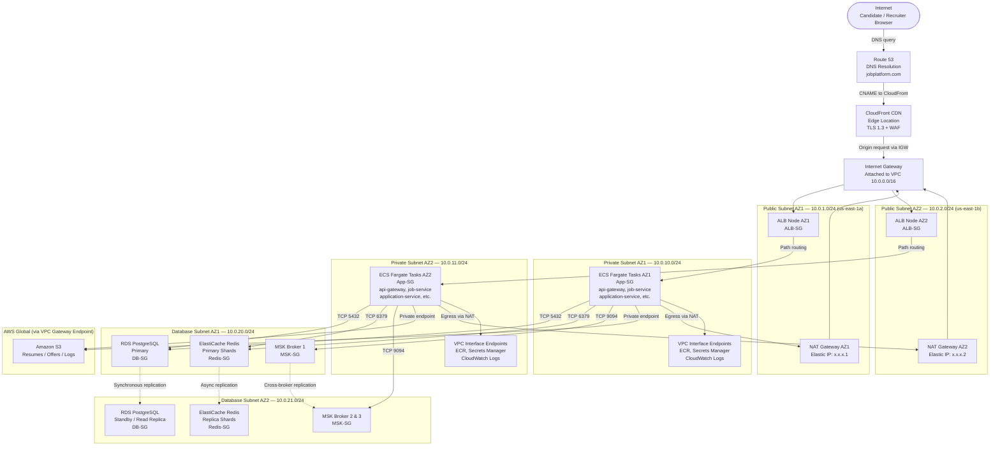

# Network Infrastructure — Job Board and Recruitment Platform

## Overview

This document describes the AWS Virtual Private Cloud (VPC) network architecture for the Job Board and Recruitment Platform. The design follows AWS Well-Architected Framework principles: defense in depth, least-privilege access, and high availability across two Availability Zones (AZs).

The network is partitioned into three logical tiers:

1. **Public Tier** — Internet-facing resources: Application Load Balancer and NAT Gateways
2. **Private Application Tier** — ECS Fargate workloads with no direct internet ingress
3. **Database Tier** — RDS, ElastiCache, and MSK with no route to the internet whatsoever

Traffic between tiers is controlled via Security Groups and Network Access Control Lists (NACLs). VPC Endpoints eliminate the need for database and storage traffic to traverse the public internet.

---

## VPC and Subnet Design

### VPC

| Attribute   | Value           |
|-------------|-----------------|
| CIDR Block  | `10.0.0.0/16`   |
| DNS Support | Enabled         |
| DNS Hostnames | Enabled       |
| Tenancy     | Default         |

### Subnets

| Subnet Name          | CIDR              | AZ           | Tier         | Resources                         |
|----------------------|-------------------|--------------|--------------|-----------------------------------|
| public-subnet-az1    | `10.0.1.0/24`     | us-east-1a   | Public       | ALB nodes, NAT Gateway AZ1        |
| public-subnet-az2    | `10.0.2.0/24`     | us-east-1b   | Public       | ALB nodes, NAT Gateway AZ2        |
| private-subnet-az1   | `10.0.10.0/24`    | us-east-1a   | Application  | ECS Fargate tasks                 |
| private-subnet-az2   | `10.0.11.0/24`    | us-east-1b   | Application  | ECS Fargate tasks                 |
| database-subnet-az1  | `10.0.20.0/24`    | us-east-1a   | Database     | RDS primary, ElastiCache, MSK     |
| database-subnet-az2  | `10.0.21.0/24`    | us-east-1b   | Database     | RDS standby/replica, ElastiCache  |

---

## Internet Gateway and NAT Gateways

- **Internet Gateway (IGW)**: Attached to the VPC; provides bidirectional internet access for resources in public subnets (ALB, NAT Gateways).
- **NAT Gateway AZ1** (Elastic IP): Deployed in `public-subnet-az1`; provides outbound-only internet access for ECS tasks in `private-subnet-az1`. Used for pulling Docker images from public registries (when ECR endpoint is unavailable) and third-party API calls (LinkedIn, DocuSign, SendGrid).
- **NAT Gateway AZ2** (Elastic IP): Deployed in `public-subnet-az2`; mirrors AZ1 NAT Gateway for high availability. Eliminates cross-AZ data transfer charges for egress traffic.

---

## Route Tables

| Route Table         | Associated Subnets              | Routes                                                              |
|---------------------|---------------------------------|---------------------------------------------------------------------|
| public-rt           | public-subnet-az1/az2           | `0.0.0.0/0` → IGW; `10.0.0.0/16` → local                         |
| private-rt-az1      | private-subnet-az1              | `0.0.0.0/0` → NAT GW AZ1; `10.0.0.0/16` → local; S3/SM → VPC EP  |
| private-rt-az2      | private-subnet-az2              | `0.0.0.0/0` → NAT GW AZ2; `10.0.0.0/16` → local; S3/SM → VPC EP  |
| database-rt         | database-subnet-az1/az2         | `10.0.0.0/16` → local only (no internet route)                    |

---

## Security Groups

Security Groups act as stateful, instance-level firewalls. The principle of least privilege is applied: each group permits only the minimum traffic required for its function.

### ALB-SG (Application Load Balancer)
| Direction | Protocol | Port  | Source/Destination   | Purpose                               |
|-----------|----------|-------|----------------------|---------------------------------------|
| Inbound   | TCP      | 443   | `0.0.0.0/0`          | HTTPS from internet (CloudFront IPs)  |
| Inbound   | TCP      | 80    | `0.0.0.0/0`          | HTTP redirect to HTTPS                |
| Outbound  | TCP      | 3000–9000 | App-SG            | Forward to ECS tasks                  |

In production, port 443 ingress is further restricted to CloudFront managed prefix list (`com.amazonaws.global.cloudfront.origin-facing`) to prevent direct ALB access bypassing WAF.

### App-SG (ECS Fargate Tasks)
| Direction | Protocol | Port      | Source/Destination   | Purpose                               |
|-----------|----------|-----------|----------------------|---------------------------------------|
| Inbound   | TCP      | 3000–9000 | ALB-SG               | Application traffic from ALB          |
| Inbound   | TCP      | Any       | App-SG               | Inter-service communication           |
| Outbound  | TCP      | 5432      | DB-SG                | PostgreSQL                            |
| Outbound  | TCP      | 6379      | Redis-SG             | ElastiCache Redis                     |
| Outbound  | TCP      | 9092,9094 | MSK-SG               | Kafka plaintext and TLS               |
| Outbound  | TCP      | 443       | `0.0.0.0/0`          | HTTPS egress via NAT GW               |

### DB-SG (RDS PostgreSQL)
| Direction | Protocol | Port  | Source/Destination   | Purpose                               |
|-----------|----------|-------|----------------------|---------------------------------------|
| Inbound   | TCP      | 5432  | App-SG               | PostgreSQL from ECS tasks only        |
| Outbound  | —        | —     | None                 | No outbound rules required            |

### Redis-SG (ElastiCache)
| Direction | Protocol | Port  | Source/Destination   | Purpose                               |
|-----------|----------|-------|----------------------|---------------------------------------|
| Inbound   | TCP      | 6379  | App-SG               | Redis from ECS tasks only             |
| Outbound  | —        | —     | None                 | No outbound rules required            |

### MSK-SG (Amazon MSK Kafka)
| Direction | Protocol | Port        | Source/Destination   | Purpose                               |
|-----------|----------|-------------|----------------------|---------------------------------------|
| Inbound   | TCP      | 9092        | App-SG               | Kafka plaintext                       |
| Inbound   | TCP      | 9094        | App-SG               | Kafka TLS                             |
| Inbound   | TCP      | 2181        | App-SG               | ZooKeeper (if applicable)             |

---

## Network ACLs (NACLs)

NACLs provide a stateless, subnet-level defense layer in addition to Security Groups.

### Public Subnet NACL
- **Inbound**: Allow TCP 443 from `0.0.0.0/0`; Allow TCP 80 from `0.0.0.0/0`; Allow TCP 1024–65535 (ephemeral) from `0.0.0.0/0`; Deny all else.
- **Outbound**: Allow all TCP to `0.0.0.0/0`; Deny all UDP and ICMP.

### Private Application Subnet NACL
- **Inbound**: Allow TCP 3000–9000 from `10.0.1.0/24` and `10.0.2.0/24`; Allow TCP 1024–65535 (ephemeral) from `0.0.0.0/0`; Allow TCP from `10.0.10.0/24` and `10.0.11.0/24` (inter-service).
- **Outbound**: Allow TCP 5432, 6379, 9092, 9094 to `10.0.20.0/24` and `10.0.21.0/24`; Allow TCP 443 to `0.0.0.0/0`; Allow ephemeral TCP to `0.0.0.0/0`.

### Database Subnet NACL
- **Inbound**: Allow TCP 5432 from `10.0.10.0/24`, `10.0.11.0/24`; Allow TCP 6379 from app subnets; Allow TCP 9092, 9094 from app subnets.
- **Outbound**: Allow TCP 1024–65535 to app subnets only. Deny all internet.

---

## VPC Endpoints

VPC Endpoints route AWS service traffic over the AWS private backbone, eliminating NAT Gateway charges and keeping sensitive traffic off the public internet.

| Endpoint                        | Type        | Used By                              |
|---------------------------------|-------------|--------------------------------------|
| `com.amazonaws.*.s3`            | Gateway     | ECS tasks reading/writing resumes    |
| `com.amazonaws.*.secretsmanager`| Interface   | ECS tasks fetching secrets at startup|
| `com.amazonaws.*.ecr.api`       | Interface   | ECS pulling container images from ECR|
| `com.amazonaws.*.ecr.dkr`       | Interface   | ECS pulling container image layers   |
| `com.amazonaws.*.logs`          | Interface   | ECS tasks sending logs to CloudWatch |
| `com.amazonaws.*.monitoring`    | Interface   | Metrics publishing to CloudWatch     |
| `com.amazonaws.*.ssm`           | Interface   | Parameter Store access               |

### PrivateLink for MSK
MSK brokers are accessed via AWS PrivateLink, creating private ENIs in the application subnets. This ensures Kafka traffic never leaves the VPC and does not require routing through the database subnet.

---

## Traffic Flow Diagram

---

## DNS and Certificate Management

- Internal service discovery uses **AWS Cloud Map** (Service Connect) with DNS names in the format `job-service.jobplatform.internal`. ECS services register automatically on task start.
- External domains are managed in **Route 53** with the apex domain `jobplatform.com` and subdomains: `api.jobplatform.com` (ALB), `careers.jobplatform.com` (candidate portal), `app.jobplatform.com` (recruiter dashboard).
- TLS certificates are provisioned via **AWS Certificate Manager (ACM)** with auto-renewal. The CloudFront distribution uses a wildcard certificate `*.jobplatform.com`.

---

## Cost Considerations

- **NAT Gateway**: Charged per GB of data processed. ECS tasks pulling large container images trigger significant NAT charges. Mitigated by ECR VPC Interface Endpoint — container pulls do not pass through NAT.
- **VPC Interface Endpoints**: Charged per AZ per hour (~$0.01/hr each) plus data processing. More cost-effective than NAT Gateway for high-volume AWS service traffic.
- **Cross-AZ Data Transfer**: ECS tasks always communicate with database nodes in the same AZ first (ElastiCache read replicas, RDS Multi-AZ transparent). This is enforced via ECS task placement constraints with `availabilityZone` spread strategy.
