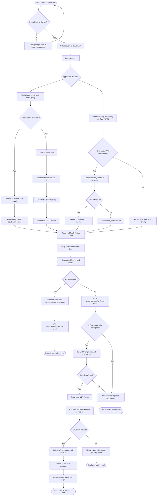

# Activity Diagrams — Knowledge Base Platform

## Introduction

This document presents activity diagrams for the four core workflows of the Knowledge Base
Platform. Each diagram uses **Mermaid flowchart TD** syntax and includes swimlane annotations
indicating which actor or subsystem is responsible for each activity. The diagrams model
control flow, decision branches, parallel activities (fork/join), and exception paths.

Swimlane notation is indicated via comment blocks preceding each group of nodes.
Decision diamonds represent guard conditions; parallelogram-style nodes represent data
stores or external calls.

---

## 1. Article Creation and Publishing Workflow

**Scope:** End-to-end journey from an Author's initial draft through editorial review to a
published, indexed article — including rejection, revision cycles, and notification steps.

**Swimlanes:** Author | TipTap Editor (Frontend) | Backend API | Editorial Queue | Editor |
Notification Service | Search / Vector Index

```mermaid
flowchart TD
    %% ── AUTHOR swimlane ──────────────────────────────────────────────
    A1([Author logs in]) --> A2[Navigate to New Article]
    A2 --> A3[Enter title and body in TipTap Editor]
    A3 --> A4{AI Draft Assist?}
    A4 -->|Yes| A5[Request AI content generation]
    A5 --> A6[AI returns structured draft]
    A6 --> A7[Author reviews and edits draft]
    A4 -->|No| A7
    A7 --> A8[Attach media and set metadata]
    A8 --> A9[Assign to Collection]
    A9 --> A10{Collection write permission?}
    A10 -->|No| A11[Show permission error — stop]
    A10 -->|Yes| A12[Click Save Draft]

    %% ── FRONTEND / AUTOSAVE swimlane ────────────────────────────────
    A3 -->|Every 30 s| AS1[Autosave POST to API]
    AS1 --> AS2{Save succeeded?}
    AS2 -->|Yes| AS3[Update draft timestamp]
    AS2 -->|No| AS4[Retry up to 3x]
    AS4 --> AS5{Retry succeeded?}
    AS5 -->|Yes| AS3
    AS5 -->|No| AS6[Warn: Autosave failed — buffer locally]

    %% ── BACKEND API swimlane ────────────────────────────────────────
    A12 --> B1[Validate: title ≥ 5 chars, collection set]
    B1 --> B2{Validation passed?}
    B2 -->|No| B3[Return 422 — display inline errors]
    B3 --> A7
    B2 -->|Yes| B4[Persist Article record — state: draft]
    B4 --> B5[Create ArticleVersion v1]
    B5 --> B6[Emit article.drafted event]
    B6 --> A13[Author receives draft saved confirmation]

    A13 --> A14{Ready to submit for review?}
    A14 -->|No| A7
    A14 -->|Yes| A15[Click Submit for Review]
    A15 --> B7[Validate: body ≥ 50 chars, SEO desc set]
    B7 --> B8{Validation passed?}
    B8 -->|No| B9[Return 422 — show missing fields]
    B9 --> A7
    B8 -->|Yes| B10[Transition state: draft → in_review]
    B10 --> B11[Emit article.submitted_for_review event]

    %% ── EDITORIAL QUEUE swimlane ────────────────────────────────────
    B11 --> EQ1[Article appears in Editorial Queue]
    EQ1 --> EQ2{Specific reviewer requested?}
    EQ2 -->|Yes| EQ3[Assign to requested reviewer]
    EQ2 -->|No| EQ4[Assign to next available Editor]
    EQ3 --> NS1
    EQ4 --> NS1

    %% ── NOTIFICATION SERVICE swimlane ────────────────────────────────
    NS1[Send in-app + email to assigned Editor]
    NS1 --> ED1

    %% ── EDITOR swimlane ─────────────────────────────────────────────
    ED1([Editor opens article in review mode])
    ED1 --> ED2[Read article and add inline comments]
    ED2 --> ED3{Decision: Approve or Request Changes?}

    ED3 -->|Request Changes| ED4[Editor writes feedback summary]
    ED4 --> B12[Transition state: in_review → changes_requested]
    B12 --> B13[Emit article.changes_requested event]
    B13 --> NS2[Notify Author: changes required]
    NS2 --> A16[Author receives feedback]
    A16 --> A7

    ED3 -->|Approve| ED5[Click Approve]
    ED5 --> B14[Transition state: in_review → approved]
    B14 --> B15[Emit article.approved event]
    B15 --> NS3[Notify Author: article approved]
    NS3 --> ED6

    %% ── EDITOR publishes ────────────────────────────────────────────
    ED6{Editor publishes immediately or schedules?}
    ED6 -->|Schedule| ED7[Set future publish timestamp]
    ED7 --> B16[Enqueue BullMQ delayed publish job]
    B16 --> WAIT1[Wait until scheduled time]
    WAIT1 --> B17

    ED6 -->|Publish Now| B17[Run pre-publish validation checklist]
    B17 --> B18{All checks pass?}
    B18 -->|No| B19[Show validation errors to Editor]
    B19 --> ED5
    B18 -->|Yes| B20[Transition state: approved → published]
    B20 --> B21[Set publishedAt = UTC now]
    B21 --> B22[Create canonical ArticleVersion snapshot]
    B22 --> B23[Emit article.published event]

    %% ── SEARCH / VECTOR INDEX swimlane ──────────────────────────────
    B23 --> SI1[Enqueue index-article BullMQ job]
    B23 --> SI2[Enqueue embed-article BullMQ job]
    SI1 --> SI3[Update Elasticsearch index]
    SI2 --> SI4[Generate text-embedding-3-small vector]
    SI4 --> SI5[Upsert into pgvector store]
    SI3 --> SI6{Index job succeeded?}
    SI6 -->|No| SI7[Retry 3x — raise alert if all fail]
    SI6 -->|Yes| SI8[Article is live and searchable]
    SI5 --> SI8

    %% ── NOTIFICATION final ───────────────────────────────────────────
    B23 --> NS4[Notify Author: article is published]
    NS4 --> DONE([Article published — end])
```

---

## 2. Search and Retrieval Workflow

**Scope:** From the moment a user enters a query to the rendered results page, covering
full-text search, semantic search, AI Q&A decision routing, and degraded-mode fallback.

**Swimlanes:** User / Widget | Search API | Elasticsearch | pgvector | OpenAI Embedding |
AI Q&A Engine | Results Renderer

---

## 3. In-App Widget Interaction Flow

**Scope:** Full lifecycle of a widget session from page load to resolution or escalation.
Covers context detection, article suggestions, AI chat, and ticket deflection.

**Swimlanes:** Host Product Browser | Widget Runtime | Widget API | KB Search Engine |
AI Q&A Engine | Support Integration

```mermaid
flowchart TD
    HP1([Host product page loads]) --> HP2[Execute widget bootstrap script]
    HP2 --> HP3{CDN reachable?}
    HP3 -->|No| HP4[Widget fails silently — host product unaffected]
    HP3 -->|Yes| HP5[Load widget bundle from CloudFront]
    HP5 --> HP6[Widget sends init request to /api/widget/init]

    %% ── Widget API ──────────────────────────────────────────────────
    HP6 --> WA1{CORS origin whitelisted?}
    WA1 -->|No| WA2[Return 403 — widget inactive]
    WA1 -->|Yes| WA3[Validate workspace ID and plan]
    WA3 --> WA4{Authenticated user token present?}
    WA4 -->|Yes| WA5[Decode JWT — load user context]
    WA4 -->|No| WA6[Use anonymous session context]
    WA5 --> CTX1
    WA6 --> CTX1

    %% ── Context Detection ────────────────────────────────────────────
    CTX1[Extract page URL and metadata signals]
    CTX1 --> CTX2[Match URL patterns against article collection labels]
    CTX2 --> CTX3[Run semantic similarity on page title vs article titles]
    CTX3 --> CTX4[Rank contextual articles — top 5]
    CTX4 --> CTX5[Return article cards to widget]
    CTX5 --> HP7[Render collapsed widget launcher button]
    HP7 --> HP8[Emit widget.initialized event]

    %% ── User opens widget ────────────────────────────────────────────
    HP8 --> UI1{User clicks launcher?}
    UI1 -->|No| UI2[Widget stays collapsed — session idle]
    UI1 -->|Yes| UI3[Widget expands — display contextual article cards]
    UI3 --> UI4{User reads an article card?}
    UI4 -->|Yes| UI5[Open article in widget panel]
    UI5 --> UI6[Track widget.article_suggested event]
    UI6 --> UI7{Issue resolved?}
    UI7 -->|Yes| UI8[User marks This helped]
    UI8 --> UI9[Emit feedback.submitted — deflected=true]
    UI9 --> DONE1([Session ends — ticket deflected])

    UI7 -->|No| UI10
    UI4 -->|No| UI10

    %% ── AI Chat path ─────────────────────────────────────────────────
    UI10[User clicks Ask AI]
    UI10 --> AI1[Emit widget.chat_started event]
    AI1 --> AI2[User types question and submits]
    AI2 --> AI3[Widget API routes to AI Q&A Engine]

    %% ── AI Q&A Engine ────────────────────────────────────────────────
    AI3 --> AIE1[Generate question embedding]
    AIE1 --> AIE2[Retrieve top-5 chunks from pgvector]
    AIE2 --> AIE3{Confidence ≥ 0.45?}
    AIE3 -->|Yes| AIE4[Build RAG prompt and call GPT-4o]
    AIE4 --> AIE5[Stream answer to widget]
    AIE5 --> AIE6[Display answer with source article links]
    AIE6 --> UI11{User satisfied?}
    UI11 -->|Yes| UI12[User marks Resolved]
    UI12 --> UI13[Emit feedback.submitted — deflected=true]
    UI13 --> DONE2([Session ends — ticket deflected])

    AIE3 -->|No| AIE7[Return disclaimer: Not fully certain]
    AIE7 --> AIE8[Emit ai.fallback_triggered event]
    AIE8 --> UI14

    UI11 -->|No| UI14

    %% ── Escalation path ──────────────────────────────────────────────
    UI14[Show escalation options: Submit ticket / Live chat]
    UI14 --> UI15{User chooses?}
    UI15 -->|Submit Ticket| TK1[Pre-fill form with conversation summary]
    TK1 --> TK2[User fills email and description]
    TK2 --> TK3[POST to /api/widget/escalate]
    TK3 --> SI1{Integration API available?}
    SI1 -->|Yes| SI2[Create ticket in Zendesk / Jira]
    SI2 --> SI3[Return ticket reference number]
    SI3 --> UI16[Display: Ticket submitted — ref# shown]
    UI16 --> UI17[Emit widget.escalation_triggered event]
    UI17 --> DONE3([Session ends — ticket created])

    SI1 -->|No| SI4[Buffer request — async retry]
    SI4 --> UI18[Display: Request received — we will follow up]
    UI18 --> DONE4([Session ends — pending ticket])

    UI15 -->|Live Chat| LC1[Open live chat integration]
    LC1 --> DONE5([Live chat session — end of widget flow])
```

---

## 4. User Onboarding Flow

**Scope:** From workspace creation by the first admin through SSO configuration, first
article creation, and team invitation — the complete onboarding journey.

**Swimlanes:** Prospective Admin | Onboarding Wizard | Backend | SSO Provider | Author /
Team Member | Notification Service

```mermaid
flowchart TD
    PA1([Admin signs up for platform]) --> PA2[Enter organisation name and email]
    PA2 --> PA3[Verify email via link]
    PA3 --> PA4{Email verified?}
    PA4 -->|No| PA5[Resend verification — wait]
    PA5 --> PA4
    PA4 -->|Yes| PA6[Select workspace plan]
    PA6 --> PA7[Enter billing details]
    PA7 --> BE1[Create Workspace record]
    BE1 --> BE2[Assign creator as Super Admin of workspace]
    BE2 --> BE3[Emit workspace.created event]
    BE3 --> OW1

    %% ── Onboarding Wizard ────────────────────────────────────────────
    OW1[Launch onboarding checklist wizard]
    OW1 --> OW2[Step 1: Configure branding — logo, colours, domain]
    OW2 --> OW3[Step 2: Choose authentication method]
    OW3 --> OW4{Enable SSO?}

    OW4 -->|Yes| SSO1[Navigate to SSO settings]
    SSO1 --> SSO2[Select protocol: SAML 2.0 or OIDC]
    SSO2 --> SSO3[Upload IdP metadata or enter OIDC credentials]
    SSO3 --> SSO4[Map attributes: email, name, role]
    SSO4 --> SSO5[Click Save and Test]
    SSO5 --> SP1[Platform sends SP-initiated test request]
    SP1 --> SSOP1([SSO Provider receives request])
    SSOP1 --> SSOP2[IdP authenticates test user]
    SSOP2 --> SSOP3[IdP returns SAML assertion / OIDC token]
    SSOP3 --> SSO6{Test assertion valid?}
    SSO6 -->|No| SSO7[Show attribute mismatch error]
    SSO7 --> SSO3
    SSO6 -->|Yes| SSO8[Mark SSO config as active]
    SSO8 --> SSO9[Emit integration.connected — type: sso]
    SSO9 --> OW5

    OW4 -->|No| OW5

    %% ── First Article ────────────────────────────────────────────────
    OW5[Step 3: Create your first article]
    OW5 --> OW6[Guided template: Choose article type]
    OW6 --> OW7[Pre-fill template content]
    OW7 --> ART1[Admin authors first article using TipTap]
    ART1 --> ART2[Add title, body, and tags]
    ART2 --> ART3[Click Publish directly — Admin bypasses review for first article]
    ART3 --> BE4[Persist and publish article]
    BE4 --> BE5[Enqueue search and vector indexing jobs]
    BE5 --> OW8

    %% ── Invite Team ──────────────────────────────────────────────────
    OW8[Step 4: Invite your team]
    OW8 --> OW9[Enter team member emails and assign roles]
    OW9 --> BE6[Create pending User + Invitation records]
    BE6 --> NS1[Notification Service sends invitation emails]
    NS1 --> TM1([Team member receives email invitation])
    TM1 --> TM2[Team member clicks accept link]
    TM2 --> TM3{SSO configured?}
    TM3 -->|Yes| TM4[Redirect to IdP for SSO login]
    TM4 --> TM5[IdP authenticates team member]
    TM5 --> TM6[Platform creates User record with mapped role]
    TM3 -->|No| TM7[Team member sets password via onboarding form]
    TM7 --> TM6
    TM6 --> TM8[Emit user.registered event]
    TM8 --> TM9[Team member accesses workspace dashboard]

    %% ── Onboarding complete ──────────────────────────────────────────
    OW9 --> OW10[Mark onboarding checklist as complete]
    OW10 --> OW11[Show confetti animation and success screen]
    OW11 --> OW12[Admin receives onboarding completion summary email]
    OW12 --> DONE([Workspace fully onboarded — end])
```

---

## Operational Policy Addendum

### Section 1 — Content Governance Policies
All transitions in Diagram 1 (Article Creation and Publishing) are governed by the state
machine defined in the platform's domain model. Bypassing review (e.g., direct
`draft → published` transitions) is prohibited for all roles below Super Admin.
AI-generated drafts (AF-001C) must carry the `ai_assisted` flag and display a banner in
the editor so that the Author and Editor are aware before publishing.
The `changes_requested` cycle may iterate without limit, but the system logs each cycle
count. Articles with more than 5 rejected cycles generate an alert to the Workspace Admin.

### Section 2 — Reader Data Privacy Policies
All search query payloads captured in Diagram 2 are anonymised before storage:
IP addresses are hashed, and unauthenticated session tokens are ephemeral (24-hour TTL).
Widget interaction events captured in Diagram 3 (widget.initialized, widget.chat_started,
widget.article_suggested) must not store device fingerprints or precise geolocation.
Escalation form data (email, message) is protected in transit via TLS 1.3 and at rest
via AES-256 encryption on the RDS instance.

### Section 3 — AI Usage Policies
In Diagram 2 (Search and Retrieval), the AI Q&A branch is only invoked when no search
results are found or the user explicitly requests it. The system must not silently replace
search results with AI-generated content. In Diagram 3 (Widget Flow), AI answers must
include source article links. Conversation summaries sent to the support integration (step
TK1) must be clearly labelled as AI-generated to prevent support agents from treating
them as direct user statements.

### Section 4 — System Availability Policies
All four diagrams include explicit degraded-mode and error handling branches. Diagram 2
requires Elasticsearch failover to PostgreSQL FTS within 3 seconds. Diagram 3 requires the
widget to fail silently if CDN is unreachable. Diagram 4 requires the invitation system to
queue retry sending if the notification service is temporarily unavailable. BullMQ jobs
created in Diagram 1 (index-article, embed-article) must be persisted to Redis with AOF
durability so that queued jobs survive a Redis restart.
