# BPMN Swimlane Diagrams — Knowledge Base Platform

## Introduction to BPMN Notation

This document models three core business processes using BPMN 2.0 concepts represented in
**Mermaid flowchart LR** syntax (left-to-right orientation to replicate horizontal swimlane
layouts). The following notation conventions apply throughout:

| Symbol | BPMN Concept | Mermaid Representation |
|---|---|---|
| `([...])` circle | Start / End Event | Rounded nodes at flow boundaries |
| `[...]` rectangle | Service / User Task | Standard rectangular nodes |
| `{...}` diamond | Exclusive Gateway (XOR) | Diamond-shaped decision nodes |
| `(((...)))` double circle | Intermediate Event (timer / message) | Nested circles |
| `-->` solid arrow | Sequence Flow | Standard directed edge |
| `-.->` dashed arrow | Message Flow (cross-lane) | Dashed directed edge |
| `-->|label|` | Conditional Sequence Flow | Labelled directed edge |

Swimlane boundaries are indicated by comment headings in the diagram source. Each swimlane
represents a distinct participant (role, system, or external service) in the process.

---

## Process 1 — Article Lifecycle Process

### Process Narrative

The Article Lifecycle Process governs the complete journey of a knowledge-base article from
initial drafting through active publication to eventual archival. Four participants collaborate:
the **Author** creates and revises content; the **Editor** reviews, approves, and manages the
published state; the **System** enforces state machine rules, persists data, and enqueues
background jobs; and the **Notification Service** dispatches asynchronous communications.

The process begins when an Author decides to create a new article. The Author works within the
TipTap editor, saving drafts iteratively via an autosave mechanism. When satisfied, the Author
submits the article to the editorial queue. The System validates mandatory fields and transitions
the article to `in_review`, simultaneously notifying the assigned Editor.

The Editor reviews the draft, optionally adding inline comments. The decision gateway either
routes the article back to the Author with a `changes_requested` status (triggering another
revision cycle) or advances it to `approved`. An approved article may be published immediately
or scheduled for future publication. At publish time the System executes two parallel background
jobs: updating the Elasticsearch full-text index and generating and storing the pgvector
embedding. Both must succeed for the article to be considered fully indexed.

A published article may subsequently be unpublished (reverting to a non-public but preserved
state) or archived (read-only, version history retained for 365 days). All state transitions
generate audit log entries. Editors may force-archive articles that are stale (not updated in
180 days) after an automated staleness alert is dispatched.

```mermaid
flowchart LR
    %% ══════════════════════════════════════════════
    %% SWIMLANE: Author
    %% ══════════════════════════════════════════════
    A_START([Start: Author decides\nto create article])
    A1[Open New Article\nin TipTap Editor]
    A2[Write title and body content]
    A3[Attach media and set metadata]
    A4[Assign to Collection]
    A5{Submit\nfor review?}
    A6[Save Draft — continue later]
    A7[Submit for Review]
    A8[Receive review feedback]
    A9[Revise article per comments]
    A10[Resubmit for Review]
    A11[Receive published notification]

    %% ══════════════════════════════════════════════
    %% SWIMLANE: Editor
    %% ══════════════════════════════════════════════
    ED1[Open article in Review Mode]
    ED2[Read content and add inline comments]
    ED3{Decision:\nApprove or Request Changes?}
    ED4[Enter change request summary]
    ED5[Click Approve]
    ED6{Publish now\nor schedule?}
    ED7[Set scheduled publish time]
    ED8[Click Publish Now]
    ED9[Unpublish article]
    ED10[Archive article]
    ED11{Is article\nstale ≥ 180 days?}

    %% ══════════════════════════════════════════════
    %% SWIMLANE: System
    %% ══════════════════════════════════════════════
    SYS1[Validate: title ≥ 5 chars,\nbody ≥ 50 chars, SEO desc set]
    SYS2{Validation\npassed?}
    SYS3[Return 422 errors to Author]
    SYS4[Transition state:\ndraft → in_review]
    SYS5[Create ArticleVersion snapshot]
    SYS6[Emit article.submitted_for_review]
    SYS7[Transition state:\nin_review → changes_requested]
    SYS8[Emit article.changes_requested]
    SYS9[Transition state:\nin_review → approved]
    SYS10[Emit article.approved]
    SYS11[Enqueue delayed publish job\nin BullMQ]
    SYS12[Transition state:\napproved → published]
    SYS13[Set publishedAt timestamp]
    SYS14[Create canonical version snapshot]
    SYS15[Emit article.published]
    SYS16[Enqueue index-article job]
    SYS17[Enqueue embed-article job]
    SYS18[Update Elasticsearch index]
    SYS19[Generate and store pgvector embedding]
    SYS20[Transition state:\npublished → unpublished]
    SYS21[Emit article.unpublished]
    SYS22[Transition state:\nany → archived]
    SYS23[Emit article.archived]
    SYS24[Write audit log entry]
    SYS25{Auto-archive\nstaleness check}

    %% ══════════════════════════════════════════════
    %% SWIMLANE: Notification Service
    %% ══════════════════════════════════════════════
    NS1[Send in-app + email to Editor:\nNew article to review]
    NS2[Send in-app + email to Author:\nChanges requested]
    NS3[Send in-app + email to Author:\nArticle approved]
    NS4[Send in-app + email to Author:\nArticle published]
    NS5[Send staleness alert to Author\nand Workspace Admin]

    %% ══════════════════════════════════════════════
    %% SEQUENCE FLOWS
    %% ══════════════════════════════════════════════
    A_START --> A1 --> A2 --> A3 --> A4 --> A5
    A5 -->|Not yet| A6
    A6 -.->|Author returns later| A2
    A5 -->|Yes| A7
    A7 --> SYS1 --> SYS2
    SYS2 -->|Fail| SYS3
    SYS3 -.-> A9
    SYS2 -->|Pass| SYS4 --> SYS5 --> SYS6
    SYS6 -.-> NS1
    SYS6 --> ED1
    ED1 --> ED2 --> ED3
    ED3 -->|Request Changes| ED4
    ED4 --> SYS7 --> SYS8
    SYS8 -.-> NS2
    NS2 -.-> A8
    A8 --> A9 --> A10
    A10 -.-> SYS4
    ED3 -->|Approve| ED5
    ED5 --> SYS9 --> SYS10
    SYS10 -.-> NS3
    NS3 -.-> A11
    SYS10 --> ED6
    ED6 -->|Schedule| ED7 --> SYS11
    SYS11 -.->|Timer fires| SYS12
    ED6 -->|Now| ED8 --> SYS12
    SYS12 --> SYS13 --> SYS14 --> SYS15
    SYS15 --> SYS16 --> SYS18
    SYS15 --> SYS17 --> SYS19
    SYS15 -.-> NS4
    SYS15 --> SYS24
    SYS25 -->|Stale| NS5
    NS5 -.-> ED11
    ED11 -->|Yes| ED10
    ED11 -->|No| SYS25
    ED9 --> SYS20 --> SYS21 --> SYS24
    ED10 --> SYS22 --> SYS23 --> SYS24
    SYS18 --> DONE([End: Article live\nand indexed])
    SYS19 --> DONE
```

---

## Process 2 — Customer Self-Service Resolution Process

### Process Narrative

The Customer Self-Service Resolution Process describes how a customer attempts to resolve an
issue through automated self-service channels before being escalated to a human support agent.
Five participants interact: the **Customer** (end user experiencing a problem); the **Widget**
(the embedded help widget running in the customer's browser); the **KB Search Engine** (the
backend search and retrieval system); the **AI Assistant** (the RAG-based Q&A engine); and the
**Support Agent** (human resolver of last resort).

The process starts when a customer opens the help widget. The Widget interrogates the KB Search
Engine with a context-aware query derived from the current page. If relevant articles are found
and the customer marks the issue as resolved, the process ends with a deflection—no ticket is
created. If the search results are insufficient, the customer may invoke the AI Assistant for a
conversational answer. The AI Assistant retrieves relevant article chunks from the vector store
and synthesises an answer using GPT-4o. If the answer satisfies the customer, the process ends
with a second deflection opportunity. If neither self-service channel resolves the issue, the
Widget collects escalation details and creates a ticket, routing it to the Support Agent. The
Support Agent resolves the issue and may trigger an article creation recommendation to prevent
future occurrences of the same question.

```mermaid
flowchart LR
    %% ══════════════════════════════════════════════
    %% SWIMLANE: Customer
    %% ══════════════════════════════════════════════
    C_START([Start: Customer\nencounters problem])
    C1[Opens help widget launcher]
    C2[Reads suggested article cards]
    C3{Issue resolved\nby article?}
    C4[Marks This helped]
    C5[Clicks Ask AI]
    C6[Types natural language question]
    C7[Reads streamed AI answer]
    C8{Issue resolved\nby AI answer?}
    C9[Marks Resolved]
    C10[Clicks Still need help]
    C11[Fills escalation form:\nemail and description]
    C12[Submits form]
    C13[Receives ticket confirmation\nwith reference number]

    %% ══════════════════════════════════════════════
    %% SWIMLANE: Widget
    %% ══════════════════════════════════════════════
    W1[Send /api/widget/init request]
    W2[Receive contextual article cards]
    W3[Render article cards in panel]
    W4[Emit widget.article_suggested]
    W5[Emit feedback.submitted — deflected=true]
    W6[Emit widget.chat_started]
    W7[Forward question to AI Q&A API]
    W8[Stream answer tokens to UI]
    W9[Display answer with source links]
    W10[Emit feedback.submitted — deflected=true]
    W11[Show escalation form]
    W12[POST to /api/widget/escalate]
    W13[Emit widget.escalation_triggered]

    %% ══════════════════════════════════════════════
    %% SWIMLANE: KB Search Engine
    %% ══════════════════════════════════════════════
    KBS1[Validate CORS and workspace]
    KBS2[Run page-context URL pattern match]
    KBS3[Run semantic similarity on page title]
    KBS4[Rank and return top-5 articles]
    KBS5{Results\nfound?}
    KBS6[Return empty list with AI prompt flag]

    %% ══════════════════════════════════════════════
    %% SWIMLANE: AI Assistant
    %% ══════════════════════════════════════════════
    AI1[Generate question embedding]
    AI2[Retrieve top-5 chunks from pgvector]
    AI3{Confidence\n≥ 0.45?}
    AI4[Build RAG prompt + conversation history]
    AI5[Call GPT-4o API — stream response]
    AI6[Append source article citations]
    AI7[Emit ai.answer_generated]
    AI8[Append low-confidence disclaimer]
    AI9[Emit ai.fallback_triggered]

    %% ══════════════════════════════════════════════
    %% SWIMLANE: Support Agent
    %% ══════════════════════════════════════════════
    SA1[Receive ticket notification]
    SA2[Review ticket with AI conversation summary]
    SA3[Resolve customer issue]
    SA4{Knowledge gap\nidentified?}
    SA5[Flag article creation recommendation]
    SA6[Emit support.ticket_resolved event]
    SA_END([End: Issue resolved\nby human agent])

    %% ══════════════════════════════════════════════
    %% SEQUENCE FLOWS
    %% ══════════════════════════════════════════════
    C_START --> C1 --> W1
    W1 --> KBS1 --> KBS2 --> KBS3 --> KBS4 --> KBS5
    KBS5 -->|Yes| W2
    KBS5 -->|No| KBS6
    KBS6 --> W3
    W2 --> W3 --> W4 --> C2
    C2 --> C3
    C3 -->|Yes| C4 --> W5
    W5 --> DONE1([End: Ticket deflected\nby article])
    C3 -->|No| C5
    KBS6 -.-> C5
    C5 --> W6 --> C6 --> W7
    W7 --> AI1 --> AI2 --> AI3
    AI3 -->|High confidence| AI4 --> AI5
    AI5 --> W8 --> W9
    AI5 --> AI6 --> AI7
    AI3 -->|Low confidence| AI8 --> AI9
    AI9 --> W9
    W9 --> C7 --> C8
    C8 -->|Yes| C9 --> W10
    W10 --> DONE2([End: Ticket deflected\nby AI answer])
    C8 -->|No| C10 --> W11 --> C11 --> C12 --> W12
    W12 --> SA1
    W12 --> W13
    W13 --> C13
    SA1 --> SA2 --> SA3 --> SA4
    SA4 -->|Yes| SA5 --> SA6 --> SA_END
    SA4 -->|No| SA6 --> SA_END
```

---

## Process 3 — Workspace Onboarding Process

### Process Narrative

The Workspace Onboarding Process captures the administrative steps required to bring a new
tenant workspace from initial sign-up to a fully operational state. Four participants are
involved: the **Workspace Admin** (the person purchasing and configuring the workspace);
the **System** (the platform backend and onboarding wizard); the **Billing** service
(payment processing and plan activation); and the **SSO Provider** (the external identity
management system used by the customer's organisation).

The process begins when the Workspace Admin completes sign-up and enters billing details.
The Billing service processes the payment and activates the appropriate plan tier. The
System creates the workspace and provisions default settings. The Workspace Admin then
works through the onboarding wizard: configuring branding, setting up SSO (optional),
creating the first article, and inviting team members. If SSO configuration fails,
the Admin can skip it and configure it later without blocking the rest of the onboarding
steps. The process ends when all checklist items are marked complete and the workspace
is in a fully active state.

```mermaid
flowchart LR
    %% ══════════════════════════════════════════════
    %% SWIMLANE: Workspace Admin
    %% ══════════════════════════════════════════════
    WA_START([Start: Admin completes\nsign-up form])
    WA1[Enter organisation name and email]
    WA2[Verify email address]
    WA3[Select billing plan]
    WA4[Enter payment method]
    WA5[Configure branding:\nlogo, colours, custom domain]
    WA6{Configure SSO?}
    WA7[Select SSO protocol:\nSAML 2.0 or OIDC]
    WA8[Upload IdP metadata\nor enter OIDC credentials]
    WA9[Map IdP attributes to roles]
    WA10[Click Save and Test SSO]
    WA11[Create first article]
    WA12[Invite team members:\nassign roles]
    WA13[Complete onboarding checklist]

    %% ══════════════════════════════════════════════
    %% SWIMLANE: System
    %% ══════════════════════════════════════════════
    SYS1[Send email verification link]
    SYS2[Validate email token]
    SYS3[Create Workspace record — state: pending]
    SYS4[Assign Admin as Super Admin of workspace]
    SYS5[Provision default collections and settings]
    SYS6[Emit workspace.created event]
    SYS7[Launch onboarding wizard UI]
    SYS8[Validate SSO configuration]
    SYS9{SSO test\nassertions valid?}
    SYS10[Mark SSO config as active]
    SYS11[Emit integration.connected — sso]
    SYS12[Show attribute mismatch error]
    SYS13[Create and publish first article]
    SYS14[Enqueue search and vector index jobs]
    SYS15[Create pending User + Invitation records]
    SYS16[Mark workspace state: active]
    SYS17[Emit workspace.activated event]
    SYS18[Send onboarding complete summary email]

    %% ══════════════════════════════════════════════
    %% SWIMLANE: Billing
    %% ══════════════════════════════════════════════
    BL1[Validate payment method details]
    BL2{Payment\nauthorised?}
    BL3[Activate plan tier on workspace]
    BL4[Emit workspace.plan_activated event]
    BL5[Return payment failure error]
    BL6[Prompt Admin to re-enter payment details]

    %% ══════════════════════════════════════════════
    %% SWIMLANE: SSO Provider
    %% ══════════════════════════════════════════════
    SSOP1[Receive SP-initiated test auth request]
    SSOP2[Authenticate test user]
    SSOP3[Return SAML assertion or OIDC token]

    %% ══════════════════════════════════════════════
    %% SEQUENCE FLOWS
    %% ══════════════════════════════════════════════
    WA_START --> WA1 --> SYS1
    SYS1 -.-> WA2
    WA2 --> SYS2 --> WA3 --> WA4
    WA4 --> BL1 --> BL2
    BL2 -->|Declined| BL5 --> BL6 -.-> WA4
    BL2 -->|Approved| BL3 --> BL4
    BL4 --> SYS3 --> SYS4 --> SYS5 --> SYS6
    SYS6 --> SYS7 --> WA5
    WA5 --> WA6
    WA6 -->|Skip SSO| WA11
    WA6 -->|Configure SSO| WA7 --> WA8 --> WA9 --> WA10
    WA10 --> SYS8
    SYS8 -.-> SSOP1
    SSOP1 --> SSOP2 --> SSOP3
    SSOP3 -.-> SYS9
    SYS9 -->|Invalid| SYS12 -.-> WA8
    SYS9 -->|Valid| SYS10 --> SYS11 --> WA11
    WA11 --> SYS13 --> SYS14
    SYS14 --> WA12
    WA12 --> SYS15
    SYS15 --> WA13
    WA13 --> SYS16 --> SYS17 --> SYS18
    SYS18 --> DONE([End: Workspace fully\nonboarded and active])
```

---

## Operational Policy Addendum

### Section 1 — Content Governance Policies
All BPMN processes in this document that include article state transitions (Process 1) are
bound by the article state machine defined in `business-rules.md`. The state machine is
enforced exclusively in the backend API service; no frontend or integration can directly
mutate the article state field in the database without going through the state machine
validation service. Archival is irreversible except via Super Admin override. Archived
articles retain all version history for a minimum of 365 days per BR-CA-002.

### Section 2 — Reader Data Privacy Policies
In Process 2, all widget interaction events and conversation data collected during the
self-service resolution flow must be handled per the platform's data retention schedule.
Customer email addresses collected during escalation form submission are used solely for
ticket creation and support follow-up; they must not be added to any marketing lists.
Conversation summaries forwarded to the Support Agent must be marked as AI-generated and
must not contain any additional PII beyond what the customer explicitly provided in the
escalation form.

### Section 3 — AI Usage Policies
The AI Assistant swimlane in Process 2 must never call the OpenAI API without first
retrieving context from the workspace's own pgvector store (RAG-first policy per BR-AI-001).
If the pgvector retrieval step returns zero results, the AI must respond with a scripted
message directing the user to support rather than generating an ungrounded answer. All
AI-generated answers presented to customers must include the source article citations to
enable fact-checking. The AI confidence threshold (0.45 cosine similarity) enforced in
Process 2 is a workspace-level configurable setting, but the minimum allowed value is 0.30.

### Section 4 — System Availability Policies
Process 1 relies on BullMQ for asynchronous search indexing and vector embedding. These jobs
must be stored in Redis with AOF persistence enabled so that in-flight jobs survive a Redis
restart. Process 2 requires the Widget API to be available on a globally distributed ECS
Fargate service behind an Application Load Balancer with health checks. Process 3's Billing
integration must implement idempotent payment operations using Stripe idempotency keys to
prevent double-charging during network retries. The SSO test flow in Process 3 must complete
within 30 seconds; if the IdP does not respond within this window, the system must surface a
timeout error and allow the Admin to skip SSO configuration temporarily.
