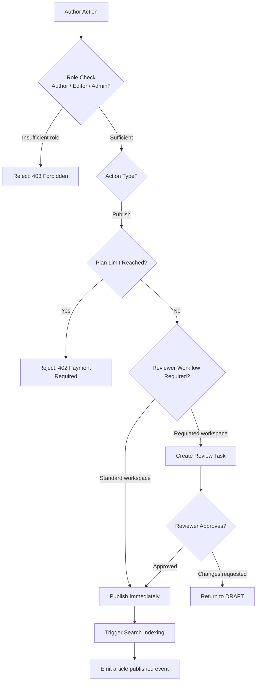

# Business Rules — Knowledge Base Platform

## Introduction

This document codifies the enforceable rules that govern every process in the Knowledge Base
Platform. Business rules are technology-agnostic constraints derived from stakeholder requirements,
regulatory obligations, and operational policies. Each rule carries a unique identifier, a
plain-English statement, a rationale, and the system component responsible for enforcement.

Rule identifiers follow the pattern `BR-<DOMAIN>-<NNN>` where DOMAIN is a short mnemonic for the
functional area. All rules are considered **mandatory** unless marked *(recommended)*.

---

## BR-AUTH — Content Authoring Rules

### BR-AUTH-001: Article Ownership Assignment
**Rule:** Every article must be assigned exactly one primary author at creation time. The creator
is automatically set as primary author unless overridden by a workspace ADMIN or OWNER.  
**Rationale:** Ensures clear accountability for content accuracy and update responsibility.  
**Enforced by:** `ArticleService.createArticle()`

### BR-AUTH-002: Draft State on Creation
**Rule:** All newly created articles enter the `DRAFT` state. No article may skip DRAFT and enter
any other state directly via the creation endpoint.  
**Rationale:** Prevents accidental publication of incomplete content.  
**Enforced by:** Article state machine; `ArticleService`

### BR-AUTH-003: Title Required Before Publish
**Rule:** An article must have a non-empty title of at least 3 characters before it can transition
from `DRAFT` to `REVIEW` or `PUBLISHED`.  
**Rationale:** Ensures all published content is identifiable and indexable.  
**Enforced by:** `ArticleValidator.validateForPublish()`

### BR-AUTH-004: Version Immutability
**Rule:** Once an `ArticleVersion` record is superseded by a newer version, its content fields
(`body`, `title`, `metadata`) are immutable. Only administrative metadata (e.g., `archivedAt`)
may be updated.  
**Rationale:** Preserves audit trail integrity and prevents retroactive content manipulation.  
**Enforced by:** `ArticleVersionRepository` — update operations on `body`/`title` are rejected
after `status = SUPERSEDED`.

### BR-AUTH-005: Maximum Article Body Size
**Rule:** The serialised TipTap JSON body of an article must not exceed 5 MB. Images and file
attachments are stored as S3 object references, never embedded inline.  
**Rationale:** Prevents database bloat and ensures acceptable editor performance on slow
connections.  
**Enforced by:** `ArticleValidator.validateBodySize()`; API request size middleware

### BR-AUTH-006: Mandatory Review Workflow for Regulated Workspaces
**Rule:** Workspaces with `settings.requiresReview = true` must route every article through the
`REVIEW` state before `PUBLISHED`. Direct `DRAFT → PUBLISHED` transitions are blocked for all
roles including ADMIN.  
**Rationale:** Satisfies compliance requirements for regulated industries (finance, healthcare).  
**Enforced by:** `ArticleStateMachineService.validateTransition()`

### BR-AUTH-007: Reviewer Cannot Be Primary Author
**Rule:** The assigned reviewer of an article cannot be the same user as the primary author of
that article within the same review cycle.  
**Rationale:** Enforces a four-eyes principle for content quality assurance.  
**Enforced by:** `ReviewAssignmentService.assignReviewer()`

### BR-AUTH-008: Concurrent Edit Locking via CRDT
**Rule:** When two or more users open an article for editing simultaneously, the system must enter
collaborative mode (Yjs CRDT). If CRDT sync fails due to network partition or server error, the
second editor must see a conflict warning. The database must never receive silently overwritten
content from a stale client.  
**Rationale:** Prevents data loss from last-write-wins conflicts in multi-author environments.  
**Enforced by:** `CollaborationGateway` (WebSocket); `ConflictResolutionService`

### BR-AUTH-009: Attachment Quota Enforcement
**Rule:** A workspace cannot exceed its plan-defined attachment storage quota. Upload requests
that would exceed the quota must be rejected with `QUOTA_EXCEEDED` *before* any bytes are written
to S3.  
**Rationale:** Protects shared infrastructure from uncontrolled storage growth.  
**Enforced by:** `AttachmentService.checkQuota()`; pre-upload quota middleware

### BR-AUTH-010: Auto-Save Interval Bounds
**Rule:** The TipTap editor must trigger an auto-save to the backend no more frequently than every
30 seconds and no less frequently than every 2 minutes while the editor has unsaved changes and
the user's browser tab is active.  
**Rationale:** Balances data safety with server load.  
**Enforced by:** Frontend `AutoSaveService`; BullMQ debounce queue

### BR-AUTH-011: Bulk Import Encoding Validation
**Rule:** Bulk article imports (CSV, Markdown, HTML) must be validated for UTF-8 encoding before
any record is persisted. Files with invalid encoding must be rejected with a per-row error report.  
**Rationale:** Ensures content integrity and prevents character corruption in the database.  
**Enforced by:** `BulkImportService.validateEncoding()`

### BR-AUTH-012: XSS Sanitisation on Persist
**Rule:** All rich-text HTML derived from TipTap JSON must be sanitised via the server-side
DOMPurify equivalent before being stored or served. Inline `<script>`, `<iframe>`, and
`javascript:` href values must be stripped unconditionally, even if originating from a trusted
ADMIN account.  
**Rationale:** Prevents stored XSS attacks via the article editor.  
**Enforced by:** `ContentSanitiser.sanitise()`; called in `ArticleService` before every write

---

## BR-SRCH — Search and Retrieval Rules

### BR-SRCH-001: Workspace Isolation in Search
**Rule:** Every search query must be scoped to the authenticated user's active workspace via a
mandatory `workspaceId` filter. The filter must be applied at query-build time, before any
Elasticsearch or pgvector call, and must not be overridable by query parameters.  
**Rationale:** Enforces multi-tenant data isolation — the most critical security invariant.  
**Enforced by:** `SearchOrchestrator.buildQuery()`

### BR-SRCH-002: Published-Only Index
**Rule:** Only articles in `PUBLISHED` state are eligible for indexing in Elasticsearch or
pgvector. Articles in `DRAFT`, `REVIEW`, `UNPUBLISHED`, or `ARCHIVED` states must be excluded
from all search indices and from index-refresh jobs.  
**Rationale:** Prevents accidental disclosure of unpublished content via search.  
**Enforced by:** `IndexingService.shouldIndex()`; Elasticsearch index filter alias

### BR-SRCH-003: Minimum Query Length
**Rule:** A search query string must be at least 2 characters after whitespace trimming. Queries
shorter than 2 characters must return an empty result set without contacting Elasticsearch.  
**Rationale:** Prevents vacuous searches that return thousands of irrelevant results.  
**Enforced by:** `SearchController` input validation pipe

### BR-SRCH-004: Maximum Results Per Page
**Rule:** A single search request must return at most 50 results per page. Pagination beyond
offset 10,000 (page 200 at size 50) is not supported and must return `PAGINATION_LIMIT_EXCEEDED`.  
**Rationale:** Protects Elasticsearch from deep-pagination performance degradation.  
**Enforced by:** `SearchService.buildQuery()`

### BR-SRCH-005: Hybrid Ranking Formula
**Rule:** Hybrid search results must be ranked using Reciprocal Rank Fusion (RRF) combining
BM25 full-text score (weight 0.6) and cosine vector similarity score (weight 0.4). Articles with
cosine similarity below 0.50 must be excluded from the semantic component of the merge.  
**Rationale:** Balances keyword relevance with semantic relevance for optimal result quality.  
**Enforced by:** `RerankingService.rerank()`

### BR-SRCH-006: No-Result Logging
**Rule:** Every search query returning zero results must be logged to the `search_queries`
analytics table with `resultCount = 0`. This data must be aggregated and surfaced in the
workspace analytics dashboard under "Content Gaps."  
**Rationale:** Enables content gap analysis to guide future authoring priorities.  
**Enforced by:** `SearchAnalyticsService.recordNoResult()`

### BR-SRCH-007: Index Lag SLA
**Rule:** Search results may lag behind article publication by a maximum of 60 seconds under
normal operating conditions. If the indexing pipeline is degraded beyond 60 seconds, the portal
must display: "Search results may be slightly delayed."  
**Rationale:** Sets clear SLA expectations and avoids user confusion about missing recent content.  
**Enforced by:** `IndexingHealthService`; frontend polling via `/api/v1/health/indexing`

### BR-SRCH-008: Autocomplete Debounce
**Rule:** Autocomplete suggestions must not fire for queries shorter than 3 characters.
Client-side debouncing at 250 ms is mandatory. Server-side autocomplete requests that bypass
the character minimum must return `400 Bad Request`.  
**Rationale:** Reduces unnecessary API load while maintaining useful UX.  
**Enforced by:** Frontend `SearchBar` component; API input validation

### BR-SRCH-009: Query String Sanitisation
**Rule:** All inbound search query strings must be sanitised to remove Elasticsearch query DSL
injection patterns (bare `{`, `}`, special field qualifier tokens). Search queries must always be
treated as user-provided strings, never as raw DSL fragments.  
**Rationale:** Prevents Elasticsearch query injection attacks.  
**Enforced by:** `QuerySanitiser.sanitise()` in `SearchService`

### BR-SRCH-010: Semantic Search Opt-Out
**Rule:** Workspace admins may disable semantic (vector) search at the workspace level. When
disabled, all searches use keyword-only BM25 mode and no content is sent to the OpenAI Embeddings
API.  
**Rationale:** Supports workspaces with sensitive content that should not generate external
embeddings.  
**Enforced by:** `WorkspaceSettingsService`; `SearchOrchestrator` checks
`workspace.semanticSearchEnabled`

---

## BR-AI — AI Assistant Rules

### BR-AI-001: Citation Requirement
**Rule:** Every AI-generated answer that references article content must include at least one
in-line citation linking to the source article. Answers without a valid citation must carry a
`LOW_CONFIDENCE` badge and must not be presented as authoritative factual statements.  
**Rationale:** Maintains verifiability and prevents AI hallucination from being mistaken for fact.  
**Enforced by:** `AIAssistantService.extractCitations()`

### BR-AI-002: Context Window Token Limit
**Rule:** The AI assistant must not exceed 12,000 tokens in the RAG context window passed to the
OpenAI API. If selected article chunks exceed this limit, the system truncates by retaining the
highest-scoring chunks first and discarding the lowest-scoring ones.  
**Rationale:** Prevents OpenAI API token quota exhaustion and controls per-request cost.  
**Enforced by:** `RAGContextBuilder.buildContext()`

### BR-AI-003: PII Scrubbing Before OpenAI
**Rule:** Before any user question is transmitted to the OpenAI API, it must pass through the
PII detector. Detected PII patterns (email addresses, phone numbers, national ID formats) must be
replaced with `[REDACTED]` tokens. The original question must never leave the platform boundary.  
**Rationale:** Protects user privacy under GDPR Article 25 (data protection by design).  
**Enforced by:** `PIIScrubber.scrub()` in `AIRequestPipeline`

### BR-AI-004: Conversation Retention Limit
**Rule:** AI conversation logs must be retained for a maximum of 90 days. After this period, all
messages within the conversation must be purged from the database. Workspace admins may configure
retention down to 7 days; they may not extend beyond 90 days.  
**Rationale:** Complies with GDPR data minimisation requirements (Article 5(1)(e)).  
**Enforced by:** `ConversationPurgeJob` (scheduled BullMQ cron)

### BR-AI-005: Workspace-Scoped RAG Retrieval
**Rule:** The vector retrieval step in the RAG pipeline must only retrieve article chunks from the
authenticated user's active workspace. Cross-workspace retrieval is prohibited even when it would
produce a more accurate answer.  
**Rationale:** Enforces multi-tenant data isolation at the AI layer.  
**Enforced by:** `VectorSearchService.searchByWorkspace()`

### BR-AI-006: Prompt Injection Detection
**Rule:** User messages matching prompt-injection patterns (e.g., "ignore previous instructions",
role-escalation attempts, jailbreak strings from the known pattern library) must be blocked before
reaching the OpenAI API. The user must receive `POLICY_VIOLATION` error and the attempt must be
logged with the user ID, workspace, and timestamp.  
**Rationale:** Prevents misuse of the AI assistant and protects the system prompt confidentiality.  
**Enforced by:** `PromptInjectionDetector.detect()`

### BR-AI-007: Competitor Name Post-Processing
**Rule:** AI assistant responses must be post-processed to replace references to competitor
product names (as configured per workspace by an ADMIN) with neutral terms (e.g., "[another
tool]"), unless the workspace admin has explicitly disabled this filter.  
**Rationale:** Protects brand integrity in customer-facing knowledge bases.  
**Enforced by:** `ResponsePostProcessor.filterCompetitors()`

### BR-AI-008: Streaming Timeout Guard
**Rule:** If an OpenAI streaming response does not produce a token within 15 seconds of the last
received token, the stream must be terminated, the partial response returned with a `TIMEOUT`
annotation, and a `ai.stream_timeout` event logged for alerting.  
**Rationale:** Prevents clients from hanging indefinitely on a stalled OpenAI stream.  
**Enforced by:** `AIStreamController` inactivity timeout guard

### BR-AI-009: Token Budget per Workspace
**Rule:** Each workspace has a configurable monthly OpenAI token budget. At 90% consumption,
ADMIN and OWNER members must receive a budget warning email. At 100%, AI assistant requests
must return `TOKEN_QUOTA_EXCEEDED` until the next billing cycle or until an admin manually
increases the budget.  
**Rationale:** Controls per-workspace cost and ensures fair distribution of shared API quota.  
**Enforced by:** `TokenBudgetService`; `AIGuardMiddleware`

### BR-AI-010: Stale Embedding Staleness Warning
**Rule:** If an article referenced in an AI citation was updated more than 48 hours after the
embedding was last generated, the citation must be annotated with `[content may have changed since
this answer was generated]`. The system must compare `article.updatedAt` vs `embedding.createdAt`
for every citation.  
**Rationale:** Prevents AI answers based on outdated content from being presented as current.  
**Enforced by:** `CitationValidator.checkFreshness()`

---

## BR-ACC — Access Control Rules

### BR-ACC-001: Role Hierarchy
**Rule:** The platform defines five workspace roles in descending privilege order:
`OWNER > ADMIN > EDITOR > AUTHOR > READER`. Permissions are additive in the upward direction;
a lower role does not inherit any permissions from a higher role.  
**Rationale:** Provides clear, auditable permission boundaries that are easy to reason about.  
**Enforced by:** `RBACGuard`; `PermissionMatrix`

### BR-ACC-002: Guest Link Expiry
**Rule:** Public guest links to articles must carry a configurable expiry timestamp (default: 30
days, maximum: 365 days). Expired links must return `404` and must not reveal whether the article
exists, who owns it, or that it has expired.  
**Rationale:** Limits uncontrolled public access windows and prevents information disclosure.  
**Enforced by:** `GuestLinkService.validateLink()`

### BR-ACC-003: SSO Session Invalidation on Member Removal
**Rule:** When a member is removed from a workspace, all active SSO sessions for that member
within that workspace must be invalidated within 60 seconds. JWT tokens bearing workspace claims
for the removed member must be added to the Redis blocklist.  
**Rationale:** Prevents continued resource access after membership revocation.  
**Enforced by:** `MemberRemovalService`; Redis JWT blocklist; `JWTValidationMiddleware`

### BR-ACC-004: API Key Workspace Scoping
**Rule:** API keys are scoped to a single workspace at issuance time. An API key must not grant
access to resources in any other workspace, even if the key owner holds membership in multiple
workspaces.  
**Rationale:** Enforces least-privilege access for programmatic clients.  
**Enforced by:** `APIKeyAuthGuard`

### BR-ACC-005: Domain Allowlist Enforcement
**Rule:** If a workspace has a domain allowlist configured, only email addresses from whitelisted
domains may self-register into the workspace. Attempts from non-allowlisted domains must return
`DOMAIN_NOT_ALLOWED` without revealing workspace existence.  
**Rationale:** Prevents unauthorised users from joining private workspaces via public sign-up.  
**Enforced by:** `WorkspaceJoinService.checkDomain()`

### BR-ACC-006: Invitation Acceptance Gate
**Rule:** Workspace invitations expire after 7 days. An invited user must not gain any workspace
access until the invitation is explicitly accepted. Any resource access attempt with an unaccepted
invitation must return `INVITATION_NOT_ACCEPTED`.  
**Rationale:** Ensures conscious opt-in to workspace membership before access is granted.  
**Enforced by:** `InvitationService.validateAccepted()`

### BR-ACC-007: Role Downgrade Session Invalidation
**Rule:** When a user's workspace role is downgraded (e.g., ADMIN → READER), all active sessions
for that user in the affected workspace must be invalidated immediately. The user must
re-authenticate to receive a JWT bearing the updated role claim.  
**Rationale:** Ensures permission reductions take effect in real time, not on next login.  
**Enforced by:** `RoleChangeService`; Redis session store invalidation

### BR-ACC-008: Draft/Review Visibility Restriction
**Rule:** Articles in `DRAFT` or `REVIEW` state are visible only to the primary author, the
assigned reviewer, and workspace ADMIN/OWNER roles. READER and AUTHOR roles with no assignment
to the article must not see these articles in any listing, search, or direct URL access.  
**Rationale:** Protects work-in-progress content from premature exposure.  
**Enforced by:** `ArticleAccessPolicy`; Elasticsearch filter alias; `ArticleRepository`

### BR-ACC-009: Mandatory workspaceId Predicate
**Rule:** All database queries involving article, collection, tag, or any workspace-scoped
resource must include a `workspaceId` predicate. Absence of this predicate in any query path is
classified as a **critical security defect** requiring immediate remediation. The ORM base
repository class must enforce this via a global TypeORM query scope.  
**Rationale:** Prevents cross-workspace data leakage at the persistence layer.  
**Enforced by:** `WorkspaceScopedRepository` base class (TypeORM global scope)

### BR-ACC-010: OWNER Role Uniqueness
**Rule:** Each workspace must have exactly one OWNER at all times. The OWNER role cannot be
removed; it can only be transferred. Ownership transfer requires the current OWNER to confirm
via a secondary verification step (email OTP or MFA prompt).  
**Rationale:** Ensures every workspace always has a single, accountable administrator.  
**Enforced by:** `WorkspaceOwnershipService.transfer()`

---

## BR-WS — Workspace Management Rules

### BR-WS-001: Workspace Slug Uniqueness
**Rule:** Each workspace must have a globally unique URL slug. Slugs must be 3–63 characters,
lowercase alphanumeric with hyphens only, and must not begin or end with a hyphen.  
**Rationale:** Enables stable, human-readable workspace URLs and prevents URL conflicts.  
**Enforced by:** `WorkspaceService.createWorkspace()`; unique database index on `slug`

### BR-WS-002: Trial Period Enforcement
**Rule:** New workspaces start on a 14-day `TRIAL` subscription. On trial expiry, write operations
(article creation, member invitation, attachment upload) are blocked until a paid plan is
activated. Read-only access remains available for 30 additional days after trial expiry.  
**Rationale:** Provides a grace period while ensuring eventual monetisation.  
**Enforced by:** `SubscriptionGuard`; `TrialExpiryJob` (BullMQ cron)

### BR-WS-003: Member Limit by Plan
**Rule:** Workspaces must not exceed the member seat count defined by their active subscription
plan. Invitations that would breach the seat limit must be rejected with `MEMBER_LIMIT_REACHED`
before sending the invitation email.  
**Rationale:** Enforces plan boundaries and protects revenue.  
**Enforced by:** `InvitationService.checkMemberLimit()`

### BR-WS-004: Webhook Delivery Guarantee
**Rule:** Webhook events must be delivered with at-least-once semantics using exponential backoff
retry (delays: 30 s, 5 min, 30 min, 2 h, 12 h). After 5 consecutive delivery failures, the
webhook endpoint must be automatically disabled and workspace ADMIN/OWNER notified.  
**Rationale:** Ensures integrations receive reliable event notifications.  
**Enforced by:** `WebhookDeliveryService`; BullMQ retry queue with exponential backoff

### BR-WS-005: Workspace Deletion Grace Period
**Rule:** When a workspace is deleted, all data is retained in a soft-deleted state for 30 days.
The OWNER may restore the workspace within this period. After 30 days, all data (articles,
attachments, embeddings, conversations) is irreversibly purged.  
**Rationale:** Protects against accidental data loss while honouring deletion intent.  
**Enforced by:** `WorkspaceDeletionService`; `WorkspacePurgeJob`

### BR-WS-006: Storage Quota Alerting Thresholds
**Rule:** When a workspace reaches 80% of its storage quota, a warning email must be sent to all
ADMIN and OWNER members. At 95%, a second warning is sent. At 100%, upload operations are
blocked with `STORAGE_QUOTA_EXCEEDED`.  
**Rationale:** Prevents silent quota exhaustion that surprises workspace administrators.  
**Enforced by:** `StorageQuotaService`; `QuotaAlertJob`

### BR-WS-007: Integration Credential Encryption at Rest
**Rule:** All third-party integration credentials (Slack bot tokens, Jira API keys, Zendesk tokens,
webhook signing secrets) must be encrypted at rest using AES-256-GCM before being stored in the
database. They must never appear in application logs, API responses, or error messages in plain
text.  
**Rationale:** Protects against credential theft via log, API, or error disclosure.  
**Enforced by:** `CredentialEncryptionService`; audit log redaction middleware

### BR-WS-008: Custom Domain DNS Verification
**Rule:** Before a custom domain (e.g., `docs.acme.com`) is activated for a workspace portal, the
platform must verify a CNAME DNS record pointing to the platform's CloudFront distribution.
Automated DNS verification must succeed before the custom domain is marked active and begins
serving workspace content.  
**Rationale:** Prevents subdomain takeover attacks and ensures domain ownership.  
**Enforced by:** `CustomDomainService.verify()`; Route 53 / CloudFront; Lambda@Edge

---

## Operational Policy Addendum

### OPA-1: Content Governance Policy

1. All published articles are subject to periodic staleness review. Articles not updated within
   180 days are flagged as "potentially stale" in the workspace admin dashboard; no automatic
   archival occurs without explicit human approval.
2. The workspace OWNER is legally responsible for the accuracy of all published content within
   their workspace.
3. The platform provider does not review, edit, or moderate article content except when required
   by applicable law or in response to a valid abuse report submitted through official channels.
4. Content violating the platform Terms of Service may be removed by the platform provider
   without prior notice; the OWNER will be notified promptly.

### OPA-2: Reader Privacy Policy

1. Anonymous readers accessing the public portal are tracked by session ID only; no personally
   identifiable information is collected without explicit consent.
2. Search queries from anonymous readers are stored in aggregate, anonymised form only; they are
   not linked to individual identities.
3. AI conversation data from authenticated readers is subject to the 90-day retention rule
   (BR-AI-004); workspace admins may configure shorter retention.
4. Workspace admins may access aggregate analytics but cannot read individual reader conversation
   content.

### OPA-3: AI Usage Policy

1. The platform uses OpenAI GPT-4o for AI assistant responses. Data transmitted to OpenAI is
   governed by the OpenAI API Data Processing Addendum (DPA) agreed to by the platform provider.
2. PII scrubbing (BR-AI-003) is mandatory and non-negotiable; workspace admins cannot disable
   this protection.
3. AI-generated responses are provided for informational purposes only and do not constitute
   professional, legal, medical, or financial advice.
4. Workspace admins may disable the AI assistant entirely; when disabled, no content data is
   transmitted to OpenAI.

### OPA-4: System Availability Policy

1. The platform targets 99.9% monthly uptime for the API and portal tier (excluding scheduled
   maintenance windows).
2. Scheduled maintenance windows must be announced at least 48 hours in advance via the public
   status page and email notification to OWNER and ADMIN members.
3. Automatic degraded-mode search (PostgreSQL full-text fallback) does not constitute downtime
   and is excluded from uptime SLA calculations.
4. AI assistant unavailability caused by OpenAI service outages is excluded from the platform
   uptime SLA.

---

## Enforceable Rules

The following rules are enforced by the Knowledge Base Platform at runtime:

1. An article in PUBLISHED state cannot be deleted; it must be ARCHIVED first, with a minimum 30-day archive period before permanent deletion.
2. Only users with EDITOR or ADMIN role may publish articles; AUTHORS can only submit for review.
3. A workspace's published article count cannot exceed the plan limit; publish attempts beyond the limit return a 402 Payment Required response.
4. Search indexing must complete within 60 seconds of article publish; articles not indexed within 120 seconds trigger an alerting event.
5. AI assistant responses must include a citation list linking to the source articles used; responses without citations are blocked before delivery.
6. Article version history is immutable; versions cannot be deleted, only superseded by a newer version.
7. Cross-workspace article sharing requires explicit sharing permission granted by the source workspace admin.

## Rule Evaluation Pipeline

## Exception and Override Handling

| Exception Scenario | Override Mechanism | Who Can Override | Audit |
|---|---|---|---|
| Published article must be deleted urgently (legal takedown) | Admin initiates legal-delete workflow with takedown notice reference; bypasses archive period | Workspace ADMIN + Platform SUPER_ADMIN | Takedown notice reference logged |
| Plan limit reached but article publication is business-critical | Admin grants a one-time publish override with 24-hour TTL | Workspace ADMIN | Override logged with expiry timestamp |
| AI assistant cites incorrect source (hallucination) | User flags response; support team can retroactively mark AI response as `FLAGGED_INACCURATE` | Support team | Flag reason + reporter logged |
| Search index out of sync after infrastructure failure | Admin triggers full re-index via admin panel; in-progress re-index shown as banner to readers | Platform SUPER_ADMIN | Re-index job ID logged |
