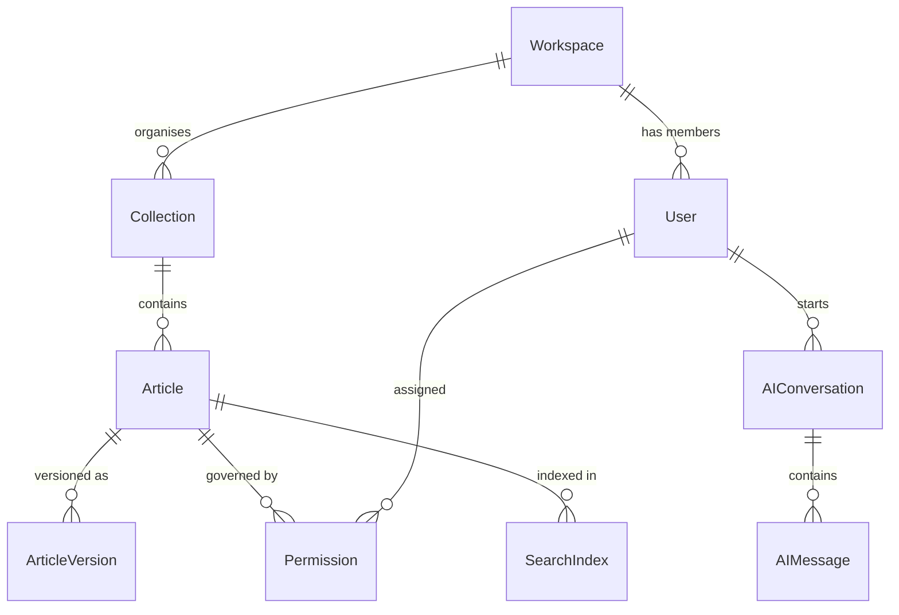

# Data Dictionary — Knowledge Base Platform

## Introduction

This document provides a comprehensive data dictionary for all major entities in the
Knowledge Base Platform. Each entity section lists all fields with data type, constraints,
description, and an example value. The document also defines enumeration types, a glossary
of domain terms, and data lineage notes.

---

## 1. Entity: Article

The central content object representing a single knowledge article.

| Field Name | Data Type | Constraints | Description | Example Value |
|---|---|---|---|---|
| `id` | UUID | PRIMARY KEY, NOT NULL | Universally unique identifier for the article | `3f8a2c1d-...` |
| `workspaceId` | UUID | NOT NULL, FK → Workspace.id | Owning workspace; enforces tenant isolation | `a1b2c3d4-...` |
| `title` | VARCHAR(250) | NOT NULL, CHECK(length ≥ 5) | Human-readable article title | `"How to reset your password"` |
| `slug` | VARCHAR(300) | NOT NULL, UNIQUE(workspaceId, slug) | URL-safe identifier, auto-generated from title | `"how-to-reset-your-password"` |
| `body` | TEXT | NOT NULL | Full HTML content produced by TipTap editor | `"<h2>Step 1...</h2>"` |
| `excerpt` | VARCHAR(500) | NULLABLE | Auto-generated 1-2 sentence summary; used in search results | `"Learn how to reset..."` |
| `seoDescription` | VARCHAR(160) | NULLABLE | Meta description for SEO; required before publish | `"Reset your password in 3 steps."` |
| `status` | ArticleStatus (enum) | NOT NULL, DEFAULT 'draft' | Current lifecycle state of the article | `"published"` |
| `visibility` | ArticleVisibility (enum) | NOT NULL, DEFAULT 'workspace' | Controls who can view the article | `"public"` |
| `collectionId` | UUID | NOT NULL, FK → Collection.id | Primary collection assignment | `c9d0e1f2-...` |
| `authorId` | UUID | NOT NULL, FK → User.id | Original creator of the article | `u5a6b7c8-...` |
| `contributors` | UUID[] | DEFAULT '{}' | Array of User IDs who edited the article | `["u5a6...", "u9b1..."]` |
| `tags` | UUID[] | DEFAULT '{}' | Array of Tag IDs attached to the article | `["t1a2b3...", "t4c5d6..."]` |
| `wordCount` | INTEGER | NOT NULL, DEFAULT 0 | Derived: word count of stripped HTML body | `342` |
| `readingTimeMinutes` | INTEGER | NOT NULL, DEFAULT 1 | Derived: `ceil(wordCount / 200)` | `2` |
| `aiAssisted` | BOOLEAN | NOT NULL, DEFAULT false | True if body was seeded by AI Assist | `false` |
| `viewCount` | INTEGER | NOT NULL, DEFAULT 0 | Cumulative view count (updated by analytics worker) | `1482` |
| `helpfulCount` | INTEGER | NOT NULL, DEFAULT 0 | Count of `feedback.submitted` with `helpful=true` | `95` |
| `notHelpfulCount` | INTEGER | NOT NULL, DEFAULT 0 | Count of `feedback.submitted` with `helpful=false` | `7` |
| `publishedAt` | TIMESTAMPTZ | NULLABLE | UTC timestamp when article was first published | `2024-03-15T09:00:00Z` |
| `lastReviewedAt` | TIMESTAMPTZ | NULLABLE | UTC timestamp of last editorial review completion | `2024-06-01T14:30:00Z` |
| `isStale` | BOOLEAN | NOT NULL, DEFAULT false | Derived: true when `now() - updatedAt > 180 days` | `false` |
| `deletedAt` | TIMESTAMPTZ | NULLABLE | Soft-delete timestamp; NULL = not deleted | `null` |
| `createdAt` | TIMESTAMPTZ | NOT NULL, DEFAULT now() | Record creation timestamp | `2024-03-10T08:00:00Z` |
| `updatedAt` | TIMESTAMPTZ | NOT NULL, DEFAULT now() | Last update timestamp (auto-managed by TypeORM) | `2024-06-01T14:30:00Z` |

---

## 2. Entity: ArticleVersion

Immutable snapshot of article content at a point in time. Insert-only; no updates or deletes.

| Field Name | Data Type | Constraints | Description | Example Value |
|---|---|---|---|---|
| `id` | UUID | PRIMARY KEY, NOT NULL | Unique identifier for this version | `7c3d9e1f-...` |
| `articleId` | UUID | NOT NULL, FK → Article.id | Parent article | `3f8a2c1d-...` |
| `versionNumber` | INTEGER | NOT NULL | Monotonically increasing version index per article | `3` |
| `title` | VARCHAR(250) | NOT NULL | Title at the time this version was created | `"How to reset your password"` |
| `body` | TEXT | NOT NULL | Full HTML body at the time of snapshot | `"<h2>Step 1...</h2>"` |
| `seoDescription` | VARCHAR(160) | NULLABLE | SEO description at snapshot time | `"Reset your password in 3 steps."` |
| `status` | ArticleStatus (enum) | NOT NULL | Article status at snapshot time | `"approved"` |
| `createdById` | UUID | NOT NULL, FK → User.id | User who triggered this version creation | `u5a6b7c8-...` |
| `changeNotes` | TEXT | NULLABLE | Optional editor notes describing changes in this version | `"Updated Step 3 for v2 UI"` |
| `isPublishedVersion` | BOOLEAN | NOT NULL, DEFAULT false | True if this is the canonical published snapshot | `true` |
| `createdAt` | TIMESTAMPTZ | NOT NULL, DEFAULT now() | Immutable creation timestamp | `2024-03-15T09:00:00Z` |

---

## 3. Entity: Collection

Hierarchical organisational unit grouping related articles.

| Field Name | Data Type | Constraints | Description | Example Value |
|---|---|---|---|---|
| `id` | UUID | PRIMARY KEY, NOT NULL | Collection unique identifier | `c9d0e1f2-...` |
| `workspaceId` | UUID | NOT NULL, FK → Workspace.id | Owning workspace | `a1b2c3d4-...` |
| `parentId` | UUID | NULLABLE, FK → Collection.id | Parent collection; NULL = root collection | `null` |
| `name` | VARCHAR(150) | NOT NULL | Display name of the collection | `"Getting Started"` |
| `slug` | VARCHAR(200) | NOT NULL, UNIQUE(workspaceId, slug) | URL-safe path segment | `"getting-started"` |
| `description` | TEXT | NULLABLE | Short description shown in navigation | `"Guides for new users."` |
| `iconEmoji` | VARCHAR(10) | NULLABLE | Optional emoji icon for navigation display | `"🚀"` |
| `depth` | INTEGER | NOT NULL, DEFAULT 0, CHECK(depth ≤ 5) | Nesting depth from root; root = 0 | `1` |
| `sortOrder` | INTEGER | NOT NULL, DEFAULT 0 | Display order among sibling collections | `2` |
| `articleCount` | INTEGER | NOT NULL, DEFAULT 0 | Denormalised count of published articles (updated by worker) | `14` |
| `isPublic` | BOOLEAN | NOT NULL, DEFAULT true | Controls whether the collection appears in public navigation | `true` |
| `createdAt` | TIMESTAMPTZ | NOT NULL, DEFAULT now() | Creation timestamp | `2024-01-05T12:00:00Z` |
| `updatedAt` | TIMESTAMPTZ | NOT NULL, DEFAULT now() | Last update timestamp | `2024-05-20T10:00:00Z` |

---

## 4. Entity: Workspace

A tenant workspace containing all content, users, and settings for one organisation.

| Field Name | Data Type | Constraints | Description | Example Value |
|---|---|---|---|---|
| `id` | UUID | PRIMARY KEY, NOT NULL | Workspace unique identifier | `a1b2c3d4-...` |
| `name` | VARCHAR(150) | NOT NULL | Organisation or product name | `"Acme Corp Help Center"` |
| `slug` | VARCHAR(100) | NOT NULL, UNIQUE | URL slug for workspace subdomain | `"acme-corp"` |
| `customDomain` | VARCHAR(255) | NULLABLE | Custom domain (e.g., help.acme.com) | `"help.acme.com"` |
| `plan` | WorkspacePlan (enum) | NOT NULL, DEFAULT 'starter' | Billing plan tier | `"business"` |
| `status` | WorkspaceStatus (enum) | NOT NULL, DEFAULT 'active' | Lifecycle status | `"active"` |
| `logoUrl` | VARCHAR(500) | NULLABLE | S3 / CDN URL for workspace logo | `"https://cdn.../logo.png"` |
| `primaryColour` | VARCHAR(7) | NULLABLE, CHECK(~#[0-9A-F]{6}) | Brand primary colour (hex) | `"#0055FF"` |
| `defaultLocale` | VARCHAR(10) | NOT NULL, DEFAULT 'en-US' | Default locale for new articles | `"en-US"` |
| `aiEnabled` | BOOLEAN | NOT NULL, DEFAULT false | Master toggle for AI Q&A features | `true` |
| `aiConfidenceThreshold` | DECIMAL(3,2) | NOT NULL, DEFAULT 0.45, CHECK(≥ 0.30) | Workspace-level AI confidence floor | `0.50` |
| `ssoEnabled` | BOOLEAN | NOT NULL, DEFAULT false | Whether SSO is configured and active | `true` |
| `ssoEnforcementMode` | BOOLEAN | NOT NULL, DEFAULT false | If true, disables local password auth | `false` |
| `widgetOriginAllowlist` | TEXT[] | DEFAULT '{}' | Whitelisted origins for widget CORS validation | `["https://app.acme.com"]` |
| `storageUsedBytes` | BIGINT | NOT NULL, DEFAULT 0 | Total attachment storage used | `2147483648` |
| `storageQuotaBytes` | BIGINT | NOT NULL | Storage quota based on plan | `10737418240` |
| `deflectionRate` | DECIMAL(5,2) | NULLABLE | Derived: rolling 30-day deflection rate % | `68.50` |
| `createdAt` | TIMESTAMPTZ | NOT NULL, DEFAULT now() | Workspace creation timestamp | `2024-01-01T00:00:00Z` |
| `updatedAt` | TIMESTAMPTZ | NOT NULL, DEFAULT now() | Last settings update | `2024-06-15T09:00:00Z` |

---

## 5. Entity: User

A platform user with a role scoped to one or more workspaces.

| Field Name | Data Type | Constraints | Description | Example Value |
|---|---|---|---|---|
| `id` | UUID | PRIMARY KEY, NOT NULL | User unique identifier | `u5a6b7c8-...` |
| `workspaceId` | UUID | NOT NULL, FK → Workspace.id | Workspace membership | `a1b2c3d4-...` |
| `email` | VARCHAR(254) | NOT NULL, UNIQUE(workspaceId, email) | Primary email address | `"alice@acme.com"` |
| `name` | VARCHAR(200) | NOT NULL | Display name | `"Alice Johnson"` |
| `avatarUrl` | VARCHAR(500) | NULLABLE | Profile picture URL | `"https://cdn.../alice.jpg"` |
| `role` | UserRole (enum) | NOT NULL, DEFAULT 'reader' | Platform role within the workspace | `"author"` |
| `status` | UserStatus (enum) | NOT NULL, DEFAULT 'invited' | Account lifecycle status | `"active"` |
| `passwordHash` | VARCHAR(255) | NULLABLE | bcrypt hash; NULL when SSO-only account | `"$2b$12$..."` |
| `ssoSubject` | VARCHAR(500) | NULLABLE | IdP subject claim for SSO users | `"okta|0001abcd"` |
| `lastLoginAt` | TIMESTAMPTZ | NULLABLE | Timestamp of most recent successful login | `2024-06-20T08:30:00Z` |
| `articleCount` | INTEGER | NOT NULL, DEFAULT 0 | Denormalised count of articles authored | `27` |
| `privacyConsentAt` | TIMESTAMPTZ | NULLABLE | Timestamp when user accepted privacy policy | `2024-01-02T10:00:00Z` |
| `createdAt` | TIMESTAMPTZ | NOT NULL, DEFAULT now() | User record creation timestamp | `2024-01-02T09:00:00Z` |
| `updatedAt` | TIMESTAMPTZ | NOT NULL, DEFAULT now() | Last profile update | `2024-06-20T08:30:00Z` |

---

## 6. Entity: Permission

Explicit permission override granting or denying access to a collection for a role or user.

| Field Name | Data Type | Constraints | Description | Example Value |
|---|---|---|---|---|
| `id` | UUID | PRIMARY KEY, NOT NULL | Permission record identifier | `p1a2b3c4-...` |
| `workspaceId` | UUID | NOT NULL, FK → Workspace.id | Owning workspace | `a1b2c3d4-...` |
| `collectionId` | UUID | NOT NULL, FK → Collection.id | Target collection | `c9d0e1f2-...` |
| `subjectType` | PermissionSubjectType (enum) | NOT NULL | Whether this permission applies to a role or a specific user | `"role"` |
| `subjectId` | VARCHAR(100) | NOT NULL | Role name (e.g., `"reader"`) or User ID UUID | `"reader"` |
| `level` | PermissionLevel (enum) | NOT NULL | Access level granted | `"viewer"` |
| `inheritFromParent` | BOOLEAN | NOT NULL, DEFAULT true | If true, defer to parent collection's permission | `false` |
| `grantedById` | UUID | NOT NULL, FK → User.id | Admin who set this permission | `u9b1c2d3-...` |
| `createdAt` | TIMESTAMPTZ | NOT NULL, DEFAULT now() | When this permission was created | `2024-02-01T00:00:00Z` |
| `updatedAt` | TIMESTAMPTZ | NOT NULL, DEFAULT now() | Last modification | `2024-05-10T15:00:00Z` |

---

## 7. Entity: SearchIndex

Metadata record tracking the state of a published article's Elasticsearch index entry.

| Field Name | Data Type | Constraints | Description | Example Value |
|---|---|---|---|---|
| `id` | UUID | PRIMARY KEY, NOT NULL | Index record identifier | `si1a2b3c-...` |
| `articleId` | UUID | NOT NULL, UNIQUE, FK → Article.id | Indexed article | `3f8a2c1d-...` |
| `workspaceId` | UUID | NOT NULL | Workspace scope for isolation | `a1b2c3d4-...` |
| `esDocumentId` | VARCHAR(100) | NOT NULL, UNIQUE | Elasticsearch document ID | `"3f8a2c1d-es"` |
| `vectorId` | VARCHAR(100) | NULLABLE | pgvector row reference | `"3f8a2c1d-vec"` |
| `indexedAt` | TIMESTAMPTZ | NULLABLE | When the article was last successfully indexed | `2024-03-15T09:05:00Z` |
| `embeddedAt` | TIMESTAMPTZ | NULLABLE | When the embedding was last generated | `2024-03-15T09:06:00Z` |
| `indexStatus` | IndexStatus (enum) | NOT NULL, DEFAULT 'pending' | Current indexing state | `"indexed"` |
| `embeddingStatus` | EmbeddingStatus (enum) | NOT NULL, DEFAULT 'pending' | Current embedding state | `"embedded"` |
| `lastError` | TEXT | NULLABLE | Error message from last failed indexing attempt | `null` |
| `retryCount` | INTEGER | NOT NULL, DEFAULT 0 | Number of retry attempts for the last job | `0` |
| `updatedAt` | TIMESTAMPTZ | NOT NULL, DEFAULT now() | Last status update | `2024-03-15T09:06:00Z` |

---

## 8. Entity: AIConversation

A conversation session between a user and the AI assistant.

| Field Name | Data Type | Constraints | Description | Example Value |
|---|---|---|---|---|
| `id` | UUID | PRIMARY KEY, NOT NULL | Conversation unique identifier | `conv1a2b-...` |
| `workspaceId` | UUID | NOT NULL, FK → Workspace.id | Owning workspace | `a1b2c3d4-...` |
| `userId` | UUID | NULLABLE, FK → User.id | Authenticated user; NULL for anonymous sessions | `u5a6b7c8-...` |
| `sessionToken` | VARCHAR(64) | NULLABLE | Anonymous session token (hashed); NULL for authenticated | `"sha256:abc123..."` |
| `channel` | ConversationChannel (enum) | NOT NULL | Origin channel of the conversation | `"widget"` |
| `messageCount` | INTEGER | NOT NULL, DEFAULT 0 | Number of messages in the conversation | `4` |
| `wasEscalated` | BOOLEAN | NOT NULL, DEFAULT false | True if conversation led to a support ticket | `false` |
| `wasDeflected` | BOOLEAN | NOT NULL, DEFAULT false | True if user marked issue as resolved | `true` |
| `totalTokensUsed` | INTEGER | NOT NULL, DEFAULT 0 | Cumulative OpenAI tokens consumed | `1842` |
| `expiresAt` | TIMESTAMPTZ | NULLABLE | For anonymous sessions: purge timestamp (now + 30 days) | `2024-07-15T00:00:00Z` |
| `createdAt` | TIMESTAMPTZ | NOT NULL, DEFAULT now() | Session start timestamp | `2024-06-15T10:00:00Z` |
| `updatedAt` | TIMESTAMPTZ | NOT NULL, DEFAULT now() | Last message timestamp | `2024-06-15T10:08:00Z` |

---

## 9. Entity: AIMessage

Individual message within an AI conversation (user turn or assistant turn).

| Field Name | Data Type | Constraints | Description | Example Value |
|---|---|---|---|---|
| `id` | UUID | PRIMARY KEY, NOT NULL | Message unique identifier | `msg1a2b3-...` |
| `conversationId` | UUID | NOT NULL, FK → AIConversation.id | Parent conversation | `conv1a2b-...` |
| `role` | MessageRole (enum) | NOT NULL | Who sent this message | `"assistant"` |
| `content` | TEXT | NOT NULL | Message text content | `"To reset your password, navigate to..."` |
| `retrievedChunkIds` | UUID[] | DEFAULT '{}' | Article version IDs of RAG chunks used (assistant turns only) | `["7c3d9e1f-..."]` |
| `confidenceScore` | DECIMAL(4,3) | NULLABLE | Max cosine similarity of retrieved chunks (assistant turns) | `0.823` |
| `promptTokens` | INTEGER | NULLABLE | OpenAI prompt token count (assistant turns) | `1204` |
| `completionTokens` | INTEGER | NULLABLE | OpenAI completion token count (assistant turns) | `318` |
| `isFallback` | BOOLEAN | NOT NULL, DEFAULT false | True if confidence < threshold; disclaimer was shown | `false` |
| `userRating` | MessageRating (enum) | NULLABLE | User's thumbs-up/down rating on this assistant turn | `"helpful"` |
| `createdAt` | TIMESTAMPTZ | NOT NULL, DEFAULT now() | Message timestamp | `2024-06-15T10:02:00Z` |

---

## 10. Entity: Feedback

User feedback submission on a published article.

| Field Name | Data Type | Constraints | Description | Example Value |
|---|---|---|---|---|
| `id` | UUID | PRIMARY KEY, NOT NULL | Feedback record identifier | `fb1a2b3c-...` |
| `workspaceId` | UUID | NOT NULL, FK → Workspace.id | Owning workspace | `a1b2c3d4-...` |
| `articleId` | UUID | NOT NULL, FK → Article.id | Article being rated | `3f8a2c1d-...` |
| `userId` | UUID | NULLABLE, FK → User.id | Authenticated user; NULL for anonymous | `u5a6b7c8-...` |
| `sessionToken` | VARCHAR(64) | NULLABLE | Anonymous session token (hashed) | `null` |
| `helpful` | BOOLEAN | NOT NULL | True = thumbs up; false = thumbs down | `true` |
| `comment` | TEXT | NULLABLE | Optional free-text feedback | `"Very clear instructions!"` |
| `isFlagged` | BOOLEAN | NOT NULL, DEFAULT false | True if feedback was flagged for moderation | `false` |
| `flagReason` | VARCHAR(500) | NULLABLE | Reason for flagging (set by Editor/Admin) | `null` |
| `source` | FeedbackSource (enum) | NOT NULL | Where the feedback was submitted from | `"article_page"` |
| `deflected` | BOOLEAN | NULLABLE | For widget-sourced feedback: whether ticket was deflected | `null` |
| `createdAt` | TIMESTAMPTZ | NOT NULL, DEFAULT now() | Submission timestamp | `2024-06-10T14:00:00Z` |

---

## 11. Entity: Attachment

A file attached to an article and stored in AWS S3.

| Field Name | Data Type | Constraints | Description | Example Value |
|---|---|---|---|---|
| `id` | UUID | PRIMARY KEY, NOT NULL | Attachment identifier | `att1a2b3-...` |
| `workspaceId` | UUID | NOT NULL, FK → Workspace.id | Owning workspace | `a1b2c3d4-...` |
| `articleId` | UUID | NOT NULL, FK → Article.id | Owning article | `3f8a2c1d-...` |
| `uploadedById` | UUID | NOT NULL, FK → User.id | User who uploaded the file | `u5a6b7c8-...` |
| `fileName` | VARCHAR(255) | NOT NULL | Original filename as provided by uploader | `"setup-guide.pdf"` |
| `s3Key` | VARCHAR(1024) | NOT NULL, UNIQUE | S3 object key for retrieval | `"workspaces/a1b2.../articles/3f8a.../att1a2b3.pdf"` |
| `cdnUrl` | VARCHAR(1024) | NULLABLE | CloudFront URL for served assets | `"https://cdn.example.com/..."` |
| `mimeType` | VARCHAR(127) | NOT NULL | MIME type of the file | `"application/pdf"` |
| `fileSizeBytes` | BIGINT | NOT NULL, CHECK(> 0) | File size in bytes | `245760` |
| `isPublic` | BOOLEAN | NOT NULL, DEFAULT true | Whether the attachment is served publicly | `true` |
| `scanStatus` | AttachmentScanStatus (enum) | NOT NULL, DEFAULT 'pending' | Malware scan result | `"clean"` |
| `deletedAt` | TIMESTAMPTZ | NULLABLE | Soft-delete timestamp | `null` |
| `createdAt` | TIMESTAMPTZ | NOT NULL, DEFAULT now() | Upload timestamp | `2024-03-15T09:02:00Z` |

---

## 12. Entity: Tag

A workspace-scoped label for categorising articles.

| Field Name | Data Type | Constraints | Description | Example Value |
|---|---|---|---|---|
| `id` | UUID | PRIMARY KEY, NOT NULL | Tag identifier | `t1a2b3c4-...` |
| `workspaceId` | UUID | NOT NULL, FK → Workspace.id | Owning workspace | `a1b2c3d4-...` |
| `name` | VARCHAR(80) | NOT NULL, UNIQUE(workspaceId, lower(name)) | Tag display name (case-insensitive unique) | `"authentication"` |
| `slug` | VARCHAR(100) | NOT NULL, UNIQUE(workspaceId, slug) | URL-safe tag identifier | `"authentication"` |
| `colour` | VARCHAR(7) | NULLABLE | Hex colour for tag chip display | `"#FF6B6B"` |
| `articleCount` | INTEGER | NOT NULL, DEFAULT 0 | Denormalised count of published articles with this tag | `23` |
| `createdById` | UUID | NOT NULL, FK → User.id | User who created the tag | `u5a6b7c8-...` |
| `createdAt` | TIMESTAMPTZ | NOT NULL, DEFAULT now() | Creation timestamp | `2024-02-10T11:00:00Z` |

---

## 13. Entity: Widget

Configuration record for a workspace's embedded help widget.

| Field Name | Data Type | Constraints | Description | Example Value |
|---|---|---|---|---|
| `id` | UUID | PRIMARY KEY, NOT NULL | Widget configuration identifier | `wgt1a2b3-...` |
| `workspaceId` | UUID | NOT NULL, UNIQUE, FK → Workspace.id | One widget config per workspace | `a1b2c3d4-...` |
| `isEnabled` | BOOLEAN | NOT NULL, DEFAULT false | Master on/off switch for the widget | `true` |
| `snippetToken` | VARCHAR(64) | NOT NULL, UNIQUE | Public token embedded in the JS snippet | `"wgt_live_abc123"` |
| `launcherPosition` | WidgetPosition (enum) | NOT NULL, DEFAULT 'bottom_right' | Screen position of the launcher button | `"bottom_right"` |
| `primaryColour` | VARCHAR(7) | NULLABLE | Widget theme colour override | `"#0055FF"` |
| `greeting` | VARCHAR(200) | NULLABLE | Welcome message shown when widget opens | `"Hi! How can we help?"` |
| `aiChatEnabled` | BOOLEAN | NOT NULL, DEFAULT true | Whether AI chat is available in the widget | `true` |
| `deflectionEnabled` | BOOLEAN | NOT NULL, DEFAULT true | Whether to show ticket creation after AI fails | `true` |
| `ticketIntegration` | TicketIntegration (enum) | NULLABLE | Which integration to use for ticket creation | `"zendesk"` |
| `privacyPolicyUrl` | VARCHAR(500) | NULLABLE | URL shown in widget footer for compliance | `"https://acme.com/privacy"` |
| `createdAt` | TIMESTAMPTZ | NOT NULL, DEFAULT now() | Widget config creation timestamp | `2024-02-01T00:00:00Z` |
| `updatedAt` | TIMESTAMPTZ | NOT NULL, DEFAULT now() | Last configuration update | `2024-06-01T12:00:00Z` |

---

## 14. Entity: AnalyticsEvent

Raw analytics event log for all tracked platform interactions.

| Field Name | Data Type | Constraints | Description | Example Value |
|---|---|---|---|---|
| `id` | UUID | PRIMARY KEY, NOT NULL | Event record identifier | `ae1a2b3c-...` |
| `workspaceId` | UUID | NOT NULL, INDEX | Owning workspace | `a1b2c3d4-...` |
| `eventName` | VARCHAR(100) | NOT NULL, INDEX | Event type name (dot-notation) | `"search.query_executed"` |
| `userId` | VARCHAR(64) | NULLABLE | Pseudonymised user ID (workspace-scoped hash) | `"hash:abc123"` |
| `sessionId` | VARCHAR(64) | NULLABLE | Anonymous session identifier | `"sess:xyz789"` |
| `properties` | JSONB | NOT NULL, DEFAULT '{}' | Event-specific payload properties | `{"query": "reset password", "resultCount": 5}` |
| `source` | EventSource (enum) | NOT NULL | Origin channel of the event | `"web_app"` |
| `ipHash` | VARCHAR(64) | NULLABLE | SHA-256 hash of user IP with rotating salt | `"sha256:def456"` |
| `userAgent` | VARCHAR(500) | NULLABLE | Browser user-agent string | `"Mozilla/5.0..."` |
| `createdAt` | TIMESTAMPTZ | NOT NULL, DEFAULT now(), INDEX | Event timestamp | `2024-06-15T10:00:00Z` |

---

## 15. Entity: Integration

Configuration record for a third-party integration connected to a workspace.

| Field Name | Data Type | Constraints | Description | Example Value |
|---|---|---|---|---|
| `id` | UUID | PRIMARY KEY, NOT NULL | Integration record identifier | `int1a2b3-...` |
| `workspaceId` | UUID | NOT NULL, FK → Workspace.id | Owning workspace | `a1b2c3d4-...` |
| `type` | IntegrationType (enum) | NOT NULL | Type of integration | `"zendesk"` |
| `status` | IntegrationStatus (enum) | NOT NULL, DEFAULT 'pending' | Connection status | `"connected"` |
| `displayName` | VARCHAR(150) | NULLABLE | User-set label for this integration | `"Acme Zendesk"` |
| `credentials` | JSONB | NOT NULL | Encrypted credentials (tokens, keys) — AES-256 at rest | `{encrypted}` |
| `settings` | JSONB | NOT NULL, DEFAULT '{}' | Integration-specific configuration | `{"syncInterval": 3600, "syncTags": true}` |
| `lastSyncedAt` | TIMESTAMPTZ | NULLABLE | Timestamp of last successful sync | `2024-06-15T06:00:00Z` |
| `lastSyncStatus` | SyncStatus (enum) | NULLABLE | Result of the most recent sync job | `"success"` |
| `lastSyncError` | TEXT | NULLABLE | Error message if last sync failed | `null` |
| `connectedById` | UUID | NOT NULL, FK → User.id | Admin who connected this integration | `u9b1c2d3-...` |
| `createdAt` | TIMESTAMPTZ | NOT NULL, DEFAULT now() | Connection creation timestamp | `2024-04-01T09:00:00Z` |
| `updatedAt` | TIMESTAMPTZ | NOT NULL, DEFAULT now() | Last settings update | `2024-06-01T11:00:00Z` |

---

## 16. Enumeration Types

| Enum Name | Values | Used In |
|---|---|---|
| `ArticleStatus` | `draft`, `in_review`, `changes_requested`, `approved`, `published`, `unpublished`, `archived` | Article.status, ArticleVersion.status |
| `ArticleVisibility` | `public`, `workspace`, `private` | Article.visibility |
| `UserRole` | `reader`, `author`, `editor`, `workspace_admin`, `super_admin` | User.role |
| `UserStatus` | `invited`, `active`, `suspended`, `deleted` | User.status |
| `WorkspacePlan` | `starter`, `professional`, `business`, `enterprise` | Workspace.plan |
| `WorkspaceStatus` | `pending`, `active`, `suspended`, `cancelled` | Workspace.status |
| `PermissionLevel` | `no_access`, `viewer`, `contributor`, `manager` | Permission.level |
| `PermissionSubjectType` | `role`, `user` | Permission.subjectType |
| `IndexStatus` | `pending`, `indexed`, `failed`, `stale` | SearchIndex.indexStatus |
| `EmbeddingStatus` | `pending`, `embedded`, `failed`, `stale` | SearchIndex.embeddingStatus |
| `MessageRole` | `user`, `assistant`, `system` | AIMessage.role |
| `MessageRating` | `helpful`, `not_helpful` | AIMessage.userRating |
| `ConversationChannel` | `web_app`, `widget`, `slack`, `api` | AIConversation.channel |
| `FeedbackSource` | `article_page`, `widget`, `api` | Feedback.source |
| `AttachmentScanStatus` | `pending`, `clean`, `infected`, `error` | Attachment.scanStatus |
| `WidgetPosition` | `bottom_right`, `bottom_left`, `top_right`, `top_left` | Widget.launcherPosition |
| `TicketIntegration` | `zendesk`, `jira`, `freshdesk`, `email` | Widget.ticketIntegration |
| `IntegrationType` | `slack`, `zendesk`, `salesforce`, `jira`, `zapier`, `sso`, `segment` | Integration.type |
| `IntegrationStatus` | `pending`, `connected`, `disconnected`, `error` | Integration.status |
| `SyncStatus` | `success`, `partial`, `failed` | Integration.lastSyncStatus |
| `EventSource` | `web_app`, `widget`, `slack`, `api`, `worker` | AnalyticsEvent.source |

---

## 17. Glossary of Domain Terms

| Term | Definition |
|---|---|
| **Article** | The primary unit of knowledge content on the platform; a structured document authored and published by team members. |
| **ArticleVersion** | An immutable snapshot of an article's content at a specific point in time; used for history, diffing, and rollback. |
| **Collection** | A hierarchical grouping of articles, similar to a folder or category. Collections form a tree up to 5 levels deep. |
| **Workspace** | A tenant instance of the platform containing all content, users, settings, and integrations for one organisation. |
| **Author** | A user role permitted to create and submit articles for review. |
| **Editor** | A user role permitted to review, approve, reject, publish, and unpublish articles. |
| **Reader** | A user role with read-only access to published articles and the search function. |
| **Workspace Admin** | A user role with full administrative control over a workspace, excluding platform-level operations. |
| **Super Admin** | A platform-level administrator with access to all workspaces, billing, and impersonation capabilities. |
| **Draft** | The initial article status when content has been saved but not yet submitted for review. |
| **In Review** | Article status indicating the article has been submitted and is awaiting editorial decision. |
| **Approved** | Article status indicating the editorial review passed; article is ready to be published. |
| **Published** | Article status indicating the article is live, publicly accessible (per visibility setting), and indexed. |
| **Archived** | Terminal article status; article is read-only and hidden from normal navigation and search. |
| **Slug** | A URL-safe string identifier derived from the article or collection title, used in routing. |
| **TipTap** | The rich-text editor framework used for article authoring on the platform (ProseMirror-based). |
| **RAG** | Retrieval-Augmented Generation — the AI architecture pattern where relevant knowledge chunks are retrieved from the vector store and injected into the LLM prompt to ground the answer. |
| **pgvector** | PostgreSQL extension enabling storage and cosine-similarity querying of vector embeddings within the primary database. |
| **Embedding** | A high-dimensional numerical vector representation of text produced by the OpenAI text-embedding-3-small model, used for semantic similarity search. |
| **Cosine Similarity** | A measure of similarity between two vectors (range: −1 to 1); used to rank semantic search results and determine AI confidence. |
| **BullMQ** | A Redis-backed Node.js job queue library used for all asynchronous background processing on the platform. |
| **Deflection** | A support ticket that was never created because the user's issue was resolved through self-service (KB article or AI chat). |
| **Deflection Rate** | The percentage of widget sessions where the user's issue was resolved without creating a support ticket. |
| **Widget** | The embeddable JavaScript component that workspaces add to their own products to provide contextual help and AI chat. |
| **SSO** | Single Sign-On — authentication via an external identity provider using SAML 2.0 or OIDC. |
| **CORS Allowlist** | The list of permitted web origins authorised to initialise a workspace's help widget. |
| **Staleness** | The condition of an article that has not been reviewed or updated for 180 or more days. |
| **Token Budget** | The maximum number of OpenAI tokens (prompt + completion) permitted per AI Q&A query, set per user tier. |
| **Reciprocal Rank Fusion** | A result merging algorithm that combines ranked lists (e.g., BM25 + vector search) into a single unified ranking. |
| **Pre-signed URL** | A time-limited AWS S3 URL that grants temporary access to a private object without requiring AWS credentials. |
| **Audit Log** | An append-only record of all significant user actions and system events for compliance and accountability. |
| **Multi-tenant** | Architecture pattern where a single platform installation serves multiple independent organisations, each in an isolated workspace. |

---

## 18. Data Lineage Notes

| Data Element | Created By | Updated By | Read By | Archived / Deleted By |
|---|---|---|---|---|
| `Article.body` | Author (create/edit) | Author, Editor (edit) | Search indexer, AI embedder, Reader | Editor (archive), Super Admin (force-delete) |
| `Article.viewCount` | Analytics worker (increment) | Analytics worker | Analytics dashboard, article page | N/A — never deleted |
| `ArticleVersion` | System (on every state transition) | Never updated (insert-only) | Editor (diff view), Author (history view) | Never deleted (retained 365 days post-archive) |
| `AIMessage.retrievedChunkIds` | AIService (on answer generation) | Never updated | Audit queries, quality review | Purged with conversation per retention policy |
| `AnalyticsEvent` | All services and workers | Never updated | Analytics dashboard, report generator | Archived to summary after 90 days (raw deleted) |
| `Integration.credentials` | Workspace Admin (on connect) | Workspace Admin (on re-auth) | Integration worker (on sync) | Workspace Admin (on disconnect) |
| `SearchIndex.embeddedAt` | embed-article worker | embed-article worker (on re-embed) | AIService (staleness check) | delete-embedding worker (on archive/delete) |
| `Workspace.deflectionRate` | MetricsService (nightly job) | MetricsService (nightly) | Analytics dashboard | N/A — recalculated, not deleted |
| `Permission` | Workspace Admin | Workspace Admin | PermissionService (all data access) | Workspace Admin (revoke); cascaded on collection delete |
| `Attachment.s3Key` | Upload worker (on S3 PUT success) | Never updated | CDN (via CloudFront origin), article rendering | Delete worker (on soft-delete) |

---

## Operational Policy Addendum

### Section 1 — Content Governance Policies
The `ArticleVersion` entity is insert-only by architectural enforcement; the TypeORM
repository for `ArticleVersion` exposes no `update()` or `delete()` methods. Any attempt
to modify version history must be escalated to Super Admin and is logged in the audit trail.
The `Article.aiAssisted` flag, once set to `true`, cannot be cleared by any user action;
it persists as a permanent record of AI involvement in the content's creation.

### Section 2 — Reader Data Privacy Policies
The `AIConversation.sessionToken` and `AnalyticsEvent.userId` fields store pseudonymised
identifiers, never raw user IDs or emails, for unauthenticated users. The `User.passwordHash`
field is computed with bcrypt (cost factor ≥ 12) and is never returned in any API response.
The `Feedback.comment` field may contain PII if a user chooses to include it; this field is
included in GDPR erasure requests and must be nullified when the user invokes right-to-erasure.
`AIConversation.expiresAt` is set at session creation for anonymous users and the purge
worker runs daily to delete expired conversations and their associated messages.

### Section 3 — AI Usage Policies
The `AIMessage` entity captures all telemetry required for AI cost attribution and quality
monitoring: `promptTokens`, `completionTokens`, `confidenceScore`, and `isFallback`. This
data feeds the workspace-level AI usage metrics shown in the Analytics Dashboard. The
`retrievedChunkIds` field links each AI answer back to the specific `ArticleVersion` records
that informed it, enabling full traceability of AI responses to source content. The
`SearchIndex.embeddingStatus` field enables the platform to detect and recover from failed
embedding jobs without blocking article publishing.

### Section 4 — System Availability Policies
The `SearchIndex` entity provides a decoupled status tracking mechanism that allows the
system to function without blocking article publishing on indexing job completion. Articles
in `indexStatus: pending` or `embeddingStatus: pending` are still accessible via direct
collection browsing; the indexing lag affects only search discoverability. The
`Integration.credentials` JSONB column is encrypted at rest at the application layer
(AES-256 via the platform's `CryptoService`) in addition to RDS storage encryption,
providing defence-in-depth for stored OAuth tokens and API keys. The `Attachment.scanStatus`
field tracks malware scan results; attachments with `scanStatus: infected` are quarantined
and never served via CDN regardless of `isPublic` flag value.

---

## Core Entities

(See numbered entity sections above for full attribute-level specifications.)

The primary entities in the Knowledge Base Platform are: **Article**, **ArticleVersion**, **Collection**, **Workspace**, **User**, **Permission**, **SearchIndex**, **AIConversation**, and **AIMessage**.

## Canonical Relationship Diagram

## Data Quality Controls

| Control ID | Entity | Field | Rule | Enforcement |
|---|---|---|---|---|
| DQC-001 | Article | slug | Must be unique within a Workspace; URL-safe characters only | DB UNIQUE(workspace_id, slug) + regex |
| DQC-002 | ArticleVersion | content_hash | SHA-256 of content body; must match stored content on retrieval | Application integrity check |
| DQC-003 | Permission | role | Must be one of [READER, EDITOR, AUTHOR, ADMIN]; no custom roles | Enum constraint |
| DQC-004 | Article | published_at | Can only be set by EDITOR or AUTHOR role; READER cannot publish | RBAC check |
| DQC-005 | SearchIndex | last_indexed_at | Must be updated within 60 seconds of article publish/update | Async worker SLA monitoring |
| DQC-006 | Workspace | custom_domain | Must pass DNS ownership verification before activation | Domain verification workflow |
