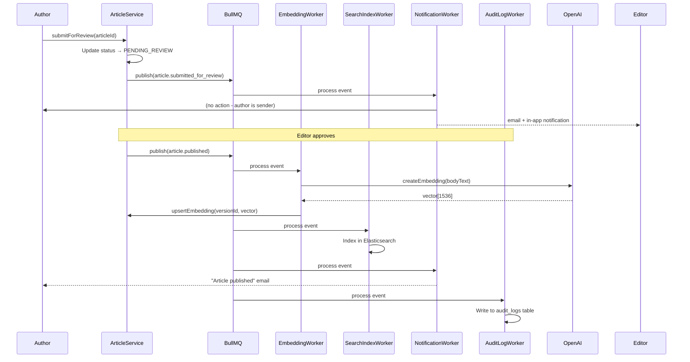
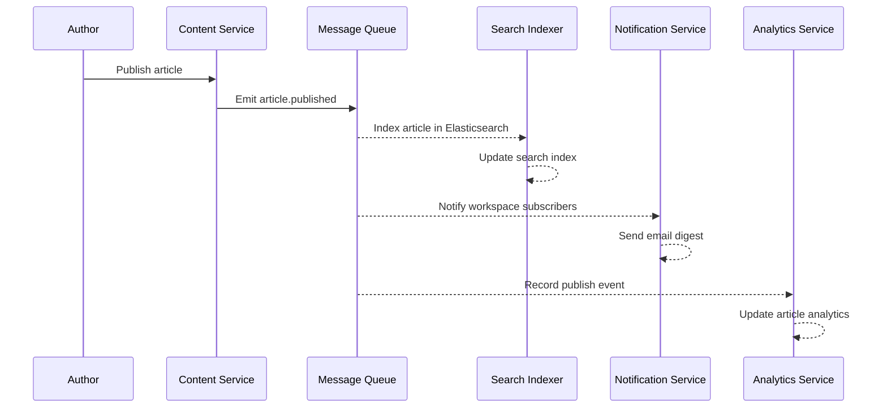

# Event Catalog — Knowledge Base Platform

## Overview

This catalog defines every domain event produced and consumed within the Knowledge Base Platform. Events are the backbone of the asynchronous, event-driven architecture — enabling loose coupling between services, real-time indexing, notification dispatch, and audit logging. All events are published via BullMQ queues backed by Redis ElastiCache and are consumed by registered workers.

---

## Event Naming Convention

Events follow the pattern `{domain}.{action_past_tense}`, e.g. `article.published`. Domain prefixes: `article`, `collection`, `search`, `ai`, `user`, `workspace`, `feedback`, `widget`, `integration`.

---

## Content Domain Events

### `article.drafted`
| Field | Value |
|-------|-------|
| **Domain** | Content |
| **Producer** | ArticleService |
| **Consumers** | AuditLogWorker |
| **Trigger** | A new article is created with status DRAFT |
| **Retention** | 90 days |

**Payload Schema:**
```json
{
  "eventId": "uuid",
  "eventType": "article.drafted",
  "occurredAt": "2024-06-20T09:00:00Z",
  "workspaceId": "uuid",
  "articleId": "uuid",
  "authorId": "uuid",
  "title": "string",
  "collectionId": "uuid | null"
}
```

---

### `article.submitted_for_review`
| Field | Value |
|-------|-------|
| **Domain** | Content |
| **Producer** | ArticleService |
| **Consumers** | NotificationWorker, AuditLogWorker |
| **Trigger** | Author clicks "Submit for Review"; status changes to PENDING_REVIEW |
| **Retention** | 90 days |

**Payload Schema:**
```json
{
  "eventId": "uuid",
  "eventType": "article.submitted_for_review",
  "occurredAt": "2024-06-20T10:00:00Z",
  "workspaceId": "uuid",
  "articleId": "uuid",
  "authorId": "uuid",
  "title": "string",
  "editorIds": ["uuid"]
}
```

---

### `article.review_requested_changes`
| Field | Value |
|-------|-------|
| **Domain** | Content |
| **Producer** | ArticleService |
| **Consumers** | NotificationWorker, AuditLogWorker |
| **Trigger** | Editor requests changes; status returns to DRAFT |
| **Retention** | 90 days |

**Payload Schema:**
```json
{
  "eventId": "uuid",
  "eventType": "article.review_requested_changes",
  "occurredAt": "2024-06-20T11:00:00Z",
  "workspaceId": "uuid",
  "articleId": "uuid",
  "editorId": "uuid",
  "authorId": "uuid",
  "comment": "string"
}
```

---

### `article.approved`
| Field | Value |
|-------|-------|
| **Domain** | Content |
| **Producer** | ArticleService |
| **Consumers** | NotificationWorker, AuditLogWorker |
| **Trigger** | Editor approves article; status changes to APPROVED |
| **Retention** | 90 days |

**Payload Schema:**
```json
{
  "eventId": "uuid",
  "eventType": "article.approved",
  "occurredAt": "2024-06-20T14:00:00Z",
  "workspaceId": "uuid",
  "articleId": "uuid",
  "editorId": "uuid",
  "authorId": "uuid"
}
```

---

### `article.published`
| Field | Value |
|-------|-------|
| **Domain** | Content |
| **Producer** | ArticleService |
| **Consumers** | SearchIndexWorker, EmbeddingWorker, NotificationWorker, AuditLogWorker, AnalyticsWorker |
| **Trigger** | Article status transitions to PUBLISHED (immediate or scheduled) |
| **Retention** | 1 year |

**Payload Schema:**
```json
{
  "eventId": "uuid",
  "eventType": "article.published",
  "occurredAt": "2024-06-20T15:00:00Z",
  "workspaceId": "uuid",
  "articleId": "uuid",
  "versionId": "uuid",
  "authorId": "uuid",
  "title": "string",
  "slug": "string",
  "collectionId": "uuid",
  "visibility": "PUBLIC | INTERNAL",
  "bodyText": "string"
}
```

---

### `article.unpublished`
| Field | Value |
|-------|-------|
| **Domain** | Content |
| **Producer** | ArticleService |
| **Consumers** | SearchIndexWorker (remove from index), NotificationWorker, AuditLogWorker |
| **Trigger** | Editor/Admin unpublishes an article |
| **Retention** | 90 days |

**Payload Schema:**
```json
{
  "eventId": "uuid",
  "eventType": "article.unpublished",
  "occurredAt": "2024-06-21T09:00:00Z",
  "workspaceId": "uuid",
  "articleId": "uuid",
  "actorId": "uuid",
  "reason": "string | null"
}
```

---

### `article.archived`
| Field | Value |
|-------|-------|
| **Domain** | Content |
| **Producer** | ArticleService |
| **Consumers** | SearchIndexWorker (purge), EmbeddingWorker (delete vector), AuditLogWorker |
| **Trigger** | Article is archived by admin or automated retention policy |
| **Retention** | 90 days |

**Payload Schema:**
```json
{
  "eventId": "uuid",
  "eventType": "article.archived",
  "occurredAt": "2024-06-22T00:00:00Z",
  "workspaceId": "uuid",
  "articleId": "uuid",
  "actorId": "uuid"
}
```

---

### `article.version_created`
| Field | Value |
|-------|-------|
| **Domain** | Content |
| **Producer** | ArticleVersionService |
| **Consumers** | EmbeddingWorker (re-embed if significant change), AuditLogWorker |
| **Trigger** | A new article version is saved (auto-save or explicit save) |
| **Retention** | 90 days |

**Payload Schema:**
```json
{
  "eventId": "uuid",
  "eventType": "article.version_created",
  "occurredAt": "2024-06-20T09:30:00Z",
  "workspaceId": "uuid",
  "articleId": "uuid",
  "versionId": "uuid",
  "versionNumber": 3,
  "authorId": "uuid",
  "wordCountDelta": 45
}
```

---

## Collection Domain Events

### `collection.created`
| Field | Value |
|-------|-------|
| **Domain** | Organization |
| **Producer** | CollectionService |
| **Consumers** | AuditLogWorker, SearchIndexWorker (update collection metadata) |
| **Trigger** | New collection created in workspace |
| **Retention** | 90 days |

**Payload Schema:**
```json
{
  "eventId": "uuid",
  "eventType": "collection.created",
  "occurredAt": "2024-06-01T10:00:00Z",
  "workspaceId": "uuid",
  "collectionId": "uuid",
  "parentId": "uuid | null",
  "name": "string",
  "visibility": "PUBLIC | INTERNAL",
  "createdBy": "uuid"
}
```

---

### `collection.updated`
| Field | Value |
|-------|-------|
| **Domain** | Organization |
| **Producer** | CollectionService |
| **Consumers** | SearchIndexWorker (refresh collection metadata in index), PermissionCacheWorker (invalidate ACL cache), AuditLogWorker |
| **Trigger** | Collection name, description, sort order, icon, or settings are modified |
| **Retention** | 90 days |

**Payload Schema:**
```json
{
  "eventId": "uuid",
  "eventType": "collection.updated",
  "occurredAt": "2024-06-15T11:30:00Z",
  "workspaceId": "uuid",
  "collectionId": "uuid",
  "updatedById": "uuid",
  "changes": {
    "name": {"before": "Getting Started", "after": "Onboarding Guides"},
    "sortOrder": {"before": 1, "after": 2}
  }
}
```

---

### `collection.permission_updated`
| Field | Value |
|-------|-------|
| **Domain** | Organization |
| **Producer** | PermissionService |
| **Consumers** | SearchIndexWorker (update visibility filters), AuditLogWorker |
| **Trigger** | Collection-level permissions changed |
| **Retention** | 1 year |

**Payload Schema:**
```json
{
  "eventId": "uuid",
  "eventType": "collection.permission_updated",
  "occurredAt": "2024-06-10T14:00:00Z",
  "workspaceId": "uuid",
  "collectionId": "uuid",
  "actorId": "uuid",
  "changes": [
    {"principal": "role:READER", "before": "READ_ONLY", "after": "NO_ACCESS"}
  ]
}
```

---

## Search Domain Events

### `search.query_executed`
| Field | Value |
|-------|-------|
| **Domain** | Search |
| **Producer** | SearchService |
| **Consumers** | AnalyticsWorker, SearchIntelligenceWorker |
| **Trigger** | Any search query is processed |
| **Retention** | 30 days |

**Payload Schema:**
```json
{
  "eventId": "uuid",
  "eventType": "search.query_executed",
  "occurredAt": "2024-06-20T12:10:00Z",
  "workspaceId": "uuid",
  "sessionId": "string",
  "query": "string",
  "queryType": "FULL_TEXT | SEMANTIC | HYBRID",
  "resultCount": 7,
  "topResultId": "uuid | null",
  "latencyMs": 234
}
```

---

### `search.no_results_found`
| Field | Value |
|-------|-------|
| **Domain** | Search |
| **Producer** | SearchService |
| **Consumers** | AnalyticsWorker, ContentGapWorker (aggregate to suggest new articles) |
| **Trigger** | Search query returns zero results |
| **Retention** | 90 days |

**Payload Schema:**
```json
{
  "eventId": "uuid",
  "eventType": "search.no_results_found",
  "occurredAt": "2024-06-20T12:15:00Z",
  "workspaceId": "uuid",
  "sessionId": "string",
  "query": "string",
  "queryType": "FULL_TEXT | SEMANTIC"
}
```

---

## AI Domain Events

### `ai.query_asked`
| Field | Value |
|-------|-------|
| **Domain** | AI |
| **Producer** | AIService |
| **Consumers** | AnalyticsWorker, AuditLogWorker |
| **Trigger** | User sends a message to the AI assistant |
| **Retention** | 30 days |

**Payload Schema:**
```json
{
  "eventId": "uuid",
  "eventType": "ai.query_asked",
  "occurredAt": "2024-06-20T12:20:00Z",
  "workspaceId": "uuid",
  "conversationId": "uuid",
  "messageId": "uuid",
  "sessionId": "string",
  "queryLength": 84,
  "widgetId": "uuid | null"
}
```

**Note:** Query content is NOT included in the event payload to prevent PII leakage in the event stream.

---

### `ai.answer_generated`
| Field | Value |
|-------|-------|
| **Domain** | AI |
| **Producer** | AIService |
| **Consumers** | AnalyticsWorker |
| **Trigger** | GPT-4o generates a response |
| **Retention** | 30 days |

**Payload Schema:**
```json
{
  "eventId": "uuid",
  "eventType": "ai.answer_generated",
  "occurredAt": "2024-06-20T12:20:02Z",
  "workspaceId": "uuid",
  "conversationId": "uuid",
  "messageId": "uuid",
  "citationCount": 2,
  "tokensUsed": 512,
  "latencyMs": 1842,
  "model": "gpt-4o"
}
```

---

### `ai.fallback_triggered`
| Field | Value |
|-------|-------|
| **Domain** | AI |
| **Producer** | AIService |
| **Consumers** | AnalyticsWorker, NotificationWorker (alert on spike), AuditLogWorker |
| **Trigger** | AI cannot generate a satisfactory answer; falls back to article list or human support |
| **Retention** | 90 days |

**Payload Schema:**
```json
{
  "eventId": "uuid",
  "eventType": "ai.fallback_triggered",
  "occurredAt": "2024-06-20T12:25:00Z",
  "workspaceId": "uuid",
  "conversationId": "uuid",
  "reason": "NO_RELEVANT_ARTICLES | LOW_CONFIDENCE | API_TIMEOUT | API_ERROR",
  "escalatedToHuman": false
}
```

---

## User & Identity Domain Events

### `user.registered`
| Field | Value |
|-------|-------|
| **Domain** | Identity |
| **Producer** | AuthService |
| **Consumers** | NotificationWorker (welcome email), AuditLogWorker, AnalyticsWorker |
| **Trigger** | New user creates an account |
| **Retention** | 1 year |

**Payload Schema:**
```json
{
  "eventId": "uuid",
  "eventType": "user.registered",
  "occurredAt": "2024-06-20T08:00:00Z",
  "userId": "uuid",
  "email": "string",
  "registrationMethod": "EMAIL | SSO_SAML | INVITATION"
}
```

---

### `user.invited`
| Field | Value |
|-------|-------|
| **Domain** | Identity |
| **Producer** | WorkspaceService |
| **Consumers** | NotificationWorker (invitation email), AuditLogWorker |
| **Trigger** | Admin invites a user to a workspace |
| **Retention** | 90 days |

**Payload Schema:**
```json
{
  "eventId": "uuid",
  "eventType": "user.invited",
  "occurredAt": "2024-06-05T10:00:00Z",
  "workspaceId": "uuid",
  "invitedByUserId": "uuid",
  "inviteeEmail": "string",
  "role": "AUTHOR | EDITOR | WORKSPACE_ADMIN",
  "invitationToken": "string",
  "expiresAt": "2024-06-12T10:00:00Z"
}
```

---

## Workspace Domain Events

### `workspace.created`
| Field | Value |
|-------|-------|
| **Domain** | Workspace |
| **Producer** | WorkspaceService |
| **Consumers** | NotificationWorker (onboarding email), AuditLogWorker, BillingWorker |
| **Trigger** | New workspace is provisioned |
| **Retention** | 1 year |

**Payload Schema:**
```json
{
  "eventId": "uuid",
  "eventType": "workspace.created",
  "occurredAt": "2024-01-15T09:00:00Z",
  "workspaceId": "uuid",
  "ownerUserId": "uuid",
  "planTier": "FREE",
  "slug": "string"
}
```

---

### `workspace.plan_upgraded`
| Field | Value |
|-------|-------|
| **Domain** | Workspace |
| **Producer** | BillingService |
| **Consumers** | AuditLogWorker, NotificationWorker, FeatureFlagWorker |
| **Trigger** | Workspace upgrades to a higher plan tier |
| **Retention** | 1 year |

**Payload Schema:**
```json
{
  "eventId": "uuid",
  "eventType": "workspace.plan_upgraded",
  "occurredAt": "2024-06-01T12:00:00Z",
  "workspaceId": "uuid",
  "actorId": "uuid",
  "fromPlan": "FREE",
  "toPlan": "GROWTH",
  "stripeSubscriptionId": "sub_1234567890"
}
```

---

## Feedback Domain Events

### `feedback.submitted`
| Field | Value |
|-------|-------|
| **Domain** | Feedback |
| **Producer** | FeedbackService |
| **Consumers** | AnalyticsWorker (update article scores), AuditLogWorker |
| **Trigger** | Reader submits a rating on an article |
| **Retention** | 1 year |

**Payload Schema:**
```json
{
  "eventId": "uuid",
  "eventType": "feedback.submitted",
  "occurredAt": "2024-06-20T11:45:00Z",
  "workspaceId": "uuid",
  "articleId": "uuid",
  "feedbackId": "uuid",
  "rating": 2,
  "isHelpful": false,
  "hasComment": true
}
```

---

### `feedback.flagged`
| Field | Value |
|-------|-------|
| **Domain** | Feedback |
| **Producer** | FeedbackService |
| **Consumers** | NotificationWorker (notify article author), AuditLogWorker |
| **Trigger** | Feedback rating triggers auto-flag threshold (rating ≤ 2) |
| **Retention** | 1 year |

**Payload Schema:**
```json
{
  "eventId": "uuid",
  "eventType": "feedback.flagged",
  "occurredAt": "2024-06-20T11:46:00Z",
  "workspaceId": "uuid",
  "articleId": "uuid",
  "authorId": "uuid",
  "feedbackId": "uuid",
  "averageRating": 2.3,
  "flagReason": "LOW_RATING"
}
```

---

## Widget Domain Events

### `widget.initialized`
| Field | Value |
|-------|-------|
| **Domain** | Widget |
| **Producer** | WidgetService |
| **Consumers** | AnalyticsWorker |
| **Trigger** | Widget JS bundle loads and initializes on host page |
| **Retention** | 30 days |

**Payload Schema:**
```json
{
  "eventId": "uuid",
  "eventType": "widget.initialized",
  "occurredAt": "2024-06-20T12:00:00Z",
  "workspaceId": "uuid",
  "widgetId": "uuid",
  "sessionId": "string",
  "pageUrl": "string",
  "referrer": "string | null"
}
```

---

### `widget.article_suggested`
| Field | Value |
|-------|-------|
| **Domain** | Widget |
| **Producer** | WidgetService |
| **Consumers** | AnalyticsWorker (deflection tracking) |
| **Trigger** | Widget surfaces context-aware article suggestions |
| **Retention** | 30 days |

**Payload Schema:**
```json
{
  "eventId": "uuid",
  "eventType": "widget.article_suggested",
  "occurredAt": "2024-06-20T12:00:05Z",
  "workspaceId": "uuid",
  "widgetId": "uuid",
  "sessionId": "string",
  "pageUrl": "string",
  "suggestedArticleIds": ["uuid", "uuid", "uuid"],
  "suggestionMethod": "URL_CONTEXT | SEARCH | AI"
}
```

---

### `widget.chat_started`
| Field | Value |
|-------|-------|
| **Domain** | Widget |
| **Producer** | WidgetService |
| **Consumers** | AnalyticsWorker, AIConversationService (initialise conversation record) |
| **Trigger** | User clicks "Ask AI" inside the widget, opening the AI chat panel |
| **Retention** | 30 days |

**Payload Schema:**
```json
{
  "eventId": "uuid",
  "eventType": "widget.chat_started",
  "occurredAt": "2024-06-20T12:01:00Z",
  "workspaceId": "uuid",
  "widgetId": "uuid",
  "sessionId": "string",
  "userId": "uuid | null",
  "pageUrl": "string",
  "triggerContext": "no_results | user_initiated | article_not_helpful"
}
```

---

### `widget.ticket_deflected`
| Field | Value |
|-------|-------|
| **Domain** | Widget |
| **Producer** | WidgetService |
| **Consumers** | AnalyticsWorker |
| **Trigger** | Reader marks their issue as resolved in the widget |
| **Retention** | 90 days |

**Payload Schema:**
```json
{
  "eventId": "uuid",
  "eventType": "widget.ticket_deflected",
  "occurredAt": "2024-06-20T12:05:00Z",
  "workspaceId": "uuid",
  "widgetId": "uuid",
  "sessionId": "string",
  "resolvedByArticleId": "uuid | null",
  "resolvedByAI": true
}
```

---

## Integration Domain Events

### `integration.connected`
| Field | Value |
|-------|-------|
| **Domain** | Integration |
| **Producer** | IntegrationService |
| **Consumers** | AuditLogWorker, NotificationWorker |
| **Trigger** | A third-party integration (Slack, Zendesk, Jira) is successfully connected |
| **Retention** | 1 year |

**Payload Schema:**
```json
{
  "eventId": "uuid",
  "eventType": "integration.connected",
  "occurredAt": "2024-04-01T10:00:00Z",
  "workspaceId": "uuid",
  "integrationId": "uuid",
  "provider": "SLACK | ZENDESK | SALESFORCE | JIRA | ZAPIER",
  "connectedByUserId": "uuid"
}
```

---

### `integration.synced`
| Field | Value |
|-------|-------|
| **Domain** | Integration |
| **Producer** | IntegrationSyncWorker |
| **Consumers** | AuditLogWorker, AnalyticsWorker, NotificationWorker (alert on sync errors) |
| **Trigger** | A scheduled or manually triggered sync operation completes (success or partial failure) |
| **Retention** | 90 days |

**Payload Schema:**
```json
{
  "eventId": "uuid",
  "eventType": "integration.synced",
  "occurredAt": "2024-06-20T06:05:00Z",
  "workspaceId": "uuid",
  "integrationId": "uuid",
  "provider": "zendesk | jira | salesforce | slack | zapier",
  "syncType": "full | incremental",
  "outcome": "success | partial | failed",
  "articlesExported": 12,
  "articlesSkipped": 1,
  "errorCount": 0,
  "durationMs": 3420
}
```

---

### `integration.sync_completed`
| Field | Value |
|-------|-------|
| **Domain** | Integration |
| **Producer** | IntegrationSyncWorker |
| **Consumers** | AuditLogWorker, AnalyticsWorker |
| **Trigger** | Scheduled or manual sync completes successfully |
| **Retention** | 30 days |

**Payload Schema:**
```json
{
  "eventId": "uuid",
  "eventType": "integration.sync_completed",
  "occurredAt": "2024-06-20T06:05:00Z",
  "workspaceId": "uuid",
  "integrationId": "uuid",
  "provider": "string",
  "articlesExported": 12,
  "durationMs": 3420
}
```

---

## Event Flow Diagram



---

## Event Sourcing and Replay

Events are stored in BullMQ with a configurable retention window (default: 7 days for processed events, 30 days for failed events). For audit and compliance, a subset of events (`article.published`, `collection.permission_updated`, `workspace.plan_upgraded`, `user.invited`, `integration.connected`) are also written synchronously to the `audit_logs` PostgreSQL table for long-term retention.

**Replay use cases:**
1. Rebuilding the Elasticsearch index after mapping changes (replay all `article.published` events)
2. Regenerating embeddings after model upgrade (replay all `article.version_created` events)
3. Reconciling analytics after worker downtime (replay `search.query_executed` events from dead letter queue)

---

## Dead Letter Queue Handling

Each BullMQ queue has a corresponding Dead Letter Queue (DLQ). Failed jobs are moved to the DLQ after 3 retry attempts with exponential backoff (1s, 4s, 16s). The DLQ is monitored by CloudWatch; when depth exceeds 100, a PagerDuty alert is triggered. Operations team reviews DLQ contents via the Bull Board admin UI at `https://admin.kb.io/queues`.

**DLQ retention:** 30 days. Failed events older than 30 days are archived to S3 for post-mortem analysis.

---

## Operational Policy Addendum

### Content Governance Policies

`article.published` events trigger the search indexing and embedding pipeline within 60 seconds of publication. If the EmbeddingWorker fails, articles remain searchable via full-text search (Elasticsearch) while the embedding retry job processes in the background. Events related to article archiving and deletion trigger cascading cleanup in all downstream stores (search index, pgvector, CDN cache invalidation).

### Reader Data Privacy Policies

Events in the Search and Widget domains do not store the raw query text or page URL in the event payload for EU/CCPA-regulated workspaces with the privacy mode enabled. `ai.query_asked` events explicitly omit the query content to prevent accidental PII exposure in the event stream. All event payloads containing user-identifiable fields (`userId`, `email`) are subject to GDPR erasure workflows — upon deletion request, affected events are scrubbed of PII fields within 30 days.

### AI Usage Policies

`ai.answer_generated` events record token usage for cost attribution and quota enforcement. When a workspace exceeds 80% of their monthly AI query quota, a `workspace.ai_quota_warning` event triggers a notification to the Workspace Admin. The EmbeddingWorker processes embedding jobs in batches of 50 to avoid OpenAI rate limit errors (3,000 requests/minute for text-embedding-3-small at Tier 2).

### System Availability Policies

BullMQ queues are backed by ElastiCache Redis with a 3-shard cluster configuration. In the event of a Redis primary node failover (30–60 second window), new events are buffered in memory and replayed after recovery. The `article.published` event has a priority level of HIGH in BullMQ to ensure search indexing completes within 60 seconds of publication SLA. Queue depths are monitored via CloudWatch metrics exported from a BullMQ metrics endpoint; alerts fire at depth > 10,000 for the embedding queue and > 1,000 for the notification queue.

---

## Contract Conventions

All Knowledge Base Platform events follow these conventions:

- **Naming pattern**: `{aggregate}.{verb_past_tense}` (e.g., `article.published`, `workspace.member_added`)
- **Transport**: Internal Redis Streams; SNS topic for cross-service consumers (search indexer, notification)
- **Schema**: JSON with `event_id` (UUID v4), `event_type`, `aggregate_id`, `workspace_id`, `occurred_at` (ISO 8601), `actor_id`, `schema_version`, `payload`
- **Idempotency**: All consumers implement idempotent processing keyed on `event_id`
- **Retention**: 60 days in event store; DLQ retained 14 days

## Domain Events

| Event Name | Trigger | Publisher | Consumers | Key Payload Fields |
|---|---|---|---|---|
| `article.published` | Article transitions to PUBLISHED state | Content Service | Search indexer, notification, analytics | article_id, workspace_id, author_id, published_at |
| `article.updated` | Published article content edited | Content Service | Search indexer, analytics | article_id, version_id, editor_id, changed_fields |
| `article.archived` | Article moved to ARCHIVED | Content Service | Search indexer, notification | article_id, archived_by, archived_at |
| `workspace.member_added` | User joins workspace | Workspace Service | Permission service, notification | workspace_id, user_id, role, added_by |
| `search.query.no_results` | Search returns zero results | Search Service | Gap analytics, recommendation | query_text, workspace_id, occurred_at |
| `ai_conversation.started` | User opens AI assistant | AI Service | Usage quota check, analytics | conversation_id, user_id, workspace_id |
| `article.review_requested` | Author submits for review | Content Service | Reviewer notification, workflow | article_id, reviewer_ids, submitted_at |

## Publish and Consumption Sequence



## Operational SLOs

| Event | Max Indexing Latency | Retry Policy | DLQ Retention |
|---|---|---|---|
| `article.published` | 60 s (search indexed) | 5 attempts, exponential | 14 days |
| `article.updated` | 60 s (search re-indexed) | 5 attempts | 14 days |
| `workspace.member_added` | 2 s | 3 attempts | 7 days |
| `search.query.no_results` | 5 s (analytics) | 3 attempts | 7 days |
| `article.review_requested` | 3 s (notification) | 3 attempts | 14 days |
