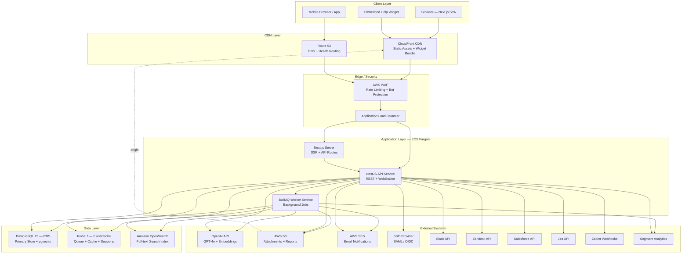

# System Context Diagram — Knowledge Base Platform

## 1. Introduction

This document provides a high-level view of the Knowledge Base Platform and all external
systems it interacts with. The C4 Context diagram shows the platform as a single opaque
system, its direct human users, and its external system dependencies. Subsequent sections
describe each external integration in detail, including protocol, data exchanged, and SLA
dependencies.

---

## 2. C4 Context Diagram

```mermaid
C4Context
    title System Context — Knowledge Base Platform

    Person(author, "Author / Editor", "Internal team member who creates and reviews knowledge articles")
    Person(reader, "Reader", "End user who searches and reads published articles")
    Person(admin, "Workspace Admin", "Configures workspace, permissions, and integrations")
    Person(superadmin, "Super Admin", "Platform-level administrator managing all tenants")
    Person(widgetUser, "Widget User", "External customer using the embedded help widget")

    System(kbp, "Knowledge Base Platform", "NestJS + Next.js platform for authoring, organising, searching, and serving knowledge content with AI Q&A capabilities")

    System_Ext(browser, "Browser Clients", "Chrome, Firefox, Safari — renders the Next.js SPA")
    System_Ext(mobile, "Mobile Clients", "iOS / Android browsers or native wrappers consuming the public API")
    System_Ext(slack, "Slack", "Team messaging platform — /kb slash command integration")
    System_Ext(zendesk, "Zendesk", "Customer support ticketing — article sync and auto-suggest")
    System_Ext(salesforce, "Salesforce", "CRM — article suggestions on case records via AppExchange connector")
    System_Ext(jira, "Jira", "Issue tracker — support ticket creation from widget escalations")
    System_Ext(zapier, "Zapier", "No-code automation — webhook triggers on article events")
    System_Ext(openai, "OpenAI API", "GPT-4o and text-embedding-3-small — AI Q&A and semantic search")
    System_Ext(s3, "AWS S3", "Object storage — article attachments, export reports, widget bundles")
    System_Ext(ses, "AWS SES", "Transactional email — invitations, notifications, digest emails")
    System_Ext(sso, "SSO Provider (SAML/OIDC)", "Identity provider — SAML 2.0 or OIDC for enterprise SSO")
    System_Ext(segment, "Segment / Analytics", "Customer data platform — analytics event pipeline")
    System_Ext(cdn, "CloudFront CDN", "Global CDN — static assets, widget bundle, article images")

    Rel(author, kbp, "Creates and publishes articles", "HTTPS / REST + WebSocket")
    Rel(reader, kbp, "Searches and reads articles", "HTTPS / REST")
    Rel(admin, kbp, "Configures workspace and integrations", "HTTPS / REST")
    Rel(superadmin, kbp, "Manages tenants and billing", "HTTPS / REST")
    Rel(widgetUser, kbp, "Initiates widget sessions and AI chat", "HTTPS / REST + SSE")

    Rel(kbp, browser, "Serves Next.js SPA and API", "HTTPS / HTML + JSON")
    Rel(kbp, mobile, "Provides REST API", "HTTPS / JSON")
    Rel(kbp, slack, "Posts article search results", "HTTPS / Slack Web API + Bolt")
    Rel(kbp, zendesk, "Syncs articles and suggests answers", "HTTPS / Zendesk REST API")
    Rel(kbp, salesforce, "Surfaces articles on CRM cases", "HTTPS / Salesforce REST API")
    Rel(kbp, jira, "Creates support tickets from widget", "HTTPS / Jira REST API")
    Rel(kbp, zapier, "Fires webhook events on article lifecycle", "HTTPS / Webhook POST")
    Rel(kbp, openai, "Sends prompts and embedding requests", "HTTPS / OpenAI REST API")
    Rel(kbp, s3, "Stores and retrieves attachments and bundles", "HTTPS / AWS SDK S3 API")
    Rel(kbp, ses, "Sends transactional emails", "HTTPS / AWS SES API")
    Rel(kbp, sso, "SP-initiated SSO authentication", "HTTPS / SAML 2.0 or OIDC")
    Rel(kbp, segment, "Streams analytics events", "HTTPS / Segment HTTP API")
    Rel(kbp, cdn, "Serves static assets via CDN", "HTTPS / CloudFront distribution")
```

---

## 3. System Landscape Diagram

This flowchart shows the infrastructure topology and how the platform's internal components
relate to external systems across deployment tiers.

---

## 4. External System Integration Descriptions

### 4.1 Browser Clients
**Purpose:** Serve the Next.js 14 single-page application including the TipTap editor,
search UI, analytics dashboard, and admin settings.
**Protocol:** HTTPS; HTML5 + JSON; WebSocket for real-time collaboration and streaming.
**Data Exchanged:** Article content, search results, user session tokens, analytics events.
**SLA Dependency:** The platform targets ≤ 2 second TTFB for SSR pages; CDN caching reduces
load on the origin Next.js server. No hard dependency on client browser version beyond
supporting ES2020.

### 4.2 Mobile Clients
**Purpose:** Provide read-access and search to users on iOS and Android devices via the
public REST API.
**Protocol:** HTTPS / JSON REST.
**Data Exchanged:** Published article content, search results, AI chat messages.
**SLA Dependency:** Same API endpoints as the web app; no separate mobile gateway required.
Mobile clients must handle HTTP 503 gracefully during maintenance windows.

### 4.3 Slack
**Purpose:** Surface KB articles inside Slack channels via a `/kb` slash command, allowing
team members to search without leaving Slack.
**Protocol:** HTTPS / Slack Web API + Bolt framework event subscriptions.
**Data Exchanged:** Search query strings (inbound), article title + excerpt + URL payloads
formatted as Slack Block Kit messages (outbound).
**SLA Dependency:** Slack Bolt event subscriptions must respond within 3 seconds or Slack
will retry. The integration handles retries idempotently using the Slack retry header.

### 4.4 Zendesk
**Purpose:** (1) Mirror published articles into the Zendesk Help Center via the Articles API.
(2) Auto-suggest relevant KB articles on new ticket creation via the Apps API.
**Protocol:** HTTPS / Zendesk REST API v2 (OAuth 2.0 authentication).
**Data Exchanged:** Article HTML content, metadata, and publish status (outbound); ticket
subject and description for suggestion queries (inbound).
**SLA Dependency:** Article sync jobs run hourly via BullMQ scheduler. Auto-suggest calls
are synchronous on ticket creation; they must complete within 5 seconds to not block the
Zendesk agent UI.

### 4.5 Salesforce
**Purpose:** Embed a Salesforce Lightning component that queries the KB API and displays
relevant articles on CRM case records.
**Protocol:** HTTPS / Salesforce REST API + Named Credentials for authentication.
**Data Exchanged:** Case subject/description (inbound for query), article cards (outbound).
**SLA Dependency:** Dependent on Salesforce managed package deployment by the customer's
Salesforce admin. The KB API must accept requests from Salesforce's IP ranges.

### 4.6 Jira
**Purpose:** Create Jira issues from widget escalation forms when Jira is the workspace's
selected support system.
**Protocol:** HTTPS / Jira REST API v3 (OAuth 2.0 with 3LO).
**Data Exchanged:** Ticket summary, description, AI conversation summary, user email, and
widget page URL (outbound); Jira issue key returned (inbound).
**SLA Dependency:** Ticket creation must succeed within 5 seconds or the platform queues
the request for async retry. Customer-facing confirmation is shown immediately regardless.

### 4.7 Zapier
**Purpose:** Enable no-code automations triggered by KB article lifecycle events (publish,
update, archive) for customers who use Zapier to connect to other tools.
**Protocol:** HTTPS / Outbound webhook POST; Zapier webhook subscription management API.
**Data Exchanged:** Article event payloads (JSON) containing article ID, title, URL, event
type, and timestamp.
**SLA Dependency:** Webhook delivery is best-effort with up to 3 retries (exponential
backoff). Failed deliveries are logged but do not affect core platform operations.

### 4.8 OpenAI API
**Purpose:** Power the AI Q&A assistant (GPT-4o) and generate semantic search embeddings
(text-embedding-3-small) for the pgvector store.
**Protocol:** HTTPS / OpenAI REST API (Bearer token authentication).
**Data Exchanged:** Prompt payloads including retrieved article chunks and conversation
history (outbound to GPT-4o); embedding generation requests (outbound); streamed token
responses and embedding vectors (inbound).
**SLA Dependency:** Critical path dependency. If OpenAI API latency exceeds 3 seconds for
first token, a timeout warning is shown. If unavailable, AI Q&A is suppressed and a
user-facing message is displayed. No platform fallback AI provider is currently configured.

### 4.9 AWS S3
**Purpose:** Store article media attachments, exported analytics reports, and the
versioned widget JavaScript bundle.
**Protocol:** HTTPS / AWS SDK v3 S3 API (IAM Role-based authentication via ECS task role).
**Data Exchanged:** Binary file uploads (inbound); pre-signed URL generation for downloads
and CDN origin (outbound).
**SLA Dependency:** S3 targets 99.999999999% durability. The platform uses a single region
bucket with versioning enabled. CloudFront is configured as the CDN origin for the public
assets bucket.

### 4.10 AWS SES
**Purpose:** Send all transactional emails: account invitations, article review
notifications, publish confirmations, digest summaries, and password resets.
**Protocol:** HTTPS / AWS SES API v2 (IAM Role-based authentication).
**Data Exchanged:** Email address, subject, HTML body, text body (outbound); delivery
status callbacks via SES SNS bounce/complaint notifications (inbound).
**SLA Dependency:** SES targets 99.9% availability. Bounce and complaint handling must be
implemented to maintain sender reputation. Hard bounces result in automatic suppression
list updates.

### 4.11 SSO Provider (SAML 2.0 / OIDC)
**Purpose:** Enable enterprise single sign-on for workspace users via their organisation's
identity provider (Okta, Azure AD, Google Workspace, etc.).
**Protocol:** HTTPS / SAML 2.0 HTTP-POST binding or OIDC Authorization Code + PKCE.
**Data Exchanged:** SP metadata XML (outbound); SAML assertions or OIDC ID tokens
containing email, name, and role attributes (inbound).
**SLA Dependency:** The platform implements SP-initiated SSO only. If the IdP is
unavailable, local password authentication remains available as a fallback (unless the
Workspace Admin has enforced SSO-only mode, in which case login is blocked).

### 4.12 Segment / Analytics
**Purpose:** Forward all platform analytics events to the customer's Segment workspace
for downstream data pipeline consumption (e.g., BigQuery, Amplitude, Mixpanel).
**Protocol:** HTTPS / Segment HTTP Tracking API.
**Data Exchanged:** Structured analytics events (JSON) conforming to Segment's Track and
Page event schemas.
**SLA Dependency:** Analytics event forwarding is asynchronous and non-blocking. Event
delivery failure does not impact core platform operations. Events are buffered for up to
24 hours if the Segment API is unreachable.

### 4.13 CloudFront CDN
**Purpose:** Serve static Next.js build assets, the widget JavaScript bundle, and article
media attachments with low latency globally.
**Protocol:** HTTPS / CloudFront distribution with S3 origin and Lambda@Edge for URL
rewriting.
**Data Exchanged:** Static files, images, and the widget bundle (cached binary content).
**SLA Dependency:** CloudFront targets 99.9% availability. Cache-Control headers must be
set correctly per asset type: 1 year for fingerprinted build assets, 5 minutes for
article images, and no-cache for API responses.

---

## 5. Integration Dependency Matrix

| External System | Integration Type | Criticality | Platform Fails Without It? | Fallback Available | Timeout Threshold |
|---|---|---|---|---|---|
| Browser Clients | Outbound / Serve | Critical | Yes | N/A (core delivery) | 2 s TTFB |
| Slack | Outbound API | Low | No | Silent disable | 3 s response |
| Zendesk | Bidirectional API | Medium | No | Queue + retry | 5 s per call |
| Salesforce | Outbound API | Low | No | Silent disable | 5 s per call |
| Jira | Outbound API | Medium | No | Async retry queue | 5 s per call |
| Zapier | Outbound Webhook | Low | No | Retry + DLQ | Best-effort |
| OpenAI API | Outbound API | High | Partial (AI features) | Suppress AI, show msg | 3 s first token |
| AWS S3 | Outbound API | Critical | Yes (for attachments) | None for attachments | 5 s per operation |
| AWS SES | Outbound API | High | No (notifications) | Queue + retry | 10 s per send |
| SSO Provider | Inbound / Auth | High | No (local auth fallback) | Local password auth | 30 s test flow |
| Segment | Outbound API | Low | No | 24 h buffer | Async |
| CloudFront CDN | Outbound / Serve | Critical | Yes (widget bundle) | S3 direct fallback | N/A |
| Amazon OpenSearch | Internal | Critical | Partial (FTS fallback) | PostgreSQL FTS | 3 s per query |
| AWS RDS (PostgreSQL) | Internal | Critical | Yes | Multi-AZ automatic failover | N/A |
| AWS ElastiCache (Redis) | Internal | High | No (queue/cache) | In-process fallback | N/A |

---

## Operational Policy Addendum

### Section 1 — Content Governance Policies
External integrations that receive article content (Zendesk sync, Salesforce display,
Zapier webhooks) must only ever receive content from articles in `published` state. Draft,
in-review, and archived articles must never be transmitted to external systems. Article
content transmitted to Zendesk is subject to the workspace's content licensing terms; the
Zendesk sync job must include the platform attribution footer on all synced articles.

### Section 2 — Reader Data Privacy Policies
Analytics events forwarded to Segment must be scrubbed of direct PII before transmission:
user IDs must be pseudonymised with a workspace-scoped hash, and raw email addresses must
not appear in event properties. Widget interaction events forwarded to downstream analytics
tools must include a data processing agreement acknowledgement in the Workspace Admin
settings before activation. OpenAI API requests must never include personally identifiable
information about the end user; conversation history passed to GPT must use anonymised
session identifiers rather than user names or emails.

### Section 3 — AI Usage Policies
The OpenAI API is the sole AI provider. All prompts sent to OpenAI must originate from the
platform's LangChain.js orchestration layer, which enforces the RAG grounding requirement
and token budget limits. Direct client-side calls to OpenAI are prohibited. API keys are
stored in AWS Secrets Manager and rotated every 90 days. Usage metrics are tracked per
workspace and per request type (chat vs. embedding) to enable cost allocation by tenant.
Embedding generation for new articles is a background job; failures do not block article
publishing but must be retried until successful.

### Section 4 — System Availability Policies
The Integration Dependency Matrix table identifies CloudFront, AWS RDS, and AWS S3 as
Critical dependencies. AWS RDS is deployed as a Multi-AZ instance to provide automatic
failover. ElastiCache is deployed in cluster mode with at least two replica nodes.
Amazon OpenSearch (Elasticsearch) is deployed with a minimum of three data nodes across
two Availability Zones. Slack, Zendesk, and Jira integrations must implement circuit
breakers that open after 5 consecutive failures, preventing cascading latency from external
API degradation from affecting core platform response times. All external API credentials
are stored in AWS Secrets Manager; no secrets are stored in environment variables or
configuration files committed to source control.
