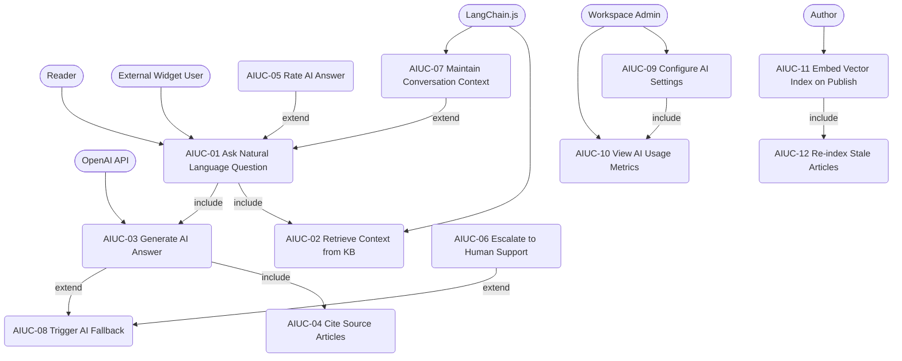

# Use-Case Diagram — Knowledge Base Platform

## 1. Introduction

This document captures the functional scope of the Knowledge Base Platform through structured
use-case diagrams and a summary table. The **system boundary** encompasses all capabilities
provided by the platform: content authoring and publishing, knowledge organisation, full-text
and semantic search, AI-powered Q&A, access control, the embeddable help widget, customer
feedback collection, multi-workspace management, analytics, and third-party integrations.

### Primary Actors

| Actor | Type | Goal |
|---|---|---|
| **Author** | Human – internal | Create, edit, and maintain knowledge articles |
| **Editor** | Human – internal | Review, approve, and improve article quality |
| **Reader** | Human – end user | Discover and consume published knowledge |
| **Workspace Admin** | Human – internal | Configure workspace settings, SSO, permissions |
| **Super Admin** | Human – platform ops | Manage all workspaces, billing, and platform health |
| **External Widget User** | Human – external | Interact with the help widget embedded in the host product |
| **Slack Bot** | System actor | Surface KB articles inside Slack channels |
| **Zendesk Integration** | System actor | Sync articles and auto-suggest answers on tickets |

---

## 2. Primary Use-Case Diagram

```mermaid
flowchart TD
    %% ── Actors ──────────────────────────────────────────
    AU([Author])
    ED([Editor])
    RE([Reader])
    WA([Workspace Admin])
    SA([Super Admin])
    EW([External Widget User])
    SB([Slack Bot])
    ZI([Zendesk Integration])

    %% ── Use Cases ────────────────────────────────────────
    UC001(UC-001 Create Article)
    UC002(UC-002 Save Draft)
    UC003(UC-003 Submit for Review)
    UC004(UC-004 Attach Media / Files)
    UC005(UC-005 Add Tags & Metadata)
    UC006(UC-006 Request Peer Review)
    UC007(UC-007 Review Article Draft)
    UC008(UC-008 Approve Article)
    UC009(UC-009 Reject with Feedback)
    UC010(UC-010 Publish Article)
    UC011(UC-011 Unpublish Article)
    UC012(UC-012 Archive Article)
    UC013(UC-013 Search Knowledge Base)
    UC014(UC-014 Browse Collections)
    UC015(UC-015 Bookmark Article)
    UC016(UC-016 Submit Feedback on Article)
    UC017(UC-017 AI Q&A Query)
    UC018(UC-018 Embed Help Widget)
    UC019(UC-019 Deflect Support Ticket via Widget)
    UC020(UC-020 Manage Collection Permissions)
    UC021(UC-021 Invite Team Members)
    UC022(UC-022 Configure SSO Integration)
    UC023(UC-023 View Analytics Dashboard)
    UC024(UC-024 Export Analytics Report)
    UC025(UC-025 Manage Workspace Settings)
    UC026(UC-026 Connect Third-Party Integration)
    UC027(UC-027 Manage All Workspaces)
    UC028(UC-028 Impersonate Workspace Admin)
    UC029(UC-029 Configure Billing Plan)
    UC030(UC-030 Slack Article Search)
    UC031(UC-031 Zendesk Ticket Auto-Suggest)
    UC032(UC-032 Sync Articles to Zendesk)

    %% ── Author associations ──────────────────────────────
    AU --> UC001
    AU --> UC002
    AU --> UC003
    AU --> UC004
    AU --> UC005
    AU --> UC006
    AU --> UC023

    %% ── Editor associations ──────────────────────────────
    ED --> UC007
    ED --> UC008
    ED --> UC009
    ED --> UC010
    ED --> UC011
    ED --> UC012
    ED --> UC023

    %% ── Reader associations ──────────────────────────────
    RE --> UC013
    RE --> UC014
    RE --> UC015
    RE --> UC016
    RE --> UC017

    %% ── Workspace Admin associations ─────────────────────
    WA --> UC020
    WA --> UC021
    WA --> UC022
    WA --> UC023
    WA --> UC024
    WA --> UC025
    WA --> UC026
    WA --> UC018

    %% ── Super Admin associations ─────────────────────────
    SA --> UC027
    SA --> UC028
    SA --> UC029
    SA --> UC023
    SA --> UC025

    %% ── External Widget User associations ────────────────
    EW --> UC018
    EW --> UC019
    EW --> UC013
    EW --> UC017

    %% ── Slack Bot associations ───────────────────────────
    SB --> UC030
    SB --> UC013

    %% ── Zendesk Integration associations ─────────────────
    ZI --> UC031
    ZI --> UC032
    ZI --> UC013

    %% ── include relationships ─────────────────────────────
    UC001 -->|include| UC002
    UC001 -->|include| UC005
    UC003 -->|include| UC006
    UC010 -->|include| UC013
    UC017 -->|include| UC013
    UC019 -->|include| UC017
    UC031 -->|include| UC013
    UC024 -->|include| UC023

    %% ── extend relationships ──────────────────────────────
    UC004 -->|extend| UC001
    UC008 -->|extend| UC007
    UC009 -->|extend| UC007
    UC015 -->|extend| UC013
    UC016 -->|extend| UC013
    UC028 -->|extend| UC027
    UC032 -->|extend| UC031
```

---

## 3. AI Assistant Sub-System Use-Case Diagram

---

## 4. Use-Case Summary Table

| UC-ID | Name | Actor(s) | Description | Priority |
|---|---|---|---|---|
| UC-001 | Create Article | Author | Author creates a new article using the rich-text editor | Critical |
| UC-002 | Save Draft | Author | Autosave or manual draft persistence before submission | High |
| UC-003 | Submit for Review | Author | Author submits a finished draft to the editorial queue | Critical |
| UC-004 | Attach Media / Files | Author | Upload images, PDFs, or videos and embed them in an article | High |
| UC-005 | Add Tags & Metadata | Author | Set title, SEO description, tags, and collection assignment | High |
| UC-006 | Request Peer Review | Author | Notify a specific reviewer to examine the article | Medium |
| UC-007 | Review Article Draft | Editor | Editor reads and annotates a draft in the review queue | Critical |
| UC-008 | Approve Article | Editor | Editor marks draft as approved, ready for publishing | Critical |
| UC-009 | Reject with Feedback | Editor | Editor returns draft with inline comments | High |
| UC-010 | Publish Article | Editor | Article goes live on the KB and becomes searchable | Critical |
| UC-011 | Unpublish Article | Editor | Remove article from public view while retaining content | High |
| UC-012 | Archive Article | Editor | Move article to read-only archive state | Medium |
| UC-013 | Search Knowledge Base | Reader / All | Full-text + semantic search across published articles | Critical |
| UC-014 | Browse Collections | Reader | Navigate hierarchical collection tree | High |
| UC-015 | Bookmark Article | Reader | Save articles to personal reading list | Medium |
| UC-016 | Submit Feedback on Article | Reader | Rate helpfulness and leave a comment | High |
| UC-017 | AI Q&A Query | Reader / Widget User | Ask a natural-language question and receive AI-generated answer with citations | Critical |
| UC-018 | Embed Help Widget | Workspace Admin / Widget User | Install and render JS widget on host product | Critical |
| UC-019 | Deflect Support Ticket via Widget | Widget User | Resolve issue through KB/AI before creating a support ticket | Critical |
| UC-020 | Manage Collection Permissions | Workspace Admin | Set read/write/admin permissions per collection and role | Critical |
| UC-021 | Invite Team Members | Workspace Admin | Send email invitations assigning role and workspace | High |
| UC-022 | Configure SSO Integration | Workspace Admin | Set up SAML 2.0 / OIDC identity provider | High |
| UC-023 | View Analytics Dashboard | Admin / Author / Editor | View article views, search trends, deflection rate | High |
| UC-024 | Export Analytics Report | Workspace Admin | Download CSV/PDF of analytics for date range | Medium |
| UC-025 | Manage Workspace Settings | Workspace Admin / Super Admin | Update branding, custom domain, locale, AI config | High |
| UC-026 | Connect Third-Party Integration | Workspace Admin | Authorize and configure Slack, Zendesk, Jira, Zapier | High |
| UC-027 | Manage All Workspaces | Super Admin | View and administer all tenant workspaces | Critical |
| UC-028 | Impersonate Workspace Admin | Super Admin | Assume admin identity for debugging (audit logged) | Medium |
| UC-029 | Configure Billing Plan | Super Admin | Upgrade, downgrade, or cancel workspace billing plan | High |
| UC-030 | Slack Article Search | Slack Bot | Respond to `/kb search <query>` slash command | Medium |
| UC-031 | Zendesk Ticket Auto-Suggest | Zendesk Integration | Surface related KB articles on new ticket creation | High |
| UC-032 | Sync Articles to Zendesk | Zendesk Integration | Mirror published articles into Zendesk Help Center | Medium |

---

## 5. Operational Policy Addendum

### 5.1 Content Governance Policies

1. **CGP-01 – Review Mandatory Before Publish:** No article may transition directly from `draft`
   to `published` without passing through `in_review` and receiving an explicit `approved` status
   from a user holding the Editor role or higher. Automated publishing pipelines must enforce this
   state machine server-side; client-bypasses must be rejected with HTTP 403.

2. **CGP-02 – Version Retention:** All previous versions of an article must be retained for a
   minimum of 365 days after the article is archived. Deletion of version history requires explicit
   Super Admin action and generates an immutable audit log entry.

3. **CGP-03 – Mandatory Metadata:** An article cannot be submitted for review unless it has a
   non-empty title (≥ 5 characters), at least one collection assignment, and an SEO description
   (≤ 160 characters). The system must enforce these constraints at submission time.

4. **CGP-04 – Sensitive Content Tagging:** Articles flagged as `sensitive` (e.g., legal notices,
   PII-adjacent procedures) must be tagged with the `restricted` label. Such articles are hidden
   from the public-facing search index and the help widget context detection unless the viewer is
   authenticated with a role of Reader or above.

### 5.2 Reader Data Privacy Policies

1. **RDP-01 – Anonymous Search Logging:** Search queries issued by unauthenticated users must be
   stored without any personally identifiable information. IP addresses must be hashed (SHA-256
   with rotating salt) before persistence in the analytics store.

2. **RDP-02 – Conversation Retention:** AI conversation histories for unauthenticated widget users
   must be purged from the database after 30 days. Authenticated users may opt out of history
   retention entirely from their profile settings.

3. **RDP-03 – GDPR Right-to-Erasure:** Upon receipt of a verified deletion request, all personal
   data attributed to a user (bookmarks, feedback, conversation history, analytics events with user
   ID) must be removed or irreversibly anonymised within 72 hours.

### 5.3 AI Usage Policies

1. **AIP-01 – Grounding Requirement:** The AI assistant must only generate answers grounded in
   content retrieved from the workspace's own knowledge base (RAG pattern). Responses that cannot
   be traced to at least one source article must include a clear disclaimer.

2. **AIP-02 – Token Budget:** Per-query token consumption (prompt + completion) is capped at
   4 096 tokens for widget users and 8 192 tokens for authenticated users to control cost and
   latency. Queries exceeding the limit must be truncated with a user-facing notice.

3. **AIP-03 – Hallucination Escalation:** If the AI confidence score (derived from retrieval
   cosine similarity) falls below 0.45, the system must append a "I'm not fully certain—please
   verify with support" notice and log an `ai.fallback_triggered` event.

### 5.4 System Availability Policies

1. **SAP-01 – SLA Targets:** The platform must maintain ≥ 99.9 % monthly uptime for all
   customer-facing endpoints (search, widget, article reading). Planned maintenance windows must
   not exceed 4 hours per month and must be announced 72 hours in advance.

2. **SAP-02 – Degraded-Mode Operation:** If Elasticsearch or OpenAI API becomes unavailable,
   the system must fall back to PostgreSQL full-text search and suppress AI Q&A features
   gracefully, displaying appropriate user-facing messages rather than returning 5xx errors.

3. **SAP-03 – Rate Limiting:** All public API endpoints must enforce rate limits of 60 requests
   per minute per IP for unauthenticated calls and 600 requests per minute per authenticated
   workspace. Exceeding these limits returns HTTP 429 with a `Retry-After` header.
