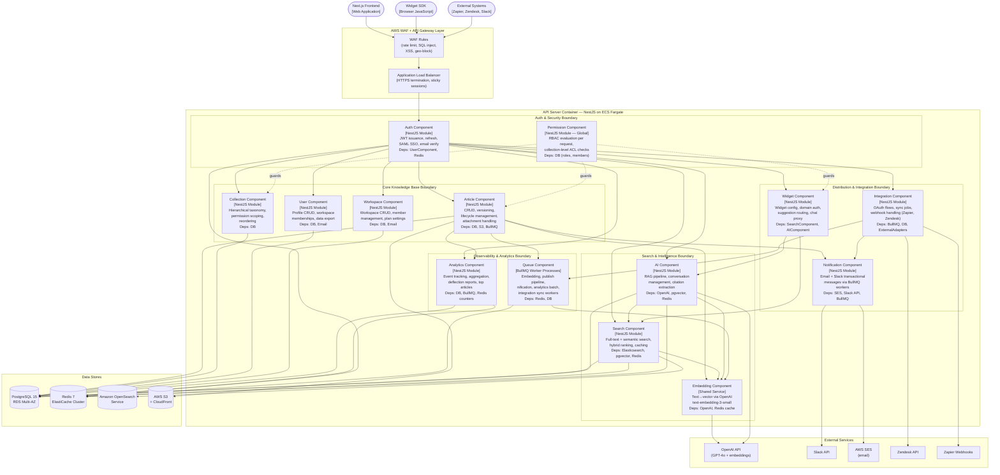
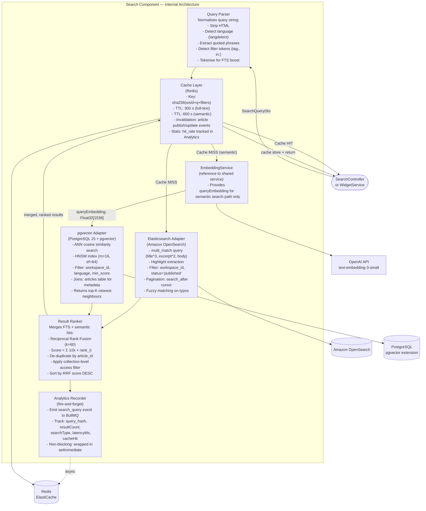
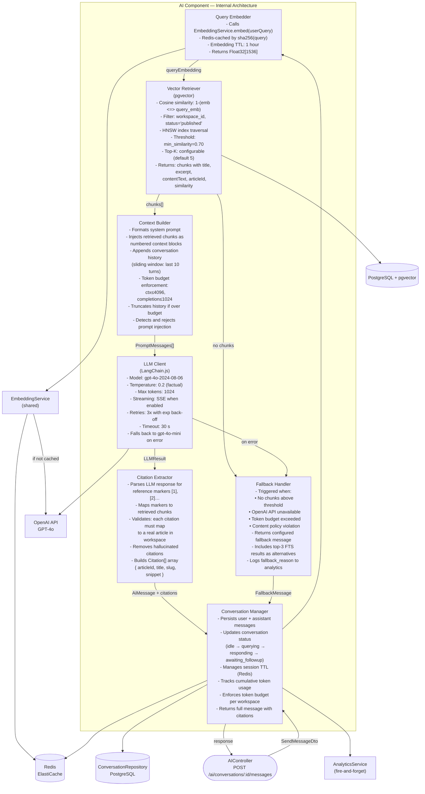

# C4 Component Diagrams — Knowledge Base Platform

## 1. Level 3 C4 Component — API Server (NestJS)

> **Container**: API Server running on ECS Fargate  
> **Technology**: Node.js 20 + NestJS  
> **Purpose**: Serves all REST API requests from the Next.js frontend, Widget SDK, and third-party integrations.

---

## 2. Level 3 C4 Component — Search Service (Internal Decomposition)

> **Component**: Search Component (within API Server container)  
> **Technology**: NestJS SearchModule  
> **Purpose**: Receives search requests and returns ranked results using full-text (Elasticsearch) and semantic (pgvector) search, with Redis caching.

### Search Component Security Boundaries

| Boundary | Control | Details |
|----------|---------|---------|
| **Workspace Isolation** | Query-level filter | Every Elasticsearch query and pgvector query includes `workspace_id = $requester.workspaceId`; no cross-workspace data leakage possible |
| **Collection Access Filter** | Post-rank ACL | `ResultRanker` applies collection-level ACL after merging to remove articles from collections the requester lacks `view` permission for |
| **Rate Limiting** | Redis sliding window | 100 req/min per authenticated user; 20 req/min per widget API key (separately tracked) |
| **Query Sanitisation** | QueryParser | HTML stripped, length capped at 512 characters, regex injection patterns rejected with 400 |

---

## 3. Level 3 C4 Component — AI Service (Internal Decomposition)

> **Component**: AI Component (within API Server container)  
> **Technology**: NestJS AIModule + LangChain.js  
> **Purpose**: Implements the full RAG (Retrieval-Augmented Generation) pipeline: embed query → retrieve context → build prompt → call GPT-4o → extract citations → manage conversation.

### AI Service Security Boundaries

| Boundary | Control | Details |
|----------|---------|---------|
| **Workspace Data Isolation** | VectorRetriever filter | `workspace_id` filter prevents any cross-workspace context retrieval |
| **Prompt Injection Shield** | ContextBuilder | Pattern-based deny-list; malicious instructions replaced with `[filtered]` before sending to OpenAI |
| **Token Budget Enforcement** | ConversationManager | Per-workspace hourly token limit checked from Redis counter before calling LLM; exceeding returns 429 |
| **PII in Responses** | CitationExtractor | Article slugs and titles included in citations; no raw user PII from database is injected into prompts |
| **API Key Rotation** | OpenAI SDK | API key stored in AWS Secrets Manager; rotated quarterly; ECS task definition references secret ARN |
| **Content Policy** | LLM Client | OpenAI moderation endpoint pre-screens user messages; policy violations skip LLM call and return moderation failure message |

---

## 4. Component Technology & Responsibility Summary

| Component | Technology | Responsibility |
|-----------|-----------|----------------|
| Auth Component | NestJS + Passport.js + `jsonwebtoken` + `passport-saml` | JWT lifecycle, SSO, email verification, token blacklisting via Redis |
| Permission Component | NestJS Global Module + TypeORM | RBAC evaluation on every request via `CanActivate` guards; caches role data in Redis for 5 min |
| Article Component | NestJS + TypeORM + BullMQ | Full article CRUD, versioning, lifecycle state machine, S3 attachment management |
| Collection Component | NestJS + TypeORM | Hierarchical collection tree with adjacency-list model; permission scoping |
| Search Component | NestJS + Elasticsearch client + TypeORM (pgvector) + ioredis | Hybrid search orchestration, query parsing, caching, result ranking |
| AI Component | NestJS + LangChain.js + TypeORM + ioredis | Full RAG pipeline, conversation management, citation extraction |
| Embedding Component | NestJS Shared Service + OpenAI SDK | Embedding generation and caching; used by Search and AI components |
| Widget Component | NestJS + ioredis | Widget configuration management, domain validation, suggestion proxy |
| Analytics Component | NestJS + TypeORM + BullMQ | Event tracking ingestion via queue, query-time aggregation for dashboards |
| Integration Component | NestJS + BullMQ + external SDKs | Integration lifecycle, credential encryption (AWS KMS), webhook handling |
| Notification Component | NestJS + BullMQ + `@aws-sdk/client-ses` + `@slack/web-api` | Async email and Slack delivery via dedicated BullMQ worker |
| Queue Component | BullMQ workers on Redis | Embedding, publish pipeline, notifications, analytics batch, integration sync |

---

## 5. Operational Policy Addendum

### 5.1 Content Governance Policies

- **Component Ownership**: Each NestJS module exclusively owns its repositories; no module may directly instantiate or inject a repository owned by another module. Cross-module data needs are served through the owning module's exported service.
- **Attachment Virus Scanning**: `AttachmentService` triggers an async BullMQ job (`scan-attachment`) after S3 upload; the job calls AWS Macie or a ClamAV Lambda to scan the file. Articles cannot be published until all attachments are cleared; infected files are deleted and the author notified.
- **Version Comparison API**: `ArticleVersionService` exposes a diff endpoint (`GET /articles/:id/versions/:v1/diff/:v2`) that returns a JSON Patch diff of TipTap content, enabling authors to review changes before restoring a version.
- **Content Export**: Workspace admins may export all articles as a ZIP of Markdown files (converted from TipTap JSON) via `POST /workspaces/:id/export`; the export job runs asynchronously and delivers a pre-signed S3 URL valid for 1 hour.

### 5.2 Reader Data Privacy Policies

- **Personalised Search**: If a Reader is authenticated, `SearchService` may boost articles from collections the user has previously viewed (stored as `recent_views` in Redis with 30-day TTL). This personalisation is disclosed in the privacy policy and can be opted out via `preferences.personaliseSearch=false`.
- **Widget Analytics Consent**: Before `AnalyticsRecorder` in the Search Component emits events originating from a Widget, it checks the widget's `config.analyticsConsent` flag set by the workspace admin; if `false`, no user-identifying properties are included in the event.
- **Search History Deletion**: Users may delete their search history via `DELETE /users/me/search-history`; this clears hashed query entries from `analytics_events` linked to their `user_id` (anonymised, not physically deleted) and clears `recent_searches` from Redis.
- **Data Residency**: The `ConfigModule` exposes a `DATA_REGION` environment variable; all RDS, ElastiCache, and OpenSearch resources are deployed to the configured region; cross-region data transfer for embeddings (OpenAI API) is governed by the OpenAI DPA.

### 5.3 AI Usage Policies

- **Component-Level Audit**: Every call from `LLMClient` to OpenAI logs `{ model, prompt_tokens, completion_tokens, latency_ms, workspace_id, conversation_id }` to the `ai_messages` table; this enables per-workspace cost attribution and anomaly detection.
- **Embedding Model Versioning**: `EmbeddingService` pins to `text-embedding-3-small` with dimension 1536; changing the model requires a full re-embedding of all `search_indices` rows and a re-index in Elasticsearch. Model upgrades require a maintenance window announcement.
- **Semantic Search Threshold Tuning**: The `min_similarity` threshold (default 0.70) in `VectorRetriever` is configurable per workspace via `settings.ai.minSimilarity`; workspaces with narrow knowledge bases (high-precision domains) are advised to increase to 0.80.
- **LangChain Callback Handlers**: A custom `AuditCallbackHandler` is registered in `LangChainClient`; it logs chain start/end events and tool calls to the structured logger (Winston) with `level=debug` in non-production environments.

### 5.4 System Availability Policies

- **ECS Task Scaling**: The `API Server` ECS service scales horizontally from 2 to 10 tasks based on CPU utilisation (target: 60%) and request count (target: 1,000 req/min per task); scale-in is protected by a 5-minute cooldown to prevent thrashing.
- **Queue Worker Scaling**: BullMQ `embedding-jobs` workers scale independently from 1 to 5 tasks based on queue depth (scale up at depth > 50); workers are deployed in a separate ECS service with a tighter memory profile (512 MB vs. 1 GB for API).
- **Database Connection Management**: TypeORM is configured with `extra.max: 20` per ECS task; at 10 tasks, maximum connections = 200, matching the RDS `max_connections` parameter; RDS Proxy is deployed in front of the primary to multiplex and pool connections.
- **Dependency Health Gate**: On ECS task startup, the NestJS `AppModule` runs a `StartupHealthService` that verifies connectivity to PostgreSQL, Redis, and Elasticsearch before accepting traffic; tasks that fail the health gate are terminated immediately without joining the ALB target group.
