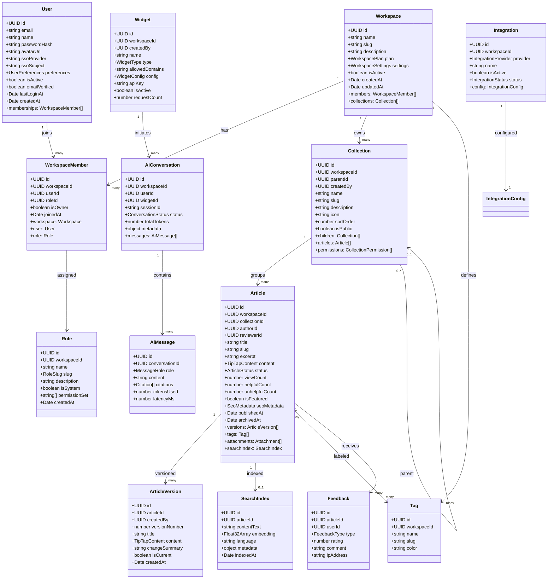

# Class Diagram — Knowledge Base Platform

## 1. NestJS Service Layer — Class Diagram

```mermaid
classDiagram
    %% ── Repositories ────────────────────────────────────────────────────────
    class ArticleRepository {
        +findById(id: UUID) Promise~Article~
        +findByWorkspace(wsId: UUID, opts: PaginationOpts) Promise~PaginatedResult~Article~~
        +findByCollection(colId: UUID, opts: PaginationOpts) Promise~PaginatedResult~Article~~
        +findPublished(wsId: UUID, opts: PaginationOpts) Promise~PaginatedResult~Article~~
        +save(article: Article) Promise~Article~
        +softDelete(id: UUID) Promise~void~
        +incrementViewCount(id: UUID) Promise~void~
        +updateHelpfulness(id: UUID, type: FeedbackType) Promise~void~
    }

    class CollectionRepository {
        +findById(id: UUID) Promise~Collection~
        +findTree(wsId: UUID) Promise~CollectionNode[]~
        +findByWorkspace(wsId: UUID) Promise~Collection[]~
        +findWithPermissions(id: UUID, roleId: UUID) Promise~Collection~
        +save(c: Collection) Promise~Collection~
        +delete(id: UUID) Promise~void~
    }

    class UserRepository {
        +findById(id: UUID) Promise~User~
        +findByEmail(email: string) Promise~User~
        +findBySsoSubject(provider: string, subject: string) Promise~User~
        +findWorkspaceMembers(wsId: UUID) Promise~WorkspaceMember[]~
        +save(user: User) Promise~User~
    }

    class SearchIndexRepository {
        +findByArticleId(articleId: UUID) Promise~SearchIndex~
        +upsert(index: SearchIndex) Promise~SearchIndex~
        +semanticSearch(embedding: number[], wsId: UUID, limit: number) Promise~ArticleMatch[]~
        +deleteByArticleId(articleId: UUID) Promise~void~
    }

    class ConversationRepository {
        +findById(id: UUID) Promise~AiConversation~
        +findBySession(sessionId: string) Promise~AiConversation~
        +findMessages(convId: UUID) Promise~AiMessage[]~
        +saveConversation(c: AiConversation) Promise~AiConversation~
        +saveMessage(m: AiMessage) Promise~AiMessage~
    }

    %% ── Services ─────────────────────────────────────────────────────────────
    class ArticleService {
        -articleRepo: ArticleRepository
        -versionService: ArticleVersionService
        -embeddingService: EmbeddingService
        -notificationService: NotificationService
        -analyticsService: AnalyticsService
        -bullQueue: Queue
        +create(dto: CreateArticleDto, authorId: UUID) Promise~Article~
        +findOne(id: UUID, requesterId: UUID) Promise~Article~
        +update(id: UUID, dto: UpdateArticleDto, editorId: UUID) Promise~Article~
        +publish(id: UUID, dto: PublishArticleDto, userId: UUID) Promise~Article~
        +unpublish(id: UUID, userId: UUID) Promise~Article~
        +archive(id: UUID, userId: UUID) Promise~Article~
        +delete(id: UUID, userId: UUID) Promise~void~
        +submitForReview(id: UUID, authorId: UUID) Promise~Article~
        +trackView(id: UUID, sessionId: string) Promise~void~
    }

    class ArticleVersionService {
        -versionRepo: ArticleVersionRepository
        +createSnapshot(article: Article, userId: UUID, summary: string) Promise~ArticleVersion~
        +listVersions(articleId: UUID) Promise~ArticleVersion[]~
        +restore(articleId: UUID, versionId: UUID, userId: UUID) Promise~Article~
        +pruneOldVersions(articleId: UUID, keepCount: number) Promise~void~
    }

    class CollectionService {
        -collectionRepo: CollectionRepository
        -permissionService: PermissionService
        +create(dto: CreateCollectionDto, userId: UUID) Promise~Collection~
        +findTree(wsId: UUID, requesterId: UUID) Promise~CollectionNode[]~
        +update(id: UUID, dto: UpdateCollectionDto) Promise~Collection~
        +delete(id: UUID) Promise~void~
        +setPermission(id: UUID, dto: SetPermissionDto) Promise~void~
        +reorder(wsId: UUID, order: UUID[]) Promise~void~
    }

    class SearchService {
        -searchIndexRepo: SearchIndexRepository
        -embeddingService: EmbeddingService
        -esAdapter: ElasticsearchAdapter
        -cacheService: RedisService
        -analyticsService: AnalyticsService
        +fullTextSearch(dto: SearchQueryDto) Promise~SearchResult~
        +semanticSearch(dto: SemanticSearchDto) Promise~SearchResult~
        +hybridSearch(dto: SearchQueryDto) Promise~SearchResult~
        +suggest(query: string, wsId: UUID) Promise~Suggestion[]~
        -mergeAndRank(fts: Hit[], semantic: Hit[]) Hit[]
        -cacheKey(dto: SearchQueryDto) string
    }

    class AIService {
        -conversationRepo: ConversationRepository
        -embeddingService: EmbeddingService
        -searchIndexRepo: SearchIndexRepository
        -langchainClient: LangChainClient
        -notificationService: NotificationService
        +createConversation(dto: CreateConversationDto, userId: UUID) Promise~AiConversation~
        +sendMessage(convId: UUID, dto: SendMessageDto) Promise~AiMessage~
        +getConversation(id: UUID) Promise~AiConversation~
        +endConversation(id: UUID) Promise~void~
        -retrieveContext(query: string, wsId: UUID) Promise~RetrievedChunk[]~
        -buildPrompt(chunks: RetrievedChunk[], history: AiMessage[]) string
        -extractCitations(response: string, chunks: RetrievedChunk[]) Citation[]
    }

    class EmbeddingService {
        -openaiAdapter: OpenAIAdapter
        -cacheService: RedisService
        +embed(text: string) Promise~number[]~
        +embedBatch(texts: string[]) Promise~number[][]~
        +embedArticle(article: Article) Promise~number[]~
        -chunkText(text: string, maxTokens: number) string[]
        -cacheKey(text: string) string
    }

    class WorkspaceService {
        -wsRepo: WorkspaceRepository
        -memberRepo: WorkspaceMemberRepository
        -roleService: RoleService
        +create(dto: CreateWorkspaceDto, ownerId: UUID) Promise~Workspace~
        +findOne(id: UUID) Promise~Workspace~
        +update(id: UUID, dto: UpdateWorkspaceDto) Promise~Workspace~
        +addMember(wsId: UUID, dto: AddMemberDto) Promise~WorkspaceMember~
        +removeMember(wsId: UUID, userId: UUID) Promise~void~
        +updateMemberRole(wsId: UUID, userId: UUID, roleId: UUID) Promise~WorkspaceMember~
        +getMembers(wsId: UUID) Promise~WorkspaceMember[]~
        +updateSettings(wsId: UUID, settings: WorkspaceSettings) Promise~Workspace~
    }

    class UserService {
        -userRepo: UserRepository
        -wsService: WorkspaceService
        +findOne(id: UUID) Promise~User~
        +findMe(id: UUID) Promise~UserProfile~
        +update(id: UUID, dto: UpdateUserDto) Promise~User~
        +deactivate(id: UUID) Promise~void~
        +getWorkspaces(userId: UUID) Promise~Workspace[]~
        +exportData(userId: UUID) Promise~DataExportJob~
    }

    class AuthService {
        -userRepo: UserRepository
        -jwtService: JwtService
        -cacheService: RedisService
        +login(dto: LoginDto) Promise~AuthTokens~
        +logout(userId: UUID, refreshToken: string) Promise~void~
        +refresh(refreshToken: string) Promise~AuthTokens~
        +ssoLogin(dto: SsoDto) Promise~AuthTokens~
        +verifyEmail(token: string) Promise~void~
        -issueTokens(user: User) AuthTokens
        -hashToken(token: string) string
    }

    class PermissionService {
        -roleRepo: RoleRepository
        -wsRepo: WorkspaceRepository
        +checkArticleAccess(userId: UUID, articleId: UUID, action: string) Promise~boolean~
        +checkCollectionAccess(userId: UUID, colId: UUID, action: string) Promise~boolean~
        +getUserRole(userId: UUID, wsId: UUID) Promise~Role~
        +assertRole(userId: UUID, wsId: UUID, minRole: RoleSlug) Promise~void~
        +can(userId: UUID, resource: string, action: string, scopeId: UUID) Promise~boolean~
    }

    class FeedbackService {
        -feedbackRepo: FeedbackRepository
        -articleRepo: ArticleRepository
        -analyticsService: AnalyticsService
        +submit(dto: SubmitFeedbackDto, userId: UUID) Promise~Feedback~
        +getArticleFeedback(articleId: UUID) Promise~FeedbackSummary~
        +listFeedback(wsId: UUID, opts: PaginationOpts) Promise~PaginatedResult~Feedback~~
        +deleteFeedback(id: UUID) Promise~void~
    }

    class WidgetService {
        -widgetRepo: WidgetRepository
        -searchService: SearchService
        -aiService: AIService
        +create(dto: CreateWidgetDto, userId: UUID) Promise~Widget~
        +findOne(id: UUID) Promise~Widget~
        +update(id: UUID, dto: UpdateWidgetDto) Promise~Widget~
        +delete(id: UUID) Promise~void~
        +getSuggestions(widgetId: UUID, url: string) Promise~WidgetSuggestion[]~
        +chat(widgetId: UUID, dto: WidgetChatDto) Promise~AiMessage~
        +validateDomain(widgetId: UUID, origin: string) Promise~boolean~
        +rotateApiKey(widgetId: UUID) Promise~string~
    }

    class AnalyticsService {
        -eventRepo: AnalyticsEventRepository
        -cacheService: RedisService
        +track(dto: TrackEventDto) Promise~void~
        +getArticleStats(wsId: UUID, dto: DateRangeDto) Promise~ArticleStats~
        +getSearchStats(wsId: UUID, dto: DateRangeDto) Promise~SearchStats~
        +getDeflectionRate(wsId: UUID, dto: DateRangeDto) Promise~DeflectionStats~
        +getTopArticles(wsId: UUID, limit: number) Promise~ArticleRank[]~
        +getSearchFunnelReport(wsId: UUID) Promise~FunnelReport~
    }

    class IntegrationService {
        -integrationRepo: IntegrationRepository
        -configRepo: IntegrationConfigRepository
        -bullQueue: Queue
        +create(dto: CreateIntegrationDto) Promise~Integration~
        +connect(id: UUID, credentials: object) Promise~Integration~
        +disconnect(id: UUID) Promise~Integration~
        +sync(id: UUID) Promise~void~
        +handleWebhook(provider: string, payload: object) Promise~void~
        +getStatus(id: UUID) Promise~IntegrationStatus~
    }

    class NotificationService {
        -bullQueue: Queue
        -emailAdapter: EmailAdapter
        -slackAdapter: SlackAdapter
        +notifyReviewRequired(article: Article) Promise~void~
        +notifyReviewDecision(article: Article, approved: boolean, comment: string) Promise~void~
        +notifyMemberInvited(member: WorkspaceMember) Promise~void~
        +sendEmail(to: string, template: string, data: object) Promise~void~
        +sendSlack(channelId: string, message: SlackMessage) Promise~void~
    }

    %% ── Dependency Injection Relationships ──────────────────────────────────
    ArticleService --> ArticleRepository
    ArticleService --> ArticleVersionService
    ArticleService --> EmbeddingService
    ArticleService --> NotificationService
    ArticleService --> AnalyticsService
    ArticleVersionService --> ArticleVersionRepository
    CollectionService --> CollectionRepository
    CollectionService --> PermissionService
    SearchService --> SearchIndexRepository
    SearchService --> EmbeddingService
    SearchService --> ElasticsearchAdapter
    AIService --> ConversationRepository
    AIService --> EmbeddingService
    AIService --> SearchIndexRepository
    EmbeddingService --> OpenAIAdapter
    WorkspaceService --> WorkspaceRepository
    WorkspaceService --> WorkspaceMemberRepository
    AuthService --> UserRepository
    PermissionService --> RoleRepository
    FeedbackService --> FeedbackRepository
    FeedbackService --> ArticleRepository
    FeedbackService --> AnalyticsService
    WidgetService --> WidgetRepository
    WidgetService --> SearchService
    WidgetService --> AIService
    IntegrationService --> IntegrationRepository
    NotificationService --> SlackAdapter
```

---

## 2. Domain Model Entities — Class Diagram

---

## 3. DTOs — Class Responsibilities

| DTO | Purpose | Key Fields |
|-----|---------|-----------|
| `CreateArticleDto` | Payload for new article creation | `title`, `collectionId`, `content` (TipTap JSON), `tags[]`, `excerpt`, `seoMetadata` |
| `UpdateArticleDto` | Partial update to article fields | All `CreateArticleDto` fields as optional; `changeSummary` for version note |
| `PublishArticleDto` | Trigger publish pipeline | `publishedAt?` (scheduled), `notifySubscribers: boolean` |
| `SearchQueryDto` | Full-text and hybrid search | `q`, `workspaceId`, `collectionId?`, `tags[]`, `type`, `page`, `limit` |
| `SemanticSearchDto` | Vector-only search | `q`, `workspaceId`, `topK`, `minScore` |
| `AIQueryDto` | Single-shot AI query | `query`, `workspaceId`, `widgetId?`, `sessionId` |
| `CreateConversationDto` | Start AI conversation | `workspaceId`, `widgetId?`, `sessionId`, `metadata?` |
| `SendMessageDto` | Add user turn to conversation | `content`, `metadata?` |
| `CreateCollectionDto` | New collection | `name`, `parentId?`, `description`, `icon`, `isPublic` |
| `SetPermissionDto` | Grant role access to collection | `roleId`, `accessLevel` |
| `CreateWidgetDto` | Widget configuration | `name`, `type`, `allowedDomains`, `config` (colors, greeting, etc.) |
| `SubmitFeedbackDto` | Reader feedback | `type`, `rating?`, `comment?` |
| `TrackEventDto` | Analytics event | `eventType`, `articleId?`, `sessionId`, `properties` |
| `AddMemberDto` | Invite member to workspace | `email`, `roleId` |
| `LoginDto` | Credential auth | `email`, `password` |

---

## 4. Design Patterns Applied

### Repository Pattern
All data access encapsulated in dedicated `*Repository` classes extending TypeORM `Repository<T>`. Services depend on repository interfaces enabling unit-test mocking without a live database.

### CQRS (Command-Query Responsibility Segregation)
Write operations (create, update, publish) flow through NestJS `CommandBus`; read operations (find, search) through `QueryBus`. Commands emit domain events consumed by `AnalyticsService` and `EmbeddingService` asynchronously.

### Strategy Pattern — Search
`SearchService` accepts a `SearchStrategy` interface with implementations: `FullTextSearchStrategy` (Elasticsearch), `SemanticSearchStrategy` (pgvector), and `HybridSearchStrategy` (merge of both). Strategy is selected based on `SearchQueryDto.type` at runtime.

### Observer Pattern — Article Events
`ArticleService` emits NestJS `EventEmitter2` events (`article.created`, `article.published`, `article.archived`). Independent listeners in `EmbeddingService`, `AnalyticsService`, and `NotificationService` react without coupling to `ArticleService`.

### Decorator Pattern — Guards & Interceptors
`@Roles(RoleSlug.EDITOR)` decorator combined with `RolesGuard` implements declarative RBAC. `LoggingInterceptor` wraps every controller method to produce structured audit log entries without modifying service logic.

---

## 5. Operational Policy Addendum

### 5.1 Content Governance Policies

- **Authorship Attribution**: Article `author_id` is immutable after creation; only the `reviewer_id` and content fields are mutable by editors. Authorship changes require Super Admin action and are recorded in `audit_logs`.
- **Content Classification**: The `tags` system serves as the primary content classification mechanism; workspaces must designate at least one tag as a "category" tag (stored in workspace `settings.categoryTagIds`).
- **Approval Chain**: Workspaces on the Pro or Enterprise plan may configure a two-stage review chain (Editor → Workspace Admin) stored in `settings.reviewChain`; the standard plan supports single-stage review only.
- **Stale Content Alerts**: Articles published more than 365 days ago without an update trigger a weekly "stale content" digest email to the original author and workspace admin.

### 5.2 Reader Data Privacy Policies

- **Minimal Collection Principle**: `SearchService` records only `event_type=search_query`, the hashed query, and a result count — never the raw query string in plaintext for anonymous users.
- **AI Conversation Anonymisation**: Widget conversations not linked to an authenticated `user_id` are automatically purged after 30 days; linked conversations follow the workspace retention setting (default 90 days).
- **Feedback Moderation**: All free-text feedback is queued through a spam/PII filter before being surfaced in the admin dashboard; raw comments are stored encrypted (AES-256-GCM, key in AWS KMS).
- **Right to Deletion**: Deleting a user account triggers a background job that nullifies `user_id` foreign keys on feedbacks and analytics events and permanently erases AI conversation history.

### 5.3 AI Usage Policies

- **Hallucination Mitigation**: `AIService.buildPrompt` enforces a system instruction: "Answer only from the provided knowledge base context. If the answer is not contained in the context, state clearly that you do not know." Compliance is monitored via a weekly manual audit of 50 sampled conversations.
- **Sensitive Topic Handling**: Queries matching a blocklist of sensitive topics (medical diagnoses, legal advice, financial guidance) trigger a disclaimer prepended to the AI response.
- **Rate Limiting per Workspace**: Each workspace is limited to 10,000 AI tokens per hour (configurable); exceeding the limit returns HTTP 429 with a `Retry-After` header and falls back to keyword search only.
- **Model Version Pinning**: Production deployments pin to a specific GPT-4o model version (`gpt-4o-2024-08-06`) to prevent unexpected behaviour changes on model updates; version upgrades require a staged rollout with A/B test.

### 5.4 System Availability Policies

- **Service Degradation Strategy**: If the OpenAI API is unavailable, `AIService` returns a graceful fallback message directing the user to keyword search results; this is tracked as `ai_fallback` in `analytics_events`.
- **Redis Cache Failure**: `SearchService` wraps cache reads in try/catch; a Redis failure causes cache miss and falls through to live search without returning an error to the caller.
- **BullMQ Dead-Letter Queue**: Failed embedding jobs are retried 3 times with exponential back-off; after the third failure, the job moves to a DLQ and triggers a PagerDuty alert.
- **ECS Health Checks**: Each ECS Fargate task exposes `GET /health` returning `{ status: "ok", db: bool, redis: bool, es: bool }`; tasks failing health checks for > 60 seconds are replaced automatically.
